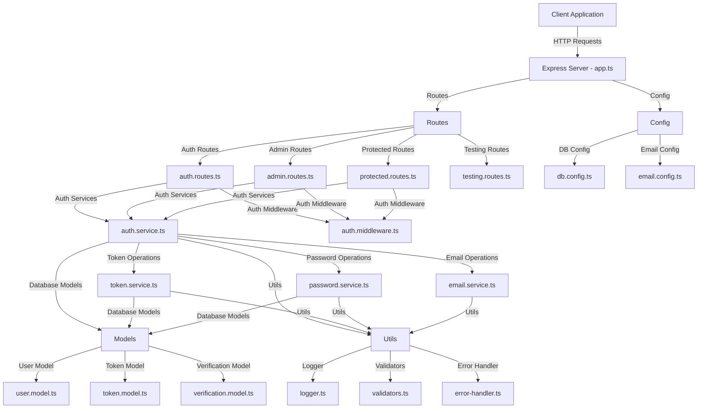
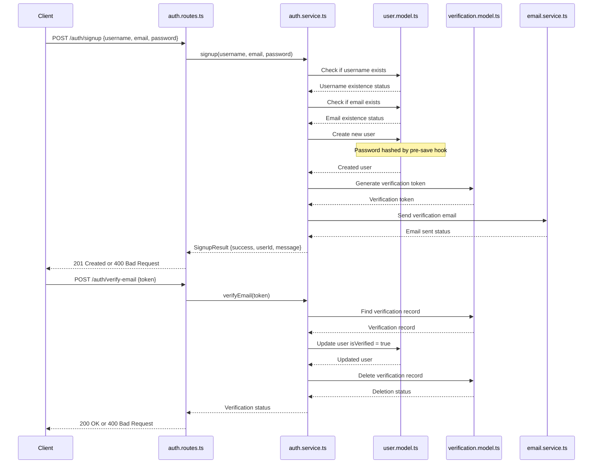
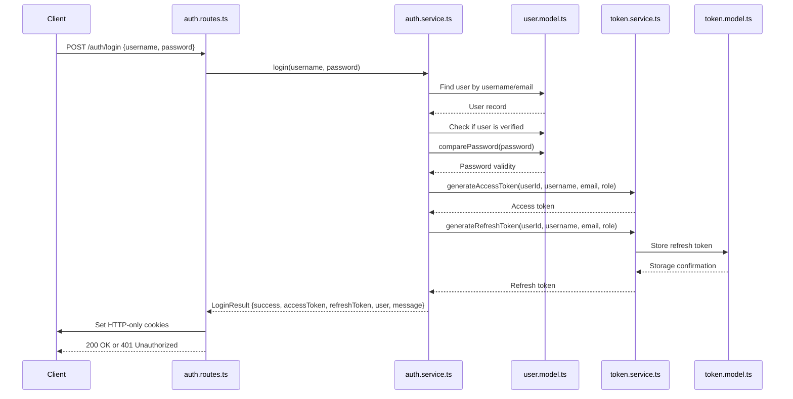
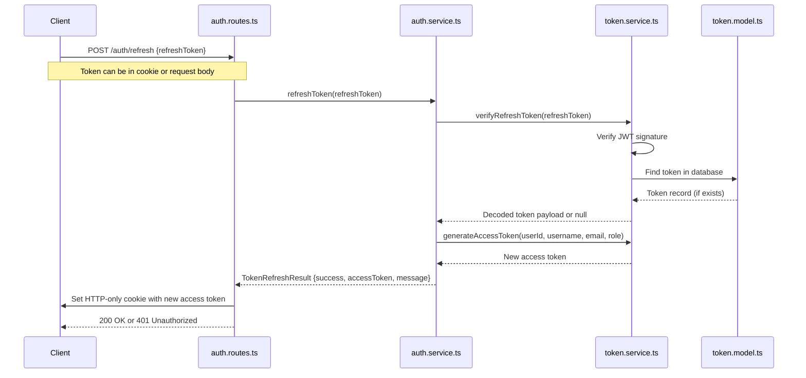
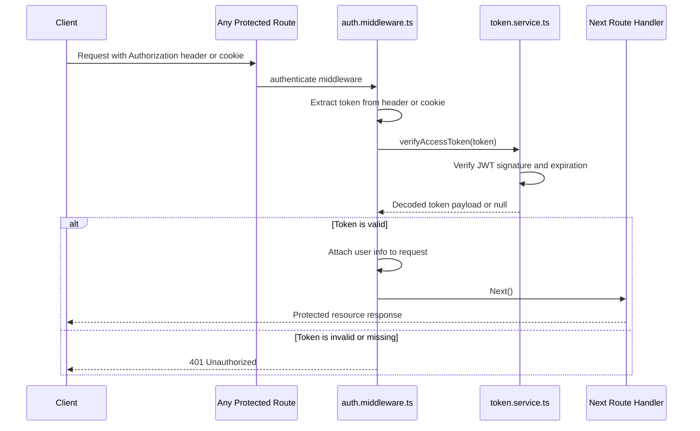
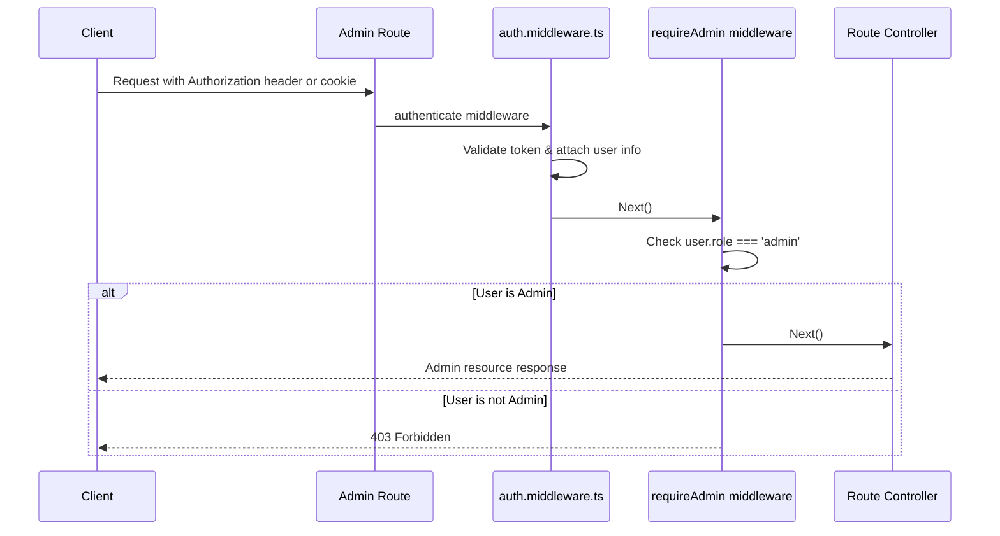
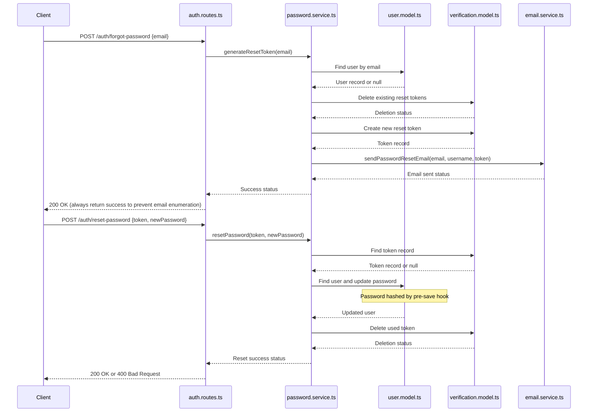
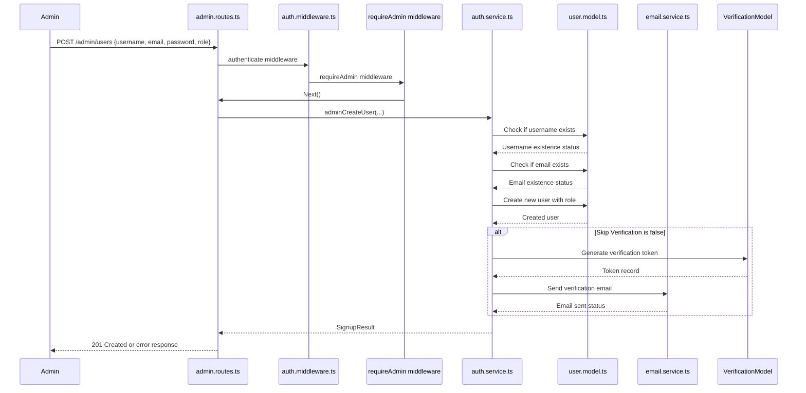
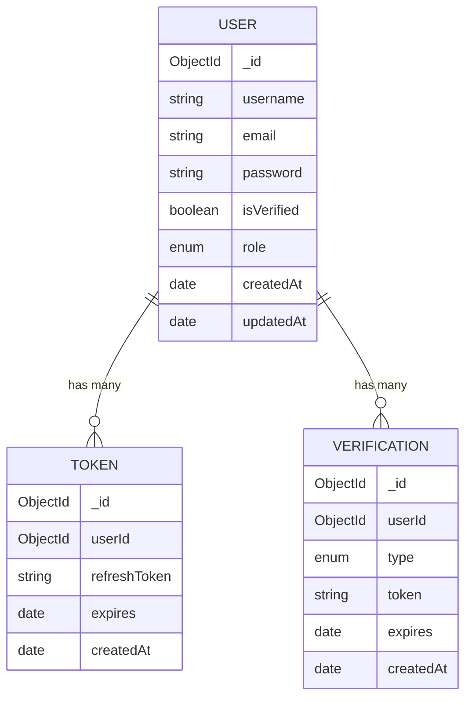

# Authentication Service Code Map

This document provides a comprehensive overview of the authentication service architecture and flows in the Simple Accounting application.

## System Architecture

The authentication system is built on TypeScript and follows a modular architecture with clear separation of concerns.

## Core Components Overview

### Models

1. **User Model** (`user.model.ts`)
   - Defines the schema for user data
   - Implements password hashing with bcryptjs
   - Provides password comparison method
   - Defines user roles (ADMIN, SUPERVISOR, ENDUSER, USER)

2. **Token Model** (`token.model.ts`)
   - Stores refresh tokens
   - Associates tokens with users
   - Tracks token expiration

3. **Verification Model** (`verification.model.ts`)
   - Stores email verification and password reset tokens
   - Associates verification tokens with users
   - Tracks token expiration

### Services

1. **Auth Service** (`auth.service.ts`)
   - Handles user registration and verification
   - Manages login and authentication
   - Provides token refresh and logout functionality
   - Implements admin user management operations

2. **Token Service** (`token.service.ts`)
   - Generates JWT access and refresh tokens
   - Verifies token validity
   - Manages token storage and deletion

3. **Password Service** (`password.service.ts`)
   - Handles password reset functionality
   - Generates secure random passwords
   - Hashes passwords

4. **Email Service** (`email.service.ts`)
   - Sends verification emails
   - Sends password reset emails
   - Sends notifications for admin-created accounts

### Middleware

1. **Auth Middleware** (`auth.middleware.ts`)
   - Authenticates requests using JWT tokens
   - Provides role-based access control
   - Supports optional authentication

### Routes

1. **Auth Routes** (`auth.routes.ts`)
   - User registration and verification
   - Login and logout
   - Password reset

2. **Protected Routes** (`protected.routes.ts`)
   - User profile management
   - Password changes
   - General authenticated user functionality

3. **Admin Routes** (`admin.routes.ts`)
   - User management
   - Batch user creation
   - Role management

4. **Testing Routes** (`testing.routes.ts`)
   - Development and testing utilities

## Authentication Flows

### 1. User Registration and Verification Flow

### 2. User Login Flow

### 3. Token Refresh Flow

### 4. Authentication Middleware Flow

### 5. Role-Based Access Control Flow

### 6. Password Reset Flow

### 7. Admin User Creation Flow

## Database Schema

## Security Considerations

1. **Password Security**
   - Passwords are hashed using bcryptjs before storage
   - Password requirements enforced (minimum length, complexity)
   - Secure password reset with time-limited tokens

2. **Token Security**
   - JWTs for stateless authentication
   - Short-lived access tokens (15 minutes)
   - HTTP-only cookies for token storage
   - Refresh token rotation

3. **Access Control**
   - Role-based authorization
   - Middleware-based permission checks
   - Route protection

4. **API Security**
   - Rate limiting on authentication endpoints
   - CORS configuration
   - Helmet for HTTP headers security

## Migration Scripts

The system includes migration scripts to help transition data between database versions:

1. **migrate-users.ts** - Migrates user data including role assignment
2. **migrate-tokens.ts** - Migrates refresh tokens 
3. **migrate-verifications.ts** - Migrates verification records
4. **migrate-all.ts** - Orchestrates the complete migration process