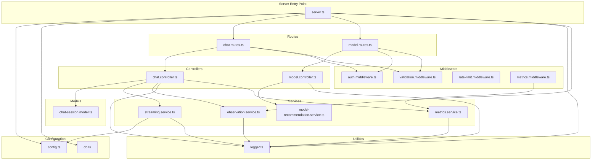
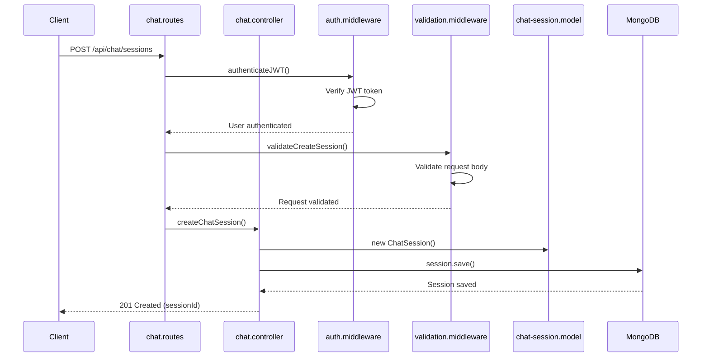
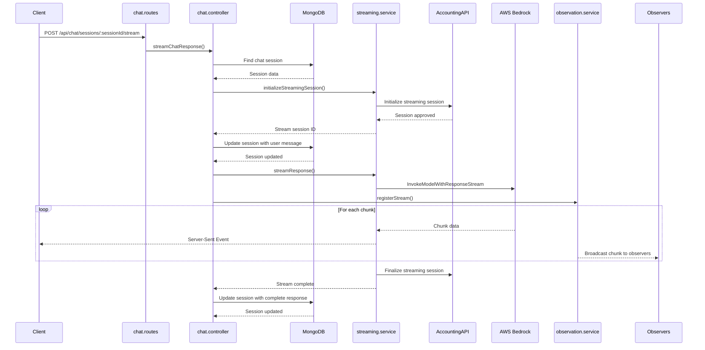
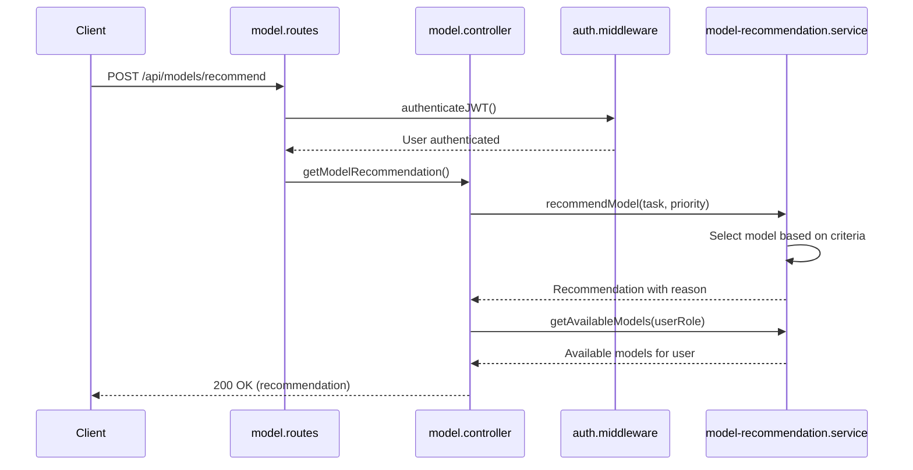
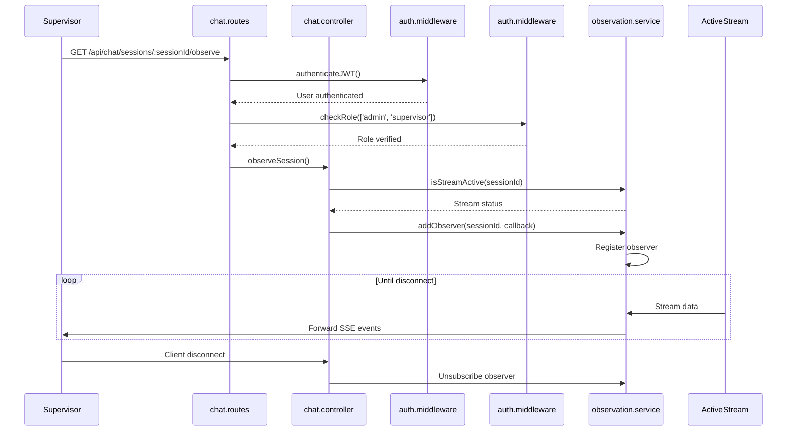
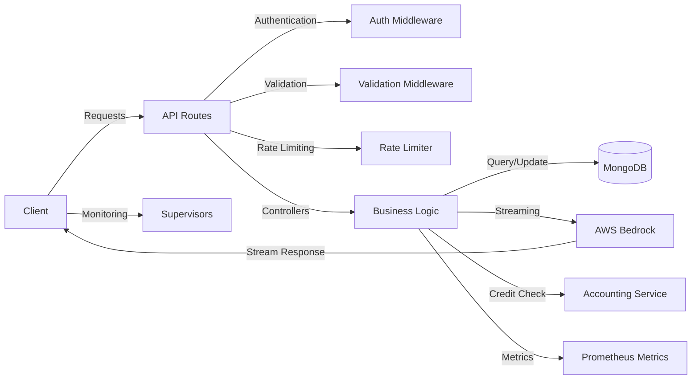
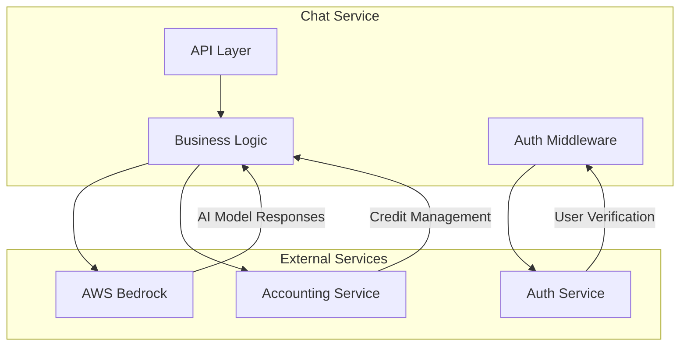

# Chat Service Code Map

## Overview

The Chat Service is a microservice that provides real-time AI chat capabilities using AWS Bedrock models. The service handles user chat sessions, streams model responses, and integrates with external authentication and accounting services.

## Architecture Components

### Core Components

### File Functions

| File | Description |
|------|-------------|
| **server.ts** | Entry point that initializes Express app, middleware, routes, and database connection |
| **config.ts** | Configuration settings loaded from environment variables |
| **db.ts** | MongoDB database connection management |
| **chat.routes.ts** | API routes for chat functionality (sessions, messages, streaming) |
| **model.routes.ts** | API routes for model selection and recommendations |
| **chat.controller.ts** | Chat business logic (session creation, message handling, streaming) |
| **model.controller.ts** | Model recommendation logic and available models |
| **auth.middleware.ts** | JWT authentication and role-based access control |
| **validation.middleware.ts** | Request validation using express-validator |
| **rate-limit.middleware.ts** | Rate limiting to prevent API abuse |
| **metrics.middleware.ts** | Request metrics collection middleware |
| **chat-session.model.ts** | MongoDB schema for chat sessions |
| **streaming.service.ts** | AWS Bedrock integration for AI model streaming |
| **observation.service.ts** | Allows supervisors to monitor active chat sessions |
| **model-recommendation.service.ts** | Provides model recommendations based on task & priority |
| **metrics.service.ts** | Prometheus metrics collection |
| **logger.ts** | Winston-based logging utility |

## Sequence Diagrams

### 1. Creating a Chat Session

### 2. Streaming Chat Response

### 3. Model Recommendation Flow

### 4. Supervisor Observation Flow

## Data Flow

## External Service Integration

