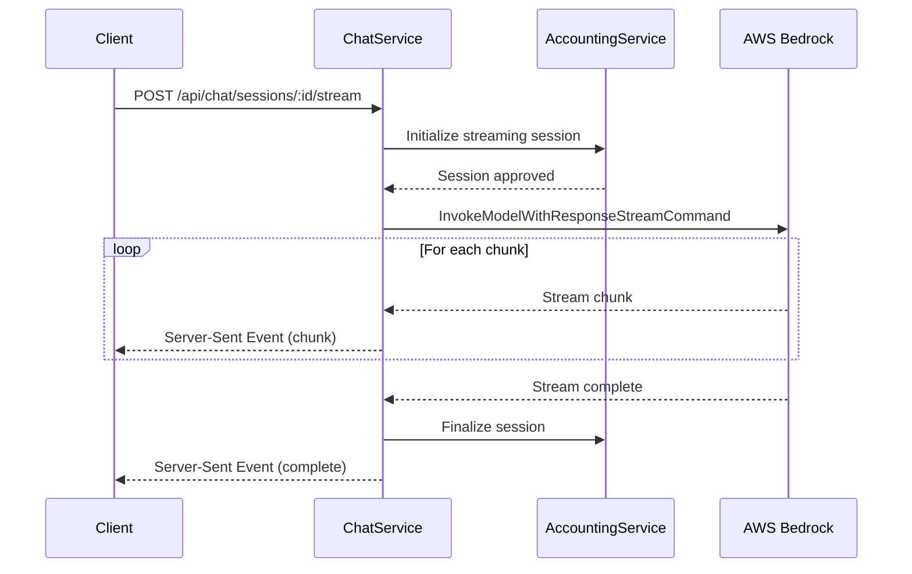

# Chat Service Streaming Implementation Code Map

This document provides a comprehensive overview of the streaming implementation in the chat service, focusing on the AWS Bedrock integration.

## Overview

The chat service uses AWS Bedrock for streaming AI responses, implementing Server-Sent Events (SSE) for real-time communication with clients. The implementation has been validated against a test implementation (`testBedrockStream.ts`), confirming its correctness and reliability.

## Core Components

### 1. AWS Client Configuration

The chat service initializes the AWS Bedrock Runtime client with proper configuration:

```typescript
// From streaming.service.ts
const bedrockClient = new BedrockRuntimeClient({ 
  region: config.awsRegion,
  credentials: {
    accessKeyId: config.awsAccessKeyId,
    secretAccessKey: config.awsSecretAccessKey
  }
});
```

This aligns with the test implementation's approach:

```typescript
// From testBedrockStream.ts
const bedrockRuntimeClient = new BedrockRuntimeClient({
  region: process.env.AWS_REGION || 'us-east-1',
  credentials: {
    accessKeyId: process.env.AWS_ACCESS_KEY_ID || '',
    secretAccessKey: process.env.AWS_SECRET_ACCESS_KEY || ''
  }
});
```

### 2. Streaming Command Implementation

Both implementations use `InvokeModelWithResponseStreamCommand` to enable streaming:

```typescript
// From streaming.service.ts
const command = new InvokeModelWithResponseStreamCommand({
  modelId: modelId,
  body: JSON.stringify(promptBody),
  contentType: 'application/json',
  accept: 'application/json'
});
```

The test implementation uses an equivalent approach:

```typescript
// From testBedrockStream.ts
const command = new InvokeModelWithResponseStreamCommand({
  modelId,
  contentType: 'application/json',
  accept: 'application/json',
  body: JSON.stringify(promptBody)
});
```

### 3. Stream Processing

Both implementations process the stream by asynchronously iterating over chunks:

```typescript
// From streaming.service.ts
for await (const chunk of response.body) {
  // Process chunk data...
  if (chunk.chunk?.bytes) {
    try {
      const chunkData = JSON.parse(Buffer.from(chunk.chunk.bytes).toString('utf-8'));
      // Process parsed chunk data...
    } catch (error) {
      // Handle parse errors...
    }
  }
}
```

This approach aligns with the test implementation:

```typescript
// From testBedrockStream.ts
if (response.body) {
  for await (const chunk of response.body) {
    // Process chunks...
  }
}
```

## Enhanced Features in Production Implementation

The chat service extends beyond the test implementation with production-ready features:

### 1. Model-Specific Formatting

The chat service handles different model formats:

```typescript
if (modelId.includes('anthropic')) {
  // Anthropic Claude format
  promptBody = {
    anthropic_version: 'bedrock-2023-05-31',
    max_tokens: 2000,
    messages: messages
  };
} else if (modelId.includes('amazon.titan')) {
  // Format for Amazon's Titan models
  // ...
} else if (modelId.includes('amazon.nova')) {
  // Format for Amazon's Nova models
  // ...
} else if (modelId.includes('meta.llama')) {
  // Format for Meta's Llama models
  // ...
}
```

This is similar to the test implementation's approach with `getPromptBody`:

```typescript
function getPromptBody(modelId: string): any {
  if (modelId.includes('amazon.nova')) {
    return {
      // Nova-specific format
    };
  } else if (modelId.includes('amazon.titan')) {
    return {
      // Titan-specific format
    };
  }
  // ...other models
}
```

### 2. Error Handling and Timeouts

The production implementation includes robust error handling and timeout mechanisms:

```typescript
// Timeout implementation
const timeout = setTimeout(() => {
  logger.warn(`Stream timeout reached for session ${sessionId}`);
  stream.write(`event: error\ndata: ${JSON.stringify({ 
    error: 'Stream timeout reached', 
    code: 'STREAM_TIMEOUT' 
  })}\n\n`);
  stream.end();
  
  // Attempt to finalize the session with a timeout status...
}, config.maxStreamingDuration);

// Error handling during streaming
try {
  // Streaming implementation
} catch (error) {
  logger.error('Error in stream processing:', error);
  
  // Clean up timeout
  clearTimeout(timeout);
  
  // Attempt to abort the streaming session
  try {
    // Notify accounting service of the error
  } catch (abortError) {
    // Handle abort error
  }
  
  // Write error to stream and end
  stream.write(`event: error\ndata: ${JSON.stringify({ 
    error: error.message || 'Stream processing error',
    code: error.code || 'STREAM_ERROR'
  })}\n\n`);
  stream.end();
}
```

### 3. Server-Sent Events (SSE)

The production implementation formats the response as Server-Sent Events for browser compatibility:

```typescript
// Format chunk as SSE
stream.write(`event: chunk\ndata: ${JSON.stringify({
  text: chunkText,
  tokens: chunkTokens,
  totalTokens: totalTokensGenerated
})}\n\n`);

// Signal completion
stream.write(`event: complete\ndata: ${JSON.stringify({
  status: "complete",
  tokens: totalTokensGenerated,
  sessionId: sessionId
})}\n\n`);
```

### 4. Integration with Accounting Service

The chat service coordinates with an accounting service to manage token usage:

```typescript
// Initialize session
const response = await axios.post(
  `${config.accountingApiUrl}/streaming-sessions/initialize`,
  {
    sessionId,
    modelId,
    estimatedTokens
  },
  {
    headers: {
      Authorization: authHeader
    }
  }
);

// Finalize session
await axios.post(
  `${config.accountingApiUrl}/streaming-sessions/finalize`,
  {
    sessionId,
    actualTokens: totalTokensGenerated,
    success: true,
    duration: completionTime
  },
  {
    headers: {
      Authorization: authHeader
    }
  }
);
```

## Request Flow

1. **Client initiates stream**: Client sends a POST request to `/api/chat/sessions/:sessionId/stream`
2. **Accounting initialization**: Chat service initializes a streaming session with the accounting service
3. **Bedrock streaming**: Chat service initiates streaming with Bedrock using `InvokeModelWithResponseStreamCommand`
4. **Chunk processing**: For each chunk received from Bedrock:
   - Parse the chunk data based on model format
   - Convert to SSE format
   - Send to client
   - Track token usage
5. **Stream completion**: When streaming completes, finalize the session with accounting service
6. **Error handling**: If errors occur, abort the stream and notify both client and accounting service

## Sequence Diagram



## Conclusion

The chat service's streaming implementation is an enhanced, production-ready version of the approach validated in `testBedrockStream.ts`. It maintains the core AWS Bedrock streaming pattern while adding enterprise features like error handling, timeouts, accounting integration, and browser-compatible SSE formatting.

The implementation demonstrates best practices for real-time AI response streaming with AWS Bedrock and provides a robust foundation for the chat service's core functionality.