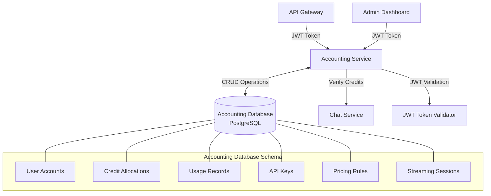

# 2. Accounting Service (Separate Database)

The accounting service will now have its own dedicated PostgreSQL database completely separate from the authentication database, connected only through JWT validation. This service will track credits, manage API keys, and support streaming session accounting.

## Accounting Service Architecture



## Database Setup

### Database Schema and Migrations

```sql
-- Create User Accounts table
CREATE TABLE user_accounts (
  user_id VARCHAR(50) PRIMARY KEY,
  email VARCHAR(255) NOT NULL UNIQUE,
  username VARCHAR(100) NOT NULL,
  role VARCHAR(50) NOT NULL DEFAULT 'user',
  created_at TIMESTAMP WITH TIME ZONE DEFAULT CURRENT_TIMESTAMP,
  updated_at TIMESTAMP WITH TIME ZONE DEFAULT CURRENT_TIMESTAMP
);

-- Create Credit Allocations table
CREATE TABLE credit_allocations (
  id SERIAL PRIMARY KEY,
  user_id VARCHAR(50) NOT NULL REFERENCES user_accounts(user_id),
  total_credits INTEGER NOT NULL,
  remaining_credits INTEGER NOT NULL,
  allocated_by VARCHAR(50) NOT NULL,
  allocated_at TIMESTAMP WITH TIME ZONE DEFAULT CURRENT_TIMESTAMP,
  expires_at TIMESTAMP WITH TIME ZONE NOT NULL,
  notes TEXT,
  
  CHECK (remaining_credits >= 0),
  CHECK (total_credits >= 0)
);

-- Create Usage Records table
CREATE TABLE usage_records (
  id SERIAL PRIMARY KEY,
  user_id VARCHAR(50) NOT NULL REFERENCES user_accounts(user_id),
  timestamp TIMESTAMP WITH TIME ZONE DEFAULT CURRENT_TIMESTAMP,
  service VARCHAR(50) NOT NULL,
  operation VARCHAR(100) NOT NULL,
  credits INTEGER NOT NULL,
  metadata JSONB,
  
  CHECK (credits >= 0)
);

-- Create API Keys table
CREATE TABLE api_keys (
  id SERIAL PRIMARY KEY,
  key VARCHAR(255) NOT NULL UNIQUE,
  user_id VARCHAR(50) NOT NULL REFERENCES user_accounts(user_id),
  name VARCHAR(100) NOT NULL,
  permissions TEXT[] NOT NULL DEFAULT '{}',
  created_at TIMESTAMP WITH TIME ZONE DEFAULT CURRENT_TIMESTAMP,
  expires_at TIMESTAMP WITH TIME ZONE,
  last_used TIMESTAMP WITH TIME ZONE,
  is_active BOOLEAN NOT NULL DEFAULT TRUE
);

-- Create Pricing Rules table
CREATE TABLE pricing_rules (
  id SERIAL PRIMARY KEY,
  model_id VARCHAR(100) NOT NULL,
  price_per_1k_tokens NUMERIC(10, 4) NOT NULL,
  effective_from TIMESTAMP WITH TIME ZONE DEFAULT CURRENT_TIMESTAMP,
  effective_to TIMESTAMP WITH TIME ZONE,
  created_by VARCHAR(50) NOT NULL REFERENCES user_accounts(user_id),
  
  CHECK (price_per_1k_tokens >= 0)
);

-- Create Streaming Sessions table
CREATE TABLE streaming_sessions (
  id SERIAL PRIMARY KEY,
  session_id VARCHAR(100) NOT NULL UNIQUE,
  user_id VARCHAR(50) NOT NULL REFERENCES user_accounts(user_id),
  model_id VARCHAR(100) NOT NULL,
  estimated_credits INTEGER NOT NULL,
  allocated_credits INTEGER NOT NULL,
  used_credits INTEGER NOT NULL DEFAULT 0,
  status VARCHAR(20) NOT NULL DEFAULT 'active',
  started_at TIMESTAMP WITH TIME ZONE DEFAULT CURRENT_TIMESTAMP,
  completed_at TIMESTAMP WITH TIME ZONE,
  
  CHECK (estimated_credits >= 0),
  CHECK (allocated_credits >= 0),
  CHECK (used_credits >= 0),
  CHECK (status IN ('active', 'completed', 'failed'))
);

-- Create indexes for performance
CREATE INDEX idx_credit_user_expiry ON credit_allocations(user_id, expires_at);
CREATE INDEX idx_usage_user_timestamp ON usage_records(user_id, timestamp);
CREATE INDEX idx_streaming_user_status ON streaming_sessions(user_id, status);
```

## Model Implementations

### User Account Model

```typescript
// src/models/user-account.model.ts
import { DataTypes, Model } from 'sequelize';
import sequelize from '../config/sequelize';

interface UserAccountAttributes {
  userId: string;  // This will be the user ID from Authentication service
  email: string;   // For identification
  username: string; // For identification
  role: string;    // For permissions
  createdAt?: Date;
  updatedAt?: Date;
}

class UserAccount extends Model<UserAccountAttributes> implements UserAccountAttributes {
  public userId!: string;
  public email!: string;
  public username!: string;
  public role!: string;
  public readonly createdAt!: Date;
  public readonly updatedAt!: Date;
}

UserAccount.init({
  userId: {
    type: DataTypes.STRING(50),
    allowNull: false,
    primaryKey: true
  },
  email: {
    type: DataTypes.STRING(255),
    allowNull: false,
    unique: true
  },
  username: {
    type: DataTypes.STRING(100),
    allowNull: false
  },
  role: {
    type: DataTypes.STRING(50),
    allowNull: false,
    defaultValue: 'user'
  },
  createdAt: {
    type: DataTypes.DATE,
    allowNull: false,
    defaultValue: DataTypes.NOW
  },
  updatedAt: {
    type: DataTypes.DATE,
    allowNull: false,
    defaultValue: DataTypes.NOW
  }
}, {
  sequelize,
  tableName: 'user_accounts',
  timestamps: true
});

export default UserAccount;
```

### Credit Allocation Model

```typescript
// src/models/credit-allocation.model.ts
import { DataTypes, Model } from 'sequelize';
import sequelize from '../config/sequelize';

interface CreditAllocationAttributes {
  id?: number;
  userId: string;
  totalCredits: number;
  remainingCredits: number;
  allocatedBy: string;
  allocatedAt?: Date;
  expiresAt: Date;
  notes?: string;
}

class CreditAllocation extends Model<CreditAllocationAttributes> implements CreditAllocationAttributes {
  public id!: number;
  public userId!: string;
  public totalCredits!: number;
  public remainingCredits!: number;
  public allocatedBy!: string;
  public readonly allocatedAt!: Date;
  public expiresAt!: Date;
  public notes!: string;
}

CreditAllocation.init({
  id: {
    type: DataTypes.INTEGER,
    autoIncrement: true,
    primaryKey: true
  },
  userId: {
    type: DataTypes.STRING(50),
    allowNull: false,
    references: {
      model: 'user_accounts',
      key: 'userId'
    }
  },
  totalCredits: {
    type: DataTypes.INTEGER,
    allowNull: false,
    validate: {
      min: 0
    }
  },
  remainingCredits: {
    type: DataTypes.INTEGER,
    allowNull: false,
    validate: {
      min: 0
    }
  },
  allocatedBy: {
    type: DataTypes.STRING(50),
    allowNull: false
  },
  allocatedAt: {
    type: DataTypes.DATE,
    allowNull: false,
    defaultValue: DataTypes.NOW
  },
  expiresAt: {
    type: DataTypes.DATE,
    allowNull: false
  },
  notes: {
    type: DataTypes.TEXT
  }
}, {
  sequelize,
  tableName: 'credit_allocations',
  timestamps: false,
  indexes: [
    {
      name: 'idx_credit_user_expiry',
      fields: ['userId', 'expiresAt']
    }
  ]
});

export default CreditAllocation;
```

### Usage Record Model

```typescript
// src/models/usage.model.ts
import { DataTypes, Model } from 'sequelize';
import sequelize from '../config/sequelize';

interface UsageAttributes {
  id?: number;
  userId: string;
  timestamp?: Date;
  service: string;
  operation: string;
  credits: number;
  metadata?: Record<string, any>;
}

class Usage extends Model<UsageAttributes> implements UsageAttributes {
  public id!: number;
  public userId!: string;
  public timestamp!: Date;
  public service!: string;
  public operation!: string;
  public credits!: number;
  public metadata!: Record<string, any>;
}

Usage.init({
  id: {
    type: DataTypes.INTEGER,
    autoIncrement: true,
    primaryKey: true
  },
  userId: {
    type: DataTypes.STRING(50),
    allowNull: false,
    references: {
      model: 'user_accounts',
      key: 'userId'
    }
  },
  timestamp: {
    type: DataTypes.DATE,
    allowNull: false,
    defaultValue: DataTypes.NOW
  },
  service: {
    type: DataTypes.STRING(50),
    allowNull: false
  },
  operation: {
    type: DataTypes.STRING(100),
    allowNull: false
  },
  credits: {
    type: DataTypes.INTEGER,
    allowNull: false,
    validate: {
      min: 0
    }
  },
  metadata: {
    type: DataTypes.JSONB
  }
}, {
  sequelize,
  tableName: 'usage_records',
  timestamps: false,
  indexes: [
    {
      name: 'idx_usage_user_timestamp',
      fields: ['userId', 'timestamp']
    }
  ]
});

export default Usage;
```

### API Key Model

```typescript
// src/models/api-key.model.ts
import { DataTypes, Model } from 'sequelize';
import sequelize from '../config/sequelize';

interface ApiKeyAttributes {
  id?: number;
  key: string;
  userId: string;
  name: string;
  permissions: string[];
  createdAt?: Date;
  expiresAt?: Date;
  lastUsed?: Date;
  isActive: boolean;
}

class ApiKey extends Model<ApiKeyAttributes> implements ApiKeyAttributes {
  public id!: number;
  public key!: string;
  public userId!: string;
  public name!: string;
  public permissions!: string[];
  public readonly createdAt!: Date;
  public expiresAt!: Date;
  public lastUsed!: Date;
  public isActive!: boolean;
}

ApiKey.init({
  id: {
    type: DataTypes.INTEGER,
    autoIncrement: true,
    primaryKey: true
  },
  key: {
    type: DataTypes.STRING(255),
    allowNull: false,
    unique: true
  },
  userId: {
    type: DataTypes.STRING(50),
    allowNull: false,
    references: {
      model: 'user_accounts',
      key: 'userId'
    }
  },
  name: {
    type: DataTypes.STRING(100),
    allowNull: false
  },
  permissions: {
    type: DataTypes.ARRAY(DataTypes.STRING),
    allowNull: false,
    defaultValue: []
  },
  createdAt: {
    type: DataTypes.DATE,
    allowNull: false,
    defaultValue: DataTypes.NOW
  },
  expiresAt: {
    type: DataTypes.DATE
  },
  lastUsed: {
    type: DataTypes.DATE
  },
  isActive: {
    type: DataTypes.BOOLEAN,
    allowNull: false,
    defaultValue: true
  }
}, {
  sequelize,
  tableName: 'api_keys',
  timestamps: false
});

export default ApiKey;
```

### Pricing Rule Model

```typescript
// src/models/pricing-rule.model.ts
import { DataTypes, Model } from 'sequelize';
import sequelize from '../config/sequelize';

interface PricingRuleAttributes {
  id?: number;
  modelId: string;
  pricePerThousandTokens: number;
  effectiveFrom?: Date;
  effectiveTo?: Date;
  createdBy: string;
}

class PricingRule extends Model<PricingRuleAttributes> implements PricingRuleAttributes {
  public id!: number;
  public modelId!: string;
  public pricePerThousandTokens!: number;
  public effectiveFrom!: Date;
  public effectiveTo!: Date;
  public createdBy!: string;
}

PricingRule.init({
  id: {
    type: DataTypes.INTEGER,
    autoIncrement: true,
    primaryKey: true
  },
  modelId: {
    type: DataTypes.STRING(100),
    allowNull: false
  },
  pricePerThousandTokens: {
    type: DataTypes.DECIMAL(10, 4),
    allowNull: false,
    validate: {
      min: 0
    }
  },
  effectiveFrom: {
    type: DataTypes.DATE,
    allowNull: false,
    defaultValue: DataTypes.NOW
  },
  effectiveTo: {
    type: DataTypes.DATE
  },
  createdBy: {
    type: DataTypes.STRING(50),
    allowNull: false,
    references: {
      model: 'user_accounts',
      key: 'userId'
    }
  }
}, {
  sequelize,
  tableName: 'pricing_rules',
  timestamps: false
});

export default PricingRule;
```

### Streaming Session Model

```typescript
// src/models/streaming-session.model.ts
import { DataTypes, Model } from 'sequelize';
import sequelize from '../config/sequelize';

interface StreamingSessionAttributes {
  id?: number;
  sessionId: string;
  userId: string;
  modelId: string;
  estimatedCredits: number;
  allocatedCredits: number;
  usedCredits: number;
  status: 'active' | 'completed' | 'failed';
  startedAt: Date;
  completedAt?: Date;
}

class StreamingSession extends Model<StreamingSessionAttributes> implements StreamingSessionAttributes {
  public id!: number;
  public sessionId!: string;
  public userId!: string;
  public modelId!: string;
  public estimatedCredits!: number;
  public allocatedCredits!: number;
  public usedCredits!: number;
  public status!: 'active' | 'completed' | 'failed';
  public startedAt!: Date;
  public completedAt?: Date;
}

StreamingSession.init({
  id: {
    type: DataTypes.INTEGER,
    autoIncrement: true,
    primaryKey: true
  },
  sessionId: {
    type: DataTypes.STRING(100),
    allowNull: false,
    unique: true
  },
  userId: {
    type: DataTypes.STRING(50),
    allowNull: false,
    references: {
      model: 'user_accounts',
      key: 'userId'
    }
  },
  modelId: {
    type: DataTypes.STRING(100),
    allowNull: false
  },
  estimatedCredits: {
    type: DataTypes.INTEGER,
    allowNull: false,
    validate: {
      min: 0
    }
  },
  allocatedCredits: {
    type: DataTypes.INTEGER,
    allowNull: false,
    validate: {
      min: 0
    }
  },
  usedCredits: {
    type: DataTypes.INTEGER,
    allowNull: false,
    defaultValue: 0,
    validate: {
      min: 0
    }
  },
  status: {
    type: DataTypes.ENUM('active', 'completed', 'failed'),
    allowNull: false,
    defaultValue: 'active'
  },
  startedAt: {
    type: DataTypes.DATE,
    allowNull: false,
    defaultValue: DataTypes.NOW
  },
  completedAt: {
    type: DataTypes.DATE
  }
}, {
  sequelize,
  tableName: 'streaming_sessions',
  timestamps: false,
  indexes: [
    {
      name: 'idx_streaming_user_status',
      fields: ['userId', 'status']
    }
  ]
});

export default StreamingSession;
```

## JWT Validation Middleware

```typescript
// src/middleware/jwt.middleware.ts
import { Request, Response, NextFunction } from 'express';
import jwt from 'jsonwebtoken';
import UserAccount from '../models/user-account.model';

// Extend the Request type to include user property
declare global {
  namespace Express {
    interface Request {
      user?: {
        userId: string;
        username: string;
        email: string;
        role: string;
      };
    }
  }
}

interface JwtPayload {
  sub: string;
  username: string;
  email: string;
  role: string;
  type: string;
  iat: number;
  exp: number;
}

export const authenticateJWT = async (req: Request, res: Response, next: NextFunction) => {
  try {
    const authHeader = req.headers.authorization;
    
    if (!authHeader || !authHeader.startsWith('Bearer ')) {
      return res.status(401).json({ message: 'Authentication token required' });
    }
    
    const token = authHeader.split(' ')[1];
    
    // Verify token using shared JWT secret
    const decoded = jwt.verify(token, process.env.JWT_ACCESS_SECRET!) as JwtPayload;
    
    if (decoded.type !== 'access') {
      return res.status(401).json({ message: 'Invalid token type' });
    }
    
    // Find or create user account in accounting database
    let userAccount = await UserAccount.findOne({ where: { userId: decoded.sub } });
    
    if (!userAccount) {
      // Create a new user account record if not found
      userAccount = await UserAccount.create({
        userId: decoded.sub,
        email: decoded.email,
        username: decoded.username,
        role: decoded.role
      });
      
      console.log(`Created new user account for ${decoded.username} (${decoded.sub})`);
    }
    
    // Attach user info to request object
    req.user = {
      userId: decoded.sub,
      username: decoded.username,
      email: decoded.email,
      role: decoded.role
    };
    
    next();
  } catch (error) {
    if (error.name === 'TokenExpiredError') {
      return res.status(401).json({ message: 'Token expired' });
    }
    
    if (error.name === 'JsonWebTokenError') {
      return res.status(401).json({ message: 'Invalid token' });
    }
    
    console.error('JWT authentication error:', error);
    return res.status(401).json({ message: 'Authentication failed' });
  }
};

export const requireAdmin = (req: Request, res: Response, next: NextFunction) => {
  if (!req.user || req.user.role !== 'admin') {
    return res.status(403).json({ message: 'Admin access required' });
  }
  next();
};

export const requireSupervisor = (req: Request, res: Response, next: NextFunction) => {
  if (!req.user || (req.user.role !== 'supervisor' && req.user.role !== 'admin')) {
    return res.status(403).json({ message: 'Supervisor access required' });
  }
  next();
};
```

## Service Layer

### Credit Service

```typescript
// src/services/credit.service.ts
import { Op } from 'sequelize';
import CreditAllocation from '../models/credit-allocation.model';
import PricingRule from '../models/pricing-rule.model';

export class CreditService {
  /**
   * Get active credit balance for a user
   */
  async getUserBalance(userId: string): Promise<{ totalCredits: number, activeAllocations: any[] }> {
    const now = new Date();
    
    const allocations = await CreditAllocation.findAll({
      where: {
        userId,
        expiresAt: { [Op.gt]: now },
        remainingCredits: { [Op.gt]: 0 }
      },
      order: [['expiresAt', 'ASC']]
    });
    
    const totalCredits = allocations.reduce((sum, allocation) => sum + allocation.remainingCredits, 0);
    
    return {
      totalCredits,
      activeAllocations: allocations.map(a => ({
        id: a.id,
        credits: a.remainingCredits,
        expiresAt: a.expiresAt,
        allocatedAt: a.allocatedAt
      }))
    };
  }
  
  /**
   * Check if user has sufficient credits for an operation
   */
  async checkUserCredits(userId: string, requiredCredits: number): Promise<boolean> {
    const now = new Date();
    
    // Get sum of all remaining credits
    const result = await CreditAllocation.sum('remainingCredits', {
      where: {
        userId,
        expiresAt: { [Op.gt]: now }
      }
    });
    
    return result >= requiredCredits;
  }
  
  /**
   * Allocate credits to a user
   */
  async allocateCredits(params: {
    userId: string,
    credits: number,
    allocatedBy: string,
    expiryDays?: number,
    notes?: string
  }) {
    const { userId, credits, allocatedBy, expiryDays = 30, notes } = params;
    
    const expiresAt = new Date();
    expiresAt.setDate(expiresAt.getDate() + expiryDays);
    
    return CreditAllocation.create({
      userId,
      totalCredits: credits,
      remainingCredits: credits,
      allocatedBy,
      allocatedAt: new Date(),
      expiresAt,
      notes: notes || ''
    });
  }
  
  /**
   * Deduct credits from a user's balance
   * Credits are deducted from allocations that expire first
   */
  async deductCredits(userId: string, credits: number): Promise<boolean> {
    const now = new Date();
    
    // Get allocations ordered by expiration (soonest first)
    const allocations = await CreditAllocation.findAll({
      where: {
        userId,
        expiresAt: { [Op.gt]: now },
        remainingCredits: { [Op.gt]: 0 }
      },
      order: [['expiresAt', 'ASC']]
    });
    
    let remainingToDeduct = credits;
    
    for (const allocation of allocations) {
      if (remainingToDeduct <= 0) break;
      
      const deductFromThis = Math.min(allocation.remainingCredits, remainingToDeduct);
      allocation.remainingCredits -= deductFromThis;
      remainingToDeduct -= deductFromThis;
      
      await allocation.save();
    }
    
    return remainingToDeduct <= 0;
  }
  
  /**
   * Get current pricing for a model
   */
  async getModelPricing(modelId: string): Promise<number> {
    const now = new Date();
    
    const pricing = await PricingRule.findOne({
      where: {
        modelId,
        effectiveFrom: { [Op.lte]: now },
        [Op.or]: [
          { effectiveTo: null },
          { effectiveTo: { [Op.gt]: now } }
        ]
      },
      order: [['effectiveFrom', 'DESC']]
    });
    
    if (!pricing) {
      // Default pricing if not found
      const defaultPricing = {
        'anthropic.claude-3-sonnet-20240229-v1:0': 3,
        'anthropic.claude-3-haiku-20240307-v1:0': 0.25,
        'anthropic.claude-instant-v1': 0.8,
        'amazon.titan-text-express-v1': 0.3,
      };
      
      return defaultPricing[modelId] || 1;
    }
    
    return Number(pricing.pricePerThousandTokens);
  }
  
  /**
   * Calculate credits needed for a token count
   */
  async calculateCreditsForTokens(modelId: string, tokens: number): Promise<number> {
    const pricePerThousandTokens = await this.getModelPricing(modelId);
    return Math.ceil((tokens / 1000) * pricePerThousandTokens);
  }
}

export default new CreditService();
```

### Usage Service

```typescript
// src/services/usage.service.ts
import { Op } from 'sequelize';
import Usage from '../models/usage.model';
import CreditService from './credit.service';

export class UsageService {
  /**
   * Record usage of a service
   */
  async recordUsage(params: {
    userId: string,
    service: string,
    operation: string,
    credits: number,
    metadata?: any
  }) {
    const { userId, service, operation, credits, metadata } = params;
    
    return Usage.create({
      userId,
      timestamp: new Date(),
      service,
      operation,
      credits,
      metadata: metadata || {}
    });
  }
  
  /**
   * Get usage statistics for a user in a date range
   */
  async getUserStats(params: {
    userId: string,
    startDate?: Date,
    endDate?: Date
  }) {
    const { userId, startDate, endDate } = params;
    
    const where: any = { userId };
    
    if (startDate || endDate) {
      where.timestamp = {};
      
      if (startDate) {
        where.timestamp[Op.gte] = startDate;
      }
      
      if (endDate) {
        where.timestamp[Op.lte] = endDate;
      }
    }
    
    const usageRecords = await Usage.findAll({ where });
    
    // Calculate statistics
    const totalCredits = usageRecords.reduce((sum, record) => sum + record.credits, 0);
    
    // Usage by service
    const byService = {};
    usageRecords.forEach(record => {
      byService[record.service] = (byService[record.service] || 0) + record.credits;
    });
    
    // Usage by day
    const byDay = {};
    usageRecords.forEach(record => {
      const day = record.timestamp.toISOString().split('T')[0];
      byDay[day] = (byDay[day] || 0) + record.credits;
    });
    
    // Usage by model (for chat operations)
    const byModel = {};
    usageRecords.filter(r => r.service === 'chat' || r.service === 'chat-streaming')
      .forEach(record => {
        const model = record.operation;
        byModel[model] = (byModel[model] || 0) + record.credits;
      });
    
    return {
      totalRecords: usageRecords.length,
      totalCredits,
      byService,
      byDay,
      byModel,
      recentActivity: usageRecords.slice(-10) // Last 10 records
    };
  }
  
  /**
   * Get system-wide usage statistics (admin only)
   */
  async getSystemStats(params: {
    startDate?: Date,
    endDate?: Date
  }) {
    const { startDate, endDate } = params;
    
    const where: any = {};
    
    if (startDate || endDate) {
      where.timestamp = {};
      
      if (startDate) {
        where.timestamp[Op.gte] = startDate;
      }
      
      if (endDate) {
        where.timestamp[Op.lte] = endDate;
      }
    }
    
    const usageRecords = await Usage.findAll({ where });
    
    // Calculate statistics
    const totalCredits = usageRecords.reduce((sum, record) => sum + record.credits, 0);
    
    // Usage by user
    const byUser = {};
    usageRecords.forEach(record => {
      byUser[record.userId] = (byUser[record.userId] || 0) + record.credits;
    });
    
    // Usage by service
    const byService = {};
    usageRecords.forEach(record => {
      byService[record.service] = (byService[record.service] || 0) + record.credits;
    });
    
    // Usage by day
    const byDay = {};
    usageRecords.forEach(record => {
      const day = record.timestamp.toISOString().split('T')[0];
      byDay[day] = (byDay[day] || 0) + record.credits;
    });
    
    // Top models used
    const byModel = {};
    usageRecords.filter(r => r.service === 'chat' || r.service === 'chat-streaming')
      .forEach(record => {
        const model = record.operation;
        byModel[model] = (byModel[model] || 0) + record.credits;
      });
    
    return {
      totalRecords: usageRecords.length,
      totalCredits,
      byUser,
      byService,
      byDay,
      byModel
    };
  }
}

export default new UsageService();
```

### Streaming Session Service

```typescript
// src/services/streaming-session.service.ts
import { Op } from 'sequelize';
import StreamingSession from '../models/streaming-session.model';
import CreditService from './credit.service';
import UsageService from './usage.service';

export class StreamingSessionService {
  /**
   * Initialize a streaming session and pre-allocate credits
   */
  async initializeSession(params: {
    sessionId: string,
    userId: string,
    modelId: string,
    estimatedTokens: number
  }) {
    const { sessionId, userId, modelId, estimatedTokens } = params;
    
    // Calculate estimated credits
    const estimatedCredits = await CreditService.calculateCreditsForTokens(modelId, estimatedTokens);
    
    // Add buffer for streaming (20% extra)
    const creditBuffer = Math.ceil(estimatedCredits * 1.2);
    
    // Check if user has sufficient credits
    const hasSufficientCredits = await CreditService.checkUserCredits(userId, creditBuffer);
    
    if (!hasSufficientCredits) {
      throw new Error('Insufficient credits for streaming session');
    }
    
    // Pre-allocate credits
    const success = await CreditService.deductCredits(userId, creditBuffer);
    
    if (!success) {
      throw new Error('Failed to allocate credits for streaming session');
    }
    
    // Create streaming session record
    const session = await StreamingSession.create({
      sessionId,
      userId,
      modelId,
      estimatedCredits,
      allocatedCredits: creditBuffer,
      usedCredits: 0,
      status: 'active',
      startedAt: new Date()
    });
    
    return session;
  }
  
  /**
   * Finalize a streaming session with actual usage
   */
  async finalizeSession(params: {
    sessionId: string,
    userId: string,
    actualTokens: number,
    success?: boolean
  }) {
    const { sessionId, userId, actualTokens, success = true } = params;
    
    // Find the streaming session
    const session = await StreamingSession.findOne({
      where: { sessionId, userId, status: 'active' }
    });
    
    if (!session) {
      throw new Error('Active streaming session not found');
    }
    
    // Calculate actual credits used
    const actualCredits = await CreditService.calculateCreditsForTokens(session.modelId, actualTokens);
    
    // Update session
    session.usedCredits = actualCredits;
    session.status = success ? 'completed' : 'failed';
    session.completedAt = new Date();
    await session.save();
    
    // Record usage
    await UsageService.recordUsage({
      userId,
      service: success ? 'chat-streaming' : 'chat-streaming-failed',
      operation: session.modelId,
      credits: actualCredits,
      metadata: {
        sessionId,
        tokens: actualTokens,
        estimatedCredits: session.estimatedCredits,
        duration: (session.completedAt!.getTime() - session.startedAt.getTime()) / 1000
      }
    });
    
    // Refund unused credits if actual usage was less than allocation
    if (actualCredits < session.allocatedCredits) {
      const refundAmount = session.allocatedCredits - actualCredits;
      
      // Create a new allocation with the refunded amount
      await CreditService.allocateCredits({
        userId,
        credits: refundAmount,
        allocatedBy: 'system',
        expiryDays: 30,
        notes: `Refund from streaming session ${sessionId}`
      });
    }
    
    return {
      sessionId,
      status: session.status,
      estimatedCredits: session.estimatedCredits,
      actualCredits,
      refund: session.allocatedCredits - actualCredits
    };
  }
  
  /**
   * Get active streaming sessions for a user
   */
  async getActiveSessions(userId: string) {
    return StreamingSession.findAll({
      where: {
        userId,
        status: 'active'
      }
    });
  }
  
  /**
   * Get all active streaming sessions (admin only)
   */
  async getAllActiveSessions() {
    return StreamingSession.findAll({
      where: {
        status: 'active'
      }
    });
  }
  
  /**
   * Abort a streaming session (for errors or timeouts)
   */
  async abortSession(params: {
    sessionId: string,
    userId: string,
    tokensGenerated?: number
  }) {
    const { sessionId, userId, tokensGenerated = 0 } = params;
    
    // Find the streaming session
    const session = await StreamingSession.findOne({
      where: { sessionId, userId, status: 'active' }
    });
    
    if (!session) {
      throw new Error('Active streaming session not found');
    }
    
    // Calculate partial credits used
    const partialCredits = await CreditService.calculateCreditsForTokens(
      session.modelId, 
      tokensGenerated
    );
    
    // Update session
    session.usedCredits = partialCredits;
    session.status = 'failed';
    session.completedAt = new Date();
    await session.save();
    
    // Record partial usage
    await UsageService.recordUsage({
      userId,
      service: 'chat-streaming-aborted',
      operation: session.modelId,
      credits: partialCredits,
      metadata: {
        sessionId,
        partialTokens: tokensGenerated,
        duration: (session.completedAt!.getTime() - session.startedAt.getTime()) / 1000
      }
    });
    
    // Refund unused credits
    if (partialCredits < session.allocatedCredits) {
      const refundAmount = session.allocatedCredits - partialCredits;
      
      // Create a new allocation with the refunded amount
      await CreditService.allocateCredits({
        userId,
        credits: refundAmount,
        allocatedBy: 'system',
        expiryDays: 30,
        notes: `Partial refund from aborted streaming session ${sessionId}`
      });
    }
    
    return {
      sessionId,
      status: 'aborted',
      partialCredits,
      refund: session.allocatedCredits - partialCredits
    };
  }
}

export default new StreamingSessionService();
```

## Route Definitions

```typescript
// src/routes/api.routes.ts
import { Router } from 'express';
import { authenticateJWT, requireAdmin, requireSupervisor } from '../middleware/jwt.middleware';

// Import controllers
import * as CreditController from '../controllers/credit.controller';
import * as UsageController from '../controllers/usage.controller';
import * as StreamingSessionController from '../controllers/streaming-session.controller';

const router = Router();

// Health check endpoint (public)
router.get('/health', (_, res) => {
  res.status(200).json({
    status: 'ok',
    service: 'accounting-service',
    version: process.env.VERSION || '1.0.0',
    timestamp: new Date().toISOString()
  });
});

// ----- AUTHENTICATED ROUTES -----
// All routes below require authentication
router.use('/credits', authenticateJWT);
router.use('/streaming-sessions', authenticateJWT);
router.use('/usage', authenticateJWT);

// ----- CREDIT MANAGEMENT ROUTES -----
// Get current user's credit balance
router.get('/credits/balance', CreditController.getUserBalance);

// Check if user has sufficient credits
router.post('/credits/check', CreditController.checkCredits);

// Calculate credits for a specific operation
router.post('/credits/calculate', CreditController.calculateCredits);

// Get a user's credit balance (admin and supervisors only)
router.get('/credits/balance/:userId', requireSupervisor, CreditController.getUserBalanceByAdmin);

// Allocate credits to a user (admin and supervisors only)
router.post('/credits/allocate', requireSupervisor, CreditController.allocateCredits);

// ----- STREAMING SESSION ROUTES -----
// Initialize a streaming session
router.post('/streaming-sessions/initialize', StreamingSessionController.initializeSession);

// Finalize a streaming session
router.post('/streaming-sessions/finalize', StreamingSessionController.finalizeSession);

// Abort a streaming session
router.post('/streaming-sessions/abort', StreamingSessionController.abortSession);

// Get active sessions for the current user
router.get('/streaming-sessions/active', StreamingSessionController.getActiveSessions);

// Get active sessions for a specific user (admin/supervisor only)
router.get('/streaming-sessions/active/:userId', requireSupervisor, StreamingSessionController.getUserActiveSessions);

// Get all active sessions (admin only)
router.get('/streaming-sessions/active/all', requireAdmin, StreamingSessionController.getAllActiveSessions);

// ----- USAGE TRACKING ROUTES -----
// Record a usage event
router.post('/usage/record', UsageController.recordUsage);

// Get current user's usage statistics
router.get('/usage/stats', UsageController.getUserStats);

// Get usage statistics for a specific user (admin and supervisors only)
router.get('/usage/stats/:userId', requireSupervisor, UsageController.getUserStatsByAdmin);

// Get system-wide usage statistics (admin only)
router.get('/usage/system-stats', requireAdmin, UsageController.getSystemStats);

export default router;
```

## Main Application Setup

```typescript
// src/app.ts
import express from 'express';
import cors from 'cors';
import helmet from 'helmet';
import morgan from 'morgan';
import rateLimit from 'express-rate-limit';
import apiRoutes from './routes/api.routes';

const app = express();

// Middleware
app.use(helmet());
app.use(cors({
  origin: process.env.CORS_ORIGIN || '*',
  allowedHeaders: ['Content-Type', 'Authorization']
}));
app.use(express.json());
app.use(morgan('combined'));

// Rate limiting
const limiter = rateLimit({
  windowMs: 15 * 60 * 1000, // 15 minutes
  max: 100 // limit each IP to 100 requests per windowMs
});
app.use(limiter);

// Routes
app.use('/api', apiRoutes);

// Health check endpoint
app.get('/health', (_, res) => {
  res.status(200).json({
    status: 'ok',
    service: 'accounting-service',
    version: process.env.VERSION || '1.0.0',
    timestamp: new Date().toISOString()
  });
});

// Error handling middleware
app.use((err, req, res, next) => {
  console.error('Unhandled error:', err);
  res.status(500).json({ 
    message: 'Internal server error',
    error: process.env.NODE_ENV === 'development' ? err.message : undefined
  });
});

export default app;
```

## Environment Configuration

```
# .env for Accounting Service
PORT=3001
NODE_ENV=development

# Database configuration
DB_HOST=localhost
DB_PORT=5432
DB_NAME=accounting_db
DB_USER=postgres
DB_PASSWORD=postgres_password

# JWT Settings (must match Authentication Service)
JWT_ACCESS_SECRET=your_access_secret_key
JWT_REFRESH_SECRET=your_refresh_secret_key

# Security settings
CORS_ORIGIN=http://localhost:3000

# Logging
LOG_LEVEL=info

# API settings
INTERNAL_API_KEY=some_secure_key_for_internal_communication
```

This comprehensive implementation of the Accounting Service provides a robust, secure, and scalable solution that's completely separate from the Authentication Service while still maintaining seamless integration through JWT validation. The service handles credit management, usage tracking, API key management, and streaming session accounting in a structured and efficient manner.