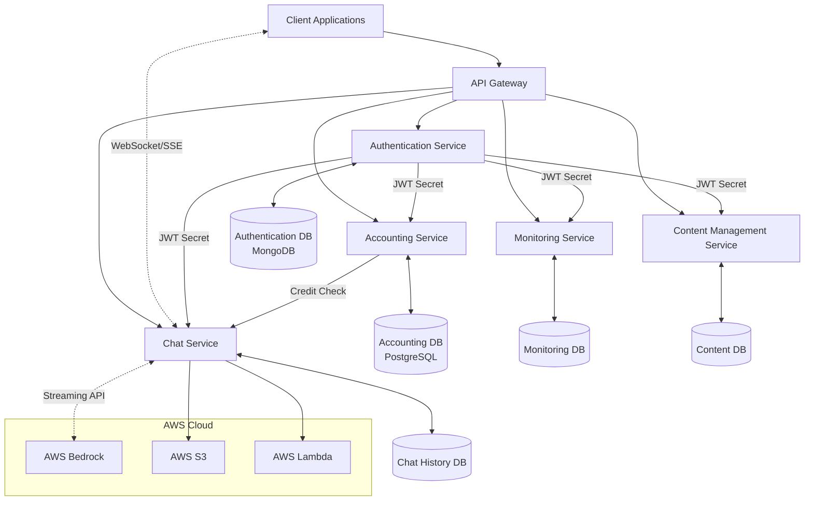
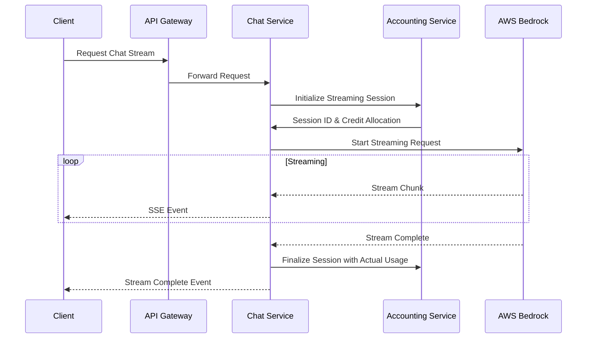
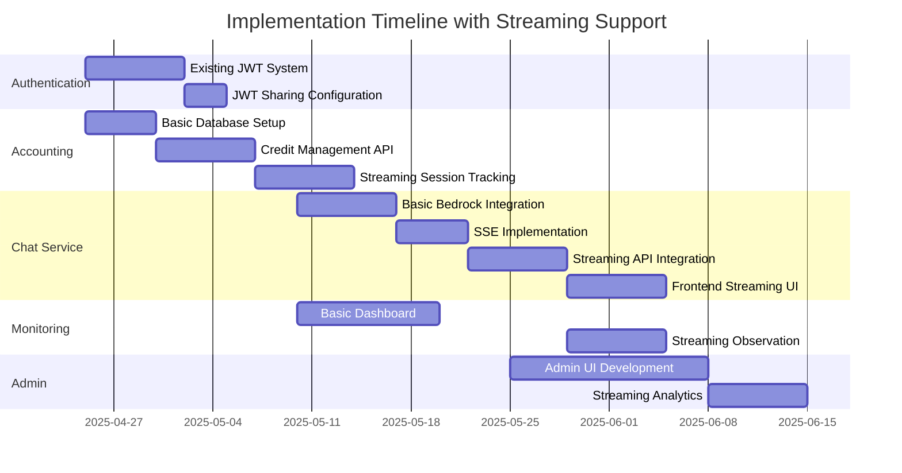

# Blueprint for Agentic Chatbot Platform with Streaming Chat Support

A comprehensive blueprint that incorporates streaming chat capabilities alongside the separate authentication and accounting databases.

## System Overview with Streaming Support

The architecture maintains the microservices approach with these key components:

1. **Authentication Service**: Using JWT tokens, with its own MongoDB database
2. **Accounting Service**: Managing credits and API usage, with a separate PostgreSQL database
3. **Chat Service**: Handling interactions with AWS Bedrock, now with streaming capabilities
4. **Monitoring Service**: For supervisors to track student activities
5. **Content Management Service**: For updating and managing chatbot content
6. **Admin Dashboard**: For system management and control

## Architecture Diagram with Streaming Support



## 1. Authentication Service (Existing)

The authentication service remains largely unchanged, continuing to use the existing JWT system. No modifications are needed to support streaming chat.

## 2. Accounting Service (Separate Database)

The accounting service will now include support for streaming session tracking.

### Update to Credit Management for Streaming

```typescript
// src/models/streaming-session.model.ts
import { DataTypes, Model } from 'sequelize';
import sequelize from '../config/sequelize';

interface StreamingSessionAttributes {
  id?: number;
  sessionId: string;
  userId: string;
  modelId: string;
  estimatedCredits: number;
  allocatedCredits: number;
  usedCredits: number;
  status: 'active' | 'completed' | 'failed';
  startedAt: Date;
  completedAt?: Date;
}

class StreamingSession extends Model<StreamingSessionAttributes> implements StreamingSessionAttributes {
  public id!: number;
  public sessionId!: string;
  public userId!: string;
  public modelId!: string;
  public estimatedCredits!: number;
  public allocatedCredits!: number;
  public usedCredits!: number;
  public status!: 'active' | 'completed' | 'failed';
  public startedAt!: Date;
  public completedAt?: Date;
}

StreamingSession.init({
  id: {
    type: DataTypes.INTEGER,
    autoIncrement: true,
    primaryKey: true
  },
  sessionId: {
    type: DataTypes.STRING,
    allowNull: false,
    unique: true
  },
  userId: {
    type: DataTypes.STRING,
    allowNull: false,
    references: {
      model: 'user_accounts',
      key: 'userId'
    }
  },
  modelId: {
    type: DataTypes.STRING,
    allowNull: false
  },
  estimatedCredits: {
    type: DataTypes.INTEGER,
    allowNull: false
  },
  allocatedCredits: {
    type: DataTypes.INTEGER,
    allowNull: false
  },
  usedCredits: {
    type: DataTypes.INTEGER,
    allowNull: false,
    defaultValue: 0
  },
  status: {
    type: DataTypes.ENUM('active', 'completed', 'failed'),
    allowNull: false,
    defaultValue: 'active'
  },
  startedAt: {
    type: DataTypes.DATE,
    allowNull: false,
    defaultValue: DataTypes.NOW
  },
  completedAt: {
    type: DataTypes.DATE
  }
}, {
  sequelize,
  tableName: 'streaming_sessions'
});

export default StreamingSession;
```

### Streaming Credit Management Controller

```typescript
// src/controllers/streaming.controller.ts
import { Request, Response } from 'express';
import { Op } from 'sequelize';
import StreamingSession from '../models/streaming-session.model';
import CreditAllocation from '../models/credit-allocation.model';
import Usage from '../models/usage.model';

// Initialize a streaming session and pre-allocate credits
export const initializeStreamingSession = async (req: Request, res: Response) => {
  try {
    const userId = req.user?.userId;
    const { sessionId, modelId, estimatedTokens } = req.body;
    
    // Calculate estimated credits needed
    const ratePerThousandTokens = {
      'anthropic.claude-3-sonnet-20240229-v1:0': 3,
      'anthropic.claude-3-haiku-20240307-v1:0': 0.25,
      'anthropic.claude-instant-v1': 0.8,
      'amazon.titan-text-express-v1': 0.3,
    };
    
    const rate = ratePerThousandTokens[modelId] || 1;
    const estimatedCredits = Math.ceil((estimatedTokens / 1000) * rate);
    
    // Check if user has sufficient credits (with buffer)
    const creditBuffer = Math.ceil(estimatedCredits * 1.2); // 20% buffer
    
    const allocation = await CreditAllocation.findOne({ 
      where: { 
        userId, 
        expiresAt: { [Op.gt]: new Date() },
        remainingCredits: { [Op.gte]: creditBuffer }
      },
      order: [['expiresAt', 'ASC']]
    });
    
    if (!allocation) {
      return res.status(402).json({ 
        message: 'Insufficient credits for streaming session',
        estimatedCredits,
        bufferRequired: creditBuffer
      });
    }
    
    // Create streaming session with pre-allocated credits
    const streamingSession = await StreamingSession.create({
      sessionId,
      userId: userId!,
      modelId,
      estimatedCredits,
      allocatedCredits: creditBuffer, // Pre-allocate with buffer
      usedCredits: 0,
      status: 'active',
      startedAt: new Date()
    });
    
    // Reserve the credits (without deducting them yet)
    allocation.remainingCredits -= creditBuffer;
    await allocation.save();
    
    return res.status(201).json({
      sessionId: streamingSession.sessionId,
      allocatedCredits: creditBuffer,
      estimatedCredits,
      message: 'Streaming session initialized'
    });
  } catch (error) {
    console.error('Error initializing streaming session:', error);
    return res.status(500).json({ message: 'Error initializing streaming session', error });
  }
};

// Update streaming session with actual usage
export const finalizeStreamingSession = async (req: Request, res: Response) => {
  try {
    const userId = req.user?.userId;
    const { sessionId, actualTokens, success = true } = req.body;
    
    // Find the streaming session
    const streamingSession = await StreamingSession.findOne({
      where: { sessionId, userId, status: 'active' }
    });
    
    if (!streamingSession) {
      return res.status(404).json({ message: 'Active streaming session not found' });
    }
    
    // Calculate actual credits used
    const ratePerThousandTokens = {
      'anthropic.claude-3-sonnet-20240229-v1:0': 3,
      'anthropic.claude-3-haiku-20240307-v1:0': 0.25,
      'anthropic.claude-instant-v1': 0.8,
      'amazon.titan-text-express-v1': 0.3,
    };
    
    const rate = ratePerThousandTokens[streamingSession.modelId] || 1;
    const actualCredits = Math.ceil((actualTokens / 1000) * rate);
    
    // Update streaming session
    streamingSession.usedCredits = actualCredits;
    streamingSession.status = success ? 'completed' : 'failed';
    streamingSession.completedAt = new Date();
    await streamingSession.save();
    
    // Find the allocation to refund unused credits
    const allocation = await CreditAllocation.findOne({ 
      where: { 
        userId,
        expiresAt: { [Op.gt]: new Date() }
      },
      order: [['expiresAt', 'ASC']]
    });
    
    if (allocation) {
      // Refund unused credits
      const refundAmount = streamingSession.allocatedCredits - actualCredits;
      if (refundAmount > 0) {
        allocation.remainingCredits += refundAmount;
        await allocation.save();
      }
    }
    
    // Record usage
    await Usage.create({
      userId: userId!,
      timestamp: new Date(),
      service: 'chat-streaming',
      operation: streamingSession.modelId,
      credits: actualCredits,
      metadata: {
        sessionId,
        tokens: actualTokens,
        streamingDuration: (streamingSession.completedAt!.getTime() - streamingSession.startedAt.getTime()) / 1000
      }
    });
    
    return res.status(200).json({
      sessionId,
      status: streamingSession.status,
      estimatedCredits: streamingSession.estimatedCredits,
      actualCredits,
      refund: streamingSession.allocatedCredits - actualCredits
    });
  } catch (error) {
    console.error('Error finalizing streaming session:', error);
    return res.status(500).json({ message: 'Error finalizing streaming session', error });
  }
};

// Handle streaming session aborts/errors
export const abortStreamingSession = async (req: Request, res: Response) => {
  try {
    const userId = req.user?.userId;
    const { sessionId, tokensGenerated = 0 } = req.body;
    
    // Find the streaming session
    const streamingSession = await StreamingSession.findOne({
      where: { sessionId, userId, status: 'active' }
    });
    
    if (!streamingSession) {
      return res.status(404).json({ message: 'Active streaming session not found' });
    }
    
    // Calculate partial credits used
    const ratePerThousandTokens = {
      'anthropic.claude-3-sonnet-20240229-v1:0': 3,
      'anthropic.claude-3-haiku-20240307-v1:0': 0.25,
      'anthropic.claude-instant-v1': 0.8,
      'amazon.titan-text-express-v1': 0.3,
    };
    
    const rate = ratePerThousandTokens[streamingSession.modelId] || 1;
    const partialCredits = Math.ceil((tokensGenerated / 1000) * rate);
    
    // Update streaming session
    streamingSession.usedCredits = partialCredits;
    streamingSession.status = 'failed';
    streamingSession.completedAt = new Date();
    await streamingSession.save();
    
    // Find the allocation to refund unused credits
    const allocation = await CreditAllocation.findOne({ 
      where: { 
        userId,
        expiresAt: { [Op.gt]: new Date() }
      },
      order: [['expiresAt', 'ASC']]
    });
    
    if (allocation) {
      // Refund unused credits
      const refundAmount = streamingSession.allocatedCredits - partialCredits;
      if (refundAmount > 0) {
        allocation.remainingCredits += refundAmount;
        await allocation.save();
      }
    }
    
    // Record partial usage
    await Usage.create({
      userId: userId!,
      timestamp: new Date(),
      service: 'chat-streaming-aborted',
      operation: streamingSession.modelId,
      credits: partialCredits,
      metadata: {
        sessionId,
        partialTokens: tokensGenerated,
        streamingDuration: (streamingSession.completedAt!.getTime() - streamingSession.startedAt.getTime()) / 1000
      }
    });
    
    return res.status(200).json({
      sessionId,
      status: 'aborted',
      partialCredits,
      refund: streamingSession.allocatedCredits - partialCredits
    });
  } catch (error) {
    console.error('Error aborting streaming session:', error);
    return res.status(500).json({ message: 'Error aborting streaming session', error });
  }
};
```

### Updated Accounting Routes

```typescript
// src/routes/accounting.routes.ts
import { Router } from 'express';
import { 
  getCreditBalance, 
  allocateCredits, 
  trackUsage,
  checkCredits
} from '../controllers/accounting.controller';
import {
  initializeStreamingSession,
  finalizeStreamingSession,
  abortStreamingSession
} from '../controllers/streaming.controller';
import { authenticateJWT, requireAdmin } from '../middleware/jwt.middleware';

const router = Router();

// Credit management routes
router.get('/credits', authenticateJWT, getCreditBalance);
router.post('/credits/check', authenticateJWT, checkCredits);
router.post('/credits/allocate', authenticateJWT, requireAdmin, allocateCredits);
router.post('/usage/track', authenticateJWT, trackUsage);

// Streaming session management
router.post('/streaming/initialize', authenticateJWT, initializeStreamingSession);
router.post('/streaming/finalize', authenticateJWT, finalizeStreamingSession);
router.post('/streaming/abort', authenticateJWT, abortStreamingSession);

// Existing API key routes
// ...

export default router;
```

## 3. Chat Service with Streaming Support

The Chat Service now implements WebSocket or Server-Sent Events (SSE) for streaming responses.

### WebSocket vs. SSE for Streaming Chat

For this implementation, we'll use Server-Sent Events (SSE) because:
1. It's simpler to implement than WebSockets
2. Works well for one-way server-to-client streaming (which is what we need)
3. Has automatic reconnection built-in
4. Works through proxies and firewalls more reliably

### Streaming Chat Implementation

```typescript
// src/services/streaming-bedrock.service.ts
import { 
  BedrockRuntimeClient, 
  InvokeModelWithResponseStreamCommand 
} from '@aws-sdk/client-bedrock-runtime';
import { PassThrough } from 'stream';
import axios from 'axios';

// Initialize AWS client
const bedrockClient = new BedrockRuntimeClient({ region: process.env.AWS_REGION });

// Constants
const ACCOUNTING_API_URL = process.env.ACCOUNTING_API_URL || 'http://localhost:3001/api/accounting';

// Initialize a streaming session
export const initializeStreamingSession = async (
  userId: string,
  messages: any[],
  modelId: string,
  authHeader: string
) => {
  try {
    // Estimate token usage
    const promptText = messages.map(m => m.content).join(' ');
    const estimatedTokens = Math.ceil(promptText.length / 4) + 1000; // Simple estimation with buffer
    
    // Initialize session with accounting service
    const response = await axios.post(
      `${ACCOUNTING_API_URL}/streaming/initialize`,
      {
        sessionId: `stream-${Date.now()}-${userId.slice(0, 6)}`,
        modelId,
        estimatedTokens
      },
      { 
        headers: { 
          'Authorization': authHeader,
          'Content-Type': 'application/json'
        } 
      }
    );
    
    return {
      sessionId: response.data.sessionId,
      allocatedCredits: response.data.allocatedCredits
    };
  } catch (error) {
    console.error('Error initializing streaming session:', error);
    if (axios.isAxiosError(error) && error.response?.status === 402) {
      throw new Error('Insufficient credits for streaming');
    }
    throw error;
  }
};

// Stream a response from Bedrock
export const streamResponse = async (
  userId: string,
  sessionId: string,
  messages: any[],
  modelId: string,
  authHeader: string
) => {
  // Create a PassThrough stream that we'll write to
  const stream = new PassThrough();
  
  // Track token usage
  let totalTokensGenerated = 0;
  
  try {
    // Format messages for Bedrock
    const promptBody = {
      anthropic_version: 'bedrock-2023-05-31',
      max_tokens: 2000,
      messages: messages
    };
    
    // Create the streaming command
    const command = new InvokeModelWithResponseStreamCommand({
      modelId: modelId || 'anthropic.claude-3-sonnet-20240229-v1:0',
      contentType: 'application/json',
      accept: 'application/json',
      body: JSON.stringify(promptBody)
    });
    
    // Execute the stream command
    const response = await bedrockClient.send(command);
    
    // Process the chunks as they arrive
    if (response.body) {
      // Write stream header for SSE
      stream.write('event: start\ndata: {"status":"started"}\n\n');
      
      // Process each chunk
      for await (const chunk of response.body) {
        if (chunk.chunk?.bytes) {
          // Parse the response chunk
          const decodedChunk = JSON.parse(new TextDecoder().decode(chunk.chunk.bytes));
          
          if (decodedChunk.message?.content) {
            const content = decodedChunk.message.content;
            stream.write(`event: chunk\ndata: ${JSON.stringify({ content })}\n\n`);
            
            // Update token count (rough estimation)
            totalTokensGenerated += Math.ceil(content.length / 4);
          }
        }
      }
      
      // Finalize streaming session with accounting
      await axios.post(
        `${ACCOUNTING_API_URL}/streaming/finalize`,
        {
          sessionId,
          actualTokens: totalTokensGenerated + (messages.reduce((acc, m) => acc + m.content.length, 0) / 4),
          success: true
        },
        {
          headers: {
            'Authorization': authHeader,
            'Content-Type': 'application/json'
          }
        }
      );
      
      // Send completion event
      stream.write(`event: complete\ndata: {"status":"complete","tokens":${totalTokensGenerated}}\n\n`);
    }
    
    // End the stream
    stream.end();
    
  } catch (error) {
    console.error('Error in stream processing:', error);
    
    // Attempt to abort/finalize the streaming session
    try {
      await axios.post(
        `${ACCOUNTING_API_URL}/streaming/abort`,
        {
          sessionId,
          tokensGenerated: totalTokensGenerated
        },
        {
          headers: {
            'Authorization': authHeader,
            'Content-Type': 'application/json'
          }
        }
      );
    } catch (abortError) {
      console.error('Error aborting streaming session:', abortError);
    }
    
    // Write error to stream
    stream.write(`event: error\ndata: ${JSON.stringify({ error: 'Stream processing error' })}\n\n`);
    stream.end();
  }
  
  return stream;
};
```

### Streaming Chat Controller

```typescript
// src/controllers/chat.controller.ts
import { Request, Response } from 'express';
import ChatSession from '../models/chat.model';
import { initializeStreamingSession, streamResponse } from '../services/streaming-bedrock.service';

// Stream chat response
export const streamChatResponse = async (req: Request, res: Response) => {
  const userId = req.user?.sub;
  const { sessionId, message, modelId = 'anthropic.claude-3-sonnet-20240229-v1:0' } = req.body;
  
  try {
    // Find chat session
    const session = await ChatSession.findOne({ _id: sessionId, userId });
    if (!session) {
      return res.status(404).json({ message: 'Chat session not found' });
    }
    
    // Add user message to session
    const userMessage = {
      role: 'user',
      content: message,
      timestamp: new Date()
    };
    session.messages.push(userMessage);
    await session.save();
    
    // Prepare messages for Bedrock
    const messageHistory = session.messages.map(m => ({
      role: m.role,
      content: m.content
    }));
    
    // Initialize streaming session with accounting
    const authHeader = req.headers.authorization || '';
    const streamSession = await initializeStreamingSession(
      userId, 
      messageHistory, 
      modelId,
      authHeader
    );
    
    // Set up SSE headers
    res.setHeader('Content-Type', 'text/event-stream');
    res.setHeader('Cache-Control', 'no-cache');
    res.setHeader('Connection', 'keep-alive');
    res.flushHeaders();
    
    // Create response stream
    const responseStream = await streamResponse(
      userId,
      streamSession.sessionId,
      messageHistory,
      modelId,
      authHeader
    );
    
    // Pipe the stream to the response
    responseStream.pipe(res);
    
    // Create a placeholder for the assistant's response
    const assistantMessage = {
      role: 'assistant',
      content: '', // Will be collected client-side from the stream
      timestamp: new Date()
    };
    session.messages.push(assistantMessage);
    
    // Update session metadata
    session.metadata.streamingSessionId = streamSession.sessionId;
    session.updatedAt = new Date();
    await session.save();
    
    // Handle client disconnect
    req.on('close', () => {
      console.log(`Client disconnected from stream for session ${sessionId}`);
      responseStream.unpipe(res);
    });
    
  } catch (error) {
    console.error('Streaming error:', error);
    
    // If headers are already sent, we're in SSE mode
    if (res.headersSent) {
      res.write(`event: error\ndata: ${JSON.stringify({ error: error.message })}\n\n`);
      res.end();
    } else {
      // Otherwise send a normal error response
      return res.status(error.message === 'Insufficient credits for streaming' ? 402 : 500)
        .json({ message: error.message });
    }
  }
};

// Update chat session with complete response
export const updateChatWithStreamResponse = async (req: Request, res: Response) => {
  try {
    const userId = req.user?.sub;
    const { sessionId, completeResponse, streamingSessionId, tokensUsed } = req.body;
    
    // Find chat session
    const session = await ChatSession.findOne({ _id: sessionId, userId });
    if (!session) {
      return res.status(404).json({ message: 'Chat session not found' });
    }
    
    // Find and update the assistant message
    const lastMessageIndex = session.messages.length - 1;
    if (lastMessageIndex >= 0 && session.messages[lastMessageIndex].role === 'assistant') {
      session.messages[lastMessageIndex].content = completeResponse;
    }
    
    // Update metadata
    session.metadata.totalTokens = (session.metadata.totalTokens || 0) + tokensUsed;
    session.metadata.lastStreamingSessionId = streamingSessionId;
    
    await session.save();
    
    return res.status(200).json({ 
      success: true,
      messageIndex: lastMessageIndex
    });
  } catch (error) {
    console.error('Error updating chat with stream response:', error);
    return res.status(500).json({ message: 'Error updating chat session', error });
  }
};
```

### Chat Routes with Streaming Support

```typescript
// src/routes/chat.routes.ts
import { Router } from 'express';
import { 
  createChatSession, 
  getChatHistory,
  streamChatResponse,
  updateChatWithStreamResponse
} from '../controllers/chat.controller';
import { authenticate } from '../auth/auth.middleware';

const router = Router();

router.post('/sessions', authenticate, createChatSession);
router.get('/history', authenticate, getChatHistory);

// Streaming endpoints
router.post('/sessions/:sessionId/stream', authenticate, streamChatResponse);
router.post('/sessions/:sessionId/update-stream', authenticate, updateChatWithStreamResponse);

export default router;
```

## 4. Frontend Implementation for Streaming Chat

The frontend needs to handle Server-Sent Events for streaming responses.

```typescript
// client/src/services/ChatService.ts
class ChatService {
  // Regular chat methods...
  
  // Stream a chat response
  async streamChatResponse(sessionId: string, message: string, modelId?: string): Promise<EventSource> {
    try {
      // First, create a POST request to initiate the stream
      const response = await fetch(`${API_URL}/api/chat/sessions/${sessionId}/stream`, {
        method: 'POST',
        headers: {
          'Content-Type': 'application/json',
          'Authorization': `Bearer ${this.getAccessToken()}`
        },
        body: JSON.stringify({ message, modelId })
      });
      
      // If response is not ok, it's an error (like insufficient credits)
      if (!response.ok) {
        const errorData = await response.json();
        throw new Error(errorData.message || 'Failed to initiate streaming chat');
      }
      
      // Create event source for SSE on the same URL
      const eventSource = new EventSource(
        `${API_URL}/api/chat/sessions/${sessionId}/stream?token=${encodeURIComponent(this.getAccessToken())}`
      );
      
      return eventSource;
    } catch (error) {
      console.error('Error streaming chat response:', error);
      throw error;
    }
  }
  
  // Update chat with complete streamed response
  async updateChatWithStreamResponse(
    sessionId: string, 
    completeResponse: string, 
    streamingSessionId: string,
    tokensUsed: number
  ): Promise<void> {
    try {
      await fetch(`${API_URL}/api/chat/sessions/${sessionId}/update-stream`, {
        method: 'POST',
        headers: {
          'Content-Type': 'application/json',
          'Authorization': `Bearer ${this.getAccessToken()}`
        },
        body: JSON.stringify({ 
          completeResponse, 
          streamingSessionId, 
          tokensUsed 
        })
      });
    } catch (error) {
      console.error('Error updating chat with stream response:', error);
    }
  }
}
```

### React Component for Streaming Chat

```tsx
// client/src/components/StreamingChat.tsx
import React, { useState, useEffect, useRef } from 'react';
import ChatService from '../services/ChatService';

const StreamingChat: React.FC<{ sessionId: string }> = ({ sessionId }) => {
  const [message, setMessage] = useState('');
  const [responseText, setResponseText] = useState('');
  const [isStreaming, setIsStreaming] = useState(false);
  const [error, setError] = useState<string | null>(null);
  const eventSourceRef = useRef<EventSource | null>(null);
  const chatService = new ChatService();
  
  // Clean up event source on unmount
  useEffect(() => {
    return () => {
      if (eventSourceRef.current) {
        eventSourceRef.current.close();
      }
    };
  }, []);
  
  const handleSendMessage = async () => {
    if (!message.trim() || isStreaming) return;
    
    try {
      setIsStreaming(true);
      setResponseText('');
      setError(null);
      
      // Store the complete response as we receive chunks
      let completeResponse = '';
      let streamingSessionId = '';
      let tokensUsed = 0;
      
      // Create event source for streaming
      const eventSource = await chatService.streamChatResponse(sessionId, message);
      eventSourceRef.current = eventSource;
      
      // Listen for stream events
      eventSource.addEventListener('start', (event) => {
        const data = JSON.parse(event.data);
        console.log('Stream started:', data);
      });
      
      eventSource.addEventListener('chunk', (event) => {
        const data = JSON.parse(event.data);
        completeResponse += data.content;
        setResponseText(prevText => prevText + data.content);
      });
      
      eventSource.addEventListener('complete', (event) => {
        const data = JSON.parse(event.data);
        console.log('Stream completed:', data);
        tokensUsed = data.tokens;
        
        // Clean up
        eventSource.close();
        eventSourceRef.current = null;
        setIsStreaming(false);
        
        // Update the chat session with complete response
        chatService.updateChatWithStreamResponse(
          sessionId,
          completeResponse,
          streamingSessionId,
          tokensUsed
        );
      });
      
      eventSource.addEventListener('error', (event) => {
        const data = JSON.parse(event.data);
        setError(data.error || 'An error occurred during streaming');
        
        // Clean up
        eventSource.close();
        eventSourceRef.current = null;
        setIsStreaming(false);
      });
      
      // Also handle general errors
      eventSource.onerror = () => {
        setError('Connection error');
        eventSource.close();
        eventSourceRef.current = null;
        setIsStreaming(false);
      };
      
      // Clear the input
      setMessage('');
      
    } catch (error) {
      setError(error.message || 'Failed to stream response');
      setIsStreaming(false);
    }
  };
  
  const handleStopStreaming = () => {
    if (eventSourceRef.current) {
      eventSourceRef.current.close();
      eventSourceRef.current = null;
      setIsStreaming(false);
    }
  };
  
  return (
    <div className="streaming-chat">
      <div className="chat-messages">
        {/* Display existing chat messages */}
        
        {/* Display streaming response */}
        {responseText && (
          <div className="assistant-message">
            <p>{responseText}</p>
          </div>
        )}
        
        {error && (
          <div className="error-message">
            <p>{error}</p>
          </div>
        )}
      </div>
      
      <div className="chat-input">
        <input
          type="text"
          value={message}
          onChange={(e) => setMessage(e.target.value)}
          disabled={isStreaming}
          placeholder="Type your message..."
        />
        
        {isStreaming ? (
          <button onClick={handleStopStreaming}>Stop</button>
        ) : (
          <button onClick={handleSendMessage}>Send</button>
        )}
      </div>
    </div>
  );
};

export default StreamingChat;
```

## 5. Monitoring Service with Streaming Support

The monitoring service needs to be updated to handle streaming sessions and potentially observe ongoing streams.

```typescript
// src/controllers/monitoring.controller.ts
import { Request, Response } from 'express';
import axios from 'axios';
import SupervisorStudent from '../models/relationship.model';

// Constants
const CHAT_API_URL = process.env.CHAT_API_URL || 'http://localhost:3002/api/chat';
const ACCOUNTING_API_URL = process.env.ACCOUNTING_API_URL || 'http://localhost:3001/api/accounting';

// Get active streaming sessions for a student
export const getActiveStreamingSessions = async (req: Request, res: Response) => {
  try {
    const supervisorId = req.user?.sub;
    const { studentId } = req.params;
    
    // Verify supervisor-student relationship
    const relationship = await SupervisorStudent.findOne({ 
      supervisorId, 
      studentId,
      status: 'active'
    });
    
    if (!relationship) {
      return res.status(403).json({ message: 'Not authorized to view this student\'s sessions' });
    }
    
    // Get active streaming sessions from accounting service
    const response = await axios.get(
      `${ACCOUNTING_API_URL}/streaming/active/${studentId}`,
      { 
        headers: { 
          'Authorization': req.headers.authorization 
        } 
      }
    );
    
    return res.status(200).json(response.data);
  } catch (error) {
    return res.status(500).json({ message: 'Error fetching active streaming sessions', error });
  }
};

// Join an active streaming session as an observer
export const joinStreamingSession = async (req: Request, res: Response) => {
  try {
    const supervisorId = req.user?.sub;
    const { studentId, sessionId } = req.params;
    
    // Verify supervisor-student relationship
    const relationship = await SupervisorStudent.findOne({ 
      supervisorId, 
      studentId,
      status: 'active'
    });
    
    if (!relationship) {
      return res.status(403).json({ message: 'Not authorized to join this student\'s session' });
    }
    
    // Set up SSE headers
    res.setHeader('Content-Type', 'text/event-stream');
    res.setHeader('Cache-Control', 'no-cache');
    res.setHeader('Connection', 'keep-alive');
    res.flushHeaders();
    
    // Forward streaming response from chat service
    const response = await axios.get(
      `${CHAT_API_URL}/sessions/${sessionId}/stream/observe`,
      { 
        headers: { 
          'Authorization': req.headers.authorization 
        },
        responseType: 'stream'
      }
    );
    
    // Pipe the stream to the response
    response.data.pipe(res);
    
    // Handle client disconnect
    req.on('close', () => {
      response.data.unpipe(res);
      // Clean up any observation-specific resources
    });
    
  } catch (error) {
    console.error('Error joining streaming session:', error);
    
    // If headers are already sent, we're in SSE mode
    if (res.headersSent) {
      res.write(`event: error\ndata: ${JSON.stringify({ error: 'Error joining streaming session' })}\n\n`);
      res.end();
    } else {
      // Otherwise send a normal error response
      return res.status(500).json({ message: 'Error joining streaming session', error });
    }
  }
};
```

## 6. AWS Bedrock Integration for Streaming

The integration with AWS Bedrock needs to use streaming APIs.



## 7. Docker Configuration with Streaming Support

Update the Docker Compose configuration to include environment variables for streaming:

```yaml
# docker-compose.yml
# ...existing services...

  # Chat Service with streaming
  chat-service:
    build:
      context: ./chat-service
      dockerfile: Dockerfile
    ports:
      - "3002:3002"
    environment:
      - NODE_ENV=production
      - PORT=3002
      - MONGO_URI=mongodb://chat-db:27017/chat_db
      - JWT_ACCESS_SECRET=${JWT_ACCESS_SECRET}
      - JWT_REFRESH_SECRET=${JWT_REFRESH_SECRET}
      - ACCOUNTING_API_URL=http://accounting-service:3001/api/accounting
      - AWS_REGION=${AWS_REGION}
      - AWS_ACCESS_KEY_ID=${AWS_ACCESS_KEY_ID}
      - AWS_SECRET_ACCESS_KEY=${AWS_SECRET_ACCESS_KEY}
      - S3_BUCKET_NAME=${S3_BUCKET_NAME}
      - ENABLE_STREAMING=true
      - MAX_STREAMING_DURATION=120000  # 2 minutes max stream time
      - CORS_ORIGIN=*
    depends_on:
      - chat-db
      - accounting-service
    restart: always
    networks:
      - chatbot-network
```

## Updated Implementation Timeline



## Technical Challenges and Solutions

### 1. Credit Pre-allocation and Adjustment

**Challenge**: With streaming, we can't know the exact credits needed before starting.

**Solution**: Pre-allocate credits with a buffer, then adjust when the stream completes.

### 2. Handling Disconnects and Errors

**Challenge**: Client or server disconnects during streaming could lead to credit discrepancies.

**Solution**: Implement session finalization/abortion endpoints to properly account for partial usage.

### 3. Monitoring Active Streams

**Challenge**: Allowing supervisors to observe active streams requires complex forwarding.

**Solution**: Use observer pattern where the original stream can be duplicated to multiple observers.

### 4. Performance Considerations

**Challenge**: Streaming to multiple clients could impact performance.

**Solution**: 
- Implement connection limits per server
- Consider using Redis for pub/sub to distribute stream chunks across instances
- Use load balancing for the streaming endpoints

## Conclusion

This comprehensive blueprint provides a robust architecture for an agentic chatbot platform with streaming chat capabilities, while maintaining separate authentication and accounting databases. The key components of this architecture include:

1. **JWT-based Authentication**: Shared JWT secret allowing secure cross-service communication
2. **Separate Accounting Database**: PostgreSQL for tracking credits and API usage 
3. **Streaming Chat Implementation**: Using Server-Sent Events for real-time responses
4. **Pre-allocation Credit Model**: Ensuring proper credit management for streaming sessions
5. **Supervisor Monitoring**: Allowing teachers to observe and provide feedback on student interactions
6. **AWS Bedrock Integration**: Using AWS Bedrock's streaming API endpoints for real-time AI responses

By implementing this blueprint, you'll create a powerful platform enabling teachers to effectively monitor and guide students in their use of agentic chatbots, with a modern streaming interface that provides immediate feedback and a more engaging user experience, all while maintaining proper administrative controls and usage tracking.

The separation of authentication and accounting services ensures each component can be scaled and maintained independently, while the shared JWT authentication provides a seamless user experience across all services.