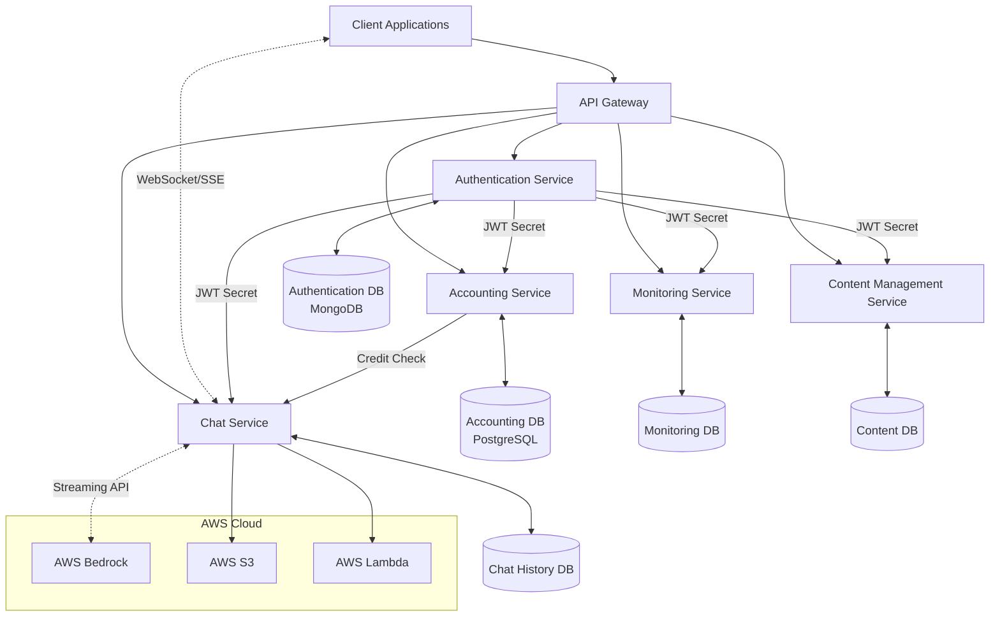
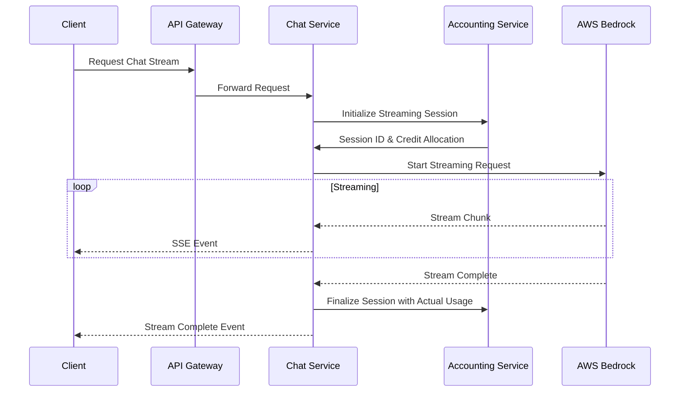
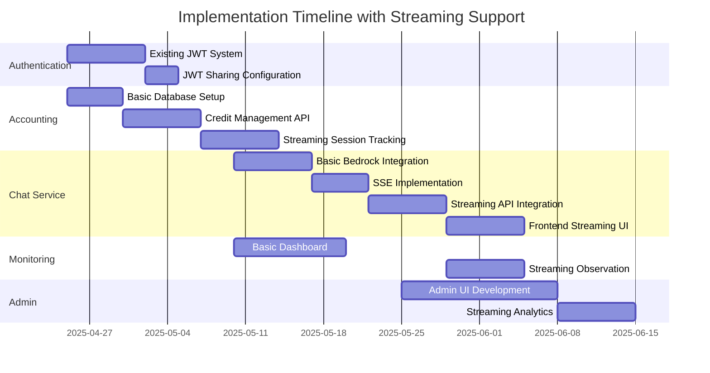

# Blueprint for Agentic Chatbot Platform with Streaming Chat Support

A comprehensive blueprint that incorporates streaming chat capabilities alongside the separate authentication and accounting databases.

## System Overview with Streaming Support

The architecture maintains the microservices approach with these key components:

1. **Authentication Service**: Using JWT tokens, with its own MongoDB database
2. **Accounting Service**: Managing credits and API usage, with a separate PostgreSQL database
3. **Chat Service**: Handling interactions with AWS Bedrock, now with streaming capabilities
4. **Monitoring Service**: For supervisors to track student activities
5. **Content Management Service**: For updating and managing chatbot content
6. **Admin Dashboard**: For system management and control

## Architecture Diagram with Streaming Support



## 1. Authentication Service (Existing)

The authentication service remains largely unchanged, continuing to use the existing JWT system. No modifications are needed to support streaming chat.

## 2. Accounting Service (Separate Database)

The accounting service will now include support for streaming session tracking.

### Update to Credit Management for Streaming

```typescript
// src/models/streaming-session.model.ts
import { DataTypes, Model } from 'sequelize';
import sequelize from '../config/sequelize';

interface StreamingSessionAttributes {
  id?: number;
  sessionId: string;
  userId: string;
  modelId: string;
  estimatedCredits: number;
  allocatedCredits: number;
  usedCredits: number;
  status: 'active' | 'completed' | 'failed';
  startedAt: Date;
  completedAt?: Date;
}

class StreamingSession extends Model<StreamingSessionAttributes> implements StreamingSessionAttributes {
  public id!: number;
  public sessionId!: string;
  public userId!: string;
  public modelId!: string;
  public estimatedCredits!: number;
  public allocatedCredits!: number;
  public usedCredits!: number;
  public status!: 'active' | 'completed' | 'failed';
  public startedAt!: Date;
  public completedAt?: Date;
}

StreamingSession.init({
  id: {
    type: DataTypes.INTEGER,
    autoIncrement: true,
    primaryKey: true
  },
  sessionId: {
    type: DataTypes.STRING,
    allowNull: false,
    unique: true
  },
  userId: {
    type: DataTypes.STRING,
    allowNull: false,
    references: {
      model: 'user_accounts',
      key: 'userId'
    }
  },
  modelId: {
    type: DataTypes.STRING,
    allowNull: false
  },
  estimatedCredits: {
    type: DataTypes.INTEGER,
    allowNull: false
  },
  allocatedCredits: {
    type: DataTypes.INTEGER,
    allowNull: false
  },
  usedCredits: {
    type: DataTypes.INTEGER,
    allowNull: false,
    defaultValue: 0
  },
  status: {
    type: DataTypes.ENUM('active', 'completed', 'failed'),
    allowNull: false,
    defaultValue: 'active'
  },
  startedAt: {
    type: DataTypes.DATE,
    allowNull: false,
    defaultValue: DataTypes.NOW
  },
  completedAt: {
    type: DataTypes.DATE
  }
}, {
  sequelize,
  tableName: 'streaming_sessions'
});

export default StreamingSession;
```

### Streaming Credit Management Controller

```typescript
// src/controllers/streaming-session.controller.ts
import { Request, Response } from 'express';
import StreamingSessionService from '../services/streaming-session.service';

/**
 * Initialize a streaming session and pre-allocate credits
 */
export const initializeSession = async (req: Request, res: Response) => {
  try {
    const userId = req.user?.userId;
    const { sessionId, modelId, estimatedTokens } = req.body;
    
    if (!sessionId || !modelId || !estimatedTokens) {
      return res.status(400).json({ message: 'Missing required parameters' });
    }
    
    const session = await StreamingSessionService.initializeSession({
      sessionId,
      userId: userId!,
      modelId,
      estimatedTokens
    });
    
    return res.status(201).json({
      sessionId: session.sessionId,
      allocatedCredits: session.allocatedCredits,
      estimatedCredits: session.estimatedCredits,
      message: 'Streaming session initialized'
    });
  } catch (error) {
    console.error('Error initializing streaming session:', error);
    
    if (error.message === 'Insufficient credits for streaming session') {
      return res.status(402).json({ 
        message: 'Insufficient credits for streaming session' 
      });
    }
    
    return res.status(500).json({ message: 'Error initializing streaming session', error });
  }
};

/**
 * Finalize a streaming session with actual usage
 */
export const finalizeSession = async (req: Request, res: Response) => {
  try {
    const userId = req.user?.userId;
    const { sessionId, actualTokens, success = true } = req.body;
    
    if (!sessionId || !actualTokens) {
      return res.status(400).json({ message: 'Missing required parameters' });
    }
    
    const result = await StreamingSessionService.finalizeSession({
      sessionId,
      userId: userId!,
      actualTokens,
      success
    });
    
    return res.status(200).json(result);
  } catch (error) {
    console.error('Error finalizing streaming session:', error);
    
    if (error.message === 'Active streaming session not found') {
      return res.status(404).json({ message: 'Active streaming session not found' });
    }
    
    return res.status(500).json({ message: 'Error finalizing streaming session', error });
  }
};

/**
 * Abort a streaming session
 */
export const abortSession = async (req: Request, res: Response) => {
  try {
    const userId = req.user?.userId;
    const { sessionId, tokensGenerated = 0 } = req.body;
    
    if (!sessionId) {
      return res.status(400).json({ message: 'Missing required parameters' });
    }
    
    const result = await StreamingSessionService.abortSession({
      sessionId,
      userId: userId!,
      tokensGenerated
    });
    
    return res.status(200).json(result);
  } catch (error) {
    console.error('Error aborting streaming session:', error);
    
    if (error.message === 'Active streaming session not found') {
      return res.status(404).json({ message: 'Active streaming session not found' });
    }
    
    return res.status(500).json({ message: 'Error aborting streaming session', error });
  }
};

/**
 * Get active streaming sessions for the authenticated user
 */
export const getActiveSessions = async (req: Request, res: Response) => {
  try {
    const userId = req.user?.userId;
    
    const sessions = await StreamingSessionService.getActiveSessions(userId!);
    
    return res.status(200).json(sessions);
  } catch (error) {
    console.error('Error fetching active streaming sessions:', error);
    return res.status(500).json({ message: 'Error fetching active streaming sessions', error });
  }
};

/**
 * Get active streaming sessions for a specific user (admin/supervisor only)
 */
export const getUserActiveSessions = async (req: Request, res: Response) => {
  try {
    const targetUserId = req.params.userId;
    
    if (!targetUserId) {
      return res.status(400).json({ message: 'User ID is required' });
    }
    
    const sessions = await StreamingSessionService.getActiveSessions(targetUserId);
    
    return res.status(200).json(sessions);
  } catch (error) {
    console.error('Error fetching user active streaming sessions:', error);
    return res.status(500).json({ message: 'Error fetching active streaming sessions', error });
  }
};

/**
 * Get all active streaming sessions (admin only)
 */
export const getAllActiveSessions = async (req: Request, res: Response) => {
  try {
    const sessions = await StreamingSessionService.getAllActiveSessions();
    
    return res.status(200).json(sessions);
  } catch (error) {
    console.error('Error fetching all active streaming sessions:', error);
    return res.status(500).json({ message: 'Error fetching all active streaming sessions', error });
  }
};
```

### Updated Accounting Routes

```typescript
// src/routes/api.routes.ts
import { Router } from 'express';
import { authenticateJWT, requireAdmin, requireSupervisor } from '../middleware/jwt.middleware';

// Import controllers
import CreditController from '../controllers/credit.controller';
import StreamingSessionController from '../controllers/streaming-session.controller';
import UsageController from '../controllers/usage.controller';

const router = Router();

// Health check endpoint (public)
router.get('/health', (_, res) => {
  res.status(200).json({ 
    status: 'ok',
    service: 'accounting-service',
    version: process.env.npm_package_version || '1.0.0',
    timestamp: new Date().toISOString()
  });
});

// ----- AUTHENTICATED ROUTES -----
// All routes below require authentication
router.use('/credits', authenticateJWT);
router.use('/streaming-sessions', authenticateJWT);
router.use('/usage', authenticateJWT);

// ----- CREDIT MANAGEMENT ROUTES -----
// Get current user's credit balance
router.get('/credits/balance', CreditController.getUserBalance);

// Check if user has sufficient credits
router.post('/credits/check', CreditController.checkCredits);

// Calculate credits for a specific operation
router.post('/credits/calculate', CreditController.calculateCredits);

// Get a user's credit balance (admin and supervisors only)
router.get('/credits/balance/:userId', requireSupervisor, CreditController.getUserBalanceByAdmin);

// Allocate credits to a user (admin and supervisors only)
router.post('/credits/allocate', requireSupervisor, CreditController.allocateCredits);

// ----- STREAMING SESSION ROUTES -----
// Initialize a streaming session
router.post('/streaming-sessions/initialize', StreamingSessionController.initializeSession);

// Finalize a streaming session
router.post('/streaming-sessions/finalize', StreamingSessionController.finalizeSession);

// Abort a streaming session
router.post('/streaming-sessions/abort', StreamingSessionController.abortSession);

// Get active sessions for the current user
router.get('/streaming-sessions/active', StreamingSessionController.getActiveSessions);

// Get active sessions for a specific user (admin/supervisor only)
router.get('/streaming-sessions/active/:userId', requireSupervisor, StreamingSessionController.getUserActiveSessions);

// Get all active sessions (admin only)
router.get('/streaming-sessions/active/all', requireAdmin, StreamingSessionController.getAllActiveSessions);

// ----- USAGE TRACKING ROUTES -----
// Record a usage event
router.post('/usage/record', UsageController.recordUsage);

// Get current user's usage statistics
router.get('/usage/stats', UsageController.getUserStats);

// Get usage statistics for a specific user (admin and supervisors only)
router.get('/usage/stats/:userId', requireSupervisor, UsageController.getUserStatsByAdmin);

// Get system-wide usage statistics (admin only)
router.get('/usage/system-stats', requireAdmin, UsageController.getSystemStats);

export default router;
```

## 3. Chat Service with Streaming Support

The Chat Service now implements Server-Sent Events (SSE) for streaming responses.

### Streaming Chat Implementation

```typescript
// src/services/streaming-bedrock.service.ts
import { 
  BedrockRuntimeClient, 
  InvokeModelWithResponseStreamCommand 
} from '@aws-sdk/client-bedrock-runtime';
import { PassThrough } from 'stream';
import axios from 'axios';

// Initialize AWS client
const bedrockClient = new BedrockRuntimeClient({ region: process.env.AWS_REGION });

// Constants
const ACCOUNTING_API_URL = process.env.ACCOUNTING_API_URL || 'http://localhost:3001/api';

// Initialize a streaming session
export const initializeStreamingSession = async (
  userId: string,
  messages: any[],
  modelId: string,
  authHeader: string
) => {
  try {
    // Estimate token usage
    const promptText = messages.map(m => m.content).join(' ');
    const estimatedTokens = Math.ceil(promptText.length / 4) + 1000; // Simple estimation with buffer
    
    // Initialize session with accounting service
    const response = await axios.post(
      `${ACCOUNTING_API_URL}/streaming-sessions/initialize`,
      {
        sessionId: `stream-${Date.now()}-${Math.random().toString(36).substring(2, 7)}`,
        modelId,
        estimatedTokens
      },
      {
        headers: {
          Authorization: authHeader
        }
      }
    );
    
    return {
      sessionId: response.data.sessionId,
      allocatedCredits: response.data.allocatedCredits
    };
  } catch (error) {
    console.error('Error initializing streaming session:', error);
    if (axios.isAxiosError(error) && error.response?.status === 402) {
      throw new Error('Insufficient credits for streaming');
    }
    throw error;
  }
};

// Stream a response from Bedrock
export const streamResponse = async (
  userId: string,
  sessionId: string,
  messages: any[],
  modelId: string,
  authHeader: string
) => {
  // Create a PassThrough stream that we'll write to
  const stream = new PassThrough();
  
  // Track token usage
  let totalTokensGenerated = 0;
  
  try {
    // Format messages for Bedrock
    const promptBody = {
      anthropic_version: 'bedrock-2023-05-31',
      messages: messages
    };
    
    // Create the streaming command
    const command = new InvokeModelWithResponseStreamCommand({
      modelId: modelId || 'anthropic.claude-3-sonnet-20240229-v1:0',
      body: JSON.stringify(promptBody)
    });
    
    // Execute the stream command
    const response = await bedrockClient.send(command);
    
    // Process the chunks as they arrive
    if (response.body) {
      for await (const chunk of response.body) {
        if (chunk.chunk?.bytes) {
          // Parse the chunk
          const parsed = JSON.parse(Buffer.from(chunk.chunk.bytes).toString('utf-8'));
          
          if (parsed.type === 'content_block_delta') {
            // Extract the content
            const text = parsed.delta?.text || '';
            
            // Estimate token count for this chunk
            const chunkTokens = Math.ceil(text.length / 4);
            totalTokensGenerated += chunkTokens;
            
            // Format for SSE
            stream.write(`event: chunk\ndata: ${JSON.stringify({
              text,
              tokens: chunkTokens,
              totalTokens: totalTokensGenerated
            })}\n\n`);
          } else if (parsed.type === 'message_stop') {
            // Send completion event when the message is done
            stream.write(`event: complete\ndata: ${JSON.stringify({
              status: "complete",
              tokens: totalTokensGenerated
            })}\n\n`);
          }
        }
      }
      
      // Finalize the streaming session
      try {
        await axios.post(
          `${ACCOUNTING_API_URL}/streaming-sessions/finalize`,
          {
            sessionId,
            actualTokens: totalTokensGenerated,
            success: true
          },
          {
            headers: {
              Authorization: authHeader
            }
          }
        );
      } catch (finalizationError) {
        console.error('Error finalizing streaming session:', finalizationError);
      }
    }
    
    // End the stream
    stream.end();
    
  } catch (error) {
    console.error('Error in stream processing:', error);
    
    // Attempt to abort/finalize the streaming session
    try {
      await axios.post(
        `${ACCOUNTING_API_URL}/streaming-sessions/abort`,
        {
          sessionId,
          tokensGenerated: totalTokensGenerated
        },
        {
          headers: {
            Authorization: authHeader
          }
        }
      );
    } catch (abortError) {
      console.error('Error aborting streaming session:', abortError);
    }
    
    // Write error to stream
    stream.write(`event: error\ndata: ${JSON.stringify({ error: 'Stream processing error' })}\n\n`);
    stream.end();
  }
  
  return stream;
};
```

### Streaming Chat Controller

```typescript
// src/controllers/chat.controller.ts
import { Request, Response } from 'express';
import ChatSession from '../models/chat.model';
import { initializeStreamingSession, streamResponse } from '../services/streaming-bedrock.service';

// Stream chat response
export const streamChatResponse = async (req: Request, res: Response) => {
  const userId = req.user?.userId;
  const sessionId = req.params.sessionId;
  const { message, modelId = 'anthropic.claude-3-sonnet-20240229-v1:0' } = req.body;
  
  try {
    // Find chat session
    const session = await ChatSession.findOne({ _id: sessionId, userId });
    if (!session) {
      return res.status(404).json({ message: 'Chat session not found' });
    }
    
    // Add user message to session
    const userMessage = {
      role: 'user',
      content: message,
      timestamp: new Date()
    };
    session.messages.push(userMessage);
    await session.save();
    
    // Prepare messages for Bedrock
    const messageHistory = session.messages.map(m => ({
      role: m.role,
      content: m.content
    }));
    
    // Initialize streaming session with accounting
    const authHeader = req.headers.authorization || '';
    const streamSession = await initializeStreamingSession(
      userId, 
      messageHistory,
      modelId,
      authHeader
    );
    
    // Set up SSE headers
    res.setHeader('Content-Type', 'text/event-stream');
    res.setHeader('Cache-Control', 'no-cache');
    res.setHeader('Connection', 'keep-alive');
    res.flushHeaders();
    
    // Create response stream
    const responseStream = await streamResponse(
      userId,
      streamSession.sessionId,
      messageHistory,
      modelId,
      authHeader
    );
    
    // Pipe the stream to the response
    responseStream.pipe(res);
    
    // Create a placeholder for the assistant's response
    const assistantMessage = {
      role: 'assistant',
      content: '',
      timestamp: new Date()
    };
    session.messages.push(assistantMessage);
    
    // Update session metadata
    session.metadata = session.metadata || {};
    session.metadata.streamingSessionId = streamSession.sessionId;
    session.updatedAt = new Date();
    await session.save();
    
    // Handle client disconnect
    req.on('close', () => {
      console.log(`Client disconnected from stream for session ${sessionId}`);
      responseStream.unpipe(res);
    });
    
  } catch (error) {
    console.error('Streaming error:', error);
    
    // If headers are already sent, we're in SSE mode
    if (res.headersSent) {
      res.write(`event: error\ndata: ${JSON.stringify({ error: error.message })}\n\n`);
      res.end();
    } else {
      // Otherwise send a normal error response
      res.status(500).json({ message: 'Error streaming chat response', error: error.message });
    }
  }
};

// Update chat session with complete response
export const updateChatWithStreamResponse = async (req: Request, res: Response) => {
  try {
    const userId = req.user?.userId;
    const sessionId = req.params.sessionId;
    const { completeResponse, streamingSessionId, tokensUsed } = req.body;
    
    // Find chat session
    const session = await ChatSession.findOne({ _id: sessionId, userId });
    if (!session) {
      return res.status(404).json({ message: 'Chat session not found' });
    }
    
    // Find the last message (which should be the assistant's response)
    const lastMessage = session.messages[session.messages.length - 1];
    if (lastMessage.role !== 'assistant') {
      return res.status(400).json({ message: 'Last message in session is not from assistant' });
    }
    
    // Update the message content
    lastMessage.content = completeResponse;
    
    // Update metadata
    session.metadata = session.metadata || {};
    session.metadata.lastTokensUsed = tokensUsed;
    session.metadata.totalTokensUsed = (session.metadata.totalTokensUsed || 0) + tokensUsed;
    
    await session.save();
    
    return res.status(200).json({
      message: 'Chat session updated successfully',
      sessionId,
      tokensUsed
    });
  } catch (error) {
    console.error('Error updating chat with stream response:', error);
    return res.status(500).json({ message: 'Error updating chat session', error: error.message });
  }
};
```

### Chat Routes with Streaming Support

```typescript
// src/routes/chat.routes.ts
import { Router } from 'express';
import { 
  createChatSession, 
  getChatHistory,
  streamChatResponse,
  updateChatWithStreamResponse
} from '../controllers/chat.controller';
import { authenticate } from '../middleware/auth.middleware';

const router = Router();

router.post('/sessions', authenticate, createChatSession);
router.get('/history', authenticate, getChatHistory);

// Streaming endpoints
router.post('/sessions/:sessionId/stream', authenticate, streamChatResponse);
router.post('/sessions/:sessionId/update-stream', authenticate, updateChatWithStreamResponse);

export default router;
```

## 4. Frontend Implementation for Streaming Chat

The frontend needs to handle Server-Sent Events for streaming responses.

```typescript
// client/src/services/ChatService.ts
class ChatService {
  private apiUrl = import.meta.env.VITE_API_URL || '/api';
  private authToken: string | null = null;
  
  constructor() {
    this.authToken = localStorage.getItem('accessToken');
  }
  
  // Regular chat methods...
  
  // Stream a chat response
  async streamChatResponse(sessionId: string, message: string, modelId?: string): Promise<EventSource> {
    try {
      // Send the streaming request
      const response = await fetch(`${this.apiUrl}/chat/sessions/${sessionId}/stream`, {
        method: 'POST',
        headers: {
          'Content-Type': 'application/json',
          'Authorization': `Bearer ${this.authToken}`
        },
        body: JSON.stringify({ message, modelId })
      });
      
      if (!response.ok && response.status !== 200) {
        // Handle error responses (e.g., 402 for insufficient credits)
        const errorData = await response.json();
        throw new Error(errorData.message || 'Failed to create streaming session');
      }
      
      // Create an SSE event source - the response itself is the stream
      const eventSource = new EventSource(`${this.apiUrl}/chat/sessions/${sessionId}/stream`);
      
      return eventSource;
    } catch (error) {
      console.error('Error creating streaming session:', error);
      throw error;
    }
  }
  
  // Update chat with complete streamed response
  async updateChatWithStreamResponse(
    sessionId: string,
    completeResponse: string,
    streamingSessionId: string,
    tokensUsed: number
  ): Promise<void> {
    try {
      const response = await fetch(`${this.apiUrl}/chat/sessions/${sessionId}/update-stream`, {
        method: 'POST',
        headers: {
          'Content-Type': 'application/json',
          'Authorization': `Bearer ${this.authToken}`
        },
        body: JSON.stringify({
          completeResponse,
          streamingSessionId,
          tokensUsed
        })
      });
      
      if (!response.ok) {
        const errorData = await response.json();
        throw new Error(errorData.message || 'Failed to update chat with stream response');
      }
    } catch (error) {
      console.error('Error updating chat with stream response:', error);
      throw error;
    }
  }
}

export default ChatService;
```

### React Component for Streaming Chat

```tsx
// client/src/components/StreamingChat.tsx
import React, { useState, useEffect, useRef } from 'react';
import ChatService from '../services/ChatService';
import Markdown from './Markdown';

const StreamingChat: React.FC<{ sessionId: string }> = ({ sessionId }) => {
  const [message, setMessage] = useState('');
  const [responseText, setResponseText] = useState('');
  const [isStreaming, setIsStreaming] = useState(false);
  const [error, setError] = useState<string | null>(null);
  const [tokenCount, setTokenCount] = useState(0);
  
  const eventSourceRef = useRef<EventSource | null>(null);
  const responseRef = useRef('');
  const chatService = new ChatService();
  
  // Clean up event source on unmount
  useEffect(() => {
    return () => {
      if (eventSourceRef.current) {
        eventSourceRef.current.close();
      }
    };
  }, []);
  
  const handleSendMessage = async () => {
    if (!message.trim() || isStreaming) return;
    
    try {
      setIsStreaming(true);
      setError(null);
      setResponseText('');
      responseRef.current = '';
      
      const eventSource = await chatService.streamChatResponse(sessionId, message, 'anthropic.claude-3-sonnet-20240229-v1:0');
      eventSourceRef.current = eventSource;
      
      // Handle incoming chunks
      eventSource.addEventListener('chunk', (event) => {
        try {
          const data = JSON.parse(event.data);
          responseRef.current += data.text;
          setResponseText(responseRef.current);
          setTokenCount(data.totalTokens);
        } catch (error) {
          console.error('Error parsing chunk data:', error);
        }
      });
      
      // Handle completion
      eventSource.addEventListener('complete', async (event) => {
        try {
          const data = JSON.parse(event.data);
          
          // Update the chat session with the complete response
          await chatService.updateChatWithStreamResponse(
            sessionId,
            responseRef.current,
            data.sessionId,
            data.tokens
          );
          
          // Clean up
          eventSource.close();
          eventSourceRef.current = null;
          setIsStreaming(false);
          setMessage('');
        } catch (error) {
          console.error('Error handling complete event:', error);
          setError('Error updating chat with complete response');
          setIsStreaming(false);
        }
      });
      
      // Handle errors
      eventSource.addEventListener('error', (event) => {
        console.error('SSE Error:', event);
        try {
          const data = JSON.parse(event.data);
          setError(data.error || 'Error in streaming response');
        } catch {
          setError('Error in streaming response');
        }
        
        eventSource.close();
        eventSourceRef.current = null;
        setIsStreaming(false);
      });
      
    } catch (error) {
      console.error('Error starting stream:', error);
      setError(error.message || 'Failed to start streaming chat');
      setIsStreaming(false);
    }
  };
  
  const handleStopStreaming = () => {
    if (eventSourceRef.current) {
      eventSourceRef.current.close();
      eventSourceRef.current = null;
      setIsStreaming(false);
    }
  };
  
  return (
    <div className="streaming-chat">
      <div className="chat-messages">
        {/* User message would be displayed here */}
        
        {isStreaming && (
          <div className="assistant-message streaming">
            <div className="message-header">
              <span className="role">Assistant</span>
              <span className="status">Streaming...</span>
              <span className="tokens">{tokenCount} tokens</span>
            </div>
            <div className="message-content">
              <Markdown content={responseText || 'Thinking...'} />
            </div>
          </div>
        )}
        
        {!isStreaming && responseText && (
          <div className="assistant-message">
            <div className="message-header">
              <span className="role">Assistant</span>
              <span className="tokens">{tokenCount} tokens</span>
            </div>
            <div className="message-content">
              <Markdown content={responseText} />
            </div>
          </div>
        )}
        
        {error && (
          <div className="error-message">
            Error: {error}
          </div>
        )}
      </div>
      
      <div className="chat-input">
        <textarea
          value={message}
          onChange={(e) => setMessage(e.target.value)}
          placeholder="Type your message..."
          disabled={isStreaming}
        />
        <div className="chat-actions">
          {isStreaming ? (
            <button onClick={handleStopStreaming} className="stop-button">
              Stop Generating
            </button>
          ) : (
            <button onClick={handleSendMessage} disabled={!message.trim()}>
              Send
            </button>
          )}
        </div>
      </div>
    </div>
  );
};

export default StreamingChat;
```

## 5. Monitoring Service with Streaming Support

The monitoring service needs to be updated to handle streaming sessions and potentially observe ongoing streams.

```typescript
// src/controllers/monitoring.controller.ts
import { Request, Response } from 'express';
import axios from 'axios';
import SupervisorStudent from '../models/relationship.model';

// Constants
const CHAT_API_URL = process.env.CHAT_API_URL || 'http://localhost:3002/api/chat';
const ACCOUNTING_API_URL = process.env.ACCOUNTING_API_URL || 'http://localhost:3001/api';

// Get active streaming sessions for a student
export const getActiveStreamingSessions = async (req: Request, res: Response) => {
  try {
    const supervisorId = req.user?.userId;
    const { studentId } = req.params;
    
    // Verify supervisor-student relationship
    const relationship = await SupervisorStudent.findOne({ 
      supervisorId, 
      studentId,
      status: 'active'
    });
    
    if (!relationship) {
      return res.status(403).json({ message: 'Not authorized to view this student\'s sessions' });
    }
    
    // Get active streaming sessions from accounting service
    const response = await axios.get(
      `${ACCOUNTING_API_URL}/streaming-sessions/active/${studentId}`,
      { 
        headers: { 
          'Authorization': req.headers.authorization 
        } 
      }
    );
    
    return res.status(200).json(response.data);
  } catch (error) {
    console.error('Error fetching active streaming sessions:', error);
    return res.status(500).json({ message: 'Error fetching active streaming sessions', error });
  }
};

// Join an active streaming session as an observer
export const joinStreamingSession = async (req: Request, res: Response) => {
  try {
    const supervisorId = req.user?.userId;
    const { studentId, sessionId } = req.params;
    
    // Verify supervisor-student relationship
    const relationship = await SupervisorStudent.findOne({ 
      supervisorId, 
      studentId,
      status: 'active'
    });
    
    if (!relationship) {
      return res.status(403).json({ message: 'Not authorized to join this student\'s session' });
    }
    
    // Set up SSE headers
    res.setHeader('Content-Type', 'text/event-stream');
    res.setHeader('Cache-Control', 'no-cache');
    res.setHeader('Connection', 'keep-alive');
    res.flushHeaders();
    
    // Forward streaming response from chat service
    const response = await axios.get(
      `${CHAT_API_URL}/sessions/${sessionId}/observe`,
      { 
        headers: { 
          'Authorization': req.headers.authorization 
        },
        responseType: 'stream'
      }
    );
    
    // Pipe the stream to the response
    response.data.pipe(res);
    
    // Handle client disconnect
    req.on('close', () => {
      response.data.unpipe(res);
      // Clean up any observation-specific resources
    });
    
  } catch (error) {
    console.error('Error joining streaming session:', error);
    
    // If headers are already sent, we're in SSE mode
    if (res.headersSent) {
      res.write(`event: error\ndata: ${JSON.stringify({ error: 'Error joining streaming session' })}\n\n`);
      res.end();
    } else {
      // Otherwise send a normal error response
      res.status(500).json({ message: 'Error joining streaming session', error });
    }
  }
};
```

## 6. AWS Bedrock Integration for Streaming

The integration with AWS Bedrock needs to use streaming APIs.



## 7. Docker Configuration with Streaming Support

Update the Docker Compose configuration to include environment variables for streaming:

```yaml
# docker-compose.yml
# ...existing services...

  # Chat Service with streaming
  chat-service:
    build:
      context: ./chat-service
      dockerfile: Dockerfile
    ports:
      - "3002:3002"
    environment:
      - NODE_ENV=production
      - PORT=3002
      - MONGO_URI=mongodb://chat-db:27017/chat_db
      - JWT_ACCESS_SECRET=${JWT_ACCESS_SECRET}
      - JWT_REFRESH_SECRET=${JWT_REFRESH_SECRET}
      - ACCOUNTING_API_URL=http://accounting-service:3001/api
      - AWS_REGION=${AWS_REGION}
      - AWS_ACCESS_KEY_ID=${AWS_ACCESS_KEY_ID}
      - AWS_SECRET_ACCESS_KEY=${AWS_SECRET_ACCESS_KEY}
      - S3_BUCKET_NAME=${S3_BUCKET_NAME}
      - ENABLE_STREAMING=true
      - MAX_STREAMING_DURATION=120000  # 2 minutes max stream time
      - CORS_ORIGIN=*
    depends_on:
      - chat-db
      - accounting-service
    restart: always
    networks:
      - chatbot-network
```

## Updated Implementation Timeline



## Technical Challenges and Solutions

### 1. Credit Pre-allocation and Adjustment

**Challenge**: With streaming, we can't know the exact credits needed before starting.

**Solution**: Pre-allocate credits with a buffer, then adjust when the stream completes.

### 2. Handling Disconnects and Errors

**Challenge**: Client or server disconnects during streaming could lead to credit discrepancies.

**Solution**: Implement session finalization/abortion endpoints to properly account for partial usage.

### 3. Monitoring Active Streams

**Challenge**: Allowing supervisors to observe active streams requires complex forwarding.

**Solution**: Use observer pattern where the original stream can be duplicated to multiple observers.

### 4. Performance Considerations

**Challenge**: Streaming to multiple clients could impact performance.

**Solution**:

- Implement connection limits per server
- Consider using Redis for pub/sub to distribute stream chunks across instances
- Use load balancing for the streaming endpoints

## Conclusion

This comprehensive blueprint provides a robust architecture for an agentic chatbot platform with streaming chat capabilities, while maintaining separate authentication and accounting databases. The key components of this architecture include:

1. **JWT-based Authentication**: Shared JWT secret allowing secure cross-service communication
2. **Separate Accounting Database**: PostgreSQL for tracking credits and API usage
3. **Streaming Chat Implementation**: Using Server-Sent Events for real-time responses
4. **Pre-allocation Credit Model**: Ensuring proper credit management for streaming sessions
5. **Supervisor Monitoring**: Allowing teachers to observe and provide feedback on student interactions
6. **AWS Bedrock Integration**: Using AWS Bedrock's streaming API endpoints for real-time AI responses

By implementing this blueprint, you'll create a powerful platform enabling teachers to effectively monitor and guide students in their use of agentic chatbots, with a modern streaming interface that provides immediate feedback and a more engaging user experience, all while maintaining proper administrative controls and usage tracking.

The separation of authentication and accounting services ensures each component can be scaled and maintained independently, while the shared JWT authentication provides a seamless user experience across all services.
