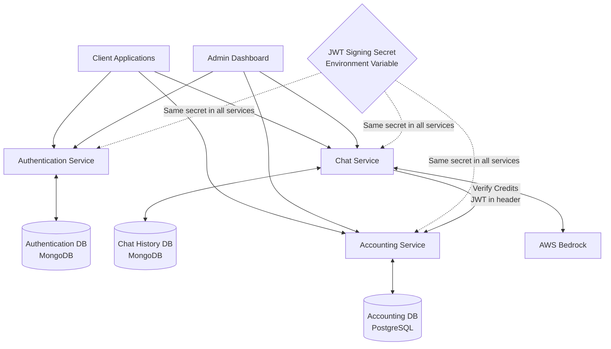
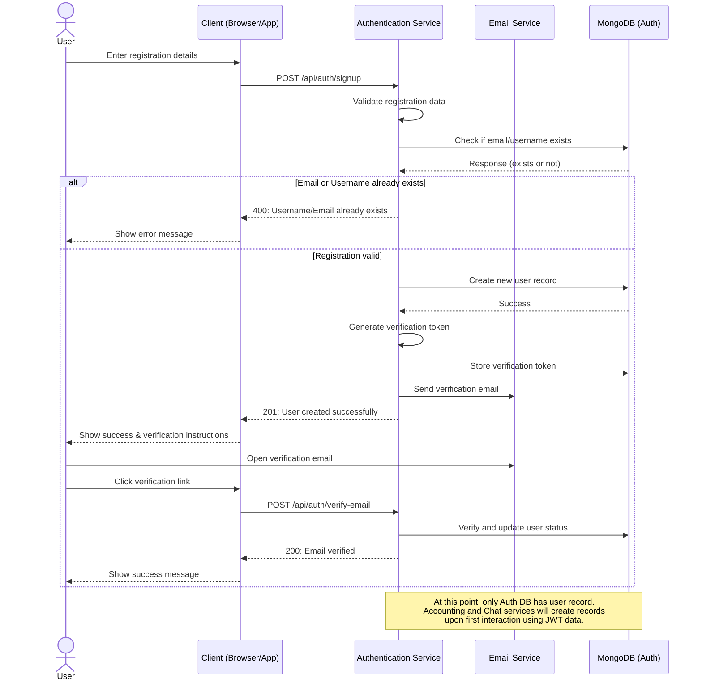
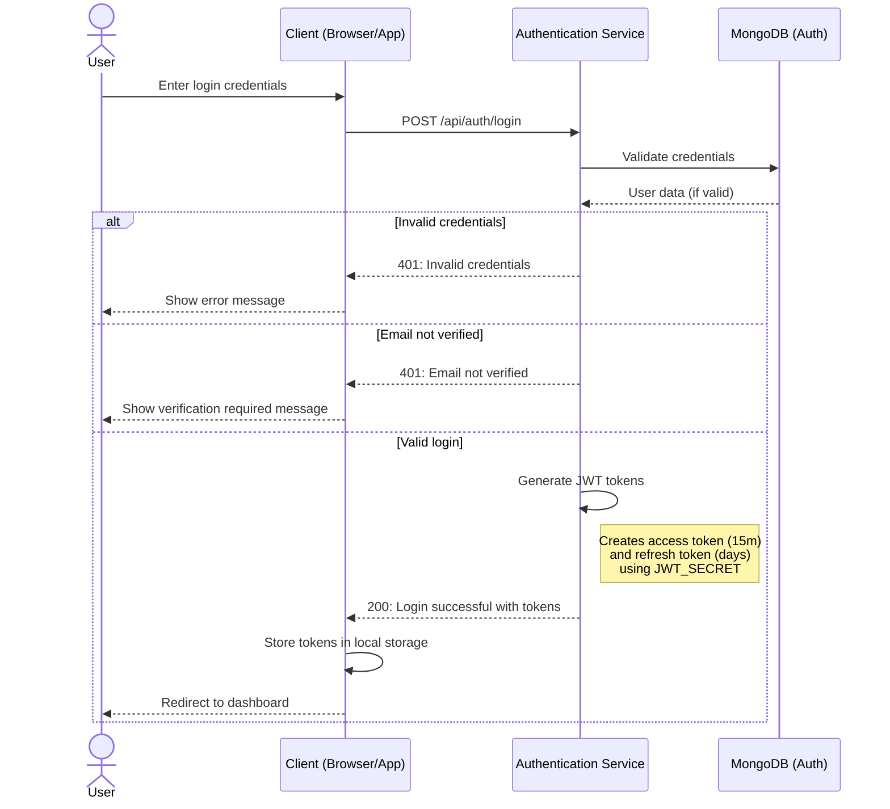
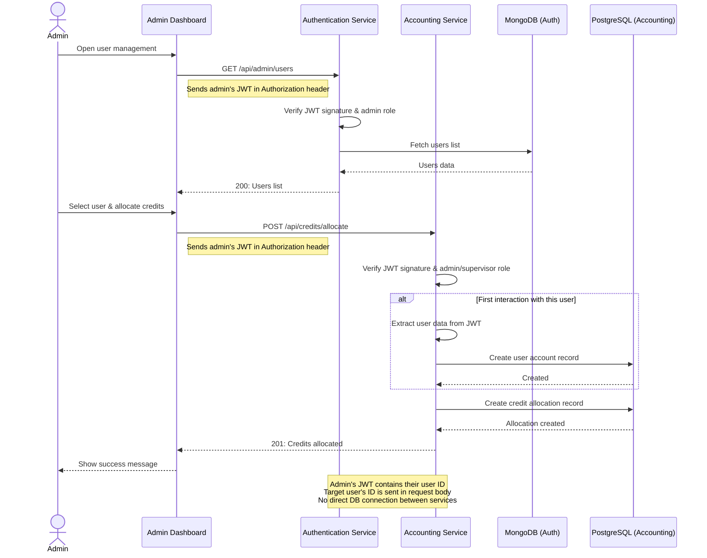
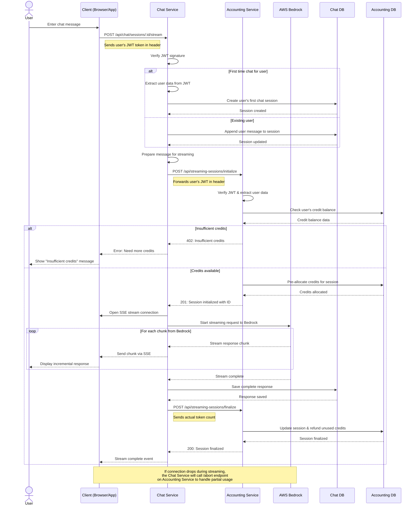
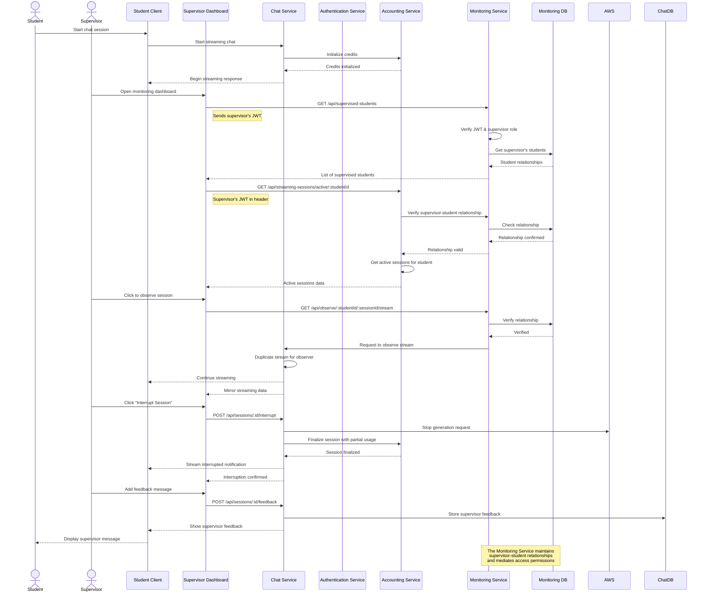

# Information Flow and JWT Sharing Between Services

Here are detailed sequential diagrams showing how information is shared among the three main services (Authentication, Accounting, and Chat), along with how JWT secrets enable secure cross-service communication. I'll illustrate each scenario you requested.

## System Architecture Overview

First, let's look at how the services are connected and how JWT secrets are shared:



Now let's explore each scenario in detail.

## 1. Registration Scenario



## 2. Login Scenario



## 3. Credit Allocation Scenario



## 4. User Chat Scenario with Streaming



## 5. Supervisor Interrupt Scenario



## JWT Token Contents and Sharing

To clarify how JWT works across services:

```mermaid
graph TD
    subgraph JWT Token Structure
        header[Header:<br>alg: HS256<br>typ: JWT]
        
        payload[Payload:<br>sub: user_id<br>username: string<br>email: string<br>role: string<br>type: access|refresh<br>iat: timestamp<br>exp: timestamp]
        
        sig[Signature:<br>HMACSHA256(<br>base64UrlEncode(header) + "." +<br>base64UrlEncode(payload),<br>JWT_SECRET<br>)]
    end
    
    subgraph Environment Variables
        authEnv[Authentication Service:<br>JWT_ACCESS_SECRET=shared_secret<br>JWT_REFRESH_SECRET=shared_secret]
        
        acctEnv[Accounting Service:<br>JWT_ACCESS_SECRET=shared_secret<br>JWT_REFRESH_SECRET=shared_secret]
        
        chatEnv[Chat Service:<br>JWT_ACCESS_SECRET=shared_secret<br>JWT_REFRESH_SECRET=shared_secret]
    end
    
    subgraph Token Verification
        verify[Each service:<br>1. Extracts token from Authorization header<br>2. Verifies signature using shared JWT_SECRET<br>3. Checks token type (access vs refresh)<br>4. Verifies expiration time<br>5. Extracts user data (id, role, etc.)]
    end
    
    jwt[JWT Token:<br>eyJhbGciOiJIUzI1NiIsInR5cCI6IkpXVCJ9.<br>eyJzdWIiOiIxMjM0NTY3ODkwIiwidXNlcm5hbWUiOiJqb2huX2RvZSIsImVtYWlsIjoiam9obkBleGFtcGxlLmNvbSIsInJvbGUiOiJ1c2VyIiwidHlwZSI6ImFjY2VzcyIsImlhdCI6MTUxNjIzOTAyMiwiZXhwIjoxNTE2MjM5NjIyfQ.<br>SflKxwRJSMeKKF2QT4fwpMeJf36POk6yJV_adQssw5c]
    
    class jwt highlight
```

## Final Notes About JWT Security

1. **Shared Secret**: The same JWT secret is stored as an environment variable in all three services, allowing them to independently verify tokens.

2. **No Database Sharing**: The services don't share database access - they only trust the data in validated JWT tokens.

3. **User Data Flow**: When a user first interacts with Accounting or Chat services, those services create their own user records based on JWT data, not by querying the Auth database.

4. **Service-to-Service Communication**: When Chat Service needs to verify credits with Accounting Service, it forwards the user's JWT in the request header.

5. **Token Refresh**: The Authentication Service is the only one that can issue new tokens. When access tokens expire, clients must request a new one from Auth Service using their refresh token.

This architecture allows each service to operate independently while maintaining secure, stateless authentication across the entire system.
