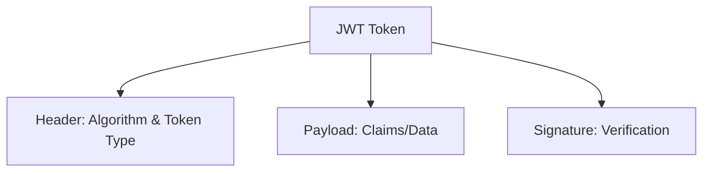
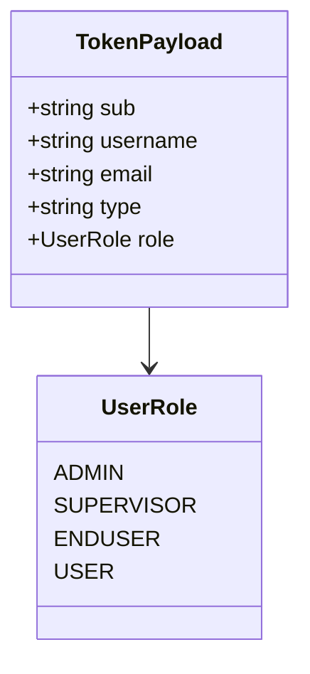
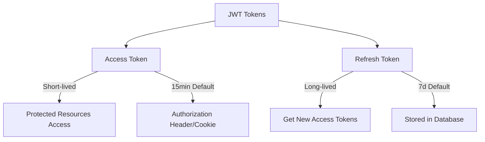
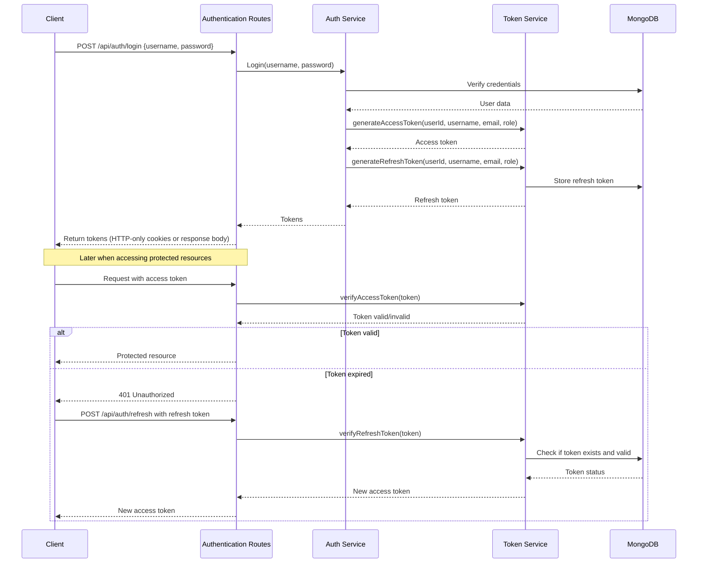
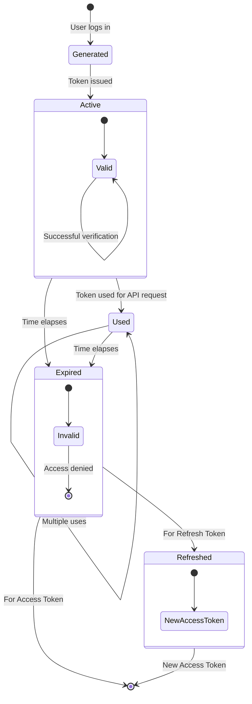
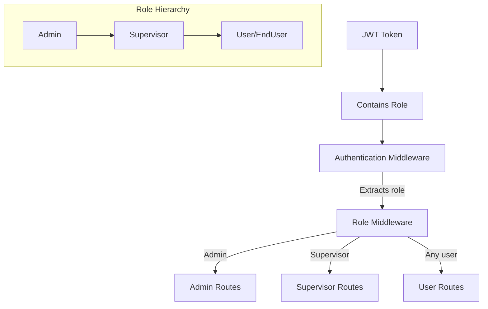
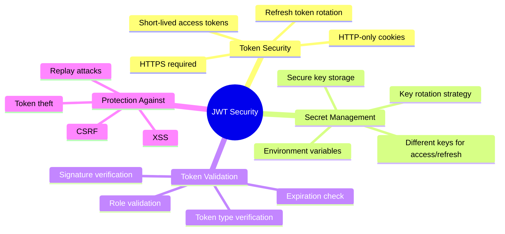
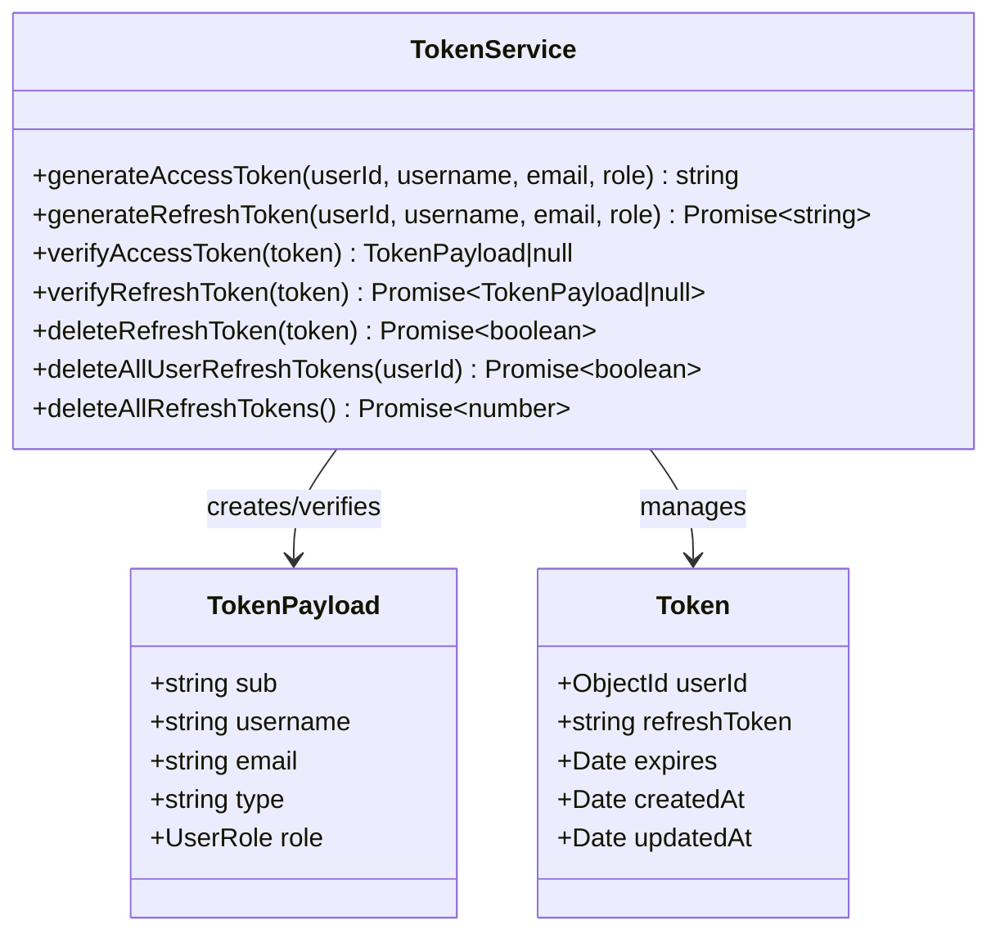
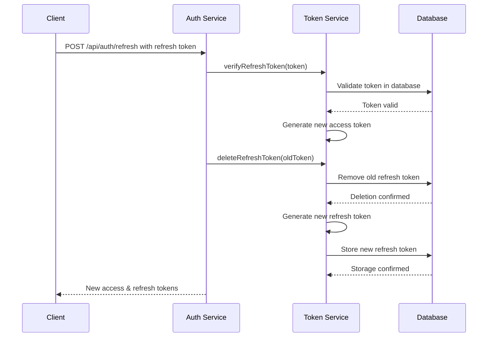

# JWT Design Documentation

This document provides a comprehensive overview of the JWT (JSON Web Token) authentication design implemented in the Simple Accounting Authentication System.

## Table of Contents

- [JWT Design Documentation](#jwt-design-documentation)
  - [Table of Contents](#table-of-contents)
  - [JWT Structure](#jwt-structure)
    - [Header](#header)
    - [Payload](#payload)
    - [Signature](#signature)
  - [Token Types](#token-types)
  - [Authentication Flow](#authentication-flow)
  - [Token Lifecycle](#token-lifecycle)
  - [Role-Based Access Control](#role-based-access-control)
  - [Security Considerations](#security-considerations)
  - [Implementation Details](#implementation-details)
  - [Refresh Token Rotation](#refresh-token-rotation)
  - [Token Storage Strategy](#token-storage-strategy)

## JWT Structure

JSON Web Tokens (JWT) are compact, URL-safe tokens used for securely transmitting information between parties. Each JWT consists of three parts separated by dots (`.`):



### Header

The header typically consists of two parts:
- **alg**: Algorithm used for signing (HS256 in our implementation)
- **typ**: Type of token (JWT)

Example header:
```json
{
  "alg": "HS256",
  "typ": "JWT"
}
```

### Payload

Our token payload contains the following standard and custom claims:



Example payload:
```json
{
  "sub": "user_id_12345",
  "username": "johndoe",
  "email": "john@example.com",
  "type": "access",
  "role": "admin",
  "iat": 1651052800,
  "exp": 1651053700
}
```

### Signature

The signature is created by combining the encoded header and payload with a secret key:

```
HMACSHA256(
  base64UrlEncode(header) + "." + base64UrlEncode(payload),
  secret
)
```

## Token Types

The system uses two types of tokens:



1. **Access Token**
   - Short-lived (default: 15 minutes)
   - Used to access protected resources
   - Contains user identification and role information
   - Stateless - validity checked by signature verification only

2. **Refresh Token**
   - Longer-lived (default: 7 days)
   - Used to obtain new access tokens without re-authentication
   - Stored in database (MongoDB) for validation and revocation
   - Enables token revocation and security monitoring

## Authentication Flow

The flow for authentication using JWTs in the system:



## Token Lifecycle



## Role-Based Access Control

JWT tokens include the user's role, which is used for role-based access control (RBAC):



## Security Considerations



## Implementation Details

The JWT implementation is primarily contained in the TokenService class:



## Refresh Token Rotation

The system implements a refresh token rotation mechanism to enhance security:



## Token Storage Strategy

```mermaid
flowchart TD
    A[JWT Token] --> B{Token Type}
    B -->|Access Token| C[Client Storage Options]
    B -->|Refresh Token| D[Server Storage]
    
    C --> C1[HTTP-only Cookie]
    C --> C2[Authorization Header]
    
    D --> D1[MongoDB]
    D1 --> D2[Token Collection]
    
    D2 --> E[Document Structure]
    E --> E1[userId: ObjectId]
    E --> E2[refreshToken: String]
    E --> E3[expires: Date]
    
    E --> F[Indexes]
    F --> F1[TTL Index on expires]