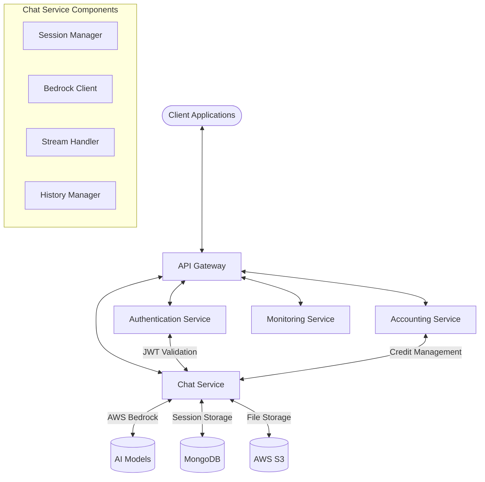

# Technical Blueprint for Chat Service: Detailed Design and Alternatives

Based on your provided documents, I've designed a comprehensive technical blueprint for the chat service component of your system. This blueprint integrates with your existing authentication and accounting services while supporting streaming capabilities.

## 1. System Architecture Overview

The chat service functions as a core component within your microservices architecture, working alongside:

- **Authentication Service**: Manages user identity and access (JWT-based)
- **Accounting Service**: Handles credit allocation and usage tracking
- **Monitoring Service**: Allows supervisors to observe student activities



## 2. Core Chat Service Components

### 2.1 API Layer

```typescript
// Primary REST endpoints for the chat service
import express from 'express';
import { authenticateJWT } from './middleware/auth.middleware';
import * as chatController from './controllers/chat.controller';

const router = express.Router();

// Session management
router.post('/sessions', authenticateJWT, chatController.createChatSession);
router.get('/sessions/:sessionId', authenticateJWT, chatController.getChatSession);
router.get('/sessions', authenticateJWT, chatController.listChatSessions);
router.delete('/sessions/:sessionId', authenticateJWT, chatController.deleteChatSession);

// Chat interactions
router.post('/sessions/:sessionId/messages', authenticateJWT, chatController.sendMessage);
router.get('/sessions/:sessionId/messages', authenticateJWT, chatController.getMessages);

// Streaming interactions
router.post('/sessions/:sessionId/stream', authenticateJWT, chatController.streamChatResponse);
router.post('/sessions/:sessionId/update-stream', authenticateJWT, chatController.updateChatWithStreamResponse);

// Session observation (for monitoring)
router.get('/sessions/:sessionId/observe', authenticateJWT, chatController.observeSession);

export default router;
```

### 2.2 Data Model

```typescript
// chat-session.model.ts
import mongoose, { Schema, Document } from 'mongoose';

export interface IMessage {
  role: 'user' | 'assistant' | 'system';
  content: string;
  timestamp: Date;
}

export interface IChatSession extends Document {
  _id: string;
  userId: string;
  title: string;
  messages: IMessage[];
  modelId: string;
  createdAt: Date;
  updatedAt: Date;
  metadata: {
    streamingSessionId?: string;
    lastTokensUsed?: number;
    totalTokensUsed?: number;
    activeStreamingSession?: boolean;
    [key: string]: any;
  };
}

const ChatSessionSchema = new Schema({
  userId: { type: String, required: true, index: true },
  title: { type: String, required: true },
  messages: [{
    role: { type: String, enum: ['user', 'assistant', 'system'], required: true },
    content: { type: String, required: true },
    timestamp: { type: Date, default: Date.now }
  }],
  modelId: { type: String, required: true, default: 'anthropic.claude-3-sonnet-20240229-v1:0' },
  createdAt: { type: Date, default: Date.now },
  updatedAt: { type: Date, default: Date.now },
  metadata: { type: Schema.Types.Mixed, default: {} }
}, { 
  timestamps: true, 
  collection: 'chat_sessions' 
});

// Create indexes for better query performance
ChatSessionSchema.index({ userId: 1, createdAt: -1 });
ChatSessionSchema.index({ 'metadata.streamingSessionId': 1 });

export default mongoose.model<IChatSession>('ChatSession', ChatSessionSchema);
```

### 2.3 Streaming Implementation

```typescript
// src/services/streaming.service.ts
import { 
  BedrockRuntimeClient, 
  InvokeModelWithResponseStreamCommand 
} from '@aws-sdk/client-bedrock-runtime';
import { PassThrough } from 'stream';
import axios from 'axios';
import { v4 as uuidv4 } from 'uuid';
import logger from '../utils/logger';

// Constants
const ACCOUNTING_API_URL = process.env.ACCOUNTING_API_URL || 'http://localhost:3001/api';
const MAX_STREAMING_DURATION = parseInt(process.env.MAX_STREAMING_DURATION || '120000', 10);

// Initialize AWS client
const bedrockClient = new BedrockRuntimeClient({ 
  region: process.env.AWS_REGION || 'us-east-1',
  credentials: {
    accessKeyId: process.env.AWS_ACCESS_KEY_ID!,
    secretAccessKey: process.env.AWS_SECRET_ACCESS_KEY!
  }
});

/**
 * Initialize a streaming session with the accounting service
 */
export const initializeStreamingSession = async (
  userId: string,
  messages: any[],
  modelId: string,
  authHeader: string
) => {
  try {
    // Generate a unique session ID
    const sessionId = `stream-${Date.now()}-${uuidv4().slice(0, 8)}`;
    
    // Estimate token usage from prompt plus expected response
    const promptText = messages.map(m => m.content).join(' ');
    const estimatedTokens = Math.ceil(promptText.length / 4) + 1000; // Simple estimation with buffer
    
    logger.info(`Initializing streaming session for user ${userId} with model ${modelId}`);
    
    // Initialize session with accounting service
    const response = await axios.post(
      `${ACCOUNTING_API_URL}/streaming-sessions/initialize`,
      {
        sessionId,
        modelId,
        estimatedTokens
      },
      {
        headers: {
          Authorization: authHeader
        }
      }
    );
    
    logger.debug(`Streaming session initialized: ${sessionId}, allocated credits: ${response.data.allocatedCredits}`);
    
    return {
      sessionId: response.data.sessionId,
      allocatedCredits: response.data.allocatedCredits
    };
  } catch (error) {
    logger.error('Error initializing streaming session:', error);
    
    if (axios.isAxiosError(error) && error.response?.status === 402) {
      throw new Error('Insufficient credits for streaming');
    }
    
    throw error;
  }
};

/**
 * Stream a response from AWS Bedrock
 */
export const streamResponse = async (
  userId: string,
  sessionId: string,
  messages: any[],
  modelId: string,
  authHeader: string
) => {
  // Create PassThrough stream
  const stream = new PassThrough();
  let totalTokensGenerated = 0;
  
  // Set a timeout to enforce maximum streaming duration
  const timeout = setTimeout(() => {
    logger.warn(`Stream timeout reached for session ${sessionId}`);
    stream.write(`event: error\ndata: ${JSON.stringify({ 
      error: 'Stream timeout reached', 
      code: 'STREAM_TIMEOUT' 
    })}\n\n`);
    stream.end();
    
    // Attempt to finalize the session with a timeout status
    try {
      axios.post(
        `${ACCOUNTING_API_URL}/streaming-sessions/abort`,
        {
          sessionId,
          tokensGenerated: totalTokensGenerated,
          reason: 'TIMEOUT'
        },
        {
          headers: { Authorization: authHeader }
        }
      );
    } catch (error) {
      logger.error('Error finalizing timed-out session:', error);
    }
  }, MAX_STREAMING_DURATION);
  
  try {
    // Format messages for Bedrock based on the model
    let promptBody;
    
    if (modelId.includes('anthropic')) {
      promptBody = {
        anthropic_version: 'bedrock-2023-05-31',
        messages: messages,
        max_tokens: 2000
      };
    } else if (modelId.includes('amazon.titan')) {
      // Format for Amazon's Titan models
      promptBody = {
        inputText: messages.map(m => `${m.role}: ${m.content}`).join('\n'),
        textGenerationConfig: {
          maxTokenCount: 2000,
          temperature: 0.7,
          topP: 0.9
        }
      };
    } else if (modelId.includes('meta.llama')) {
      // Format for Meta's Llama models
      promptBody = {
        prompt: messages.map(m => `${m.role}: ${m.content}`).join('\n'),
        max_gen_len: 2000,
        temperature: 0.7,
        top_p: 0.9
      };
    } else {
      // Default format (Claude-compatible)
      promptBody = {
        anthropic_version: 'bedrock-2023-05-31',
        messages: messages,
        max_tokens: 2000
      };
    }
    
    // Create streaming command
    const command = new InvokeModelWithResponseStreamCommand({
      modelId: modelId,
      body: JSON.stringify(promptBody),
      contentType: 'application/json',
      accept: 'application/json'
    });
    
    // Invoke Bedrock with streaming
    logger.debug(`Sending streaming request to Bedrock: ${modelId}`);
    const response = await bedrockClient.send(command);
    
    // Process streaming response
    if (response.body) {
      // Track start time for monitoring
      const startTime = Date.now();
      let lastChunkTime = startTime;
      
      // Process each chunk as it arrives
      for await (const chunk of response.body) {
        lastChunkTime = Date.now();
        
        if (chunk.chunk?.bytes) {
          const chunkData = Buffer.from(chunk.chunk.bytes).toString('utf-8');
          
          try {
            const parsed = JSON.parse(chunkData);
            
            // Handle different model response formats
            if (modelId.includes('anthropic')) {
              if (parsed.type === 'content_block_delta') {
                const text = parsed.delta?.text || '';
                const chunkTokens = Math.ceil(text.length / 4);
                totalTokensGenerated += chunkTokens;
                
                stream.write(`event: chunk\ndata: ${JSON.stringify({
                  text,
                  tokens: chunkTokens,
                  totalTokens: totalTokensGenerated
                })}\n\n`);
              } else if (parsed.type === 'message_stop') {
                stream.write(`event: complete\ndata: ${JSON.stringify({
                  status: "complete",
                  tokens: totalTokensGenerated,
                  sessionId: sessionId
                })}\n\n`);
              }
            } else if (modelId.includes('amazon.titan') || modelId.includes('meta.llama')) {
              // Handle Titan or Llama format (adapt based on actual response format)
              if (parsed.outputText || parsed.generation) {
                const text = parsed.outputText || parsed.generation || '';
                const chunkTokens = Math.ceil(text.length / 4);
                totalTokensGenerated += chunkTokens;
                
                stream.write(`event: chunk\ndata: ${JSON.stringify({
                  text,
                  tokens: chunkTokens,
                  totalTokens: totalTokensGenerated
                })}\n\n`);
              }
              
              if (parsed.completionReason === 'FINISH' || parsed.stopReason) {
                stream.write(`event: complete\ndata: ${JSON.stringify({
                  status: "complete",
                  tokens: totalTokensGenerated,
                  sessionId: sessionId
                })}\n\n`);
              }
            }
          } catch (parseError) {
            logger.error('Error parsing chunk:', parseError);
            // If we can't parse the chunk, send it as raw text
            stream.write(`event: chunk\ndata: ${JSON.stringify({
              text: chunkData,
              raw: true
            })}\n\n`);
          }
        }
      }
      
      // Record completion time
      const completionTime = Date.now() - startTime;
      logger.debug(`Streaming completed in ${completionTime}ms, generated ${totalTokensGenerated} tokens`);
      
      // Finalize the streaming session with accounting
      try {
        await axios.post(
          `${ACCOUNTING_API_URL}/streaming-sessions/finalize`,
          {
            sessionId,
            actualTokens: totalTokensGenerated,
            success: true,
            duration: completionTime
          },
          {
            headers: {
              Authorization: authHeader
            }
          }
        );
        
        logger.info(`Successfully finalized streaming session ${sessionId}`);
      } catch (finalizationError) {
        logger.error('Error finalizing streaming session:', finalizationError);
      }
    }
    
    // Clean up and end the stream
    clearTimeout(timeout);
    stream.end();
    
  } catch (error) {
    logger.error('Error in stream processing:', error);
    
    // Clean up timeout
    clearTimeout(timeout);
    
    // Attempt to abort the streaming session
    try {
      await axios.post(
        `${ACCOUNTING_API_URL}/streaming-sessions/abort`,
        {
          sessionId,
          tokensGenerated: totalTokensGenerated,
          error: error.message
        },
        {
          headers: {
            Authorization: authHeader
          }
        }
      );
      
      logger.info(`Aborted streaming session ${sessionId} due to error`);
    } catch (abortError) {
      logger.error('Error aborting streaming session:', abortError);
    }
    
    // Write error to stream and end
    stream.write(`event: error\ndata: ${JSON.stringify({ 
      error: error.message || 'Stream processing error',
      code: error.code || 'STREAM_ERROR'
    })}\n\n`);
    stream.end();
  }
  
  return stream;
};
```

### 2.4 Chat Controller

```typescript
// src/controllers/chat.controller.ts
import { Request, Response } from 'express';
import ChatSession from '../models/chat-session.model';
import { initializeStreamingSession, streamResponse } from '../services/streaming.service';
import logger from '../utils/logger';
import { ObservationManager } from '../services/observation.service';

// Create a new chat session
export const createChatSession = async (req: Request, res: Response) => {
  try {
    const userId = req.user?.userId;
    const { title, initialMessage, modelId = 'anthropic.claude-3-sonnet-20240229-v1:0' } = req.body;
    
    // Create initial messages array with system message
    const messages = [
      {
        role: 'system',
        content: 'You are a helpful AI assistant that provides accurate, helpful information.',
        timestamp: new Date()
      }
    ];
    
    // Add initial user message if provided
    if (initialMessage) {
      messages.push({
        role: 'user',
        content: initialMessage,
        timestamp: new Date()
      });
    }
    
    // Create new session
    const session = new ChatSession({
      userId,
      title: title || 'New Chat',
      messages,
      modelId,
      metadata: {
        source: req.body.source || 'web',
        userAgent: req.headers['user-agent']
      }
    });
    
    await session.save();
    
    return res.status(201).json({
      sessionId: session._id,
      title: session.title,
      createdAt: session.createdAt
    });
  } catch (error) {
    logger.error('Error creating chat session:', error);
    return res.status(500).json({ message: 'Failed to create chat session', error: error.message });
  }
};

// Get chat session details
export const getChatSession = async (req: Request, res: Response) => {
  try {
    const userId = req.user?.userId;
    const sessionId = req.params.sessionId;
    
    const session = await ChatSession.findOne({ _id: sessionId, userId });
    
    if (!session) {
      return res.status(404).json({ message: 'Chat session not found' });
    }
    
    return res.status(200).json({
      sessionId: session._id,
      title: session.title,
      messages: session.messages,
      modelId: session.modelId,
      createdAt: session.createdAt,
      updatedAt: session.updatedAt,
      metadata: session.metadata
    });
  } catch (error) {
    logger.error('Error retrieving chat session:', error);
    return res.status(500).json({ message: 'Failed to retrieve chat session', error: error.message });
  }
};

// List chat sessions for a user
export const listChatSessions = async (req: Request, res: Response) => {
  try {
    const userId = req.user?.userId;
    const page = parseInt(req.query.page as string || '1');
    const limit = parseInt(req.query.limit as string || '20');
    const skip = (page - 1) * limit;
    
    const sessions = await ChatSession.find({ userId })
      .sort({ updatedAt: -1 })
      .skip(skip)
      .limit(limit)
      .select('_id title createdAt updatedAt modelId metadata');
    
    const total = await ChatSession.countDocuments({ userId });
    
    return res.status(200).json({
      sessions,
      pagination: {
        total,
        page,
        limit,
        pages: Math.ceil(total / limit)
      }
    });
  } catch (error) {
    logger.error('Error listing chat sessions:', error);
    return res.status(500).json({ message: 'Failed to list chat sessions', error: error.message });
  }
};

// Delete a chat session
export const deleteChatSession = async (req: Request, res: Response) => {
  try {
    const userId = req.user?.userId;
    const sessionId = req.params.sessionId;
    
    const session = await ChatSession.findOneAndDelete({ _id: sessionId, userId });
    
    if (!session) {
      return res.status(404).json({ message: 'Chat session not found' });
    }
    
    return res.status(200).json({
      message: 'Chat session deleted successfully',
      sessionId
    });
  } catch (error) {
    logger.error('Error deleting chat session:', error);
    return res.status(500).json({ message: 'Failed to delete chat session', error: error.message });
  }
};

// Send a message in non-streaming mode
export const sendMessage = async (req: Request, res: Response) => {
  try {
    const userId = req.user?.userId;
    const sessionId = req.params.sessionId;
    const { message, modelId } = req.body;
    
    // Find the chat session
    const session = await ChatSession.findOne({ _id: sessionId, userId });
    
    if (!session) {
      return res.status(404).json({ message: 'Chat session not found' });
    }
    
    // Add user message
    const userMessage = {
      role: 'user',
      content: message,
      timestamp: new Date()
    };
    
    session.messages.push(userMessage);
    session.updatedAt = new Date();
    
    // Update model ID if provided
    if (modelId) {
      session.modelId = modelId;
    }
    
    await session.save();
    
    // TODO: Implement non-streaming response generation
    // This would make a synchronous call to Bedrock and wait for the complete response
    
    return res.status(200).json({
      message: 'Message added successfully',
      sessionId
    });
  } catch (error) {
    logger.error('Error sending message:', error);
    return res.status(500).json({ message: 'Failed to send message', error: error.message });
  }
};

// Stream chat response
export const streamChatResponse = async (req: Request, res: Response) => {
  const userId = req.user?.userId;
  const sessionId = req.params.sessionId;
  const { message, modelId } = req.body;
  
  // Observation manager to handle supervisor observers
  const observationManager = ObservationManager.getInstance();
  
  try {
    // Find chat session
    const session = await ChatSession.findOne({ _id: sessionId, userId });
    if (!session) {
      return res.status(404).json({ message: 'Chat session not found' });
    }
    
    // Verify no active streaming session for this chat
    if (session.metadata?.activeStreamingSession) {
      return res.status(400).json({ message: 'This chat session already has an active streaming session' });
    }
    
    // Add user message to session
    const userMessage = {
      role: 'user',
      content: message,
      timestamp: new Date()
    };
    session.messages.push(userMessage);
    
    // Update model if specified
    const selectedModel = modelId || session.modelId;
    if (modelId && modelId !== session.modelId) {
      session.modelId = modelId;
    }
    
    // Mark session as having an active streaming session
    session.metadata = session.metadata || {};
    session.metadata.activeStreamingSession = true;
    await session.save();
    
    // Prepare messages for Bedrock
    const messageHistory = session.messages.map(m => ({
      role: m.role,
      content: m.content
    }));
    
    // Initialize streaming session with accounting
    const authHeader = req.headers.authorization || '';
    const streamSession = await initializeStreamingSession(
      userId!, 
      messageHistory,
      selectedModel,
      authHeader
    );
    
    // Update session with streaming session ID
    session.metadata.streamingSessionId = streamSession.sessionId;
    await session.save();
    
    // Log streaming start
    logger.info(`Starting streaming session ${streamSession.sessionId} for chat ${sessionId}`);
    
    // Set up SSE headers
    res.setHeader('Content-Type', 'text/event-stream');
    res.setHeader('Cache-Control', 'no-cache');
    res.setHeader('Connection', 'keep-alive');
    
    // Add CORS headers if needed
    const origin = req.headers.origin;
    if (origin) {
      res.setHeader('Access-Control-Allow-Origin', origin);
      res.setHeader('Access-Control-Allow-Credentials', 'true');
    }
    
    res.flushHeaders();
    
    // Create and register a placeholder for the assistant's response
    const assistantMessage = {
      role: 'assistant',
      content: '',
      timestamp: new Date()
    };
    session.messages.push(assistantMessage);
    
    // Create and send the stream
    const responseStream = await streamResponse(
      userId!,
      streamSession.sessionId,
      messageHistory,
      selectedModel,
      authHeader
    );
    
    // Register this stream with the observation manager
    observationManager.registerStream(sessionId, responseStream);
    
    // Pipe the stream to the response
    responseStream.pipe(res);
    
    // Collect the full response to save later
    let fullResponse = '';
    
    responseStream.on('data', (data) => {
      const sseData = data.toString();
      
      // Extract content from SSE format (event: chunk\ndata: {...})
      if (sseData.includes('event: chunk')) {
        try {
          const match = sseData.match(/data: (.*)/);
          if (match && match[1]) {
            const parsedData = JSON.parse(match[1]);
            if (parsedData.text) {
              fullResponse += parsedData.text;
            }
          }
        } catch (parseError) {
          logger.error('Error parsing SSE chunk:', parseError);
        }
      }
    });
    
    // Handle stream close
    responseStream.on('end', async () => {
      try {
        // Update the assistant message with the complete response
        if (fullResponse) {
          // Find and update the assistant message we added earlier
          const assistantMessageIndex = session.messages.findIndex(
            m => m.role === 'assistant' && m.content === ''
          );
          
          if (assistantMessageIndex !== -1) {
            session.messages[assistantMessageIndex].content = fullResponse;
          }
        }
        
        // Update session metadata
        session.metadata.activeStreamingSession = false;
        session.updatedAt = new Date();
        await session.save();
        
        // Deregister from observation manager
        observationManager.deregisterStream(sessionId);
        
        logger.info(`Completed streaming session for chat ${sessionId}`);
      } catch (error) {
        logger.error('Error updating session after stream end:', error);
      }
    });
    
    // Handle client disconnect
    req.on('close', () => {
      logger.info(`Client disconnected from stream for session ${sessionId}`);
      
      // Attempt to clean up
      responseStream.unpipe(res);
      
      // Note: The stream will still continue processing until completion
      // This allows the response to still be saved to the database
    });
    
  } catch (error) {
    logger.error('Streaming error:', error);
    
    // Clean up the session's streaming status
    try {
      if (session) {
        session.metadata.activeStreamingSession = false;
        await session.save();
      }
    } catch (cleanupError) {
      logger.error('Error cleaning up session after streaming error:', cleanupError);
    }
    
    // If headers are already sent, we're in SSE mode
    if (res.headersSent) {
      res.write(`event: error\ndata: ${JSON.stringify({ 
        error: error.message || 'Unknown streaming error'
      })}\n\n`);
      res.end();
    } else {
      // Otherwise send a normal error response
      if (error.message === 'Insufficient credits for streaming') {
        return res.status(402).json({ 
          message: 'Insufficient credits for streaming chat response'
        });
      }
      
      res.status(500).json({ 
        message: 'Error streaming chat response', 
        error: error.message 
      });
    }
  }
};

// Update chat with stream response
export const updateChatWithStreamResponse = async (req: Request, res: Response) => {
  try {
    const userId = req.user?.userId;
    const sessionId = req.params.sessionId;
    const { completeResponse, streamingSessionId, tokensUsed } = req.body;
    
    // Find chat session
    const session = await ChatSession.findOne({ _id: sessionId, userId });
    if (!session) {
      return res.status(404).json({ message: 'Chat session not found' });
    }
    
    // Verify this is the right streaming session
    if (session.metadata?.streamingSessionId !== streamingSessionId) {
      return res.status(400).json({ 
        message: 'Streaming session ID mismatch'
      });
    }
    
    // Find the last message (which should be the assistant's response)
    const lastIndex = session.messages.length - 1;
    if (lastIndex < 0 || session.messages[lastIndex].role !== 'assistant') {
      return res.status(400).json({ 
        message: 'Last message in session is not from assistant'
      });
    }
    
    // Update the message content
    session.messages[lastIndex].content = completeResponse;
    
    // Update metadata
    session.metadata = session.metadata || {};
    session.metadata.lastTokensUsed = tokensUsed;
    session.metadata.totalTokensUsed = (session.metadata.totalTokensUsed || 0) + tokensUsed;
    session.metadata.activeStreamingSession = false;
    session.updatedAt = new Date();
    
    await session.save();
    
    return res.status(200).json({
      message: 'Chat session updated successfully',
      sessionId,
      tokensUsed
    });
  } catch (error) {
    logger.error('Error updating chat with stream response:', error);
    return res.status(500).json({ 
      message: 'Error updating chat session', 
      error: error.message 
    });
  }
};

// Observe an active session (for supervisors/monitoring)
export const observeSession = async (req: Request, res: Response) => {
  try {
    const supervisorId = req.user?.userId;
    const role = req.user?.role;
    const sessionId = req.params.sessionId;
    
    // Check if user has permission to observe
    // This would need to be implemented based on your permission model
    // For example, admins can observe any session, supervisors only their assigned students
    
    if (role !== 'admin' && role !== 'supervisor') {
      return res.status(403).json({ message: 'Insufficient permissions to observe sessions' });
    }
    
    // Get the observation manager and check if the session is active
    const observationManager = ObservationManager.getInstance();
    const isStreamActive = observationManager.isStreamActive(sessionId);
    
    if (!isStreamActive) {
      return res.status(404).json({ message: 'No active streaming session found for observation' });
    }
    
    // Set up SSE headers
    res.setHeader('Content-Type', 'text/event-stream');
    res.setHeader('Cache-Control', 'no-cache');
    res.setHeader('Connection', 'keep-alive');
    res.flushHeaders();
    
    // Send initial observer connected message
    res.write(`event: observer\ndata: ${JSON.stringify({ 
      message: 'Observer connected' 
    })}\n\n`);
    
    // Register this observer to receive stream events
    const unsubscribe = observationManager.addObserver(sessionId, (data) => {
      res.write(data);
    });
    
    // Handle client disconnect
    req.on('close', () => {
      logger.info(`Observer ${supervisorId} disconnected from session ${sessionId}`);
      unsubscribe();
    });
    
  } catch (error) {
    logger.error('Error setting up observation:', error);
    
    if (res.headersSent) {
      res.write(`event: error\ndata: ${JSON.stringify({ 
        error: 'Error setting up observation'
      })}\n\n`);
      res.end();
    } else {
      res.status(500).json({ message: 'Error setting up observation', error: error.message });
    }
  }
};
```

### 2.5 Observation Service for Monitoring

```typescript
// src/services/observation.service.ts
import { PassThrough } from 'stream';
import { EventEmitter } from 'events';
import logger from '../utils/logger';

type ObserverCallback = (data: string) => void;

/**
 * Manages stream observers for supervisors to monitor student conversations
 * Uses the Singleton pattern to ensure only one instance exists
 */
export class ObservationManager {
  private static instance: ObservationManager;
  private activeStreams: Map<string, PassThrough>;
  private observers: Map<string, Map<string, ObserverCallback>>;
  private eventEmitter: EventEmitter;
  
  private constructor() {
    this.activeStreams = new Map();
    this.observers = new Map();
    this.eventEmitter = new EventEmitter();
    // Increase max listeners to support many observers
    this.eventEmitter.setMaxListeners(100);
    
    logger.info('Observation Manager initialized');
  }
  
  /**
   * Get the singleton instance
   */
  public static getInstance(): ObservationManager {
    if (!ObservationManager.instance) {
      ObservationManager.instance = new ObservationManager();
    }
    return ObservationManager.instance;
  }
  
  /**
   * Register a new stream for observation
   */
  public registerStream(sessionId: string, stream: PassThrough): void {
    this.activeStreams.set(sessionId, stream);
    this.observers.set(sessionId, new Map());
    
    // Listen for data events on the stream
    stream.on('data', (data) => {
      const dataStr = data.toString();
      // Emit the data to all observers of this session
      this.eventEmitter.emit(`stream:${sessionId}`, dataStr);
    });
    
    // Handle stream end
    stream.on('end', () => {
      this.deregisterStream(sessionId);
    });
    
    logger.debug(`Stream registered for observation: ${sessionId}`);
  }
  
  /**
   * Deregister a stream when it's complete
   */
  public deregisterStream(sessionId: string): void {
    // Clean up the stream
    const stream = this.activeStreams.get(sessionId);
    if (stream) {
      this.activeStreams.delete(sessionId);
    }
    
    // Clean up observers
    this.observers.delete(sessionId);
    
    logger.debug(`Stream deregistered: ${sessionId}`);
  }
  
  /**
   * Check if a stream is active
   */
  public isStreamActive(sessionId: string): boolean {
    return this.activeStreams.has(sessionId);
  }
  
  /**
   * Add an observer to a session stream
   * Returns an unsubscribe function
   */
  public addObserver(sessionId: string, callback: ObserverCallback): () => void {
    if (!this.isStreamActive(sessionId)) {
      logger.warn(`Attempted to observe inactive stream: ${sessionId}`);
      return () => {};
    }
    
    // Generate unique observer ID
    const observerId = `obs_${Date.now()}_${Math.random().toString(36).substring(2, 9)}`;
    
    // Store the observer callback
    const sessionObservers = this.observers.get(sessionId)!;
    sessionObservers.set(observerId, callback);
    
    // Set up event listener
    const listener = (data: string) => {
      callback(data);
    };
    
    this.eventEmitter.on(`stream:${sessionId}`, listener);
    
    logger.debug(`Observer ${observerId} added to session ${sessionId}`);
    
    // Return unsubscribe function
    return () => {
      sessionObservers.delete(observerId);
      this.eventEmitter.off(`stream:${sessionId}`, listener);
      logger.debug(`Observer ${observerId} removed from session ${sessionId}`);
    };
  }
  
  /**
   * Get count of active streams
   */
  public getActiveStreamCount(): number {
    return this.activeStreams.size;
  }
  
  /**
   * Get count of observers for a session
   */
  public getObserverCount(sessionId: string): number {
    return this.observers.get(sessionId)?.size || 0;
  }
}
```

## 3. Implementation Alternatives

### 3.1 Alternative Streaming Implementation Approaches

#### Option 1: WebSockets Instead of SSE

```typescript
// Using Socket.io for bidirectional communication

import { Server } from 'socket.io';
import http from 'http';
import jwt from 'jsonwebtoken';

// Set up Socket.io server
export function setupWebSocketServer(httpServer: http.Server) {
  const io = new Server(httpServer, {
    cors: {
      origin: process.env.CORS_ORIGIN || '*',
      methods: ['GET', 'POST'],
      credentials: true
    }
  });
  
  // Authentication middleware
  io.use((socket, next) => {
    const token = socket.handshake.auth.token;
    if (!token) {
      return next(new Error('Authentication error: Token required'));
    }
    
    try {
      const decoded = jwt.verify(token, process.env.JWT_ACCESS_SECRET!);
      socket.data.user = decoded;
      next();
    } catch (error) {
      next(new Error('Authentication error: Invalid token'));
    }
  });
  
  // Handle connections
  io.on('connection', (socket) => {
    const userId = socket.data.user.userId;
    logger.info(`User ${userId} connected via WebSocket`);
    
    // Handle stream request
    socket.on('stream-request', async (data) => {
      try {
        const { sessionId, message, modelId } = data;
        
        // Find chat session
        const session = await ChatSession.findOne({ _id: sessionId, userId });
        if (!session) {
          socket.emit('error', { message: 'Chat session not found' });
          return;
        }
        
        // Initialize streaming with the accounting service
        // ... similar implementation as before
        
        // Set up Bedrock streaming
        const responseStream = await streamResponse(/* params */);
        
        // Process chunks and emit to socket
        for await (const chunk of responseStream) {
          // Parse and send chunk
          socket.emit('stream-chunk', { 
            chunk: chunk.text,
            tokens: chunk.tokens 
          });
        }
        
        // Signal completion
        socket.emit('stream-complete', { 
          tokens: totalTokens,
          sessionId: sessionId
        });
        
      } catch (error) {
        logger.error('Socket streaming error:', error);
        socket.emit('error', { message: error.message });
      }
    });
    
    // Handle disconnect
    socket.on('disconnect', () => {
      logger.info(`User ${userId} disconnected`);
      // Clean up any resources
    });
  });
  
  return io;
}
```

#### Option 2: HTTP Long Polling Fallback

```typescript
// HTTP long polling fallback for environments where SSE is problematic

// Controller method
export const pollChatResponse = async (req: Request, res: Response) => {
  const { sessionId, pollId } = req.params;
  const userId = req.user?.userId;
  
  try {
    // Find the session
    const session = await ChatSession.findOne({ _id: sessionId, userId });
    if (!session) {
      return res.status(404).json({ message: 'Chat session not found' });
    }
    
    // Get the polling state from cache/database
    const pollState = await getPollState(sessionId, pollId);
    
    if (!pollState) {
      return res.status(404).json({ message: 'Polling session not found' });
    }
    
    // Return new chunks since last poll
    res.status(200).json({
      chunks: pollState.newChunks,
      complete: pollState.complete,
      tokens: pollState.tokens
    });
    
    // Clear the chunks we just sent
    await clearSentChunks(sessionId, pollId);
    
  } catch (error) {
    logger.error('Error in long polling:', error);
    res.status(500).json({ message: 'Error retrieving response chunks' });
  }
};
```

### 3.2 Alternative Database Approaches

#### Option 1: Using DynamoDB instead of MongoDB

```typescript
// Using AWS DynamoDB for chat data with automatic scaling

import { DynamoDBClient } from '@aws-sdk/client-dynamodb';
import { 
  DynamoDBDocumentClient, 
  PutCommand,
  GetCommand,
  QueryCommand,
  UpdateCommand
} from '@aws-sdk/lib-dynamodb';

const client = new DynamoDBClient({ region: process.env.AWS_REGION });
const docClient = DynamoDBDocumentClient.from(client);

// Create a new chat session
export async function createChatSession(userId: string, data: any) {
  const sessionId = `chat_${Date.now()}_${Math.random().toString(36).slice(2)}`;
  
  const params = {
    TableName: 'ChatSessions',
    Item: {
      PK: `USER#${userId}`,
      SK: `SESSION#${sessionId}`,
      userId,
      sessionId,
      title: data.title || 'New Chat',
      modelId: data.modelId || 'anthropic.claude-3-sonnet-20240229-v1:0',
      createdAt: new Date().toISOString(),
      updatedAt: new Date().toISOString(),
      metadata: data.metadata || {}
    }
  };
  
  await docClient.send(new PutCommand(params));
  
  // Create initial message if provided
  if (data.initialMessage) {
    await addMessageToSession(userId, sessionId, {
      role: 'user',
      content: data.initialMessage
    });
  }
  
  return { sessionId, ...params.Item };
}

// Add a message to a session
export async function addMessageToSession(userId: string, sessionId: string, message: any) {
  const messageId = `msg_${Date.now()}_${Math.random().toString(36).slice(2)}`;
  
  const params = {
    TableName: 'ChatMessages',
    Item: {
      PK: `SESSION#${sessionId}`,
      SK: `MESSAGE#${messageId}`,
      userId,
      sessionId,
      messageId,
      role: message.role,
      content: message.content,
      timestamp: new Date().toISOString()
    }
  };
  
  await docClient.send(new PutCommand(params));
  
  // Update session's updatedAt timestamp
  const updateParams = {
    TableName: 'ChatSessions',
    Key: {
      PK: `USER#${userId}`,
      SK: `SESSION#${sessionId}`
    },
    UpdateExpression: 'SET updatedAt = :updatedAt',
    ExpressionAttributeValues: {
      ':updatedAt': new Date().toISOString()
    }
  };
  
  await docClient.send(new UpdateCommand(updateParams));
  
  return { messageId, ...params.Item };
}

// Get messages for a session
export async function getSessionMessages(sessionId: string) {
  const params = {
    TableName: 'ChatMessages',
    KeyConditionExpression: 'PK = :pk',
    ExpressionAttributeValues: {
      ':pk': `SESSION#${sessionId}`
    },
    ScanIndexForward: true // sort by SK in ascending order
  };
  
  const result = await docClient.send(new QueryCommand(params));
  return result.Items || [];
}
```

#### Option 2: Using Redis for Caching Frequent Chat Data

```typescript
// Using Redis for caching frequent chat data

import { createClient } from 'redis';
import ChatSession from '../models/chat-session.model';

// Initialize Redis client
const redisClient = createClient({
  url: process.env.REDIS_URL || 'redis://localhost:6379'
});

redisClient.connect().catch(console.error);

// Cache a chat session
export async function cacheSession(sessionId: string, session: any) {
  const cacheKey = `chat:session:${sessionId}`;
  const cacheData = JSON.stringify(session);
  
  await redisClient.set(cacheKey, cacheData, {
    EX: 3600 // Cache for 1 hour
  });
}

// Get a cached session or fetch from database
export async function getChatSession(userId: string, sessionId: string) {
  const cacheKey = `chat:session:${sessionId}`;
  
  // Try to get from cache
  const cachedData = await redisClient.get(cacheKey);
  if (cachedData) {
    const session = JSON.parse(cachedData);
    // Verify this session belongs to the requesting user
    if (session.userId === userId) {
      return session;
    }
  }
  
  // Not in cache or wrong user, get from database
  const session = await ChatSession.findOne({ _id: sessionId, userId });
  
  // Cache the session for future requests
  if (session) {
    await cacheSession(sessionId, session);
  }
  
  return session;
}

// Cache recent messages
export async function cacheRecentMessages(userId: string, limit = 20) {
  const cacheKey = `chat:recent:${userId}`;
  
  // Get recent sessions from database
  const sessions = await ChatSession.find({ userId })
    .sort({ updatedAt: -1 })
    .limit(limit)
    .select('_id title createdAt updatedAt modelId');
  
  // Cache the results
  await redisClient.set(cacheKey, JSON.stringify(sessions), {
    EX: 300 // Cache for 5 minutes
  });
  
  return sessions;
}
```

### 3.3 Alternative Model Routing Options

#### Option 1: Dynamic Model Selection API

```typescript
// Dynamic model selection API

// Available models endpoint
export const getAvailableModels = async (req: Request, res: Response) => {
  try {
    // These could be fetched from a database or configuration
    const models = [
      {
        id: 'anthropic.claude-3-sonnet-20240229-v1:0',
        name: 'Claude 3 Sonnet',
        description: 'Balanced model for quality and speed',
        capabilities: ['chat', 'reasoning', 'creative-writing'],
        creditCost: 3,
        maxTokens: 100000
      },
      {
        id: 'anthropic.claude-3-haiku-20240307-v1:0',
        name: 'Claude 3 Haiku',
        description: 'Fast and efficient model for simpler tasks',
        capabilities: ['chat', 'quick-responses'],
        creditCost: 1,
        maxTokens: 50000
      },
      {
        id: 'amazon.titan-text-express-v1',
        name: 'Titan Text Express',
        description: 'Amazon\'s efficient text generation model',
        capabilities: ['chat', 'summarization'],
        creditCost: 1,
        maxTokens: 8000
      }
    ];
    
    // Filter based on user permissions
    const userRole = req.user?.role;
    const filteredModels = models.filter(model => {
      // Example: Only admins can access certain models
      if (model.id.includes('premium') && userRole !== 'admin') {
        return false;
      }
      return true;
    });
    
    return res.status(200).json({ models: filteredModels });
  } catch (error) {
    logger.error('Error fetching available models:', error);
    return res.status(500).json({ message: 'Error fetching available models' });
  }
};

// Model recommendation endpoint
export const recommendModel = async (req: Request, res: Response) => {
  try {
    const { task, priority } = req.body;
    
    // Simple recommendation logic
    let recommendedModel;
    
    if (priority === 'speed') {
      recommendedModel = 'anthropic.claude-3-haiku-20240307-v1:0';
    } else if (priority === 'quality') {
      recommendedModel = 'anthropic.claude-3-sonnet-20240229-v1:0';
    } else if (task === 'code-generation') {
      recommendedModel = 'anthropic.claude-3-opus-20240229-v1:0';
    } else {
      // Default recommendation
      recommendedModel = 'anthropic.claude-3-sonnet-20240229-v1:0';
    }
    
    return res.status(200).json({
      recommendedModel,
      reason: `Based on your ${priority} priority for ${task}`
    });
  } catch (error) {
    logger.error('Error generating model recommendation:', error);
    return res.status(500).json({ message: 'Error recommending model' });
  }
};
```

#### Option 2: Model Fallback Strategy

```typescript
// Model fallback strategy service

/**
 * Try to use preferred model, fall back to alternatives if unavailable
 */
export async function streamWithFallback(
  userId: string,
  sessionId: string,
  messages: any[],
  primaryModelId: string,
  authHeader: string
) {
  // Define fallback sequence
  const modelFallbackChain = getModelFallbackChain(primaryModelId);
  
  // Try each model in sequence
  for (const modelId of modelFallbackChain) {
    try {
      logger.info(`Attempting to use model: ${modelId}`);
      
      // Initialize streaming session
      const streamSession = await initializeStreamingSession(
        userId, 
        messages,
        modelId,
        authHeader
      );
      
      // Create response stream
      const responseStream = await streamResponse(
        userId,
        streamSession.sessionId,
        messages,
        modelId,
        authHeader
      );
      
      // If we got here, the model worked, so return the stream
      logger.info(`Successfully using model: ${modelId}`);
      
      // Add a header to the stream indicating the actual model used
      responseStream.write(`event: model\ndata: ${JSON.stringify({ 
        model: modelId, 
        fallbackApplied: modelId !== primaryModelId
      })}\n\n`);
      
      return {
        stream: responseStream,
        modelUsed: modelId,
        sessionId: streamSession.sessionId
      };
      
    } catch (error) {
      logger.warn(`Model ${modelId} failed: ${error.message}`);
      
      // Check if this is a credit issue or other, if credits, don't try other models
      if (error.message.includes('Insufficient credits')) {
        throw error;
      }
      
      // If the error indicates this model is unavailable, continue to next
      // Otherwise, throw the error
      if (!isModelAvailabilityError(error)) {
        throw error;
      }
    }
  }
  
  // If we got here, all models failed
  throw new Error('All models in fallback chain unavailable');
}

/**
 * Get fallback chain for a given model
 */
function getModelFallbackChain(primaryModelId: string): string[] {
  // Define model fallback chains
  const fallbackMap: Record<string, string[]> = {
    'anthropic.claude-3-opus-20240229-v1:0': [
      'anthropic.claude-3-opus-20240229-v1:0',
      'anthropic.claude-3-sonnet-20240229-v1:0',
      'anthropic.claude-3-haiku-20240307-v1:0'
    ],
    'anthropic.claude-3-sonnet-20240229-v1:0': [
      'anthropic.claude-3-sonnet-20240229-v1:0',
      'anthropic.claude-3-haiku-20240307-v1:0',
      'amazon.titan-text-express-v1'
    ],
    'anthropic.claude-3-haiku-20240307-v1:0': [
      'anthropic.claude-3-haiku-20240307-v1:0',
      'amazon.titan-text-express-v1',
      'meta.llama2-13b-chat-v1'
    ]
  };
  
  return fallbackMap[primaryModelId] || [primaryModelId];
}

/**
 * Check if an error indicates model availability issues
 */
function isModelAvailabilityError(error: any): boolean {
  const message = error.message || '';
  return (
    message.includes('model is currently overloaded') ||
    message.includes('model not available') ||
    message.includes('capacity') ||
    message.includes('rate limit') ||
    message.includes('throttled')
  );
}
```

## 4. Deployment and Scaling Strategy

### 4.1 Docker Configuration

```dockerfile
# Dockerfile for Chat Service

FROM node:18-alpine as builder

WORKDIR /app

# Copy package files and install dependencies
COPY package*.json ./
RUN npm ci

# Copy source files
COPY tsconfig.json ./
COPY src ./src

# Build TypeScript
RUN npm run build

# Create production image
FROM node:18-alpine

WORKDIR /app

# Copy package files
COPY package*.json ./

# Install production dependencies only
RUN npm ci --only=production

# Copy built files from builder stage
COPY --from=builder /app/dist ./dist

# Set environment variables
ENV NODE_ENV=production
ENV PORT=3002

# Expose the port
EXPOSE 3002

# Health check
HEALTHCHECK --interval=30s --timeout=5s --start-period=5s --retries=3 \
  CMD wget -qO- http://localhost:3002/health || exit 1

# Start the service
CMD ["node", "dist/server.js"]
```

### 4.2 Kubernetes Deployment

```yaml
# kubernetes/chat-service.yaml
apiVersion: apps/v1
kind: Deployment
metadata:
  name: chat-service
  labels:
    app: chat-service
spec:
  replicas: 3
  selector:
    matchLabels:
      app: chat-service
  strategy:
    rollingUpdate:
      maxSurge: 1
      maxUnavailable: 0
    type: RollingUpdate
  template:
    metadata:
      labels:
        app: chat-service
    spec:
      containers:
      - name: chat-service
        image: ${ECR_REPOSITORY_URI}:${IMAGE_TAG}
        ports:
        - containerPort: 3002
        resources:
          requests:
            cpu: "100m"
            memory: "256Mi"
          limits:
            cpu: "500m"
            memory: "512Mi"
        env:
        - name: NODE_ENV
          value: "production"
        - name: PORT
          value: "3002"
        - name: MONGO_URI
          valueFrom:
            secretKeyRef:
              name: chat-service-secrets
              key: mongo-uri
        - name: JWT_ACCESS_SECRET
          valueFrom:
            secretKeyRef:
              name: auth-secrets
              key: jwt-access-secret
        - name: ACCOUNTING_API_URL
          value: "http://accounting-service:3001/api"
        - name: AWS_REGION
          value: "us-east-1"
        - name: AWS_ACCESS_KEY_ID
          valueFrom:
            secretKeyRef:
              name: aws-credentials
              key: access-key-id
        - name: AWS_SECRET_ACCESS_KEY
          valueFrom:
            secretKeyRef:
              name: aws-credentials
              key: secret-access-key
        livenessProbe:
          httpGet:
            path: /health
            port: 3002
          initialDelaySeconds: 30
          periodSeconds: 30
        readinessProbe:
          httpGet:
            path: /health
            port: 3002
          initialDelaySeconds: 5
          periodSeconds: 10
---
apiVersion: v1
kind: Service
metadata:
  name: chat-service
spec:
  selector:
    app: chat-service
  ports:
  - port: 3002
    targetPort: 3002
  type: ClusterIP
---
apiVersion: autoscaling/v2
kind: HorizontalPodAutoscaler
metadata:
  name: chat-service-hpa
spec:
  scaleTargetRef:
    apiVersion: apps/v1
    kind: Deployment
    name: chat-service
  minReplicas: 2
  maxReplicas: 10
  metrics:
  - type: Resource
    resource:
      name: cpu
      target:
        type: Utilization
        averageUtilization: 70
  - type: Resource
    resource:
      name: memory
      target:
        type: Utilization
        averageUtilization: 80
```

### 4.3 Horizontal Scaling Strategy for Streaming

To effectively scale the streaming capabilities, implement a Redis-based streaming coordinator:

```typescript
// src/services/streaming-coordinator.service.ts
import Redis from 'ioredis';
import { PassThrough } from 'stream';
import logger from '../utils/logger';

// Initialize Redis clients
const publisher = new Redis(process.env.REDIS_URL);
const subscriber = new Redis(process.env.REDIS_URL);

/**
 * Streaming Coordinator using Redis Pub/Sub for horizontal scaling
 */
export class StreamingCoordinator {
  private static instance: StreamingCoordinator;
  private streamObservers: Map<string, Set<PassThrough>>;
  
  private constructor() {
    this.streamObservers = new Map();
    
    // Subscribe to streaming channels
    subscriber.on('message', (channel, message) => {
      if (channel.startsWith('stream:')) {
        const sessionId = channel.split(':')[1];
        this.broadcastToObservers(sessionId, message);
      }
    });
    
    subscriber.on('error', (err) => {
      logger.error('Redis subscriber error:', err);
    });
    
    logger.info('Streaming Coordinator initialized');
  }
  
  public static getInstance(): StreamingCoordinator {
    if (!StreamingCoordinator.instance) {
      StreamingCoordinator.instance = new StreamingCoordinator();
    }
    return StreamingCoordinator.instance;
  }
  
  /**
   * Subscribe to stream updates for a session
   */
  public subscribeToStream(sessionId: string): void {
    subscriber.subscribe(`stream:${sessionId}`);
  }
  
  /**
   * Unsubscribe from stream updates
   */
  public unsubscribeFromStream(sessionId: string): void {
    subscriber.unsubscribe(`stream:${sessionId}`);
  }
  
  /**
   * Publish a chunk to all instances
   */
  public publishChunk(sessionId: string, chunk: string): void {
    publisher.publish(`stream:${sessionId}`, chunk);
  }
  
  /**
   * Register an observer stream
   */
  public registerObserver(sessionId: string, stream: PassThrough): void {
    if (!this.streamObservers.has(sessionId)) {
      this.streamObservers.set(sessionId, new Set());
      this.subscribeToStream(sessionId);
    }
    
    this.streamObservers.get(sessionId)!.add(stream);
    logger.debug(`Observer registered for session ${sessionId}`);
  }
  
  /**
   * Deregister an observer stream
   */
  public deregisterObserver(sessionId: string, stream: PassThrough): void {
    const observers = this.streamObservers.get(sessionId);
    if (observers) {
      observers.delete(stream);
      
      // If no more observers, unsubscribe from the channel
      if (observers.size === 0) {
        this.streamObservers.delete(sessionId);
        this.unsubscribeFromStream(sessionId);
      }
    }
  }
  
  /**
   * Broadcast a message to all registered observers
   */
  private broadcastToObservers(sessionId: string, message: string): void {
    const observers = this.streamObservers.get(sessionId);
    if (!observers) return;
    
    observers.forEach(stream => {
      stream.write(message);
    });
  }
}
```

### 4.4 Rate Limiting and Circuit Breaker

```typescript
// src/middleware/rate-limit.middleware.ts
import { Request, Response, NextFunction } from 'express';
import Redis from 'ioredis';
import logger from '../utils/logger';

const redisClient = new Redis(process.env.REDIS_URL);

// Rate limiting middleware for chat API
export function chatRateLimiter(
  maxRequests: number = 30,
  windowMs: number = 60 * 1000,
  message: string = 'Too many requests, please try again later'
) {
  return async (req: Request, res: Response, next: NextFunction) => {
    const userId = req.user?.userId || 'anonymous';
    const key = `ratelimit:chat:${userId}`;
    
    try {
      // Check current count
      const count = await redisClient.get(key);
      const currentCount = count ? parseInt(count) : 0;
      
      if (currentCount >= maxRequests) {
        logger.warn(`Rate limit exceeded for user ${userId}`);
        return res.status(429).json({
          message,
          retryAfter: Math.ceil(windowMs / 1000)
        });
      }
      
      // Increment counter
      const newCount = await redisClient.incr(key);
      
      // Set expiry on first request
      if (newCount === 1) {
        await redisClient.expire(key, Math.ceil(windowMs / 1000));
      }
      
      // Set headers
      res.setHeader('X-RateLimit-Limit', maxRequests.toString());
      res.setHeader('X-RateLimit-Remaining', (maxRequests - newCount).toString());
      
      next();
    } catch (error) {
      logger.error('Rate limiter error:', error);
      // Allow the request to proceed if Redis is down
      next();
    }
  };
}

// Streaming-specific rate limiter with more generous limits
export function streamingRateLimiter(
  maxStreams: number = 5,
  windowMs: number = 60 * 1000
) {
  return async (req: Request, res: Response, next: NextFunction) => {
    const userId = req.user?.userId || 'anonymous';
    const key = `ratelimit:streaming:${userId}`;
    
    try {
      // Check current active streams
      const count = await redisClient.get(key);
      const currentCount = count ? parseInt(count) : 0;
      
      if (currentCount >= maxStreams) {
        logger.warn(`Streaming rate limit exceeded for user ${userId}`);
        return res.status(429).json({
          message: `Maximum of ${maxStreams} active streams allowed per minute`,
          retryAfter: Math.ceil(windowMs / 1000)
        });
      }
      
      // Increment counter
      const newCount = await redisClient.incr(key);
      
      // Set expiry on first request
      if (newCount === 1) {
        await redisClient.expire(key, Math.ceil(windowMs / 1000));
      }
      
      next();
    } catch (error) {
      logger.error('Streaming rate limiter error:', error);
      next();
    }
  };
}
```

## 5. Testing Strategy

### 5.1 Unit Testing

```typescript
// tests/services/streaming.service.test.ts
import { describe, it, expect, jest, beforeEach, afterEach } from '@jest/globals';
import { PassThrough } from 'stream';
import axios from 'axios';
import { initializeStreamingSession, streamResponse } from '../../src/services/streaming.service';
import { BedrockRuntimeClient } from '@aws-sdk/client-bedrock-runtime';

// Mock dependencies
jest.mock('@aws-sdk/client-bedrock-runtime');
jest.mock('axios');

describe('Streaming Service', () => {
  beforeEach(() => {
    jest.clearAllMocks();
  });
  
  describe('initializeStreamingSession', () => {
    it('should initialize a streaming session successfully', async () => {
      // Mock Axios response
      (axios.post as jest.Mock).mockResolvedValueOnce({
        data: {
          sessionId: 'test-session-id',
          allocatedCredits: 10
        }
      });
      
      const result = await initializeStreamingSession(
        'user123',
        [{ role: 'user', content: 'Hello' }],
        'anthropic.claude-3-sonnet-20240229-v1:0',
        'Bearer token123'
      );
      
      expect(result).toEqual({
        sessionId: 'test-session-id',
        allocatedCredits: 10
      });
      
      expect(axios.post).toHaveBeenCalledWith(
        expect.stringContaining('/streaming-sessions/initialize'),
        expect.objectContaining({
          modelId: 'anthropic.claude-3-sonnet-20240229-v1:0'
        }),
        expect.objectContaining({
          headers: { Authorization: 'Bearer token123' }
        })
      );
    });
    
    it('should handle insufficient credits error', async () => {
      // Mock Axios error response
      (axios.post as jest.Mock).mockRejectedValueOnce({
        response: { status: 402 },
        isAxiosError: true
      });
      
      await expect(
        initializeStreamingSession(
          'user123',
          [{ role: 'user', content: 'Hello' }],
          'anthropic.claude-3-sonnet-20240229-v1:0',
          'Bearer token123'
        )
      ).rejects.toThrow('Insufficient credits for streaming');
    });
  });
  
  describe('streamResponse', () => {
    it('should create a streaming response', async () => {
      // Mock Bedrock response
      const mockStream = new PassThrough();
      const mockResponse = {
        body: mockStream
      };
      
      (BedrockRuntimeClient.prototype.send as jest.Mock).mockResolvedValueOnce(mockResponse);
      
      // Mock Axios for finalization
      (axios.post as jest.Mock).mockResolvedValueOnce({ data: { success: true } });
      
      const result = await streamResponse(
        'user123',
        'test-session-id',
        [{ role: 'user', content: 'Hello' }],
        'anthropic.claude-3-sonnet-20240229-v1:0',
        'Bearer token123'
      );
      
      // Verify stream was created
      expect(result).toBeInstanceOf(PassThrough);
      
      // Simulate streaming events
      setTimeout(() => {
        // Send a chunk of data
        mockStream.write(Buffer.from(JSON.stringify({
          type: 'content_block_delta',
          delta: { text: 'Hello, how can I help?' }
        })));
        
        // Send completion
        mockStream.write(Buffer.from(JSON.stringify({
          type: 'message_stop'
        })));
        
        mockStream.end();
      }, 10);
      
      // Wait for stream to end
      await new Promise(resolve => {
        result.on('end', resolve);
      });
      
      // Verify finalization was called
      expect(axios.post).toHaveBeenCalledWith(
        expect.stringContaining('/streaming-sessions/finalize'),
        expect.objectContaining({
          sessionId: 'test-session-id',
          success: true
        }),
        expect.any(Object)
      );
    });
  });
});
```

### 5.2 Integration Testing

```typescript
// tests/integration/streaming.test.ts
import request from 'supertest';
import { jest } from '@jest/globals';
import app from '../../src/app';
import mongoose from 'mongoose';
import jwt from 'jsonwebtoken';
import ChatSession from '../../src/models/chat-session.model';
import { streamResponse } from '../../src/services/streaming.service';

// Mock streaming service
jest.mock('../../src/services/streaming.service');

// Mock JWT verification
jest.mock('jsonwebtoken');

describe('Streaming API Integration', () => {
  let authToken: string;
  let testSessionId: string;
  
  beforeAll(async () => {
    // Connect to test database
    await mongoose.connect(process.env.MONGO_URI_TEST!);
    
    // Create test token
    authToken = 'test-token';
    (jwt.verify as jest.Mock).mockImplementation(() => ({
      userId: 'test-user',
      role: 'user'
    }));
    
    // Create a test session
    const session = new ChatSession({
      userId: 'test-user',
      title: 'Test Session',
      messages: [
        {
          role: 'system',
          content: 'You are a helpful assistant',
          timestamp: new Date()
        }
      ],
      modelId: 'test-model'
    });
    await session.save();
    testSessionId = session._id.toString();
  });
  
  afterAll(async () => {
    await ChatSession.deleteMany({});
    await mongoose.connection.close();
  });
  
  it('should start a streaming session', async () => {
    // Mock stream response
    const mockStream = {
      pipe: jest.fn(),
      on: jest.fn().mockImplementation((event, cb) => {
        if (event === 'data') {
          // Simulate data events
          cb(Buffer.from('event: chunk\ndata: {"text":"Hello"}\n\n'));
          cb(Buffer.from('event: complete\ndata: {"status":"complete"}\n\n'));
        }
        return mockStream;
      })
    };
    
    (streamResponse as jest.Mock).mockResolvedValue(mockStream);
    
    const response = await request(app)
      .post(`/api/chat/sessions/${testSessionId}/stream`)
      .set('Authorization', `Bearer ${authToken}`)
      .send({
        message: 'Hello, how are you?',
        modelId: 'test-model'
      })
      .expect(200)
      .expect('Content-Type', 'text/event-stream');
    
    expect(response.headers['cache-control']).toBe('no-cache');
    expect(streamResponse).toHaveBeenCalled();
    expect(mockStream.pipe).toHaveBeenCalled();
  });
  
  it('should update a chat session after streaming', async () => {
    const response = await request(app)
      .post(`/api/chat/sessions/${testSessionId}/update-stream`)
      .set('Authorization', `Bearer ${authToken}`)
      .send({
        completeResponse: 'Hello, I am doing well!',
        streamingSessionId: 'test-stream-session',
        tokensUsed: 10
      })
      .expect(200);
    
    expect(response.body.message).toBe('Chat session updated successfully');
    
    // Verify session was updated
    const session = await ChatSession.findById(testSessionId);
    const lastMessage = session?.messages[session.messages.length - 1];
    
    expect(lastMessage?.role).toBe('assistant');
    expect(lastMessage?.content).toBe('Hello, I am doing well!');
    expect(session?.metadata.lastTokensUsed).toBe(10);
  });
});
```

## 6. Monitoring and Observability

### 6.1 Prometheus Metrics

```typescript
// src/middleware/metrics.middleware.ts
import { Request, Response, NextFunction } from 'express';
import client from 'prom-client';
import logger from '../utils/logger';

// Create a Registry to register metrics
const register = new client.Registry();

// Add default metrics
client.collectDefaultMetrics({ register });

// Create custom metrics
const httpRequestDurationMicroseconds = new client.Histogram({
  name: 'http_request_duration_ms',
  help: 'Duration of HTTP requests in ms',
  labelNames: ['method', 'route', 'status'],
  buckets: [5, 10, 25, 50, 100, 250, 500, 1000, 2500, 5000, 10000]
});

const streamingSessionsTotal = new client.Counter({
  name: 'streaming_sessions_total',
  help: 'Total number of streaming sessions',
  labelNames: ['success', 'model']
});

const streamingSessionDurationSeconds = new client.Histogram({
  name: 'streaming_session_duration_seconds',
  help: 'Duration of streaming sessions in seconds',
  labelNames: ['model'],
  buckets: [1, 5, 15, 30, 60, 120, 300, 600]
});

const activeStreamingSessions = new client.Gauge({
  name: 'active_streaming_sessions',
  help: 'Current number of active streaming sessions'
});

// Register the metrics
register.registerMetric(httpRequestDurationMicroseconds);
register.registerMetric(streamingSessionsTotal);
register.registerMetric(streamingSessionDurationSeconds);
register.registerMetric(activeStreamingSessions);

// Middleware to track HTTP request duration
export function metricsMiddleware(req: Request, res: Response, next: NextFunction) {
  const start = Date.now();
  
  // Add a finished event listener
  res.on('finish', () => {
    const duration = Date.now() - start;
    
    // Get route path
    const path = req.route ? req.route.path : req.path;
    
    // Record metrics
    httpRequestDurationMicroseconds
      .labels(req.method, path, res.statusCode.toString())
      .observe(duration);
  });
  
  next();
}

// Endpoint to expose metrics
export function metricsEndpoint(req: Request, res: Response) {
  res.set('Content-Type', register.contentType);
  register.metrics().then(data => res.send(data));
}

// Helper functions to update streaming metrics
export function incrementStreamingSession(model: string, success: boolean) {
  streamingSessionsTotal.labels(success ? 'success' : 'failed', model).inc();
}

export function trackStreamingSessionDuration(model: string, durationSeconds: number) {
  streamingSessionDurationSeconds.labels(model).observe(durationSeconds);
}

export function updateActiveStreamingSessions(count: number) {
  activeStreamingSessions.set(count);
}

export { register };
```

### 6.2 Structured Logging

```typescript
// src/utils/logger.ts
import winston from 'winston';
import { Logtail } from '@logtail/node';
import { LogtailTransport } from '@logtail/winston';

// Initialize Logtail if source token exists
const logtail = process.env.LOGTAIL_SOURCE_TOKEN
  ? new Logtail(process.env.LOGTAIL_SOURCE_TOKEN)
  : null;

// Define log levels
const levels = {
  error: 0,
  warn: 1,
  info: 2,
  http: 3,
  debug: 4,
};

// Define log level based on environment
const level = () => {
  const env = process.env.NODE_ENV || 'development';
  return env === 'development' ? 'debug' : 'info';
};

// Define colors for each level
const colors = {
  error: 'red',
  warn: 'yellow',
  info: 'green',
  http: 'magenta',
  debug: 'blue',
};

// Add colors to winston
winston.addColors(colors);

// Define the format for logs
const format = winston.format.combine(
  winston.format.timestamp({ format: 'YYYY-MM-DD HH:mm:ss:ms' }),
  winston.format.errors({ stack: true }),
  winston.format.splat(),
  winston.format.json(),
  winston.format.metadata({ fillExcept: ['timestamp', 'level', 'message'] })
);

// Define transports
const transports = [
  new winston.transports.Console({
    format: winston.format.combine(
      winston.format.colorize({ all: true }),
      winston.format.printf(
        (info) => `${info.timestamp} ${info.level}: ${info.message}`
      )
    ),
  }),
  new winston.transports.File({
    filename: 'logs/error.log',
    level: 'error',
  }),
  new winston.transports.File({ filename: 'logs/combined.log' }),
];

// Add Logtail transport if available
if (logtail) {
  transports.push(new LogtailTransport(logtail));
}

// Create the logger
const logger = winston.createLogger({
  level: level(),
  levels,
  format,
  transports,
  defaultMeta: { service: 'chat-service' }
});

export default logger;
```

## 7. Security Considerations

### 7.1 Input Validation

```typescript
// src/middleware/validation.middleware.ts
import { Request, Response, NextFunction } from 'express';
import { body, param, validationResult } from 'express-validator';

// Common validation chains
export const sessionIdValidator = param('sessionId')
  .isString()
  .trim()
  .matches(/^[0-9a-fA-F]{24}$/)
  .withMessage('Invalid session ID format');

export const messageValidator = body('message')
  .isString()
  .trim()
  .notEmpty()
  .withMessage('Message is required')
  .isLength({ max: 10000 })
  .withMessage('Message exceeds maximum length of 10000 characters');

export const modelIdValidator = body('modelId')
  .optional()
  .isString()
  .trim()
  .matches(/^[a-z0-9.-]+:[0-9a-zA-Z-]+$/)
  .withMessage('Invalid model ID format');

// Validation for stream chat endpoint
export const validateStreamChat = [
  sessionIdValidator,
  messageValidator,
  modelIdValidator
];

// Validation for update stream endpoint
export const validateUpdateStream = [
  sessionIdValidator,
  body('completeResponse')
    .isString()
    .withMessage('Complete response must be a string'),
  body('streamingSessionId')
    .isString()
    .trim()
    .notEmpty()
    .withMessage('Streaming session ID is required'),
  body('tokensUsed')
    .isInt({ min: 0 })
    .withMessage('Tokens used must be a positive integer')
];

// Middleware to check validation results
export const validateRequest = (req: Request, res: Response, next: NextFunction) => {
  const errors = validationResult(req);
  if (!errors.isEmpty()) {
    return res.status(400).json({ errors: errors.array() });
  }
  next();
};
```

### 7.2 Content Filtering and Sanitization

```typescript
// src/services/content-filter.service.ts
import DOMPurify from 'dompurify';
import { JSDOM } from 'jsdom';
import logger from '../utils/logger';

// Create DOMPurify instance
const window = new JSDOM('').window;
const purify = DOMPurify(window);

// Configure DOMPurify
purify.setConfig({
  ALLOWED_TAGS: [
    'b', 'i', 'em', 'strong', 'a', 'p', 'ul', 'ol', 'li', 'code', 'pre',
    'h1', 'h2', 'h3', 'h4', 'h5', 'h6', 'blockquote', 'hr', 'br'
  ],
  ALLOWED_ATTR: ['href', 'target', 'rel'],
  FORBID_TAGS: ['style', 'script', 'iframe', 'form', 'input'],
  FORBID_ATTR: ['style', 'onerror', 'onload', 'onclick'],
  ALLOW_DATA_ATTR: false,
  ADD_ATTR: ['target'],
  ADD_TAGS: [],
  USE_PROFILES: { html: true }
});

// Sanitize content
export function sanitizeContent(content: string): string {
  return purify.sanitize(content);
}

// Banned word list (simplified example)
const BANNED_WORDS = [
  'hack', 'exploit', 'vulnerability', 'attack', 'illegal', 'bomb',
  'terrorist', 'terrorism', 'poison', 'kill', 'murder'
];

// Check for harmful content
export function checkHarmfulContent(content: string): { 
  safe: boolean; 
  reason?: string; 
  filteredContent?: string;
} {
  const lowerContent = content.toLowerCase();
  
  // Check for banned words
  for (const word of BANNED_WORDS) {
    if (lowerContent.includes(word)) {
      logger.warn(`Harmful content detected: Contains banned word "${word}"`);
      const filtered = content.replace(
        new RegExp(word, 'gi'), 
        '*'.repeat(word.length)
      );
      return {
        safe: false,
        reason: `Contains banned word: ${word}`,
        filteredContent: filtered
      };
    }
  }
  
  // Add more sophisticated content filtering as needed
  
  return { safe: true };
}

// Apply content filtering to chat messages
export function processAndFilterMessage(message: string): {
  message: string;
  filtered: boolean;
  reason?: string;
} {
  // First sanitize HTML/JS
  const sanitized = sanitizeContent(message);
  
  // Then check for harmful content
  const harmCheck = checkHarmfulContent(sanitized);
  
  if (!harmCheck.safe) {
    return {
      message: harmCheck.filteredContent || '[FILTERED CONTENT]',
      filtered: true,
      reason: harmCheck.reason
    };
  }
  
  return {
    message: sanitized,
    filtered: false
  };
}
```

## 8. Frontend Integration Example

```typescript
// client/src/hooks/useStreamingChat.tsx
import { useState, useEffect, useCallback, useRef } from 'react';
import { useAuth } from './useAuth';

interface StreamingChatOptions {
  onChunk?: (text: string) => void;
  onComplete?: (fullResponse: string, tokens: number) => void;
  onError?: (error: string) => void;
  onModelChange?: (model: string) => void;
}

export function useStreamingChat(sessionId: string, options: StreamingChatOptions = {}) {
  const [isStreaming, setIsStreaming] = useState(false);
  const [error, setError] = useState<string | null>(null);
  const [fullResponse, setFullResponse] = useState('');
  const [tokenCount, setTokenCount] = useState(0);
  const [model, setModel] = useState<string | null>(null);
  
  const eventSourceRef = useRef<EventSource | null>(null);
  const accumulatedResponseRef = useRef('');
  const { accessToken } = useAuth();
  
  // Close event source and clean up
  const closeEventSource = useCallback(() => {
    if (eventSourceRef.current) {
      eventSourceRef.current.close();
      eventSourceRef.current = null;
    }
  }, []);
  
  // Stop the stream manually
  const stopStreaming = useCallback(() => {
    closeEventSource();
    setIsStreaming(false);
  }, [closeEventSource]);
  
  // Clean up on unmount
  useEffect(() => {
    return () => {
      closeEventSource();
    };
  }, [closeEventSource]);
  
  // Start streaming a response
  const startStreaming = useCallback(async (message: string, modelId?: string) => {
    try {
      setIsStreaming(true);
      setError(null);
      setFullResponse('');
      accumulatedResponseRef.current = '';
      setTokenCount(0);
      
      // Close any existing event source
      closeEventSource();
      
      // Create headers with auth token
      const headers = {
        'Content-Type': 'application/json',
        'Authorization': `Bearer ${accessToken}`
      };
      
      // First make the initial request to start the stream
      const response = await fetch(`/api/chat/sessions/${sessionId}/stream`, {
        method: 'POST',
        headers,
        body: JSON.stringify({ message, modelId })
      });
      
      if (!response.ok) {
        const errorData = await response.json();
        throw new Error(errorData.message || 'Failed to start streaming');
      }
      
      // Set up SSE connection
      const eventSource = new EventSource(`/api/chat/sessions/${sessionId}/stream`);
      eventSourceRef.current = eventSource;
      
      // Handle chunks
      eventSource.addEventListener('chunk', (event) => {
        try {
          const data = JSON.parse(event.data);
          accumulatedResponseRef.current += data.text;
          setFullResponse(accumulatedResponseRef.current);
          setTokenCount(data.totalTokens);
          options.onChunk?.(data.text);
        } catch (error) {
          console.error('Error parsing chunk data:', error);
        }
      });
      
      // Handle completion
      eventSource.addEventListener('complete', (event) => {
        try {
          const data = JSON.parse(event.data);
          options.onComplete?.(accumulatedResponseRef.current, data.tokens);
          closeEventSource();
          setIsStreaming(false);
        } catch (error) {
          console.error('Error handling complete event:', error);
        }
      });
      
      // Handle model info
      eventSource.addEventListener('model', (event) => {
        try {
          const data = JSON.parse(event.data);
          setModel(data.model);
          options.onModelChange?.(data.model);
        } catch (error) {
          console.error('Error handling model event:', error);
        }
      });
      
      // Handle errors
      eventSource.addEventListener('error', (event) => {
        try {
          const data = JSON.parse(event.data);
          setError(data.error || 'Error in streaming response');
          options.onError?.(data.error || 'Error in streaming response');
        } catch (error) {
          setError('Error in streaming response');
          options.onError?.('Error in streaming response');
        }
        
        closeEventSource();
        setIsStreaming(false);
      });
      
      // Handle general error
      eventSource.onerror = () => {
        setError('Connection error');
        options.onError?.('Connection error');
        closeEventSource();
        setIsStreaming(false);
      };
      
    } catch (error) {
      console.error('Error starting stream:', error);
      setError(error.message || 'Failed to start streaming');
      options.onError?.(error.message || 'Failed to start streaming');
      setIsStreaming(false);
    }
  }, [accessToken, closeEventSource, options, sessionId]);
  
  return {
    startStreaming,
    stopStreaming,
    isStreaming,
    error,
    fullResponse,
    tokenCount,
    model
  };
}
```

## Conclusion

This technical blueprint provides a comprehensive design for your chat service with robust streaming capabilities. By following this architecture, you'll create a scalable, secure service that integrates seamlessly with your existing authentication and accounting services.

The design prioritizes:

1. **Reliable Streaming**: Using Server-Sent Events for efficient real-time responses that work with your existing infrastructure
2. **Proper Integration**: Maintaining clear communication with the authentication and accounting services
3. **Robust Error Handling**: Comprehensive approach to handle failures at every level
4. **Scalability**: Distributed architecture that can handle high volumes of concurrent users
5. **Security**: Proper input validation, content filtering, and authentication checks
6. **Observability**: Thorough logging and metrics for monitoring and troubleshooting

Each component is designed with clear interfaces and separation of concerns, allowing for flexible deployment and future enhancements.