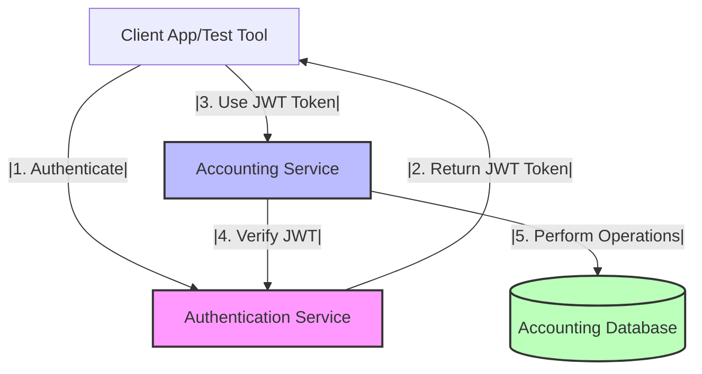
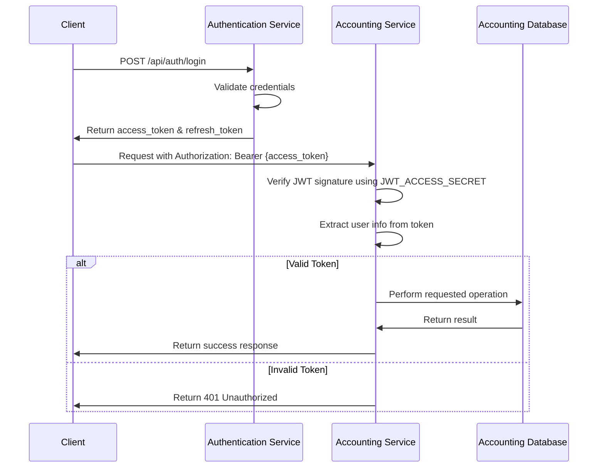
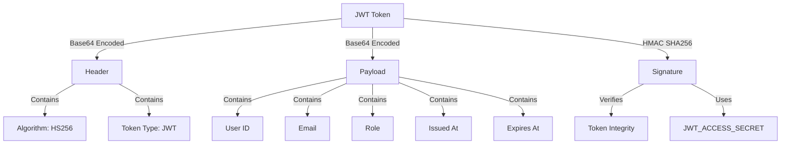

# Testing the Accounting Service with External Authentication Service

## Overview

This guide provides step-by-step instructions for testing the Accounting Service while it interacts with the External Authentication Service running in Docker Desktop. By following this guide, you'll learn how to:

1. Set up both services for testing
2. Create test users and authenticate them
3. Test the Accounting Service's JWT verification
4. Test credit allocation and management
5. Test streaming session flows
6. Troubleshoot common issues



## Prerequisites

- Docker Desktop installed and running
- Node.js and npm installed
- TypeScript installed globally (`npm install -g typescript`)
- Postman or another API testing tool (optional but recommended)
- Basic understanding of JWT authentication
- Basic knowledge of terminal/command line operations

## Environment Setup

### 1. Authentication Service Status

The External Authentication Service should be running in Docker Desktop with the following containers:

- `auth-service-dev` - Authentication Service running on port 3000
- `auth-mongodb` - MongoDB database for user accounts
- `auth-mailhog` - Email testing service on ports 1025 (SMTP) and 8025 (Web UI)

To check the status of these containers, run:

```bash
docker ps | grep auth
```

If the containers are not running, you can restart them or check with your administrator.

The service is configured with the following JWT secrets:

- JWT_ACCESS_SECRET=dev_access_secret_key_change_this_in_production
- JWT_REFRESH_SECRET=dev_refresh_secret_key_change_this_in_production

### 2. Setting Up the Accounting Service

To test the Accounting Service with the External Authentication Service, follow these steps:

1. Navigate to the accounting service directory:

```bash
cd services/accounting-service
```

2. Create a `.env` file with the following configuration:

```
# Server configuration
PORT=3001
NODE_ENV=development

# Database configuration
DB_HOST=localhost
DB_PORT=5432
DB_NAME=accounting_db
DB_USER=postgres
DB_PASSWORD=postgres

# JWT configuration (must match Authentication Service)
JWT_ACCESS_SECRET=dev_access_secret_key_change_this_in_production
JWT_REFRESH_SECRET=dev_refresh_secret_key_change_this_in_production

# CORS configuration
CORS_ORIGIN=http://localhost:3000

# Authentication Service URL
AUTH_SERVICE_URL=http://localhost:3000
```

3. Start the Accounting Service using Docker Compose:

```bash
docker-compose up -d
```

This will start the Accounting Service and its PostgreSQL database.

## Authentication Flow



## Step 1: Create a Test User

First, let's create a test user in the Authentication Service:

1. Register a new user:

```bash
curl -X POST http://localhost:3000/api/auth/signup \
  -H "Content-Type: application/json" \
  -d '{"username":"testuser","email":"testuser@example.com","password":"Password123!"}'
```

2. You can check the verification email in MailHog at http://localhost:8025

3. Get the verification code from the email and verify the account:

```bash
curl -X POST http://localhost:3000/api/auth/verify-email \
  -H "Content-Type: application/json" \
  -d '{"token":"YOUR_VERIFICATION_CODE"}'
```

4. Create an admin user (optional but useful for testing):

```bash
curl -X POST http://localhost:3000/api/auth/signup \
  -H "Content-Type: application/json" \
  -d '{"username":"adminuser","email":"admin@example.com","password":"AdminPass123!"}'
```

5. Verify the admin user, then use MongoDB shell to update their role:

```bash
docker exec -it auth-mongodb mongosh
use auth_db
db.users.updateOne(
  { username: "adminuser" },
  { $set: { role: "admin", isVerified: true } }
)
exit
```

## Step 2: Authenticate and Get JWT Token

1. Get an authentication token by logging in:

```bash
curl -X POST http://localhost:3000/api/auth/login \
  -H "Content-Type: application/json" \
  -d '{"email":"testuser@example.com","password":"Password123!"}' \
  -o auth_response.json
```

2. Extract the access token from the response:

```bash
JWT_TOKEN=$(cat auth_response.json | grep -o '"accessToken":"[^"]*' | grep -o '[^"]*$')
echo $JWT_TOKEN
```

On Windows PowerShell, you can use:

```powershell
$auth_response = Get-Content -Raw auth_response.json | ConvertFrom-Json
$JWT_TOKEN = $auth_response.accessToken
echo $JWT_TOKEN
```

3. Store this token for use in subsequent requests.

## Step 3: Test Accounting Service with the JWT Token

Now let's test if the Accounting Service can verify the JWT token from the Authentication Service:

1. Check the health status of the Accounting Service:

```bash
curl http://localhost:3001/health
```

2. Test a protected endpoint using the JWT token:

```bash
curl -X GET http://localhost:3001/api/credits/balance \
  -H "Authorization: Bearer $JWT_TOKEN"
```

If everything is set up correctly, you should see a response from the Accounting Service. If the user doesn't exist in the Accounting database yet, you might need to create the user account first.

## Step 4: Test Credit Allocation (Admin Only)

To test credit allocation, you need to use an admin account:

1. Log in as the admin user and get the admin JWT token.

2. Allocate credits to a user:

```bash
curl -X POST http://localhost:3001/api/credits/allocate \
  -H "Content-Type: application/json" \
  -H "Authorization: Bearer $ADMIN_JWT_TOKEN" \
  -d '{
    "userId": "testuser@example.com",
    "credits": 100,
    "expiresAt": "2025-12-31T23:59:59Z",
    "notes": "Test credit allocation"
  }'
```

3. Check the user's balance:

```bash
curl -X GET http://localhost:3001/api/credits/balance \
  -H "Authorization: Bearer $JWT_TOKEN"
```

## Step 5: Test Streaming Session Flow

Now let's test the streaming session flow:

1. Initialize a streaming session:

```bash
curl -X POST http://localhost:3001/api/streaming-sessions/initialize \
  -H "Content-Type: application/json" \
  -H "Authorization: Bearer $JWT_TOKEN" \
  -d '{
    "sessionId": "test-session-001",
    "modelId": "anthropic.claude-3-sonnet-20240229-v1:0",
    "estimatedTokens": 1000
  }'
```

2. Finalize the streaming session:

```bash
curl -X POST http://localhost:3001/api/streaming-sessions/finalize \
  -H "Content-Type: application/json" \
  -H "Authorization: Bearer $JWT_TOKEN" \
  -d '{
    "sessionId": "test-session-001",
    "actualTokens": 800,
    "success": true
  }'
```

3. Check the user's balance again to see the credits deducted:

```bash
curl -X GET http://localhost:3001/api/credits/balance \
  -H "Authorization: Bearer $JWT_TOKEN"
```

## Testing with Postman

Postman provides a more user-friendly interface for testing APIs:

1. Create a new Postman Collection for testing.

2. Set up environment variables:
   - `AUTH_URL`: http://localhost:3000
   - `ACCOUNTING_URL`: http://localhost:3001
   - `ACCESS_TOKEN`: (leave empty for now)

3. Create the following requests:

   a. **Login**:
      - Method: POST
      - URL: {{AUTH_URL}}/api/auth/login
      - Body: `{"email":"testuser@example.com","password":"Password123!"}`
      - Test Script:
        ```javascript
        if (pm.response.code === 200) {
            pm.environment.set("ACCESS_TOKEN", pm.response.json().accessToken);
        }
        ```

   b. **Get Credit Balance**:
      - Method: GET
      - URL: {{ACCOUNTING_URL}}/api/credits/balance
      - Authorization: Bearer Token (use `{{ACCESS_TOKEN}}`)

   c. **Initialize Streaming Session**:
      - Method: POST
      - URL: {{ACCOUNTING_URL}}/api/streaming-sessions/initialize
      - Authorization: Bearer Token (use `{{ACCESS_TOKEN}}`)
      - Body: 
        ```json
        {
          "sessionId": "test-session-{{$timestamp}}",
          "modelId": "anthropic.claude-3-sonnet-20240229-v1:0",
          "estimatedTokens": 1000
        }
        ```
      - Test Script:
        ```javascript
        if (pm.response.code === 201) {
            pm.environment.set("SESSION_ID", pm.response.json().sessionId);
        }
        ```

   d. **Finalize Streaming Session**:
      - Method: POST
      - URL: {{ACCOUNTING_URL}}/api/streaming-sessions/finalize
      - Authorization: Bearer Token (use `{{ACCESS_TOKEN}}`)
      - Body:
        ```json
        {
          "sessionId": "{{SESSION_ID}}",
          "actualTokens": 800,
          "success": true
        }
        ```

4. Run the requests in sequence to test the entire flow.

## Troubleshooting Common Issues

### 1. TypeScript Compilation Error: Missing dist/server.js

If you see errors like this in your Docker logs:
```
Error: Cannot find module '/usr/src/app/dist/server.js'
```

This means the TypeScript files aren't being compiled properly. To fix this:

1. Stop the current containers:
   ```bash
   docker-compose down
   ```

   For Windows PowerShell:
   ```powershell
   docker-compose down
   ```

2. Build the TypeScript files locally:
   ```bash
   npm install
   npm run build
   ```

   These commands will work in both bash and PowerShell.

3. Check if the `dist` folder was created with compiled JavaScript files:
   ```bash
   ls -la dist
   ```

   For Windows PowerShell:
   ```powershell
   ls dist
   ```

   You should see the compiled JavaScript files in the dist directory, including:
   - dist/src/ - Directory containing the compiled application code
   - dist/tests/ - Directory containing the compiled test files
   - dist/server.js - The main entry point for the application

4. If the build succeeds locally but fails in Docker, update your docker-compose.yml to include the dist folder in volumes:
   ```yaml
   volumes:
     - ./src:/usr/src/app/src
     - ./dist:/usr/src/app/dist
     - ./node_modules:/usr/src/app/node_modules
   ```

5. Restart the containers:
   ```bash
   docker-compose up -d
   ```

   For Windows PowerShell:
   ```powershell
   docker-compose up -d
   ```

6. Check the container status to verify it's running correctly:
   ```bash
   docker-compose ps
   ```

   If the accounting service container shows a status of "Up" (instead of "Restarting"), the issue has been resolved.

### 2. JWT Verification Fails

If JWT verification fails, check:
- Is the JWT_ACCESS_SECRET the same in both services?
- Is the token expired? Access tokens usually expire in 15 minutes.
- Is the Authorization header formatted correctly? It should be "Bearer [token]".

### 3. User Not Found in Accounting Service

If the user exists in the Authentication Service but not in the Accounting Service:
- Check if user auto-creation is enabled in the Accounting Service
- Manually create the user in the Accounting database:

```sql
INSERT INTO user_accounts (user_id, email, username, role)
VALUES ('user-id-from-jwt', 'user@example.com', 'username', 'user');
```

### 4. Insufficient Credits

If testing credit-dependent operations fails due to insufficient credits:
- Allocate more credits using the admin account
- Check if the credits have expired
- Verify the user has an active credit allocation

### 5. Service Connectivity Issues

If services can't communicate:
- Ensure both services are running (check with `docker ps`)
- Verify network connectivity between containers
- Check if CORS is properly configured

## JWT Token Structure

Understanding the JWT token structure is helpful for debugging:



The JWT payload typically contains:
- `sub`: User ID
- `email`: User's email
- `role`: User's role (user, supervisor, admin)
- `iat`: Issued At timestamp
- `exp`: Expiration timestamp

## Conclusion

By following this guide, you should now be able to test the Accounting Service with the External Authentication Service. This setup mimics the production environment where these two services work together to provide a secure and functional system.

Remember to:
1. Match JWT secrets between services
2. Use valid JWT tokens for all protected endpoints
3. Properly allocate credits before testing credit-dependent operations
4. Check logs for detailed error information

For more advanced testing scenarios, consider setting up automated tests using Jest or another testing framework.