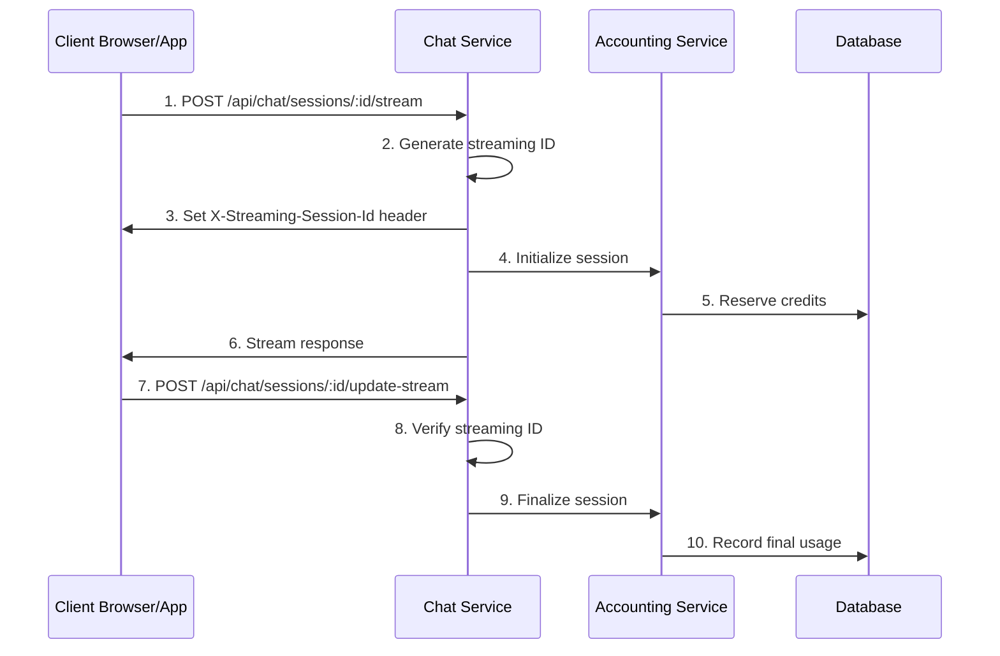
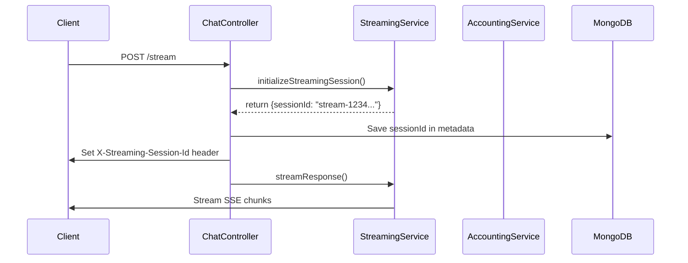
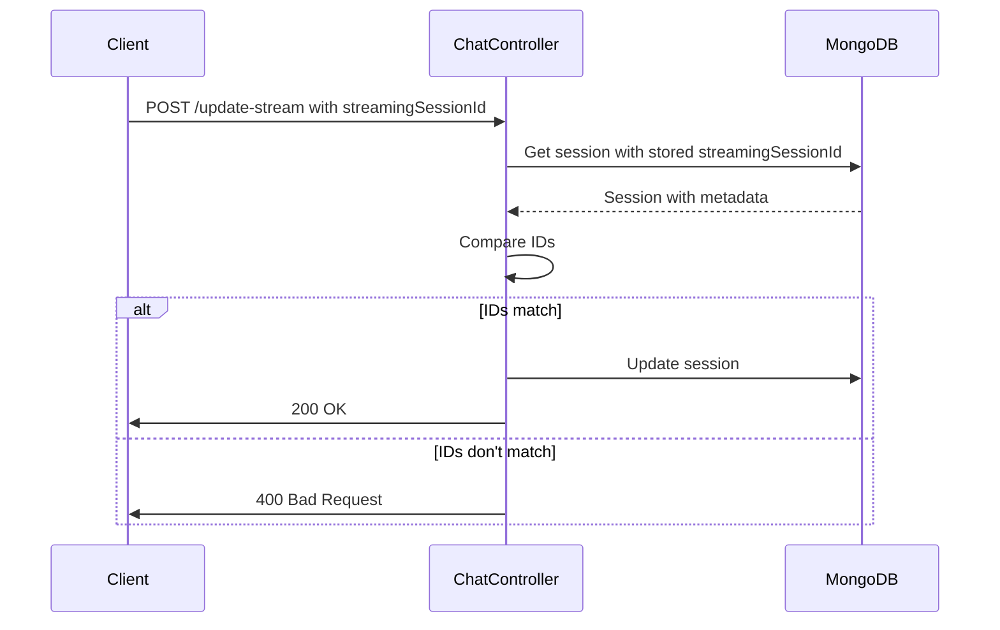
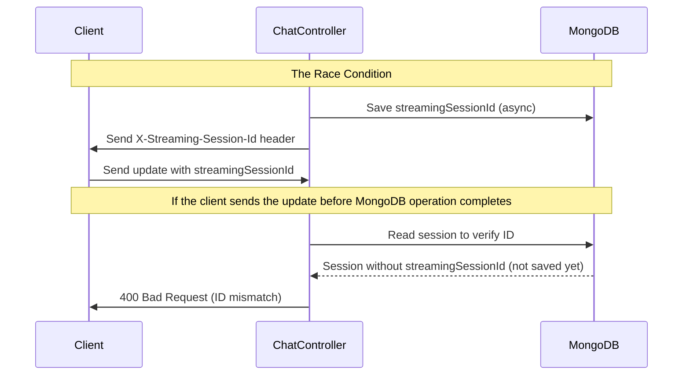

# Understanding the Streaming Session ID System in Chat Service

## Overview

This document provides a detailed analysis of the streaming session ID functionality in the chat service, focusing on how it's implemented, how it works, and the issues that can occur with it, especially related to race conditions.

## Streaming Session ID System Architecture

The streaming session ID system is designed to track and correlate streaming interactions between different parts of the microservices architecture. It's primarily used to:

1. Link a streaming request to its update operation
2. Track billing and resource usage
3. Enable race condition detection and prevention
4. Provide hooks for monitoring and observability



## Key Components

### 1. Streaming Session ID Generation

The streaming session ID is created in the `initializeStreamingSession` function of the `streaming.service.ts` file:

```typescript
// Generate a unique session ID with timestamp and UUID for tracking
const sessionId = `stream-${Date.now()}-${uuidv4().slice(0, 8)}`;
```

This creates IDs like: `stream-1714930557123-a1b2c3d4`

### 2. Session ID Storage and Transmission

The ID is:
1. Stored in the chat session's metadata in MongoDB
2. Passed to the accounting service for billing tracking
3. Sent to the client via the `X-Streaming-Session-Id` HTTP header



### 3. Stream Update Verification

When the client calls the update endpoint, the server verifies that the provided streaming session ID matches what's stored in the database:



## Race Condition Issues

The primary issue tested in the Python script is a race condition between:
1. The time when the streaming session ID is generated and set in the HTTP header
2. The time when the ID is stored in the MongoDB database
3. The time when the client receives the ID and sends it back in the update request



### The Retry Mechanism

To mitigate this race condition, the code implements a retry mechanism with progressively longer waits:

```typescript
// Attempt to retrieve the session up to 3 times with progressively longer waits
let session = null;
let latestError = null;
const maxRetries = 3;

for (let retry = 0; retry < maxRetries; retry++) {
  try {
    // Find chat session with ownership verification
    session = await ChatSession.findOne({ _id: sessionId, userId });
    
    if (session) {
      // If we found the session and it has metadata with streamingSessionId, break the retry loop
      if (session.metadata?.streamingSessionId) {
        break;
      } else {
        logger.debug(`Session found but missing streamingSessionId - retry ${retry + 1}/${maxRetries}`);
      }
    } else {
      logger.debug(`Session not found - retry ${retry + 1}/${maxRetries}`);
    }
    
    // Only wait and try again if this isn't the last attempt
    if (retry < maxRetries - 1) {
      // Progressive backoff - wait longer between each retry
      const delayMs = 500 * Math.pow(2, retry); // 500ms, 1000ms, 2000ms
      logger.debug(`Waiting ${delayMs}ms before retry ${retry + 2}/${maxRetries}`);
      await new Promise(resolve => setTimeout(resolve, delayMs));
    }
  } catch (err) {
    latestError = err;
    logger.error(`Error retrieving session on attempt ${retry + 1}:`, err);
  }
}
```

## Testing Issues and Edge Cases

The Python test script tests two key scenarios:
1. When the streaming session ID is correctly passed from the server to the client and back
2. When an incorrect streaming session ID is provided by the client

### Common Issues with Streaming Session IDs

1. **Header Case Sensitivity**: HTTP headers can be case-insensitive, but JavaScript property access is case-sensitive
   
   ```mermaid
   graph TD
       A[Problem: X-Streaming-Session-Id header] --> B{Client receives as}
       B -->|x-streaming-session-id| C[Case mismatch when accessing]
       B -->|X-STREAMING-SESSION-ID| D[Case mismatch when accessing]
       B -->|X-Streaming-Session-Id| E[Correct match]
   ```

2. **Race Condition Even With Retries**: If the database operation is very slow, even retries might not be sufficient
   
   ```mermaid
   sequenceDiagram
       participant Client
       participant ChatController
       participant MongoDB
       
       ChatController->>MongoDB: Save streamingSessionId (very slow)
       ChatController->>Client: Send X-Streaming-Session-Id header
       Client->>ChatController: Send update with streamingSessionId
       
       loop Retry mechanism (3 attempts)
           ChatController->>MongoDB: Check for streamingSessionId
           MongoDB-->>ChatController: Session without streamingSessionId (still not saved)
           Note over ChatController: Wait with exponential backoff
       end
       
       ChatController->>Client: 400 Bad Request (after all retries)
       
       Note over ChatController,MongoDB: MongoDB finally saves the streamingSessionId (too late)
   ```

3. **Header Missing or Stripped**: Some proxies or client libraries might strip or modify custom headers
   
   ```mermaid
   graph TD
       A[Server sends header] --> B{Intermediaries}
       B --> C[CDN]
       B --> D[Proxy]
       B --> E[Load Balancer]
       C --> F{Headers received by client?}
       D --> F
       E --> F
       F -->|Yes| G[Normal flow]
       F -->|No| H[Client missing ID]
   ```

## Implementation Details

### Setting the Header (in chat.controller.ts)

```typescript
// Set streaming session ID header FIRST before any other headers
if (streamSession.sessionId) {
  logger.debug(`Setting streaming session ID header: ${streamSession.sessionId}`);
  res.setHeader('X-Streaming-Session-Id', streamSession.sessionId);
} else {
  logger.error('Missing streaming session ID when trying to set header');
}

// Add CORS headers if needed for cross-origin requests
const origin = req.headers.origin;
if (origin) {
  res.setHeader('Access-Control-Allow-Origin', origin);
  res.setHeader('Access-Control-Allow-Credentials', 'true');
  res.setHeader('Access-Control-Expose-Headers', 'X-Streaming-Session-Id');
}
```

### Storing the ID in MongoDB

```typescript
// Update session with streaming session ID for tracking
session.metadata.streamingSessionId = streamSession.sessionId;
await session.save();
```

### Verifying the ID During Update

```typescript
// Super detailed comparison with optional chaining and fallbacks
const storedId = (session.metadata?.streamingSessionId || '').toString().trim().toLowerCase();
const providedId = (streamingSessionId || '').toString().trim().toLowerCase();

// Special case: First time the ID is being set
if (!storedId && providedId) {
  logger.debug(`No stored ID found, but client provided a valid ID. Accepting update.`);
  // We'll accept the client's ID and set it in the database
  session.metadata = session.metadata || {};
  session.metadata.streamingSessionId = streamingSessionId;
} 
// Normal case: Careful comparison that handles undefined, null, and other edge cases
else if (!providedId || !storedId || storedId !== providedId) {
  return res.status(400).json({ 
    message: 'Streaming session ID mismatch',
    details: {
      expected: storedId || '(no stored ID)',
      received: providedId || '(no provided ID)'
    }
  });
}
```

## Recommendations for Improvement

1. **Increase Retry Count and Max Wait Time**:
   ```typescript
   const maxRetries = 5; // Instead of 3
   const delayMs = 1000 * Math.pow(2, retry); // 1s, 2s, 4s, 8s, 16s
   ```

2. **Use Client-Side Storage Backup**:
   ```javascript
   // Client-side code
   let streamingSessionId = null;
   fetch('/api/chat/sessions/123/stream', { ... })
     .then(response => {
       streamingSessionId = response.headers.get('X-Streaming-Session-Id');
       localStorage.setItem('last-streaming-session-id', streamingSessionId);
       // Continue with streaming...
     });
   
   // Later, when updating:
   const fallbackId = localStorage.getItem('last-streaming-session-id');
   fetch('/api/chat/sessions/123/update-stream', {
     body: JSON.stringify({
       streamingSessionId: streamingSessionId || fallbackId,
       // Other data...
     })
   });
   ```

3. **Implement a First-Pass Special Condition**:
   If the streamingSessionId is missing from the database but the update request comes soon after streaming starts, allow it as a valid first update.

## Conclusion

The streaming session ID system is a critical component that ensures proper tracking, billing, and data integrity in streaming interactions. The primary challenges come from:

1. Race conditions between database operations and client requests
2. HTTP header handling inconsistencies
3. Network and infrastructure issues that may delay or drop headers

The current implementation has robust retry mechanisms, but as demonstrated in the testing script, edge cases can still occur. The recommendations above may help further improve the reliability of this system.