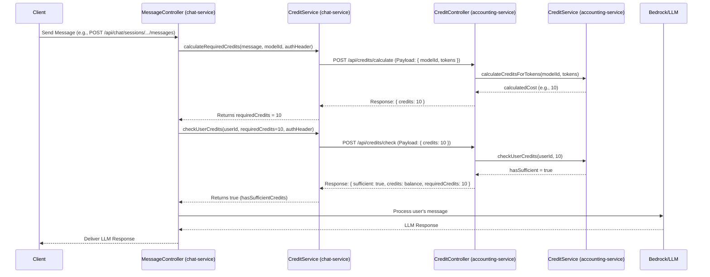
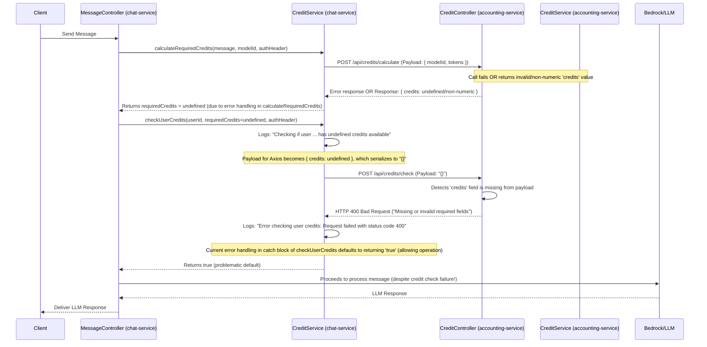

# Understanding Credit Calculation and Checking in the Chatbot System

This document explains how credit calculation and user credit verification work between the `chat-service` and the `accounting-service`. It also details a common issue where credit checks fail due to an empty payload and provides recommendations for resolving it.

## 1. Overview of Credit Flow

When a user interacts with the chatbot, particularly by sending a message that will incur a cost, the system performs several steps to manage credits:

1.  **User Action**: The user sends a message to the `chat-service`.
2.  **Cost Estimation (`chat-service` -> `accounting-service`)**:
    *   The `chat-service` (specifically `message.controller.ts`) needs to determine how many credits this operation will cost.
    *   It calls its internal `CreditService.calculateRequiredCredits` function.
    *   This function, in turn, makes an API call to the `accounting-service`'s `/api/credits/calculate` endpoint, providing details like the AI model and estimated tokens.
    *   The `accounting-service` calculates the cost and returns it to the `chat-service`.
3.  **Credit Verification (`chat-service` -> `accounting-service`)**:
    *   Once the `chat-service` knows the `requiredCredits`, its `message.controller.ts` calls the internal `CreditService.checkUserCredits` function.
    *   This function makes another API call, this time to the `accounting-service`'s `/api/credits/check` endpoint, sending the `userId` (implicitly via JWT) and the `requiredCredits`.
    *   The `accounting-service` checks if the user has sufficient credits and returns a boolean (`true` or `false`).
4.  **Action Execution**:
    *   If the user has sufficient credits, the `chat-service` proceeds to process the user's message (e.g., by calling the LLM).
    *   If not, or if the credit check fails critically, the operation should ideally be denied.

### Mermaid Diagram: Successful Credit Flow



## 2. The "Missing or invalid required fields" Problem

A critical issue identified from logs (`AWScloudlogfor_test_send_messages.py.json`) and `debug.md` is that the `accounting-service` often returns an HTTP 400 Bad Request error with the message: `"Missing or invalid required fields"`.

This occurs when the `chat-service` calls the `/api/credits/check` endpoint of the `accounting-service`.

### Log Evidence:

*   **`chat-service` log (AxiosError when calling `accounting-service`):**
    ```json
    {
        "level":"error",
        "message":"Error checking user credits: Request failed with status code 400",
        "name":"AxiosError",
        "config": {
            "url":"http://accounting-service-accounting-service-1:3001/api/credits/check",
            "method":"post",
            "data":"{}" // Key: An empty JSON object was sent as the payload
        },
        "response": {
            "status":400,
            "data":{"message":"Missing or invalid required fields"}
        },
        // ...
    }
    ```
*   The `accounting-service` expects a payload like `{"credits": 10}` for this endpoint. When it receives `{}`, it correctly identifies that the required `credits` field is missing.

## 3. Root Cause Analysis: Why is an Empty Payload (`{}`) Sent?

The core reason an empty payload is sent lies within the `chat-service`.

1.  **The "undefined credits" Log - The Smoking Gun**:
    The `chat-service` logs the following *before* the Axios 400 error occurs:
    ```json
    {"level":"info","message":"Checking if user 68142f173a381f81e190343e has undefined credits available","service":"chat-service", ...}
    ```
    This log originates from `chat-service/src/services/credit.service.ts` within the `checkUserCredits` function. It clearly shows that the `requiredCredits` parameter is `undefined` at this point.

2.  **How `undefined` `requiredCredits` Becomes an Empty Payload `{}`**:
    Inside `chat-service`'s `CreditService.checkUserCredits` function:
    ```typescript
    // const requiredCredits = undefined; // This is the state based on the log
    const payload: any = { credits: requiredCredits };
    // At this point, payload is { credits: undefined }
    ```
    When Axios serializes this `payload` object to a JSON string for the HTTP request body, `{ credits: undefined }` is converted to the string `"{}".` The `Content-Length: 2` in the request headers confirms this.

3.  **Why `requiredCredits` Becomes `undefined` in the First Place**:
    The `requiredCredits` variable is determined in `chat-service/src/controllers/chat/message.controller.ts` (within the `sendMessage` function) by calling `await CreditService.calculateRequiredCredits(...)`.
    ```typescript
    // In message.controller.ts
    const requiredCredits = await CreditService.calculateRequiredCredits(message, selectedModel, authHeader);
    // If CreditService.calculateRequiredCredits(...) resolves to undefined, 
    // then 'requiredCredits' here will be undefined.
    ```
    The `CreditService.calculateRequiredCredits` function itself might return `undefined` if:
    *   **Its own API call to `accounting-service`'s `/api/credits/calculate` endpoint fails** (e.g., network error, `accounting-service` error). The `catch` block in `calculateRequiredCredits` was updated to return `undefined` in such cases.
    *   **The `/api/credits/calculate` endpoint returns an invalid or unexpected response.** For example, if the response from `accounting-service` does not contain a valid numeric `credits` field (e.g., `response.data.credits` is missing, `null`, `NaN`, or not a number), `calculateRequiredCredits` was updated to return `undefined`.
    *   The log entry `{"level":"error","message":"Invalid credits calculated (undefined) for user ... Skipping usage recording."}` from `recordChatUsage` (which also calls `/credits/calculate`) supports the idea that the credit calculation step can indeed result in `undefined`.

### Mermaid Diagram: Problematic Flow



## 4. Recommended Solutions

To address this issue, robustness needs to be added at several points within the `chat-service`.

1.  **Strengthen `CreditService.calculateRequiredCredits` (`chat-service`):**
    *   **Ensure Clear Return Values:** This function should reliably return a `number` upon success or `undefined` (or throw a custom error) upon failure. The recent changes to return `undefined` if the upstream call to `/api/credits/calculate` fails or returns non-numeric credits are good.
    *   **Detailed Logging:** Ensure comprehensive logging within this function for when it calls the `accounting-service`'s `/api/credits/calculate` endpoint, including the payload sent, and the status and data of the response received. This helps diagnose why credit calculation might fail.

2.  **Add Strict Checks in `message.controller.ts` (`chat-service`):**
    *   After calling `calculateRequiredCredits` and before calling `checkUserCredits`, the `sendMessage` function in `message.controller.ts` **must** verify that `requiredCredits` is a valid number.
    *   If `requiredCredits` is `undefined`, `NaN`, or otherwise invalid, the controller should not proceed to `checkUserCredits`. Instead, it should log the error and return an appropriate error response to the client (e.g., HTTP 500 "Failed to calculate credit cost").
    *   **Implementation Example (already partially applied in previous edits):**
        ```typescript
        // In services/chat-service/src/controllers/chat/message.controller.ts
        // ...
        const requiredCredits = await CreditService.calculateRequiredCredits(
          message,
          selectedModel,
          authHeader
        );

        logger.debug(`Calculated requiredCredits: ${requiredCredits} for user: ${userId}`);

        if (typeof requiredCredits !== 'number' || isNaN(requiredCredits)) {
          logger.error(`Invalid requiredCredits calculated (${requiredCredits}) for user ${userId}, model ${selectedModel}. Cannot check credits.`);
          return res.status(500).json({
            message: 'Failed to calculate credit cost. Please try again.',
            error: 'CREDIT_CALCULATION_FAILED',
          });
        }

        const hasSufficientCredits = await CreditService.checkUserCredits(
          userId!,
          requiredCredits, // Now guaranteed to be a number
          authHeader
        );
        // ...
        ```

3.  **Improve Input Validation in `CreditService.checkUserCredits` (`chat-service`):**
    *   As a defense-in-depth measure, the `checkUserCredits` function itself should validate its `requiredCredits` input at the very beginning.
    *   If `requiredCredits` is not a valid positive number, it should log an error.
    *   **Crucially, decide on behavior:**
        *   **Safer:** Return `false` immediately. This stops the operation if the cost is unknown or invalid.
        *   **Current (as per logs/previous edits):** Log a warning and return `true` (due to the broader `catch` block's behavior). This is risky as it allows operations to proceed even if the credit cost was invalid.
    *   **Implementation Example (incorporating previous suggestions):**
        ```typescript
        // In services/chat-service/src/services/credit.service.ts
        export const checkUserCredits = async (
          userId: string,
          requiredCredits: number, // Type hint expects a number
          authHeader: string
        ): Promise<boolean> => {
          // Add strict validation at the beginning
          if (typeof requiredCredits !== 'number' || isNaN(requiredCredits) || requiredCredits < 0) {
            logger.error(`[checkUserCredits] Attempted to check credits with invalid requiredCredits value: ${requiredCredits} for user ${userId}.`);
            // SAFER APPROACH:
            // return false; 
            
            // To align with existing catch-all behavior (which also needs review):
            logger.warn(`[checkUserCredits] Due to invalid requiredCredits (${requiredCredits}), defaulting to allow operation for user ${userId}. This default behavior should be reviewed for safety.`);
            return true; // This path should be carefully considered. Returning false is generally safer.
          }
          
          try {
            logger.info(`Checking if user ${userId} has ${requiredCredits} credits available`);
            const payload: any = { credits: requiredCredits };
            // ... rest of the function
        ```

4.  **Review and Revise Error Handling in `CreditService.checkUserCredits` Catch Block (`chat-service`):**
    *   Currently, if the API call to `accounting-service`'s `/api/credits/check` fails for *any* reason (network error, 500 from accounting, etc.), the `catch` block in `checkUserCredits` logs a warning and then `return true;`.
    *   **This is a significant issue.** It means if the credit checking system is down or errors out, the `chat-service` defaults to allowing the operation, potentially leading to resource use without proper credit deduction.
    *   **Recommendation:** Change this behavior. If the credit check fails, it should generally return `false` or propagate an error that leads to the operation being denied.
        ```typescript
        // In services/chat-service/src/services/credit.service.ts
        // ...
        } catch (error) {
            logger.error('Error checking user credits:', error);
            // Instead of failing, default to allowing the operation if credit check fails (CURRENT PROBLEMATIC BEHAVIOR)
            // logger.warn(`Credit check failed, defaulting to allow operation for user ${userId}`);
            // return true;

            // RECOMMENDED CHANGE:
            logger.warn(`Credit check failed for user ${userId}. Operation will be denied.`);
            return false; // Deny operation if credit check system fails
        }
        };
        ```

5.  **`accounting-service` Behavior is Correct (for this specific issue):**
    *   The `accounting-service`'s `/api/credits/check` endpoint in `credit.controller.ts` correctly identifies that the `credits` field is missing when an empty payload `{}` is sent and returns a 400 Bad Request. This part of the system is behaving as expected and does not need changes to fix *this particular* bug (which originates in `chat-service`).

## 5. Summary for Newcomers

*   **The Problem:** The `chat-service` sometimes tries to check if a user has enough credits without first knowing how many credits the operation actually costs. This happens when the initial step of asking the `accounting-service` "How much does this cost?" fails or gives an unclear answer.
*   **The Symptom:** Because the cost is "undefined," the `chat-service` ends up sending an empty request (`{}`) to the `accounting-service` when it asks, "Does the user have enough credits?". The `accounting-service` correctly rejects this empty request with a 400 error.
*   **The Risk:** Due to a lenient error handling default, the `chat-service` might still proceed with the user's action even if the credit check technically failed.
*   **The Solutions:**
    1.  Make sure the `chat-service` always gets a clear, valid number for the cost of an operation from the `accounting-service`.
    2.  If the cost cannot be determined, the `chat-service` should stop and inform the user of an error, rather than trying to proceed with an "undefined" cost.
    3.  If any part of the credit checking process itself fails, the system should err on the side of caution and deny the operation, rather than allowing it by default.

By implementing these recommendations, the credit calculation and checking mechanism will become more robust and reliable.
