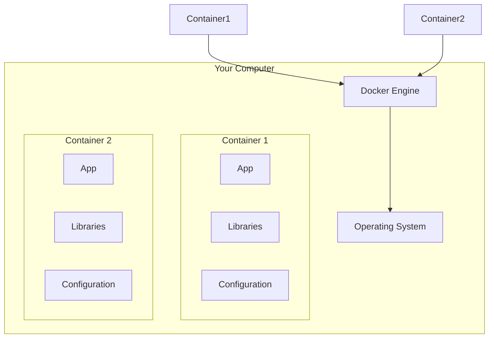
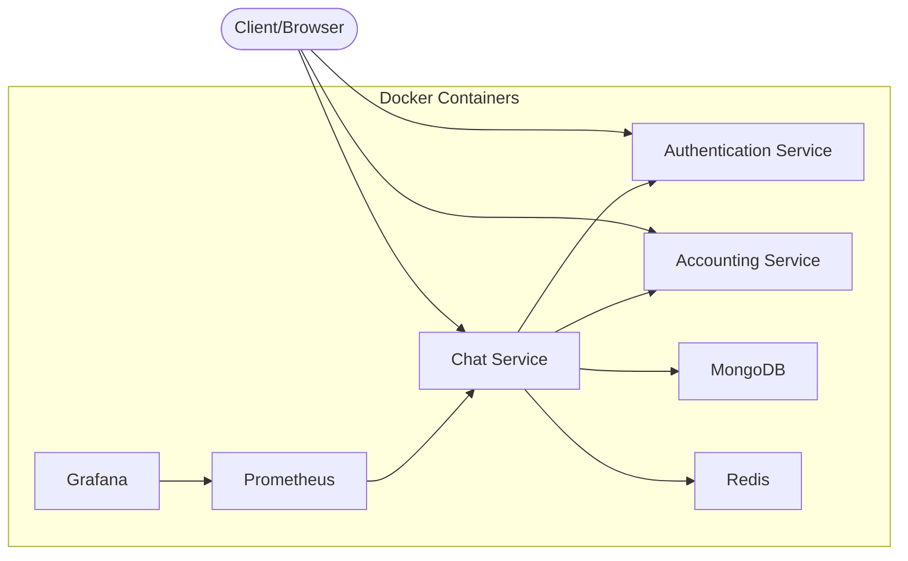
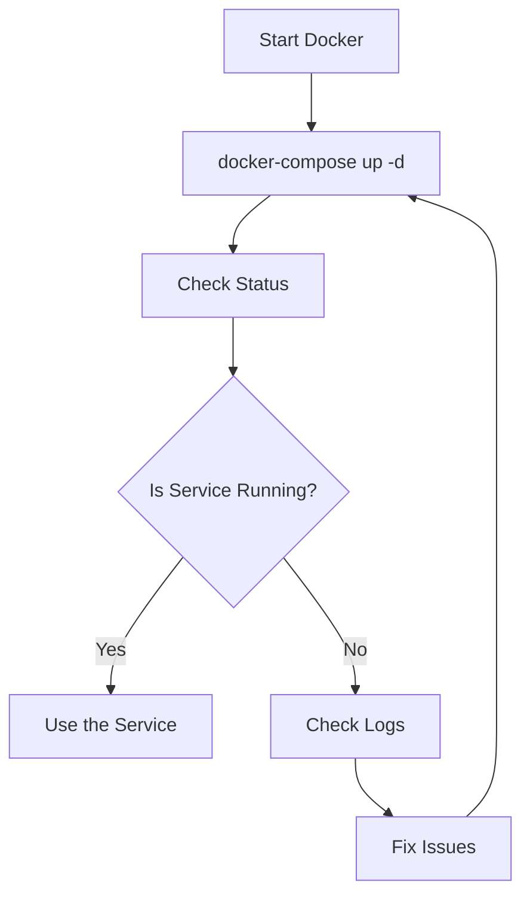
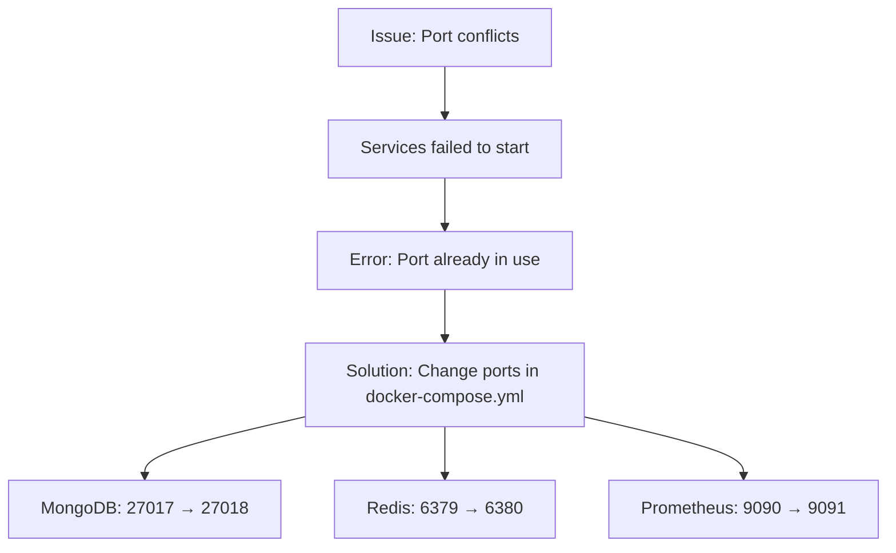
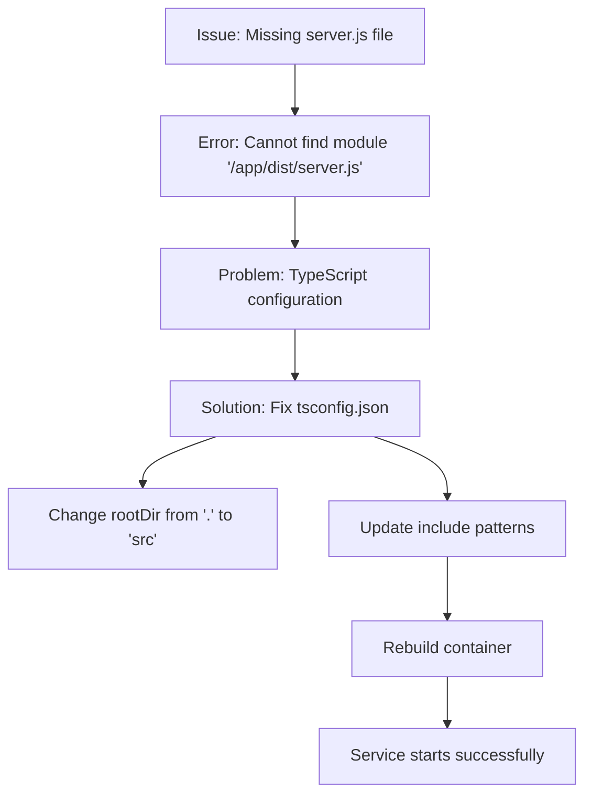
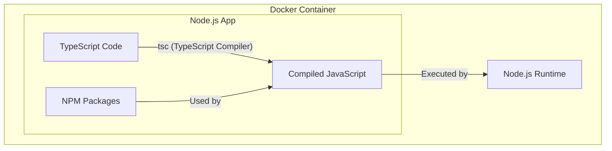
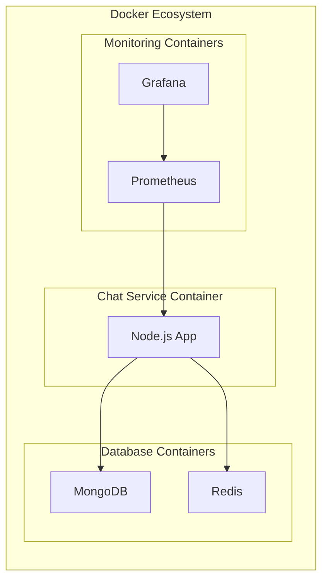
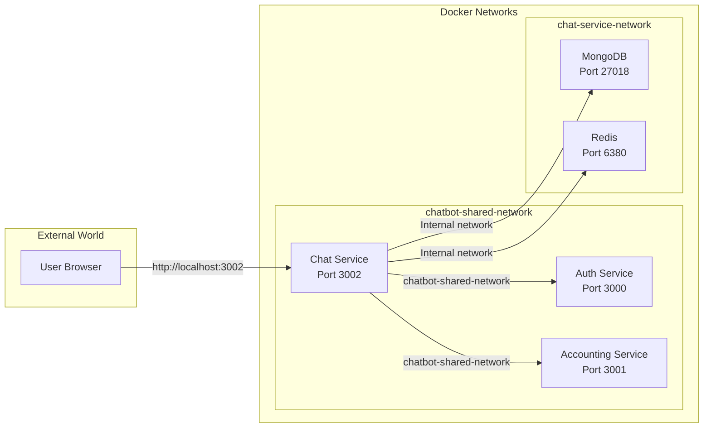

# Understanding Docker and Node.js for Beginners

## Introduction to Docker

Docker is a platform that makes it easier to create, deploy, and run applications using containers. Think of containers as lightweight, portable, self-sufficient packages that include everything your application needs to run (code, runtime, libraries, etc.).

### What is a Container?

A container:
- Is like a mini-computer inside your computer
- Contains everything needed to run an application
- Isolates applications from each other
- Runs the same way on any computer with Docker

## Our Project Structure

Our project consists of several services that work together:

## Common Docker Commands

When working with Docker, these are the commands we used most often:

- `docker-compose up -d`: Start all services defined in docker-compose.yml
- `docker-compose down`: Stop all services
- `docker-compose logs service-name`: View logs for a specific service
- `docker-compose build --no-cache`: Rebuild a service without using cached layers

## What We Fixed in Our Project

We encountered and solved several issues when setting up our Docker environment:

### Issue 1: Port Conflicts

When multiple services try to use the same port, Docker will report an error. We solved this by changing the port mappings in our docker-compose.yml file.

### Issue 2: TypeScript Compilation Problems

Our chat service wouldn't start because TypeScript wasn't compiling our code correctly. The main issue was in tsconfig.json, where we needed to point the rootDir to the 'src' directory instead of the project root.

## How Docker and Node.js Work Together

In our project:
1. We write code in TypeScript (.ts files)
2. Docker builds our application using a Dockerfile
3. During build, TypeScript compiles to JavaScript
4. Node.js runtime executes the JavaScript code
5. Services communicate with each other over internal networks

## Docker Components for Our Chat Service

Each component runs in its own container, making the system:
- Modular: Each part can be updated independently
- Scalable: Can run multiple instances of services
- Portable: Works the same in development and production
- Reliable: If one service crashes, others can continue running

## Networking Between Containers

Our project uses two types of networks:
- **chatbot-shared-network**: Allows different services (Auth, Accounting, and Chat) to communicate
- **chat-service-network**: Internal network for the Chat service components

## Common Docker Issues and Solutions

### Port Conflicts
- **Issue**: "Bind for 0.0.0.0:27017 failed: port is already allocated"
- **Solution**: Change the port mapping in docker-compose.yml from "27017:27017" to "27018:27017"

### Missing Files After Build
- **Issue**: "Cannot find module '/app/dist/server.js'"
- **Solution**: Fix TypeScript configuration in tsconfig.json to compile files to the correct location

### Container Networking Problems
- **Issue**: "Error response from daemon: failed to set up container networking"
- **Solution**: Restart Docker or ensure the shared network is created first

## Best Practices We Learned

1. **Start services in the correct order**: Authentication → Accounting → Chat
2. **Check service health**: Use health endpoints to verify services are running
3. **Use unique ports**: Avoid port conflicts by using different external ports
4. **Review logs when troubleshooting**: `docker-compose logs service-name`
5. **Rebuild from scratch when needed**: `docker-compose build --no-cache`

## Conclusion

Docker provides a consistent environment for development and deployment. By containerizing our services, we can:
- Ensure consistent behavior across different environments
- Simplify dependency management
- Focus on writing code rather than setting up environments
- Deploy faster and more reliably

Our chat service project demonstrates how multiple Docker containers can work together to create a complete application system, with separate containers for the application, databases, and monitoring tools.