# Understanding Race Conditions in Web Applications

## Introduction to Race Conditions

A race condition occurs when the behavior of a system depends on the sequence or timing of events that are not under your control. In web applications, these commonly happen when multiple operations that depend on each other don't complete in the expected order.

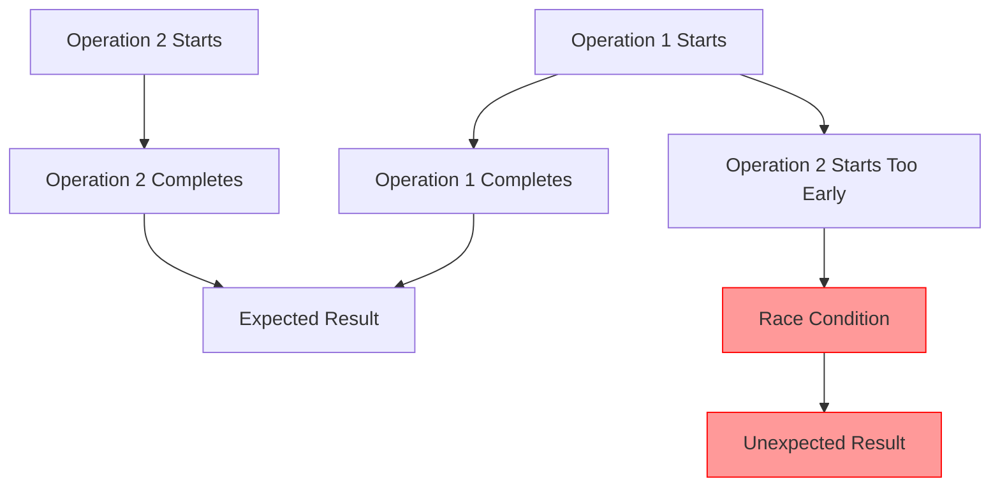
```mermaid
flowchart TD
    A[Operation 1 Starts] --> B[Operation 1 Completes]
    C[Operation 2 Starts] --> D[Operation 2 Completes]
    
    B --> E[Expected Result]
    D --> E
    
    A --> F[Operation 2 Starts Too Early]
    F --> G[Race Condition]
    G --> H[Unexpected Result]
    
    style G fill:#ff9999,stroke:#ff0000
    style H fill:#ff9999,stroke:#ff0000
```

## The Streaming Session ID Mismatch Issue

### The Problem We Faced

In our chat application, we encountered a classic race condition with the "Streaming Session ID Mismatch" error. This happened when:

1. The client started a streaming request
2. The server generated a unique streaming session ID
3. The server sent this ID in the response headers
4. The client needed to include this ID when updating the session
5. But sometimes the client's update would fail with "Streaming Session ID Mismatch"

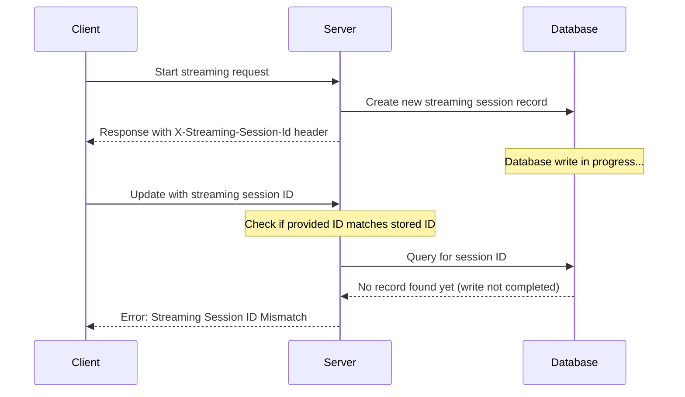
```mermaid
sequenceDiagram
    participant Client
    participant Server
    participant Database
    
    Client->>Server: Start streaming request
    Server->>Database: Create new streaming session record
    Server-->>Client: Response with X-Streaming-Session-Id header
    
    Note over Database: Database write in progress...
    
    Client->>Server: Update with streaming session ID
    
    Note over Server: Check if provided ID matches stored ID
    Server->>Database: Query for session ID
    Database-->>Server: No record found yet (write not completed)
    Server-->>Client: Error: Streaming Session ID Mismatch
```

### Root Cause Analysis

This was a race condition because:

1. The server began storing the streaming session ID in the database
2. The client received the ID in the headers and immediately tried to use it
3. But the database write operation hadn't completed when the client sent the update
4. The server couldn't find the ID in the database and rejected the update

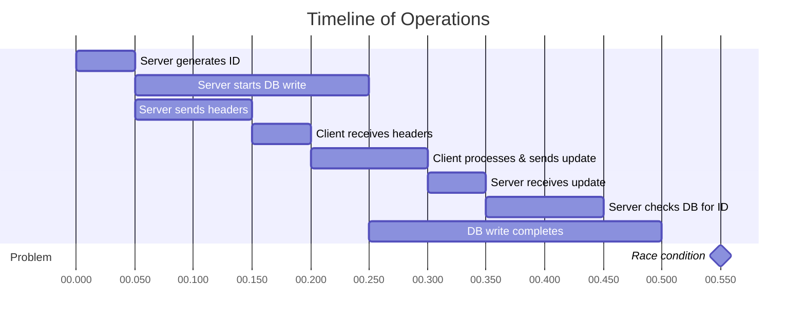
```mermaid
gantt
    title Timeline of Operations
    dateFormat  ss.SSS
    axisFormat %S.%L
    
    Server generates ID           :a1, 00.000, 0.050s
    Server starts DB write        :a2, after a1, 0.200s
    Server sends headers          :a3, after a1, 0.100s
    Client receives headers       :b1, after a3, 0.050s
    Client processes & sends update :b2, after b1, 0.100s
    Server receives update        :c1, after b2, 0.050s
    Server checks DB for ID       :c2, after c1, 0.100s
    DB write completes            :a4, after a2, 0.250s
    
    section Problem
    Race condition: milestone, m1, 00.550, 0
```

## Solution Approaches

### 1. Client-Side Delay

The simplest solution was to add a deliberate delay before the client attempts to update the session:

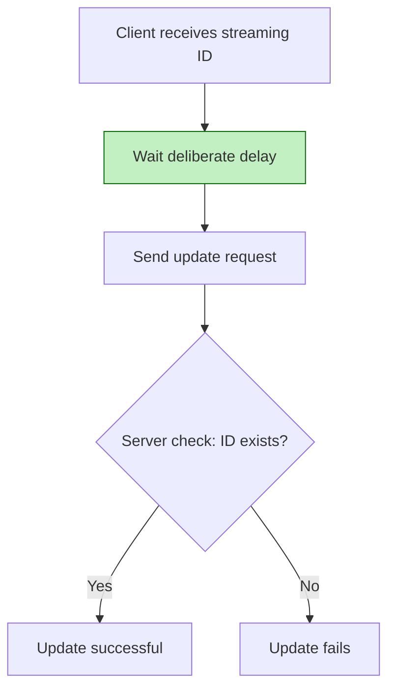
```mermaid
flowchart TD
    A[Client receives streaming ID] --> B[Wait deliberate delay]
    B --> C[Send update request]
    C --> D{Server check: ID exists?}
    D -->|Yes| E[Update successful]
    D -->|No| F[Update fails]
    
    style B fill:#c2f0c2,stroke:#006600
```

```python
# Python code example
Logger.info("Adding delay before update to avoid race conditions...")
time.sleep(0.5)  # Wait 500ms before updating
```

### 2. Server-Side Retries

A more robust solution was to implement retries on the server side:

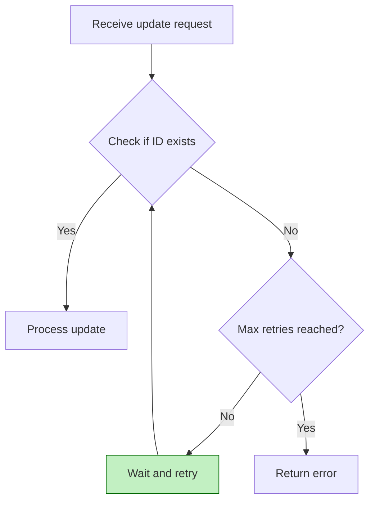
```mermaid
flowchart TD
    A[Receive update request] --> B{Check if ID exists}
    B -->|Yes| C[Process update]
    B -->|No| D{Max retries reached?}
    D -->|No| E[Wait and retry]
    D -->|Yes| F[Return error]
    
    E --> B
    
    style E fill:#c2f0c2,stroke:#006600
```

```typescript
// TypeScript code example
let session = null;
const maxRetries = 3;
    
for (let retry = 0; retry < maxRetries; retry++) {
  try {
    // Find chat session with ownership verification
    session = await ChatSession.findOne({ _id: sessionId, userId });
        
    if (session?.metadata?.streamingSessionId) {
      break; // Found it, exit retry loop
    } else {
      logger.debug(`Session found but missing streamingSessionId - retry ${retry + 1}/${maxRetries}`);
    }
        
    // Only wait if this isn't the last attempt
    if (retry < maxRetries - 1) {
      const delayMs = 500 * Math.pow(2, retry); // Progressive backoff
      await new Promise(resolve => setTimeout(resolve, delayMs));
    }
  } catch (err) {
    logger.error(`Error retrieving session on attempt ${retry + 1}:`, err);
  }
}
```

### 3. Input Normalization

We also improved the comparison logic to be more forgiving with formatting differences:

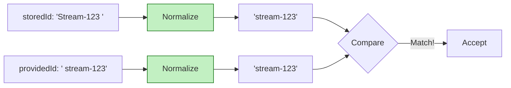
```mermaid
flowchart LR
    A["storedId: 'Stream-123  '"] --> B[Normalize]
    C["providedId: '  stream-123'"] --> D[Normalize]
    
    B --> E["'stream-123'"]
    D --> F["'stream-123'"]
    
    E & F --> G{Compare}
    G -->|Match!| H[Accept]
    
    style B fill:#c2f0c2,stroke:#006600
    style D fill:#c2f0c2,stroke:#006600
```

```typescript
// TypeScript code example
const storedId = (session.metadata?.streamingSessionId || '').toString().trim().toLowerCase();
const providedId = (streamingSessionId || '').toString().trim().toLowerCase();

if (storedId !== providedId) {
  return res.status(400).json({ message: 'Streaming session ID mismatch' });
}
```

## Race Conditions in Different Environments

### Client-Server Communication

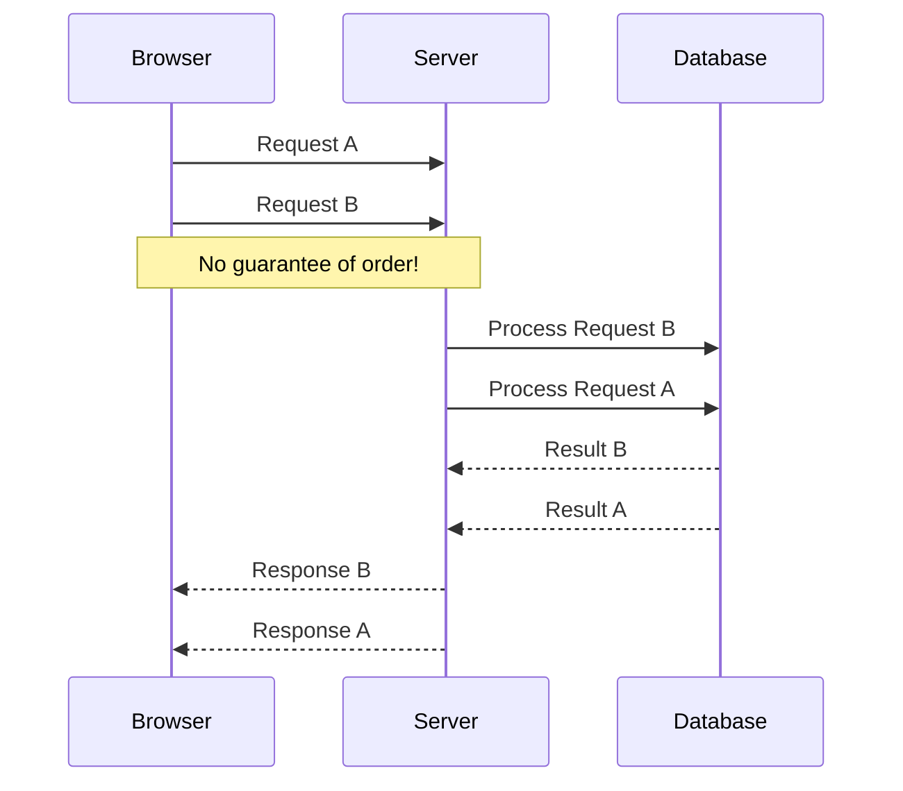
```mermaid
sequenceDiagram
    participant Browser
    participant Server
    participant Database
    
    Browser->>Server: Request A
    Browser->>Server: Request B
    
    Note over Browser,Server: No guarantee of order!
    
    Server->>Database: Process Request B
    Server->>Database: Process Request A
    
    Database-->>Server: Result B
    Database-->>Server: Result A
    
    Server-->>Browser: Response B
    Server-->>Browser: Response A
```

### Database Operations

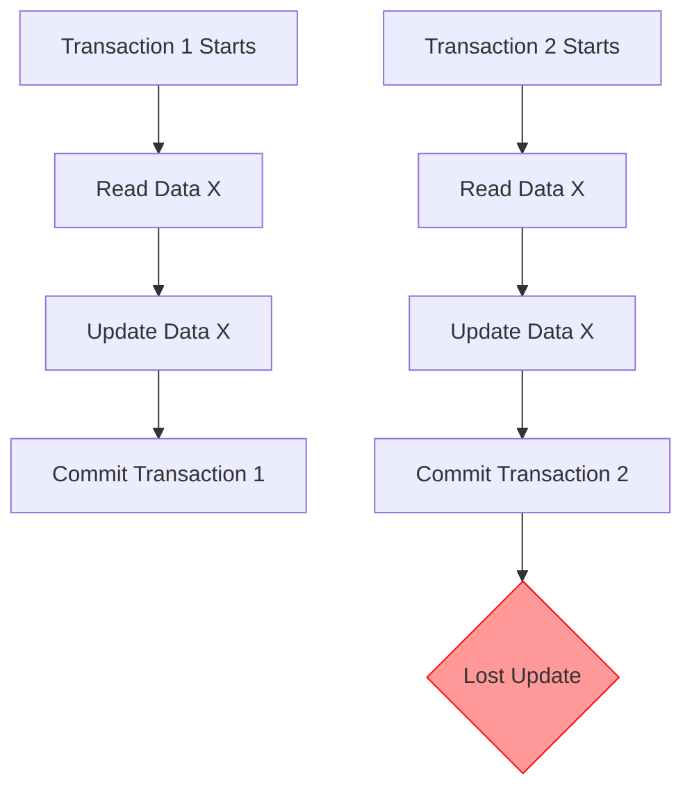
```mermaid
flowchart TD
    A[Transaction 1 Starts] --> B[Read Data X]
    C[Transaction 2 Starts] --> D[Read Data X]
    B --> E[Update Data X]
    D --> F[Update Data X]
    E --> G[Commit Transaction 1]
    F --> H[Commit Transaction 2]
    
    H --> I{Lost Update}
    
    style I fill:#ff9999,stroke:#ff0000
```

### Multi-threading

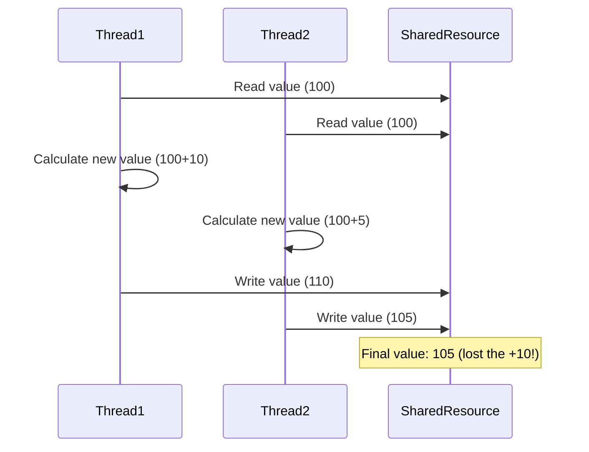
```mermaid
sequenceDiagram
    participant Thread1
    participant Thread2
    participant SharedResource
    
    Thread1->>SharedResource: Read value (100)
    Thread2->>SharedResource: Read value (100)
    Thread1->>Thread1: Calculate new value (100+10)
    Thread2->>Thread2: Calculate new value (100+5)
    Thread1->>SharedResource: Write value (110)
    Thread2->>SharedResource: Write value (105)
    
    Note over SharedResource: Final value: 105 (lost the +10!)
```

## Practical Tips for Avoiding Race Conditions

### 1. Use Transactions

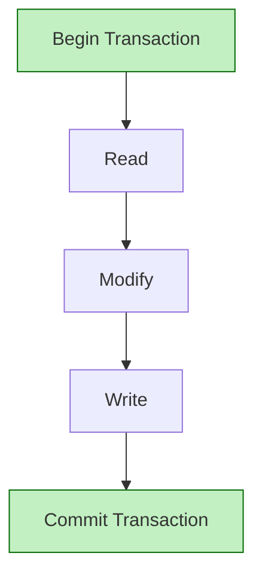
```mermaid
flowchart TD
    A[Begin Transaction] --> B[Read]
    B --> C[Modify]
    C --> D[Write]
    D --> E[Commit Transaction]
    
    style A fill:#c2f0c2,stroke:#006600
    style E fill:#c2f0c2,stroke:#006600
```

### 2. Implement Locking

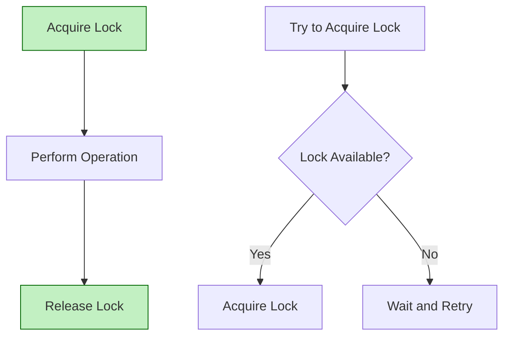
```mermaid
flowchart TD
    A[Acquire Lock] --> B[Perform Operation]
    B --> C[Release Lock]
    
    D[Try to Acquire Lock] --> E{Lock Available?}
    E -->|Yes| F[Acquire Lock]
    E -->|No| G[Wait and Retry]
    
    style A fill:#c2f0c2,stroke:#006600
    style C fill:#c2f0c2,stroke:#006600
```

### 3. Use Atomic Operations

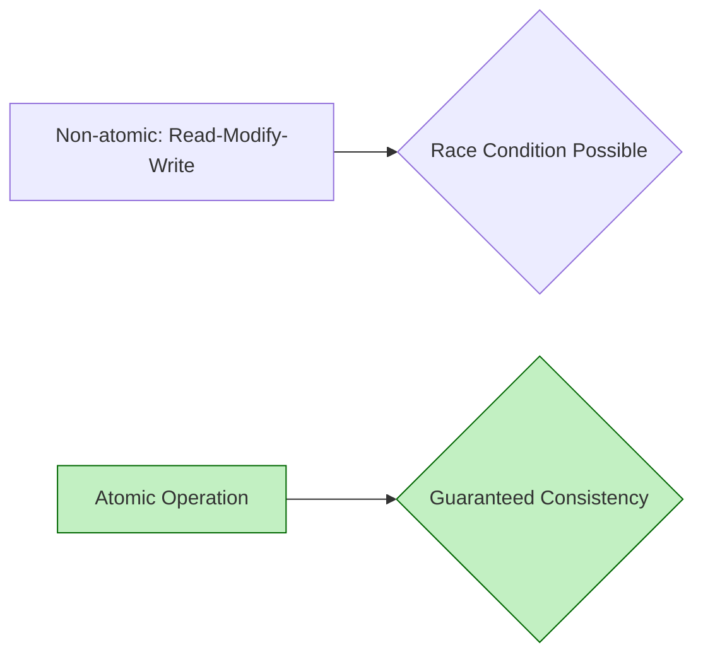
```mermaid
flowchart LR
    A[Non-atomic: Read-Modify-Write] --> B{Race Condition Possible}
    C[Atomic Operation] --> D{Guaranteed Consistency}
    
    style C fill:#c2f0c2,stroke:#006600
    style D fill:#c2f0c2,stroke:#006600
```

### 4. Implement Retries with Backoff

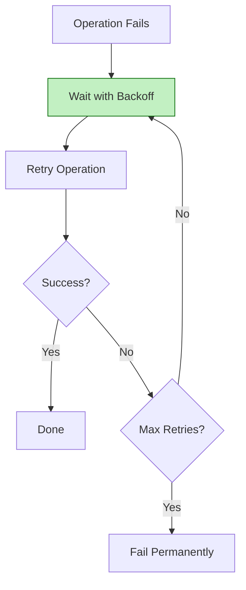
```mermaid
flowchart TD
    A[Operation Fails] --> B[Wait with Backoff]
    B --> C[Retry Operation]
    C --> D{Success?}
    D -->|Yes| E[Done]
    D -->|No| F{Max Retries?}
    F -->|No| B
    F -->|Yes| G[Fail Permanently]
    
    style B fill:#c2f0c2,stroke:#006600
```

## Real-world Examples of Race Conditions

### 1. E-commerce Double Purchase

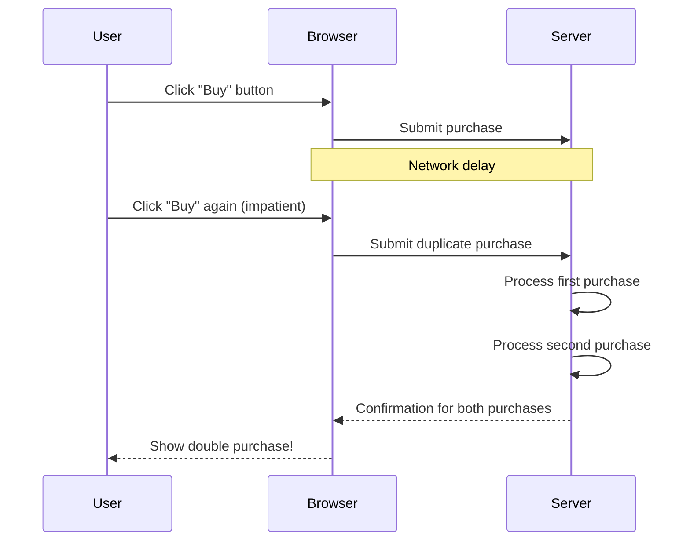
```mermaid
sequenceDiagram
    participant User
    participant Browser
    participant Server
    
    User->>Browser: Click "Buy" button
    Browser->>Server: Submit purchase
    
    Note over Browser,Server: Network delay
    
    User->>Browser: Click "Buy" again (impatient)
    Browser->>Server: Submit duplicate purchase
    
    Server->>Server: Process first purchase
    Server->>Server: Process second purchase
    
    Server-->>Browser: Confirmation for both purchases
    Browser-->>User: Show double purchase!
```

### 2. Social Media Like Button

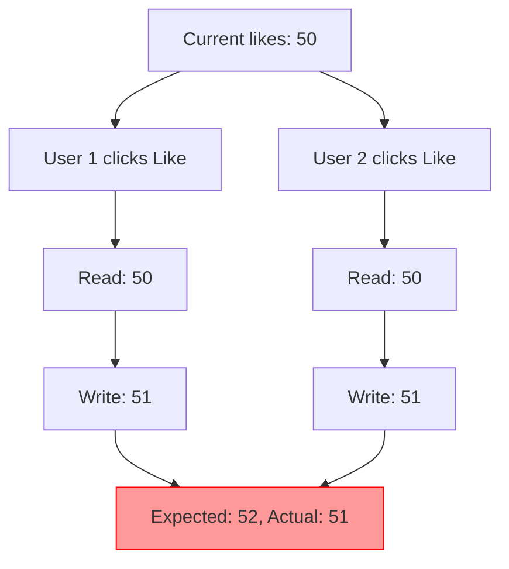
```mermaid
flowchart TD
    A[Current likes: 50] --> B[User 1 clicks Like]
    A --> C[User 2 clicks Like]
    B --> D[Read: 50]
    C --> E[Read: 50]
    D --> F[Write: 51]
    E --> G[Write: 51]
    
    F & G --> H[Expected: 52, Actual: 51]
    
    style H fill:#ff9999,stroke:#ff0000
```

## How We Fixed the Streaming Session ID Issue

Here's our complete solution for the "Streaming Session ID Mismatch" error:

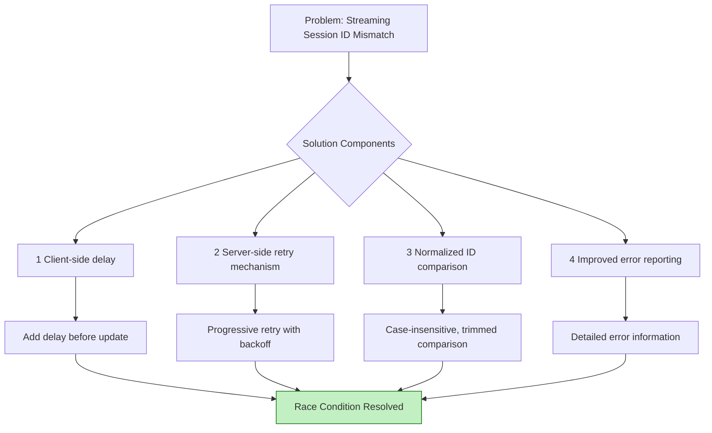
```mermaid
flowchart TD
    A[Problem: Streaming Session ID Mismatch] --> B{Solution Components}
    
    B --> C[1 Client-side delay]
    B --> D[2 Server-side retry mechanism]
    B --> E[3 Normalized ID comparison]
    B --> F[4 Improved error reporting]
    
    C --> G[Add delay before update]
    D --> H[Progressive retry with backoff]
    E --> I[Case-insensitive, trimmed comparison]
    F --> J[Detailed error information]
    
    G & H & I & J --> K[Race Condition Resolved]
    
    style K fill:#c2f0c2,stroke:#006600
```

### Solution Sequence

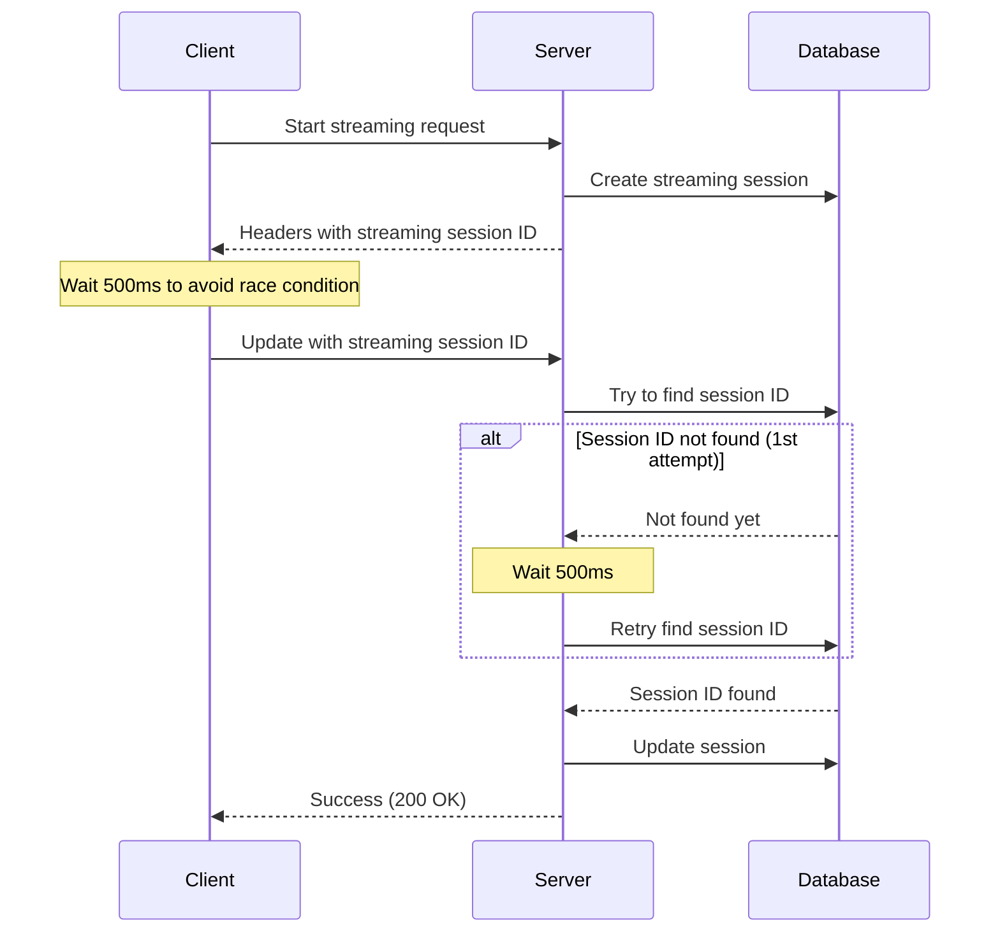
```mermaid
sequenceDiagram
    participant Client
    participant Server
    participant Database
    
    Client->>Server: Start streaming request
    Server->>Database: Create streaming session
    Server-->>Client: Headers with streaming session ID
    
    Note over Client: Wait 500ms to avoid race condition
    
    Client->>Server: Update with streaming session ID
    Server->>Database: Try to find session ID
    alt Session ID not found (1st attempt)
        Database-->>Server: Not found yet
        Note over Server: Wait 500ms
        Server->>Database: Retry find session ID
    end
    
    Database-->>Server: Session ID found
    Server->>Database: Update session
    Server-->>Client: Success (200 OK)
```

## Conclusion

Race conditions are a common but challenging issue in distributed systems and web applications. By understanding the timing-dependent nature of these issues, you can implement effective solutions:

1. **Defensive programming** - Assume operations may not complete in the expected order
2. **Timing delays** - Add strategic delays where appropriate
3. **Retry mechanisms** - Implement retries with exponential backoff
4. **Robust validation** - Make comparisons more forgiving with normalization
5. **Detailed logging** - Add debugging information to identify race conditions

By applying these techniques, we successfully resolved the "Streaming Session ID Mismatch" issue in our chat application, ensuring reliable streaming updates even with database write delays.