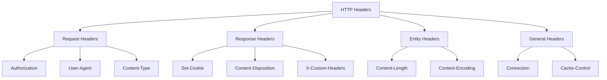
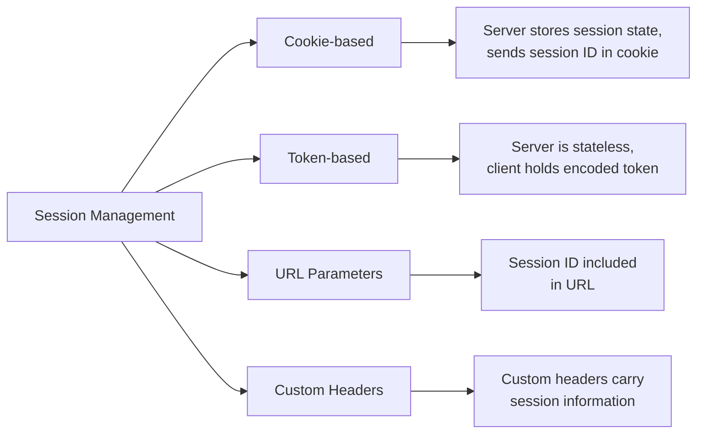
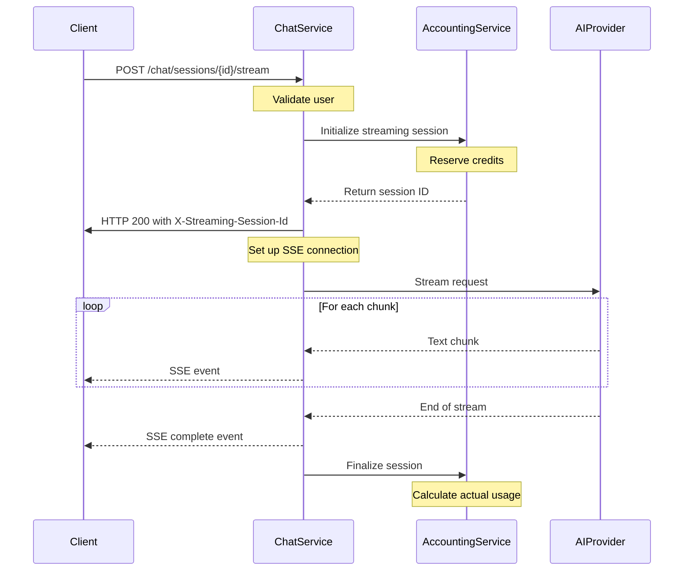
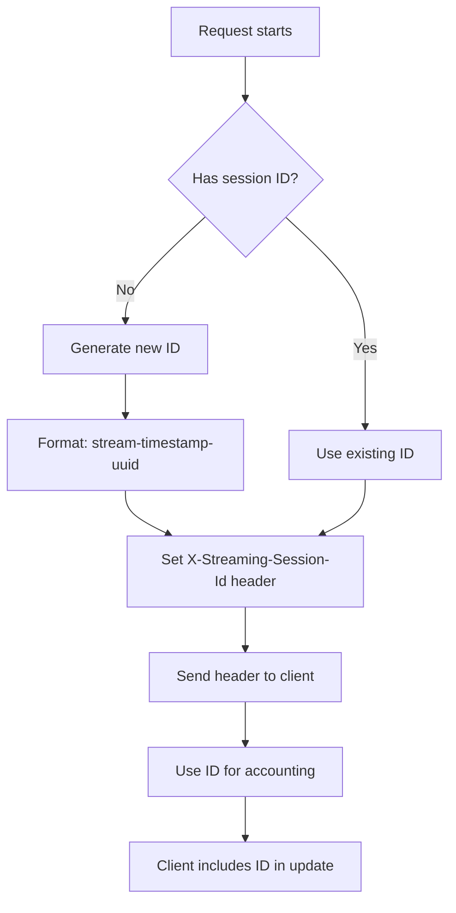
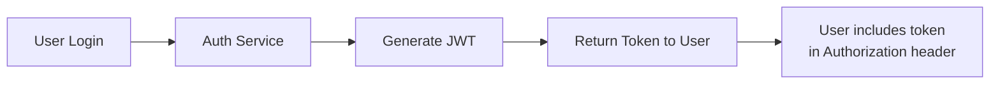
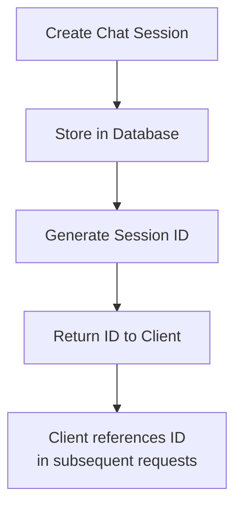
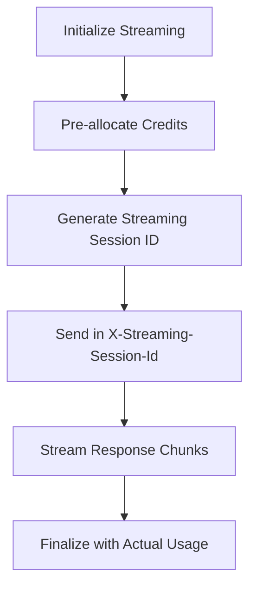

# Understanding Sessions and HTTP Headers in Microservices

This document explains the concepts of session management and HTTP headers in the context of our chat service architecture, particularly focusing on streaming sessions and their management across microservices.

## Table of Contents

1. [Introduction to HTTP Headers](#introduction-to-http-headers)
2. [Session Management Basics](#session-management-basics)
3. [Streaming Sessions in Our Architecture](#streaming-sessions-in-our-architecture)
4. [Common Issues and Solutions](#common-issues-and-solutions)
5. [Best Practices](#best-practices)
6. [Debugging Techniques](#debugging-techniques)

## Introduction to HTTP Headers

HTTP headers are key-value pairs sent at the beginning of HTTP requests and responses. They provide essential metadata about the request or response, such as content type, authentication credentials, caching policies, and more.

### Common HTTP Header Types



### Key Headers in Our System

| Header Name | Purpose | Example Value |
|-------------|---------|---------------|
| `Authorization` | Carries authentication token | `Bearer eyJhbGciOiJIUzI1...` |
| `X-Streaming-Session-Id` | Identifies streaming sessions | `stream-1620847252-a1b2c3d4` |
| `Content-Type` | Specifies media type | `text/event-stream` |
| `X-User-ID` | Identifies the user | `user1` |
| `Cache-Control` | Controls caching | `no-cache` |

## Session Management Basics

A "session" represents a series of interactions between a client and server. Sessions help maintain state in the otherwise stateless HTTP protocol.

### Sessions vs. Connections

- **Connection**: The TCP connection between client and server
- **Session**: A logical concept representing related interactions over time

### Session Management Approaches



In our architecture, we use a hybrid approach with JWT tokens for authentication and custom headers for session tracking.

## Streaming Sessions in Our Architecture

Our system implements Server-Sent Events (SSE) for streaming AI responses. This requires special handling of sessions across microservices.

### Streaming Flow



### Critical Headers for Streaming

- `Content-Type: text/event-stream`: Indicates an SSE connection
- `X-Streaming-Session-Id`: Unique identifier for the streaming session
- `Cache-Control: no-cache`: Prevents caching of streamed content
- `Connection: keep-alive`: Maintains the connection for streaming

### Session ID Management



## Common Issues and Solutions

### Session ID Mismatch

**Problem**: Client doesn't receive the streaming session ID or sends an incorrect ID when updating.

**Solution**:
1. Ensure headers are properly set before flushing
2. Set CORS header `Access-Control-Expose-Headers` to expose custom headers
3. Log headers for debugging
4. Implement fallback mechanisms

Example header setup:

```typescript
// Set streaming session ID header FIRST before any other headers
if (streamSession.sessionId) {
  logger.debug(`Setting streaming session ID header: ${streamSession.sessionId}`);
  res.setHeader('X-Streaming-Session-Id', streamSession.sessionId);
} else {
  logger.error('Missing streaming session ID when trying to set header');
}

// Add CORS headers if needed for cross-origin requests
const origin = req.headers.origin;
if (origin) {
  res.setHeader('Access-Control-Allow-Origin', origin);
  res.setHeader('Access-Control-Allow-Credentials', 'true');
  res.setHeader('Access-Control-Expose-Headers', 'X-Streaming-Session-Id');
}

// Then set the standard SSE headers
res.setHeader('Content-Type', 'text/event-stream');
res.setHeader('Cache-Control', 'no-cache');
res.setHeader('Connection', 'keep-alive');
```

### Debugging Headers

Example in Python:

```python
# Look for streaming session ID in headers
self.streaming_session_id = streaming_response.headers.get("X-Streaming-Session-Id")
Logger.debug(f"All headers: {dict(streaming_response.headers)}")
if self.streaming_session_id:
    Logger.info(f"Found streaming session ID in headers: {self.streaming_session_id}")
else:
    Logger.warning("No streaming session ID found in headers. This might cause issues.")
    # Using timestamp as fallback
    self.streaming_session_id = f"stream-{int(time.time())}"
    Logger.info(f"Using fallback streaming session ID: {self.streaming_session_id}")
```

## Session Types in Our Architecture

Our system manages several types of sessions:

### 1. Authentication Sessions

JWT-based tokens that verify user identity. These typically have a longer lifetime.



### 2. Chat Sessions

Persistent sessions that store conversation history and metadata.



### 3. Streaming Sessions

Short-lived sessions for AI response streaming with credit pre-allocation.



## Best Practices

1. **Always Set Headers Before Content**: Set all headers before sending any content or flushing response.
2. **Log Headers for Debugging**: Log headers during development and testing.
3. **Use Consistent Header Naming**: Follow naming conventions (X- prefix for custom headers).
4. **Include Fallback Mechanisms**: Have recovery strategies when headers are missing.
5. **Set Proper CORS Headers**: Ensure custom headers are accessible cross-origin.
6. **Use Meaningful Session IDs**: Include useful information in session IDs when possible.

## Debugging Techniques

### Header Inspection Tools

- Browser DevTools Network tab
- Postman for API testing
- Custom logging in code

### Common Debugging Methods

1. **Log All Headers**: 
   ```python
   Logger.debug(f"All headers: {dict(response.headers)}")
   ```

2. **Add Debug Middleware**:
   ```typescript
   app.use((req, res, next) => {
     console.log('Request headers:', req.headers);
     const originalSetHeader = res.setHeader;
     res.setHeader = function(name, value) {
       console.log(`Setting header: ${name}: ${value}`);
       return originalSetHeader.apply(this, arguments);
     };
     next();
   });
   ```

3. **Verify Header Visibility in Browsers**:
   ```javascript
   fetch('/api/endpoint', {
     headers: { 'Authorization': 'Bearer token' }
   }).then(response => {
     console.log('Response headers:', 
       Array.from(response.headers.entries()));
   });
   ```

---

## Conclusion

Understanding how sessions and headers work together is crucial for developing reliable microservice architectures, especially for streaming applications. By following best practices and implementing proper header management, we can ensure smooth communication between services and clients even in complex scenarios like real-time streaming.

The session ID mismatch issue we encountered highlights the importance of proper header handling. By implementing the right order of header setup, adding the necessary CORS headers, and having robust debugging capabilities, we ensured our system could reliably maintain session consistency across requests.