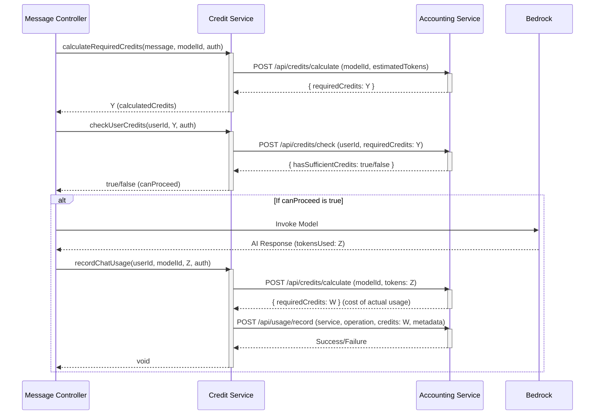

# Flow

## Bug Fixes and Resolutions (Applied on May 21, 2025)

Following the analysis of issues identified in previous log files and `debug.md` entries, several key bugs were addressed in the `chat-service`. These fixes aim to improve the reliability of non-streaming credit checks, usage recording, and server-side SSE stream processing.

### 1. Credit Service Enhancements (`services/chat-service/src/services/credit.service.ts`)

Several issues related to credit checking and recording were fixed:

* **Incorrect Credit Check Payload:**
  * **Problem:** The `/api/credits/check` endpoint in the accounting service was being called with an insufficient payload (e.g., `{"credits":X}`).
  * **Fix:** The payload now correctly includes `userId` and uses the field `requiredCredits`.
        *Code Snippet (credit.service.ts - checkUserCredits):*

        ```typescript
        // ...
        const response = await axios.post(
          `${config.accountingApiUrl}/credits/check`, // Corrected: accountingApiUrl
          {
            userId: userId, // Added userId
            requiredCredits: requiredCredits // Ensured field name consistency
          },
          {
            headers: {
              Authorization: authHeader
            }
          }
        );
        // ...
        ```

* **Problematic Fallback on Credit Check Failure:**
  * **Problem:** If the credit check API call failed, the system would default to allowing the operation (`return true`).
  * **Fix:** The system now defaults to denying the operation (`return false`) if the credit check fails, preventing operations without confirmed credit availability.
        *Code Snippet (credit.service.ts - checkUserCredits error handling):*

        ```typescript
        // ...
        } catch (error: any) {
          logger.error('[checkUserCredits] Error checking user credits:', error.message);
          logger.warn(`[checkUserCredits] Credit check failed for user ${userId}, defaulting to DENY operation.`);
          return false; // Changed to false: Deny operation if credit check fails
        }
        // ...
        ```

* **Lost/Undefined Credits for Usage Recording:**
  * **Problem:** When recording usage, the service was attempting to read `response.data.credits` from the `/credits/calculate` endpoint, but the accounting service returns `response.data.requiredCredits`. This led to `undefined` credits and skipped usage recording.
  * **Fix:** The service now correctly reads `response.data.requiredCredits` for usage recording.
        *Code Snippet (credit.service.ts - recordChatUsage):*

        ```typescript
        // ...
        const response = await axios.post(
          `${config.accountingApiUrl}/credits/calculate`, // Corrected: accountingApiUrl
          payload,
          // ... headers
        );
        // ...
        const creditsToRecord = response.data.requiredCredits; 

        if (typeof creditsToRecord !== 'number' || isNaN(creditsToRecord) || creditsToRecord < 0) {
          logger.error(
            `[recordChatUsage] Invalid credits calculated (${creditsToRecord}) for user ${userId}, model ${modelId}, tokens ${tokensUsed}. Skipping usage recording.`
          );
          return; 
        }
        // ... record usage with creditsToRecord
        ```

  * Additionally, the `calculateRequiredCredits` function was updated to explicitly return `undefined` if the accounting service provided an invalid credit value, and the caller (`sendMessage` in `message.controller.ts`) already had checks for this.
        *Code Snippet (credit.service.ts - calculateRequiredCredits):*

        ```typescript
        // ...
        const credits = response.data.requiredCredits;
        if (typeof credits !== 'number' || isNaN(credits)) {
          logger.error(`[calculateRequiredCredits] Invalid credits value received from accounting service: ${credits}. Returning undefined.`);
          return undefined;
        }
        return credits;
        // ...
        ```

* **Configuration Error:**
  * **Problem:** `config.accountingServiceUrl` was used in some places instead of `config.accountingApiUrl`.
  * **Fix:** Corrected to use `config.accountingApiUrl` consistently throughout `credit.service.ts`.
* **Error Handling:**
  * **Fix:** Ensured `error` objects in `catch` blocks are typed as `any` to access `error.message` safely (e.g., `catch (error: any)`).

**Corrected Credit Check and Usage Recording Flow:**



### 2. SSE Stream Processing Fixes (`services/chat-service/src/controllers/chat/message.controller.ts`)

* **Malformed SSE Chunk Parsing (Server-Side):**
  * **Problem:** The `message.controller.ts` was failing to correctly parse JSON from SSE data chunks received from `streaming.service.ts`, leading to "Unexpected token \\" errors. This was likely due to incorrect extraction of the JSON string from the full SSE event line.
  * **Fix:** The logic for extracting the JSON data from an SSE event (`data: <json_payload>\n\n`) in `message.controller.ts` was made more robust. It now correctly isolates the JSON string part before attempting `JSON.parse()`.
  * **Context from `streaming.service.ts`:** Comments within `services/chat-service/src/services/streaming.service.ts` (lines 380 and 487) also reference this issue (`[20250521_16_52] Problem identified: Streaming - Malformed SSE Chunk Parsing`), confirming that the `message.controller.ts` was the point of failure for parsing SSE events originating from `streaming.service.ts`. No code changes were made in `streaming.service.ts` itself regarding the *generation* of these SSE events as the issue was with the *consumption and parsing* in `message.controller.ts`.
        *Code Snippet (message.controller.ts - streamChatResponse data handler):*

        ```typescript
        // ...
        chatStream.on('data', (data: Buffer) => {
          const sseData = data.toString();
          if (sseData.includes('event: chunk')) {
            try {
              const dataPrefix = 'data: ';
              const dataStartIndex = sseData.indexOf(dataPrefix);
              if (dataStartIndex === -1) {
                logger.warn(`[streamChatResponse] SSE data event received without 'data: ' prefix: ${sseData}`);
                return;
              }
              const jsonStr = sseData.substring(dataStartIndex + dataPrefix.length).trim();
              const chunkData = JSON.parse(jsonStr);
              if (chunkData.text) { fullResponse += chunkData.text; }
            } catch (parseError: any) {
              logger.error('Error parsing SSE chunk:', parseError);
            }
          }
        });
        // ...
        ```

* **MongoDB Validation for Empty Streamed Content:**
  * **Problem:** If the AI model returned an empty stream, the `fullResponse` could be an empty string. Saving this empty string to `message.content` in MongoDB could cause a validation error if the schema requires content.
  * **Fix:** If `fullResponse` is empty at the end of a stream, it's now defaulted to a single space (`' '`) before saving, satisfying the likely schema requirement for non-empty content.
        *Code Snippet (message.controller.ts - streamChatResponse end handler):*

        ```typescript
        // ...
        chatStream.on('end', async () => {
          try {
            // ... retrieve updatedSession
            if (updatedSession) {
              const lastIndex = updatedSession.messages.length - 1;
              if (lastIndex >= 0 && updatedSession.messages[lastIndex].role === 'assistant') {
                updatedSession.messages[lastIndex].content = fullResponse || ' '; // Default to space if empty
              }
              // ... save session
            }
          } catch (error: any) {
            logger.error('Error updating session after stream end:', error);
          }
        });
        // ...
        ```

**Corrected Server-Side SSE Chunk Processing:**

```mermaid
sequenceDiagram
    participant SS as Streaming Service
    participant MC as Message Controller (Chat Stream Handler)
    participant Client as HTTP Client

    SS->>MC: Pipes SSE stream (PassThrough)
    activate MC # Stream handling in Message Controller

    Note over SS,MC: SSE stream contains events like:\nevent: chunk\ndata: {"text": "Hello "}\n\n

    MC->>MC: On 'data' event from stream:
    Note right of MC: Receives raw SSE line(s): 'event: chunk\\ndata: {"text": "Hello "}\\n\\n'
    MC->>MC: Extracts JSON string: '{"text": "Hello "}'
    MC->>MC: JSON.parse('{"text": "Hello "}')
    Note right of MC: Successfully parses to object: { text: "Hello " }
    MC->>MC: Appends "Hello " to fullResponse

    SS->>MC: More 'data' (chunks)
    MC->>MC: Processes more chunks similarly...

    SS->>MC: Stream 'end' event
    MC->>MC: Saves fullResponse (e.g., "Hello World") to DB (ensuring not empty)
    deactivate MC
    MC-->>Client: Stream ends
```

### 3. General TypeScript and Error Handling Improvements (`message.controller.ts` and `credit.service.ts`)

* **Type Safety:** Added missing type annotations (e.g., for error objects in `catch` blocks (`error: any`), `PassThrough` type for `chatStream`, `IMessage` type for messages) and resolved type-related compiler errors.
* **Imports:** Ensured all necessary modules and types are correctly imported (e.g., `IMessage` from `../../models/chat-session.model`, `PassThrough` from `stream`).
* **Variable Names:** Corrected inconsistencies in variable names (e.g., using `streamSession.sessionId` consistently when referring to the ID from `initializeStreamingSession`).
* **Logging:** Corrected syntax errors in `logger.warn` calls (e.g., ensuring proper argument separation).
* **Input Validation in `sendMessage` (`message.controller.ts`):**
  * Added strict checks for `userId` and `message` content at the beginning of the `sendMessage` function to prevent calls to `CreditService.calculateRequiredCredits` with invalid inputs.
        *Code Snippet (message.controller.ts - sendMessage initial checks):*

        ```typescript
        // ...
        if (!userId) {
          logger.error('User ID is missing, cannot proceed with sending message.');
          return res.status(401).json({ message: 'User not authenticated or user ID missing.' });
        }

        if (!message || typeof message !== 'string' || message.trim() === '') {
          logger.error('Message is missing or invalid, cannot proceed.');
          return res.status(400).json({ message: 'Message content is required and must be a non-empty string.' });
        }
        // ...
        ```

  * Added a strict check after `CreditService.calculateRequiredCredits` to ensure `requiredCredits` is a valid number before calling `CreditService.checkUserCredits`. This was a key fix to prevent the 400 error from the accounting service due to an empty payload.
        *Code Snippet (message.controller.ts - sendMessage post-credit calculation check):*

        ```typescript
        // ...
        const requiredCredits = await CreditService.calculateRequiredCredits(/* ... */);
        // ...
        if (typeof requiredCredits !== 'number' || isNaN(requiredCredits) || requiredCredits < 0) { 
          logger.error(`Invalid requiredCredits calculated (${requiredCredits}) for user ${userId}, model ${selectedModel}. Cannot check credits or proceed.`);
          return res.status(500).json({
            message: 'Failed to calculate credit cost. Please try again.',
            error: 'CREDIT_CALCULATION_FAILED',
          });
        }
        // ... call CreditService.checkUserCredits with validated requiredCredits
        ```

These changes should address the critical bugs related to credit management and SSE processing that were identified.
