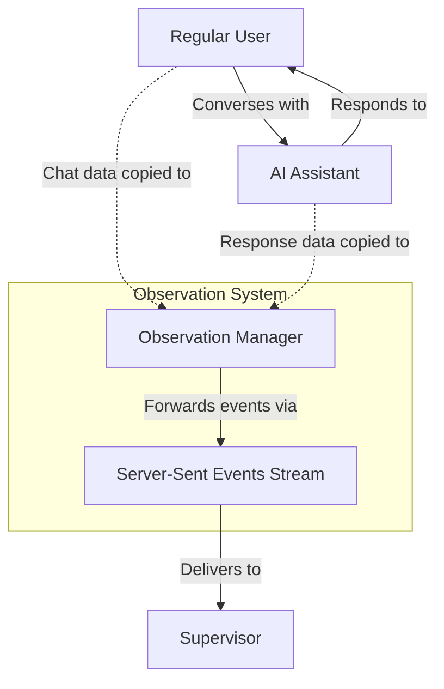
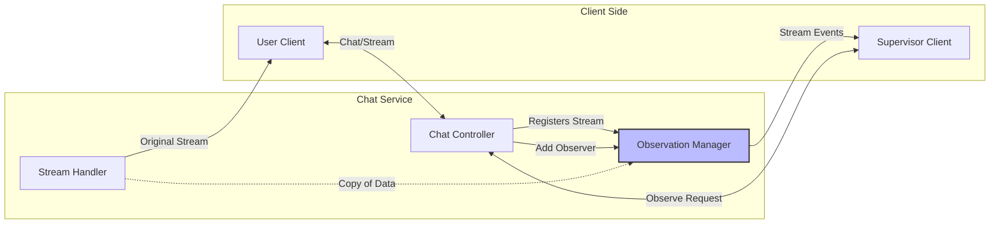
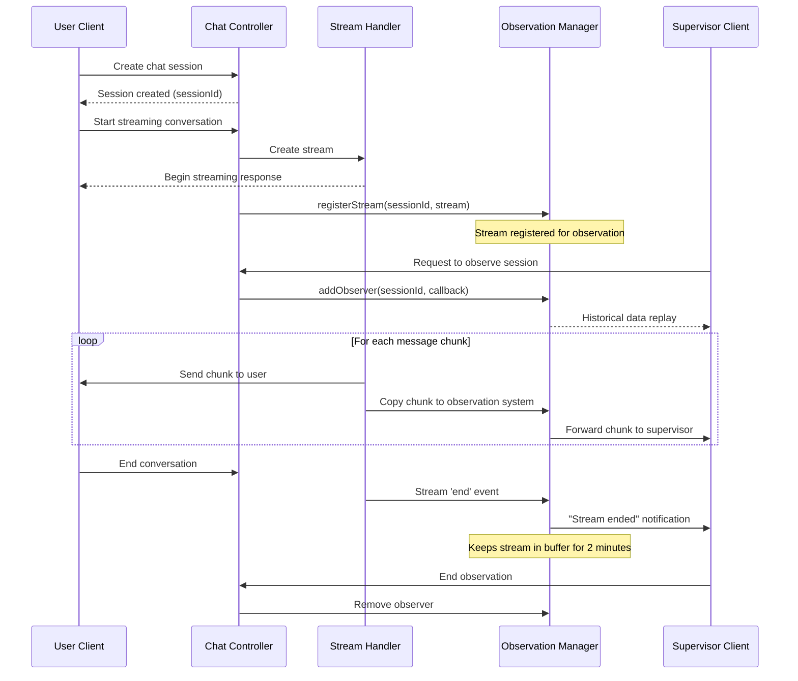
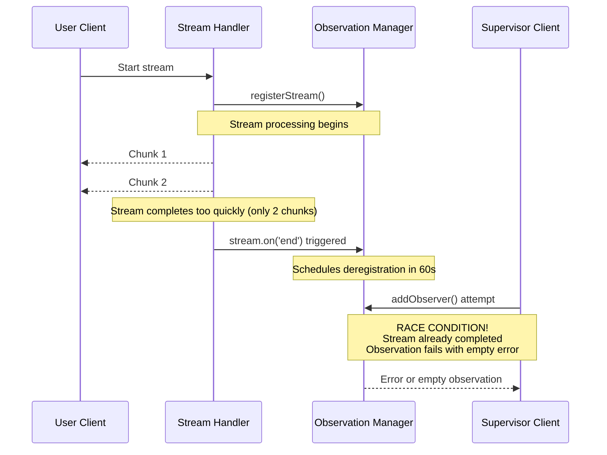
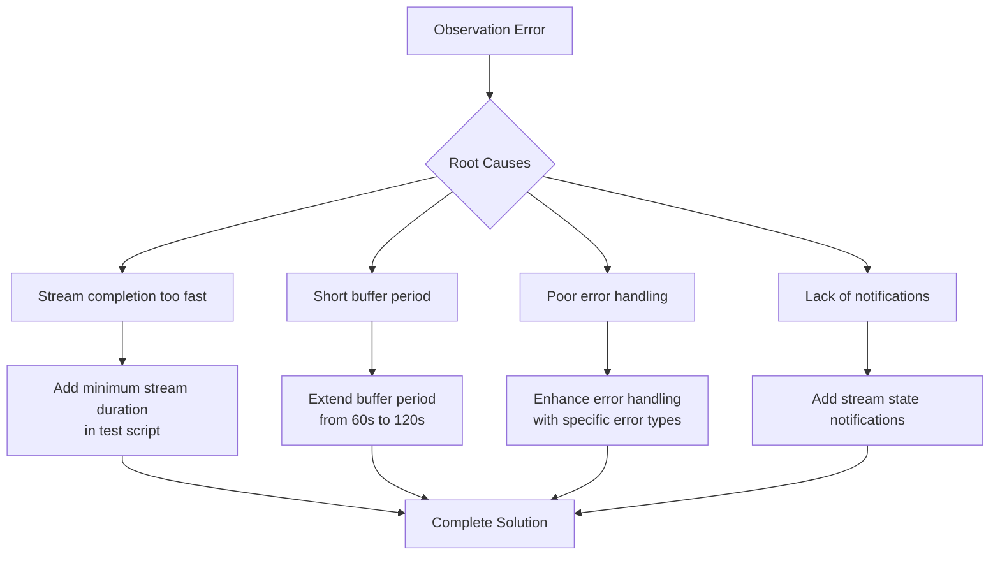
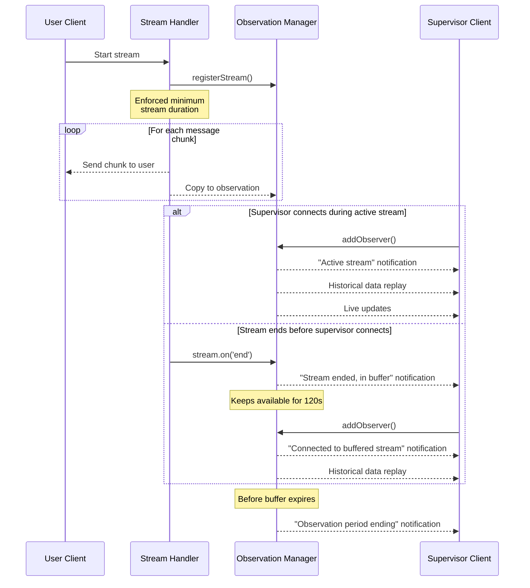

# Understanding the Observation Feature

## Introduction

The Observation Feature is a powerful monitoring mechanism implemented in the chat service that allows supervisors to observe ongoing conversations between users and the AI assistant in real-time. This document explains what the feature is, how it works, why it's valuable, and how we solved a critical race condition bug that was affecting its reliability.

## What is the Observation Feature?

At its core, the Observation Feature enables designated users with supervisor privileges to "look over the shoulder" of regular users during their chat sessions with the AI assistant. This happens in real-time through Server-Sent Events (SSE) streams, without interrupting or alerting the user being observed.



## How Does It Work?

The observation system uses a publish-subscribe pattern to distribute chat events to authorized supervisors.

### System Architecture



### Sequence of Events



## Key Components

### 1. Observation Manager

This singleton class is the heart of the observation system. It manages:
- Active streams for observation
- Registered observers
- Stream history buffering
- Stream lifecycle notifications

### 2. Server-Sent Events (SSE)

The system uses SSE technology to establish one-way communication channels from the server to observers. This enables real-time streaming of events without requiring the observer to repeatedly poll for updates.

### 3. History Buffering

When a supervisor begins observing a session that's already in progress, the system provides a replay of recent messages to give context before streaming live updates.

## When and Why Is This Feature Useful?

The Observation Feature serves several important purposes:

### 1. Quality Assurance

Supervisors can monitor AI responses to ensure accuracy, appropriateness, and helpfulness. This helps maintain high standards of service.

### 2. Training and Onboarding

New users can be observed by trainers who can provide feedback on effective interaction with the AI system.

### 3. Troubleshooting

When users report issues, supervisors can observe subsequent sessions to reproduce and diagnose problems in real-time.

### 4. Compliance and Oversight

In regulated industries, this feature enables required oversight of AI interactions to ensure compliance with guidelines and regulations.

### 5. Performance Evaluation

The feature allows evaluation of both AI performance and user engagement patterns to inform system improvements.

## The Race Condition Bug and Its Solution

Our observation feature encountered a critical race condition bug that sometimes prevented supervisors from successfully connecting to active sessions. Let's understand the bug and how we fixed it.

### The Bug: Race Condition in Observation Events



### Root Cause Analysis

We identified several issues contributing to the observation failure:

1. **Stream Duration Too Short**: The stream was completing with only 2 chunks before the supervisor could establish an observation connection.

2. **Inadequate Buffer Period**: The stream was only kept available for observation for 60 seconds after completion, which wasn't long enough.

3. **Poor Error Handling**: When an error occurred during observation, the error message was empty, making debugging difficult.

4. **Lack of Stream State Notifications**: Observers weren't being properly informed about the state of the stream (active, buffered, or unavailable).

### The Solution

We implemented a comprehensive fix addressing all aspects of the problem:



#### 1. Client-Side Fixes

In the test script `test_supervisor_features.py`, we improved:

- **Minimum Stream Duration**: Added code to ensure the stream stays open for at least 10 seconds, giving observers time to connect.

```python
# Ensure minimum stream duration
elapsed = time.time() - start_time
if elapsed < min_duration:
    remaining_time = min_duration - elapsed
    Logger.info(f"Ensuring minimum stream duration, waiting {remaining_time:.1f}s")
    await asyncio.sleep(remaining_time)
```

- **Enhanced Error Handling**: Added comprehensive error handling with specific exception types and clear error messages.

```python
try:
    # Observation code...
except aiohttp.ClientError as e:
    Logger.error(f"Connection error during observation: {type(e).__name__}: {str(e)}")
except asyncio.TimeoutError:
    Logger.warning("Timeout waiting for observation event, retrying...")
except Exception as e:
    Logger.error(f"Error reading observation events: {type(e).__name__}: {str(e)}")
```

#### 2. Server-Side Fixes

In the `observation.service.ts` file, we enhanced:

- **Extended Buffer Time**: Increased the stream buffer time from 60 seconds to 120 seconds.

```typescript
private streamBufferTime: number = 120000; // 2 minutes (increased from 1 minute)
```

- **Stream End Notifications**: Added notifications to observers when the stream ends but is still available, and before the observation period expires.

```typescript
// Notify observers that stream has ended but observation continues
this.eventEmitter.emit(`stream:${sessionId}`, `event: info\ndata: ${JSON.stringify({
  message: "Original stream ended, remaining in observation buffer",
  timestamp: new Date().toISOString()
})}\n\n`);
```

- **Better Stream State Handling**: Improved the `addObserver` method to detect different stream states and handle them appropriately.

```typescript
// Check if stream is in buffer period (completed but still available)
if (!isActive && isBuffered) {
  logger.info(`Observer connected to completed stream in buffer period: ${sessionId}`);
  callback(`event: info\ndata: ${JSON.stringify({
    message: 'Connected to recently completed stream in buffer period',
    sessionId: sessionId,
    timestamp: new Date().toISOString()
  })}\n\n`);
}
```

## Improved Observation Flow After Fix



## Conclusion

The Observation Feature is a powerful tool that enables real-time monitoring of chat sessions for quality assurance, training, troubleshooting, and compliance purposes. By fixing the race condition bug through comprehensive client and server-side improvements, we've made the feature more robust and reliable.

The key lessons from this bug fix are:

1. **Race conditions** in asynchronous systems require careful timing management
2. **Buffer periods** should be generous enough to account for real-world network and processing delays
3. **Clear error messages** are crucial for effective debugging
4. **State notifications** help clients understand what's happening in the system

These improvements ensure that supervisors can reliably observe chat sessions, whether they're actively ongoing or recently completed, enhancing the overall quality and reliability of the chat service.