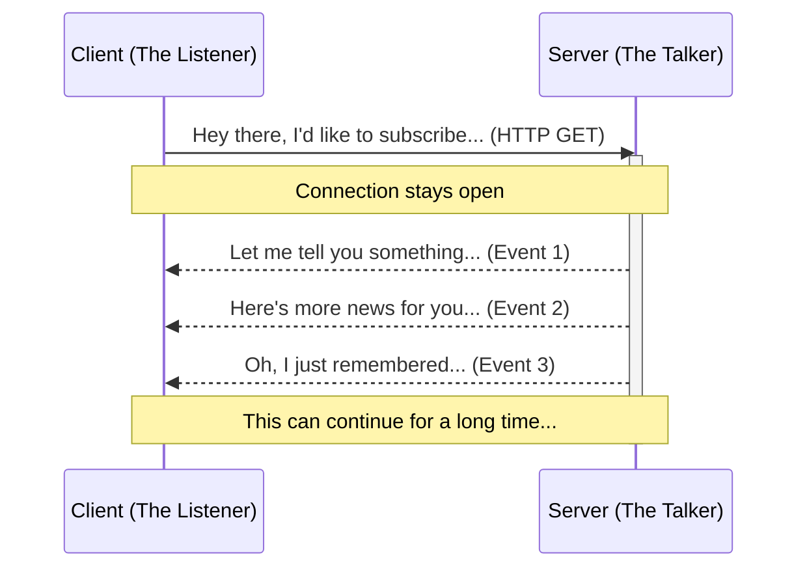
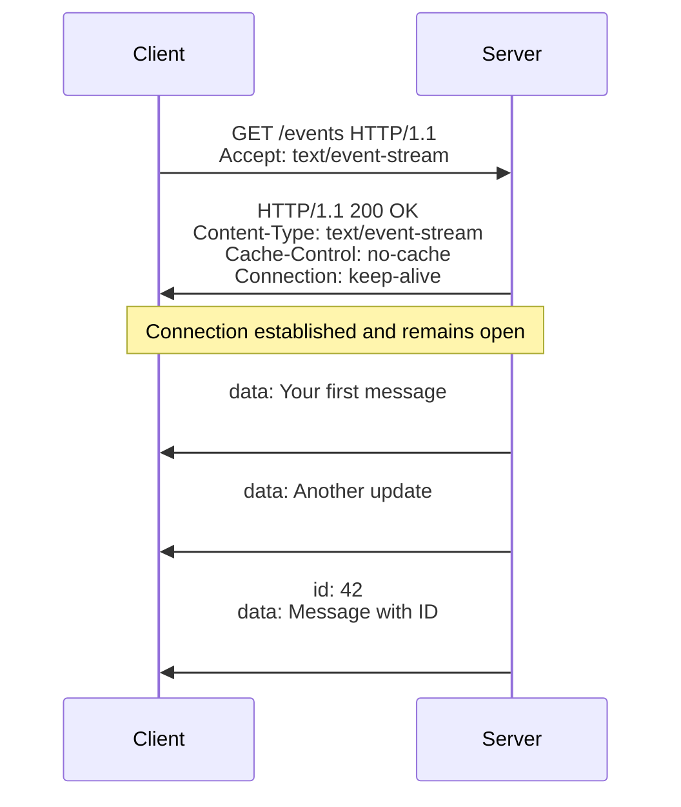
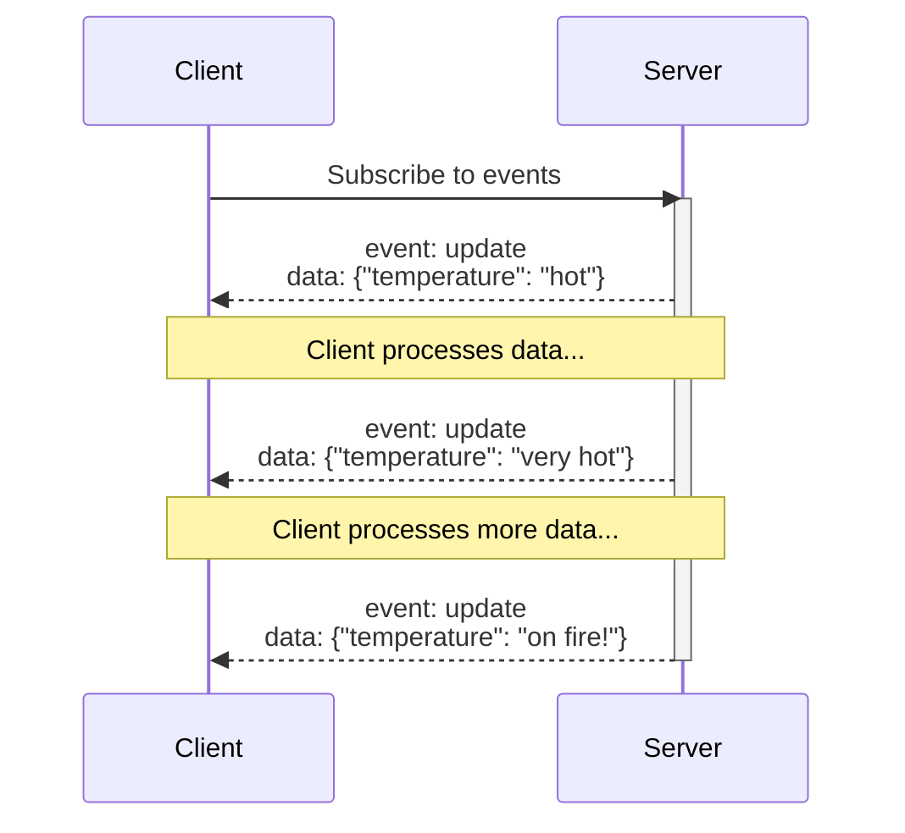

# Server-Sent Events (SSE): The Hot, One-Way Relationship

Imagine Server-Sent Events as that irresistibly attractive partner who just *loves* to talk, constantly sending you messages, while you simply sit back and listen. Unlike the back-and-forth conversation of a regular relationship (or traditional HTTP), SSE is all about the server doing the talking.

Let me illustrate this seductive technology with some diagrams!

## The Basic SSE Relationship

## What Makes SSE So Attractive?

SSE is like that alluring person who:

- Keeps the conversation going (persistent connection)
- Is low-maintenance (simple HTTP, no special protocols)
- Knows when you're not listening (automatic reconnection)
- Remembers where they left off (event IDs for resuming)

## The SSE Courtship Dance

## The Passionate One-Way Conversation

In a typical HTTP relationship, things get hot and heavy but end quickly - request, response, disconnect. But SSE keeps that connection open and flowing, like a passionate monologue where the server whispers sweet nothings (or important data updates) into the client's ear.

## When to Have This Kind of Relationship

SSE is perfect for situations like:

- Stock tickers constantly updating with new prices
- News feeds that need fresh stories
- Live sports scores updating in real-time
- Notification systems that push alerts

The best part about SSE is its simplicity. Unlike the more complex WebSockets (which is like a demanding two-way relationship), SSE knows its role and performs it well - delivering a steady stream of updates without asking for anything in return.
