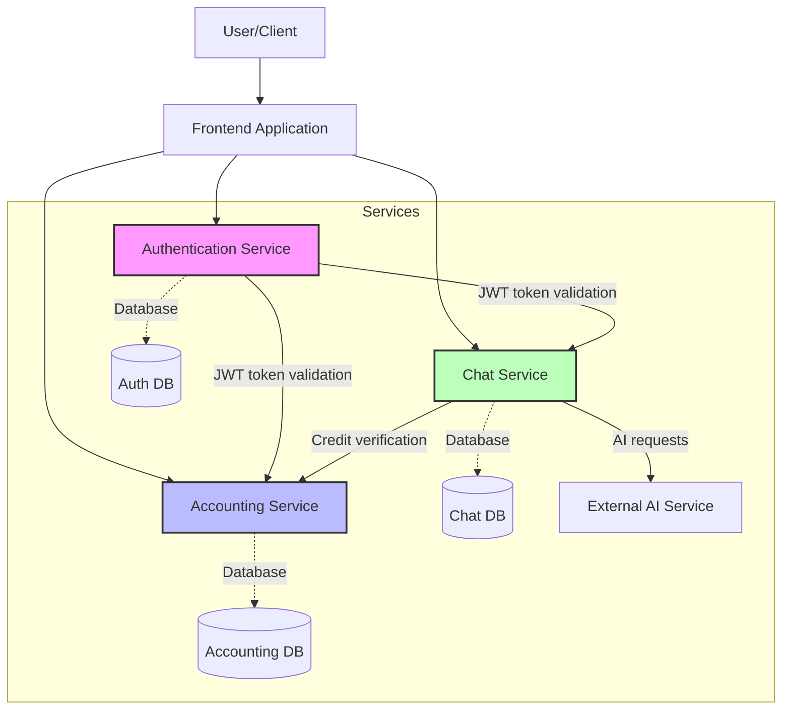
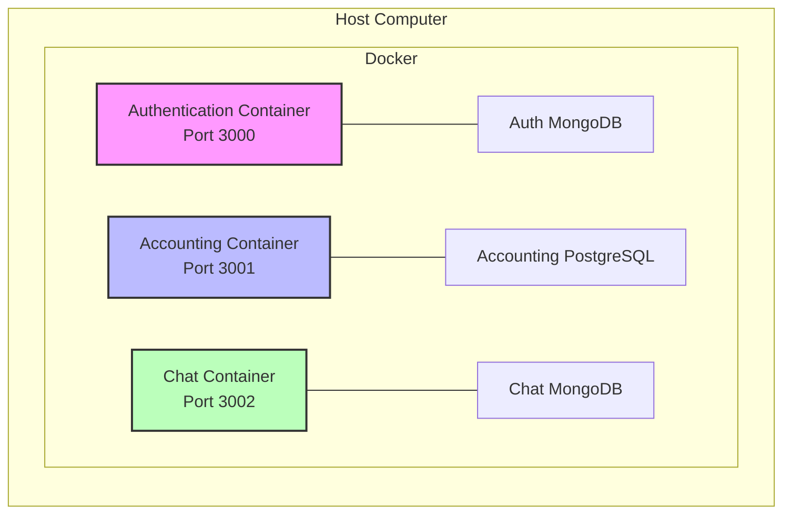
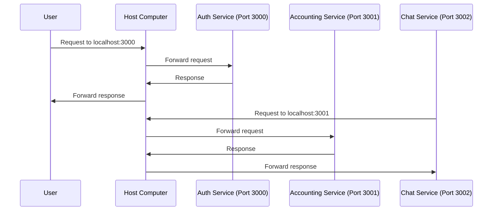
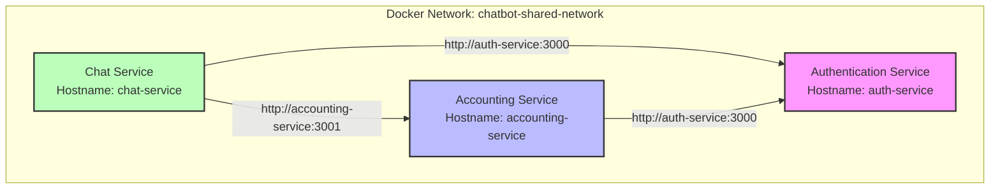
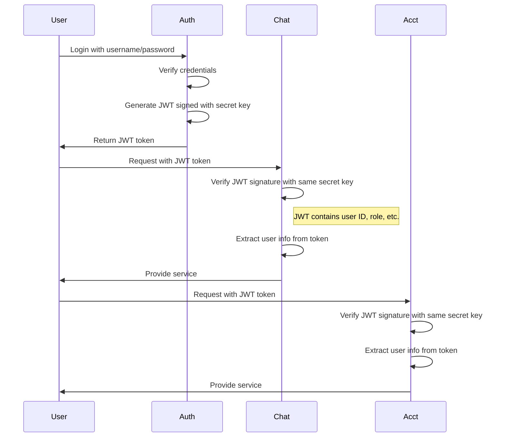
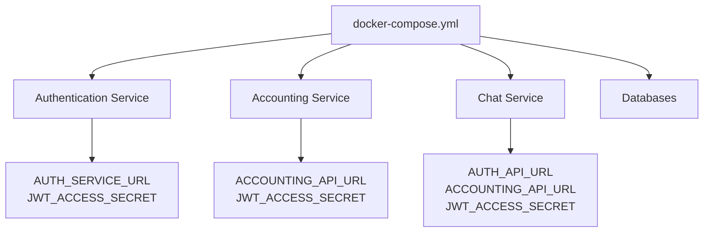
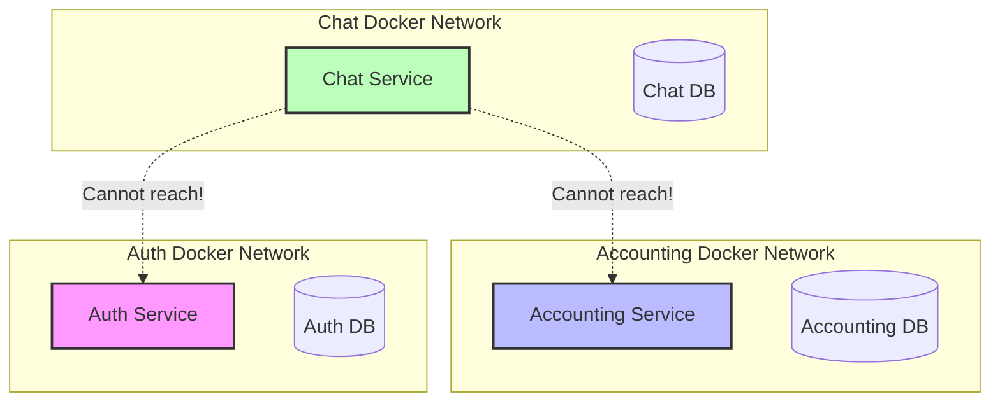
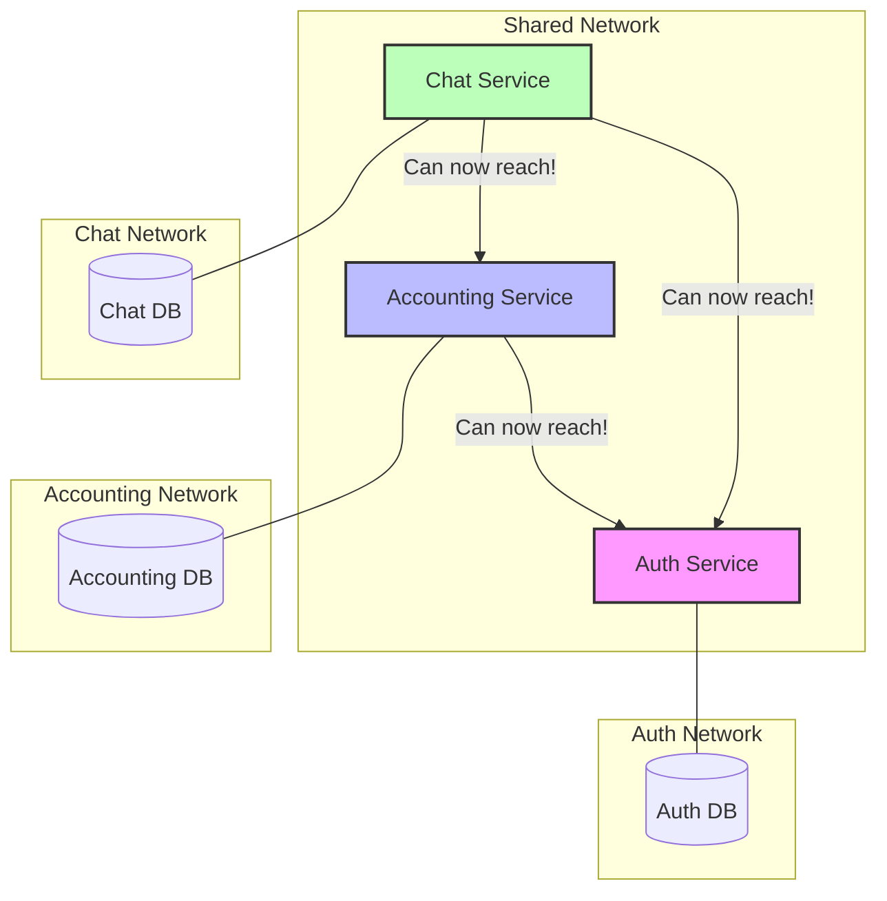
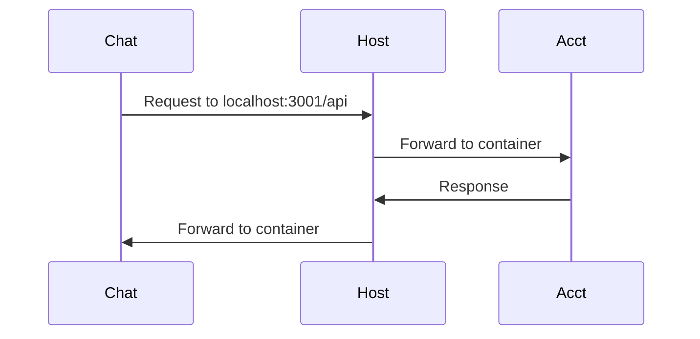
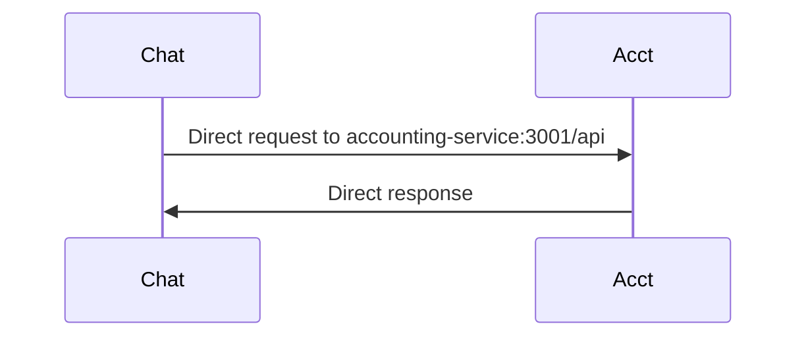

# Understanding Microservices Communication with Docker

This guide explains how our services communicate with each other using Docker, with diagrams and explanations aimed at beginners who are new to deployment concepts.

## What We've Built: The Big Picture

We've created a system with three main services that work together:

1. **Authentication Service** - Manages user accounts, login, and security tokens
2. **Accounting Service** - Tracks credits, manages transactions, and handles billing
3. **Chat Service** - Provides AI chat functionality using external AI models



## What is Docker?

Docker is like a shipping container for software. Just like shipping containers standardize how goods are transported regardless of what's inside them, Docker containers standardize how software runs regardless of the underlying system.

### Key Docker Concepts:

1. **Container**: A lightweight, standalone package that contains everything needed to run a piece of software, including code, runtime, libraries, and settings.

2. **Image**: A template used to create containers. Think of it as a snapshot of your application and all its dependencies.

3. **Dockerfile**: A text file with instructions for building a Docker image, similar to a recipe.

4. **Docker Compose**: A tool for defining and running multi-container applications (which is what we're using).

## How Our Services Are Packaged in Docker

Each of our services runs in its own Docker container:



## How Docker Containers Communicate

Docker containers can communicate in two main ways:

### 1. Through Exposed Ports (Host Network)

In development, we expose each service's port to the host computer, allowing them to communicate through "localhost":



In this model:
- Each service exposes a port to the host (3000, 3001, 3002)
- Services communicate by making HTTP requests to localhost:PORT
- Simple but not ideal for production (less secure, depends on port mapping)

### 2. Through Docker Networks (Container Networking)

In production, services communicate directly through a shared Docker network:



In this model:
- Services connect to each other using service names as hostnames
- Communication is direct within the Docker network
- More secure and better suited for production environments

## JWT Authentication Between Services

Our services don't share databases directly. Instead, they use JWT (JSON Web Tokens) to securely pass user information:



Key points:
- The JWT secret key is shared between services (environment variable)
- Services never query each other's databases directly
- User identity and permissions are extracted from the validated JWT

## Docker Compose: Orchestrating Multiple Services

Docker Compose is a tool that helps us define and manage multiple Docker containers:



The docker-compose.yml files contain:
- Which services to run
- Environment variables for configuration
- Network settings
- Volume mounts for persistent data

## Our Communication Issues and Solution

In our original setup, services were in isolated networks:



The solution was to create a shared network:



## Updating Docker Compose Files to Enable Communication

We modified two Docker Compose files:

1. **Chat Service's docker-compose.yml**:
```yaml
networks:
  chatbot-network:    # Internal network for chat service components
    driver: bridge
  chatbot-shared-network:    # Shared network that connects all services
    name: chatbot-shared-network    # Network name for other services to reference
    driver: bridge    # Network type
```

2. **Accounting Service's docker-compose.yml**:
```yaml
networks:
  accounting-network:    # Internal network for accounting components
    driver: bridge
  chatbot-shared-network:    # Reference to the shared network
    external: true    # Indicates this network is created elsewhere
```

The "external: true" tag indicates that the accounting service expects this network to already exist, while the chat service is responsible for creating it.

## Starting the Services in the Right Order

Because of the network dependencies, services should be started in this order:

1. First, start the chat service (creates the shared network):
```bash
cd services/chat-service
docker-compose up -d
```

2. Next, start the accounting service (joins the existing network):
```bash
cd services/accounting-service
docker-compose up -d
```

3. Finally, start the authentication service (also joins the network).

## Environment Variables for Service Communication

Each service is configured with environment variables that tell it how to find the other services:

- **Chat Service**:
```
AUTH_API_URL=http://auth-service:3000/api
ACCOUNTING_API_URL=http://accounting-service:3001/api
```

- **Accounting Service**:
```
AUTH_SERVICE_URL=http://auth-service:3000
```

- **All services share**:
```
JWT_ACCESS_SECRET=dev_access_secret_key_change_this_in_production
```

## Development vs Production Communication

For simplicity in development, services can communicate through the host machine via localhost:



This works because:
1. Each container exposes its port to the host
2. Containers can reach the host machine
3. The host forwards the request to the appropriate container

For production, a direct container-to-container approach is preferred:



## Summary

We've built a microservices architecture with three main services (Authentication, Accounting, and Chat) that communicate through:

1. HTTP API calls between services
2. JWT tokens for secure user authentication
3. Docker networks for container-to-container communication

By using Docker and microservices:
- Each service can be developed, updated, and scaled independently
- Services maintain their own databases and domain logic
- Communication happens through well-defined APIs
- The system is more resilient and maintainable

Whether services communicate through the host machine (localhost) in development or directly via Docker networks in production, the architecture ensures they can work together seamlessly while remaining independently deployable.