# Understanding Streaming Sessions with IDs

This guide explains what streaming session IDs are, why they're important, and how the two complementary tests work to ensure security in your chat application.

## What are Streaming Session IDs?

Streaming session IDs are unique identifiers that connect two separate operations in a streaming chat interaction:

1. The initial streaming response from the server to the client
2. The final update when the client sends the complete response back to the server

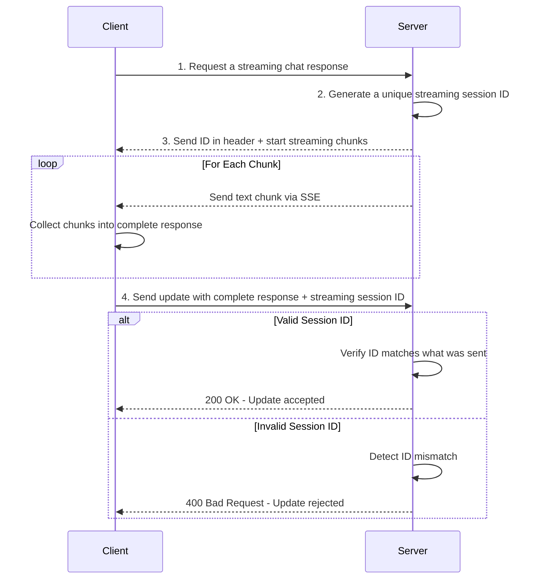
```mermaid
sequenceDiagram
    participant Client
    participant Server
    
    Client->>Server: 1. Request a streaming chat response
    Server->>Server: 2. Generate a unique streaming session ID
    Server-->>Client: 3. Send ID in header + start streaming chunks
    
    loop For Each Chunk
        Server-->>Client: Send text chunk via SSE
        Client->>Client: Collect chunks into complete response
    end
    
    Client->>Server: 4. Send update with complete response + streaming session ID
    
    alt Valid Session ID
        Server->>Server: Verify ID matches what was sent
        Server-->>Client: 200 OK - Update accepted
    else Invalid Session ID
        Server->>Server: Detect ID mismatch
        Server-->>Client: 400 Bad Request - Update rejected
    end
```

## Why Do We Need Streaming Session IDs?

Streaming session IDs solve several critical problems:

### 1. Security: Preventing Unauthorized Updates

Without verification, any client could update any chat session with malicious content:

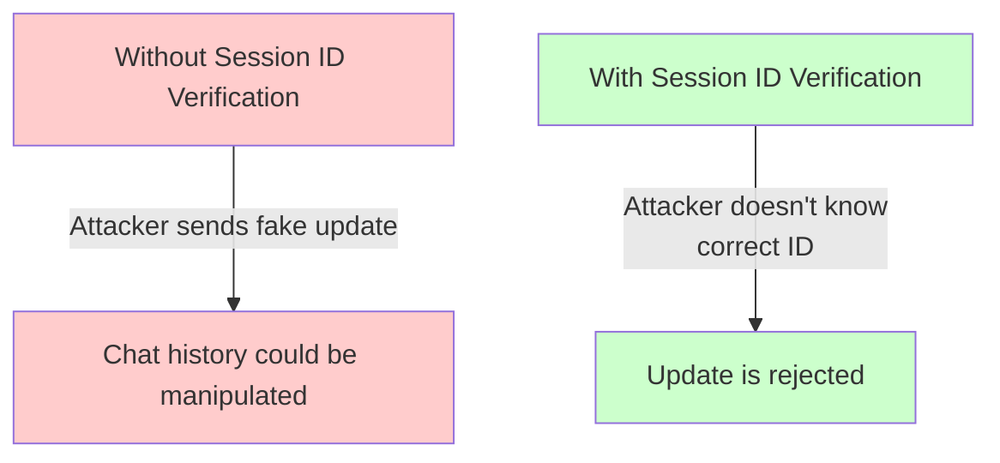
```mermaid
graph TD
    A[Without Session ID Verification] -->|Attacker sends fake update| B[Chat history could be manipulated]
    C[With Session ID Verification] -->|Attacker doesn't know <br> correct ID| D[Update is rejected]
    
    style A fill:#ffcccc
    style B fill:#ffcccc
    style C fill:#ccffcc
    style D fill:#ccffcc
```

### 2. Preventing Race Conditions & Mix-ups

When multiple streaming sessions are happening simultaneously, IDs ensure updates are applied to the correct sessions:

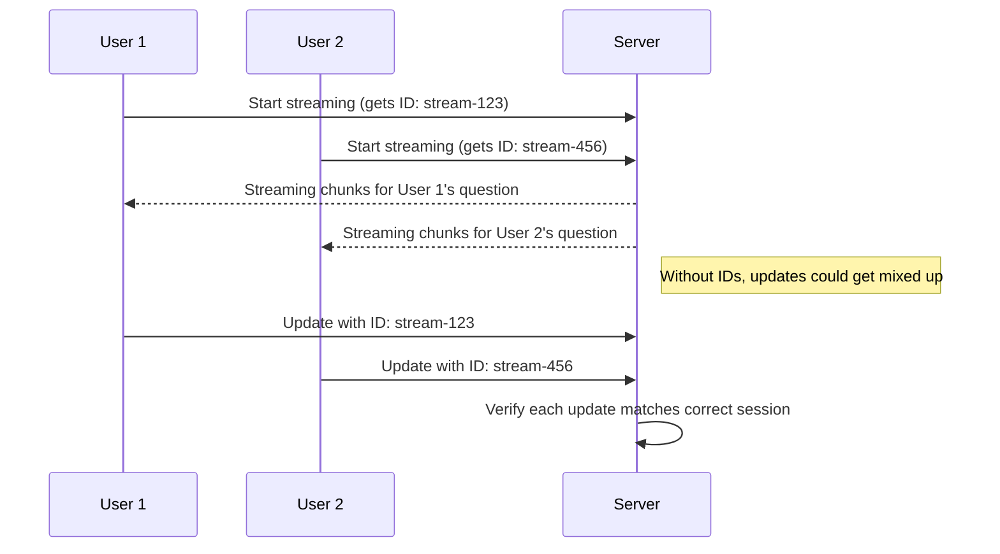
```mermaid
sequenceDiagram
    participant User1 as User 1
    participant User2 as User 2
    participant Server
    
    User1->>Server: Start streaming (gets ID: stream-123)
    User2->>Server: Start streaming (gets ID: stream-456)
    
    Server-->>User1: Streaming chunks for User 1's question
    Server-->>User2: Streaming chunks for User 2's question
    
    Note right of Server: Without IDs, updates could get mixed up
    
    User1->>Server: Update with ID: stream-123
    User2->>Server: Update with ID: stream-456
    
    Server->>Server: Verify each update matches correct session 
```

### 3. Billing and Resource Tracking

Streaming session IDs help track resource usage for billing purposes:

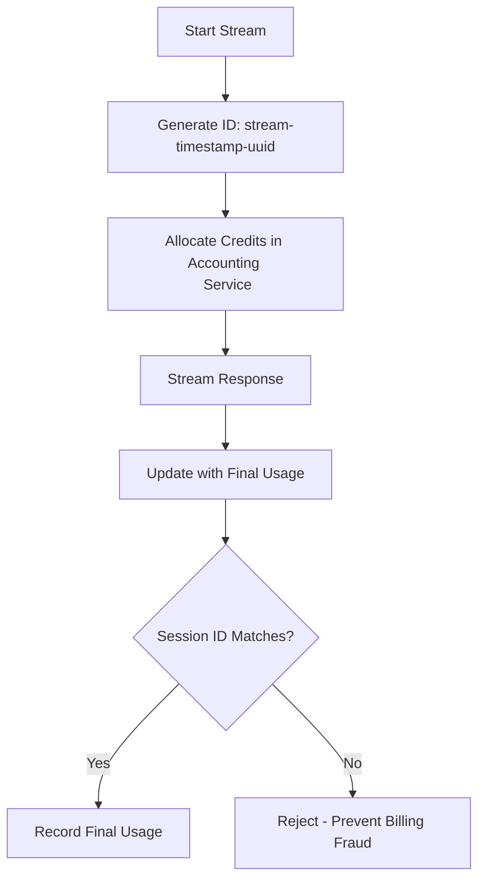
```mermaid
flowchart TD
    A[Start Stream] --> B[Generate ID: stream-timestamp-uuid]
    B --> C[Allocate Credits in Accounting <br> Service]
    C --> D[Stream Response]
    D --> E[Update with Final Usage]
    E --> F{Session ID Matches?}
    F -->|Yes| G[Record Final Usage]
    F -->|No| H[Reject - Prevent Billing Fraud]
```

## How Session IDs Work in the Chat Service

Here's a detailed flow of how streaming session IDs are used in the chat service:

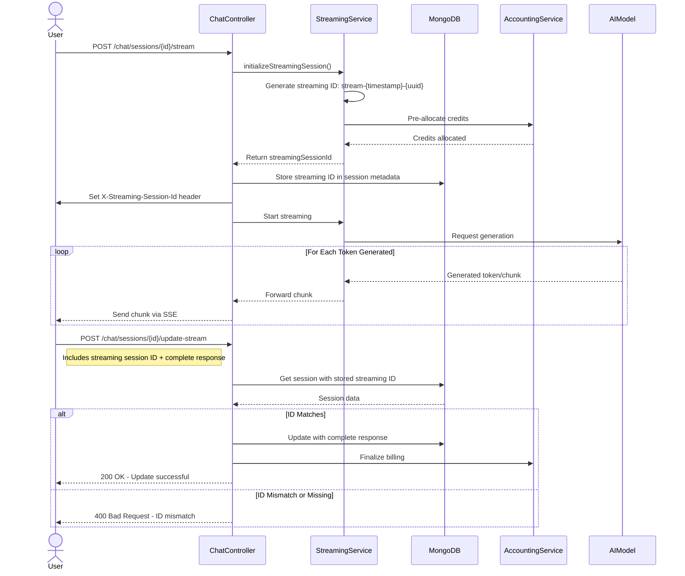
```mermaid
sequenceDiagram
    actor User
    participant ChatController
    participant StreamingSvc as StreamingService
    participant MongoDB
    participant AccountingSvc as AccountingService
    participant AIModel
    
    User->>ChatController: POST /chat/sessions/{id}/stream
    ChatController->>StreamingSvc: initializeStreamingSession()
    StreamingSvc->>StreamingSvc: Generate streaming ID: stream-{timestamp}-{uuid}
    StreamingSvc->>AccountingSvc: Pre-allocate credits
    AccountingSvc-->>StreamingSvc: Credits allocated
    StreamingSvc-->>ChatController: Return streamingSessionId
    
    ChatController->>MongoDB: Store streaming ID in session metadata
    ChatController->>User: Set X-Streaming-Session-Id header
    
    ChatController->>StreamingSvc: Start streaming
    StreamingSvc->>AIModel: Request generation
    
    loop For Each Token Generated
        AIModel-->>StreamingSvc: Generated token/chunk
        StreamingSvc-->>ChatController: Forward chunk
        ChatController-->>User: Send chunk via SSE
    end
    
    User->>ChatController: POST /chat/sessions/{id}/update-stream
    Note right of User: Includes streaming session ID + complete response
    
    ChatController->>MongoDB: Get session with stored streaming ID
    MongoDB-->>ChatController: Session data
    
    alt ID Matches
        ChatController->>MongoDB: Update with complete response
        ChatController->>AccountingSvc: Finalize billing
        ChatController-->>User: 200 OK - Update successful
    else ID Mismatch or Missing
        ChatController-->>User: 400 Bad Request - ID mismatch
    end
```

## The Race Condition Challenge

One special challenge with streaming session IDs is handling race conditions, where the client might send the update before the server has stored the ID in the database:

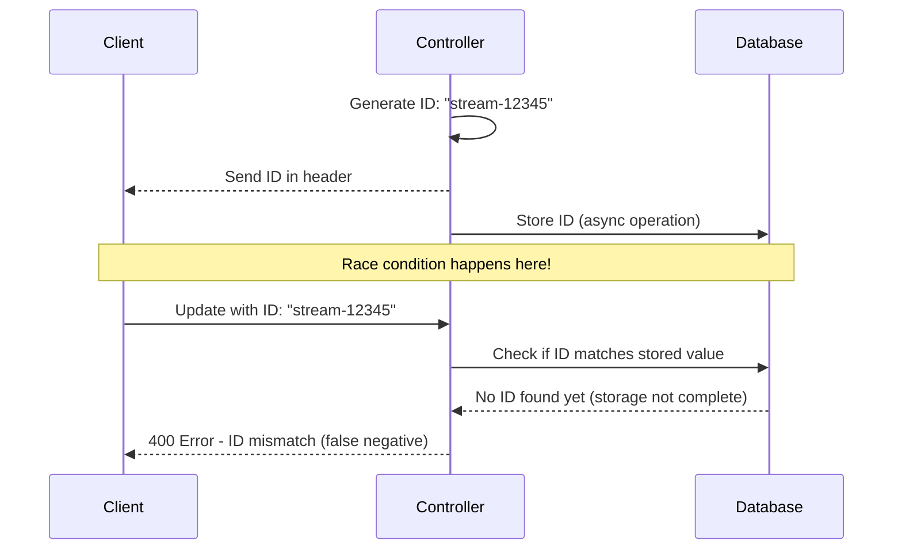
```mermaid
sequenceDiagram
    participant Client
    participant Controller
    participant Database
    
    Controller->>Controller: Generate ID: "stream-12345"
    Controller-->>Client: Send ID in header
    Controller->>Database: Store ID (async operation)
    
    Note over Client,Database: Race condition happens here!
    
    Client->>Controller: Update with ID: "stream-12345"
    Controller->>Database: Check if ID matches stored value
    Database-->>Controller: No ID found yet (storage not complete)
    Controller-->>Client: 400 Error - ID mismatch (false negative)
```

This is why the code includes:

1. Retries with backoff in the client
2. Special handling for first-time IDs on the server

## Understanding the Two Complementary Tests

The two tests validate different security aspects of the streaming session ID system:

### Test 1: Correct Session ID Test

Tests that legitimate clients can successfully update their streaming sessions:

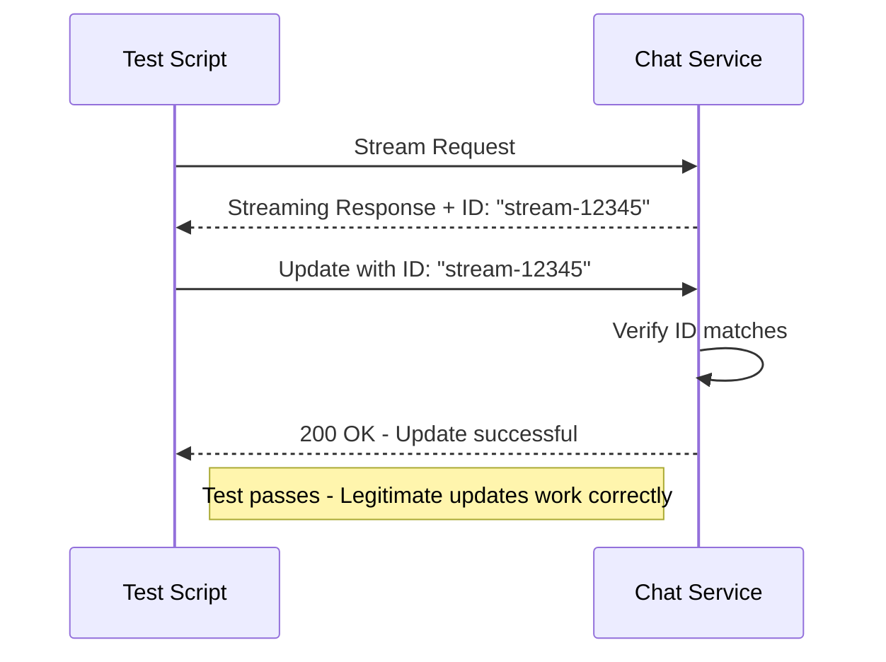
```mermaid
sequenceDiagram
    participant Test as Test Script
    participant Server as Chat Service
    
    Test->>Server: Stream Request
    Server-->>Test: Streaming Response + ID: "stream-12345"
    
    Test->>Server: Update with ID: "stream-12345"
    Server->>Server: Verify ID matches
    Server-->>Test: 200 OK - Update successful
    
    Note right of Test: Test passes - Legitimate updates work correctly
```

### Test 2: Incorrect Session ID Test

Tests that invalid or forged IDs are properly rejected:

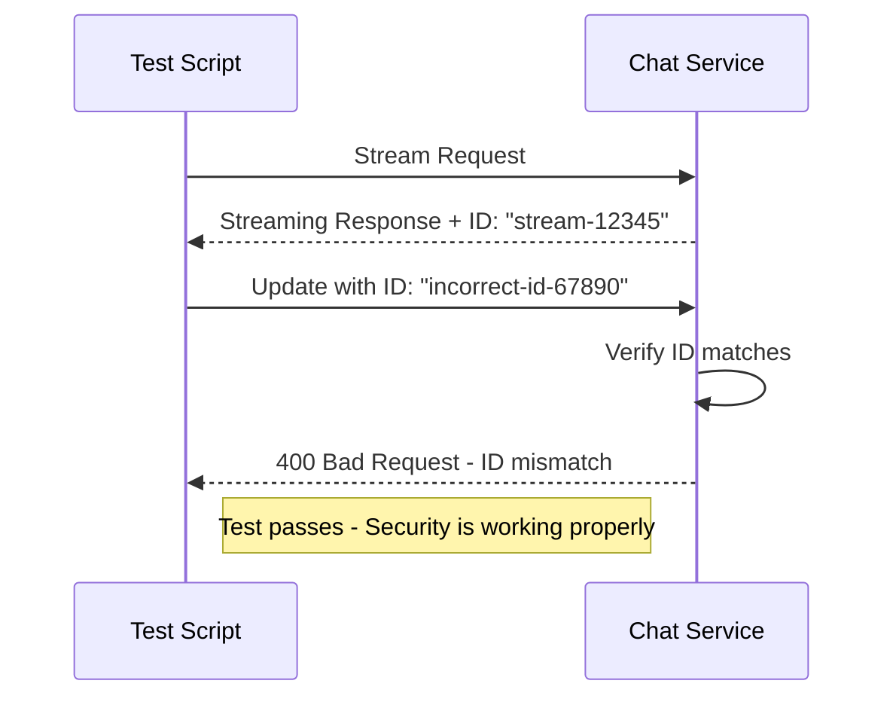
```mermaid
sequenceDiagram
    participant Test as Test Script
    participant Server as Chat Service
    
    Test->>Server: Stream Request 
    Server-->>Test: Streaming Response + ID: "stream-12345"
    
    Test->>Server: Update with ID: "incorrect-id-67890"
    Server->>Server: Verify ID matches
    Server-->>Test: 400 Bad Request - ID mismatch
    
    Note right of Test: Test passes - Security is working properly
```

## Why Both Tests Complement Each Other

These two tests validate the system from both sides:

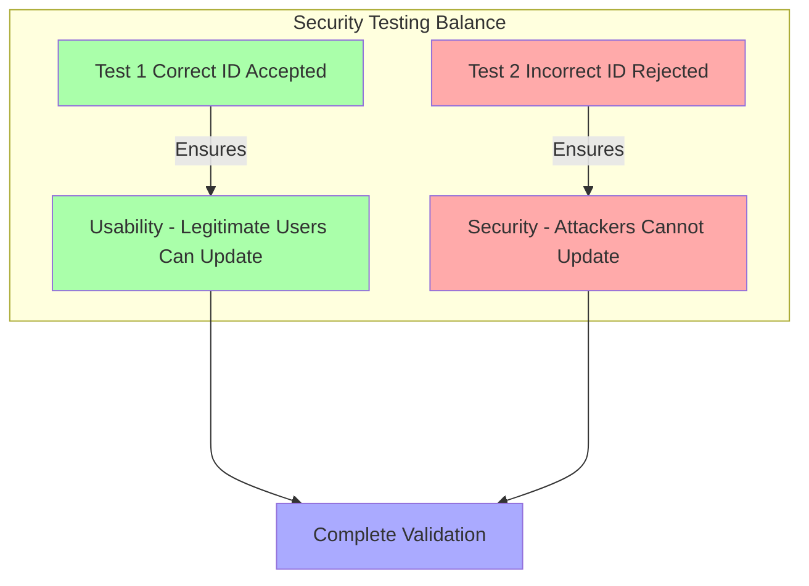
```mermaid
graph TD
    subgraph "Security Testing Balance"
        A[Test 1 Correct ID Accepted] -->|Ensures| B[Usability - Legitimate Users Can Update]
        C[Test 2 Incorrect ID Rejected] -->|Ensures| D[Security - Attackers Cannot Update]
    end
    
    B ----> E[Complete Validation]
    D ----> E
    
    style A fill:#aaffaa
    style B fill:#aaffaa
    style C fill:#ffaaaa
    style D fill:#ffaaaa
    style E fill:#aaaaff
```

If only the first test passed but the second test failed:

- Legitimate users could update their chat sessions (good)
- But attackers could also update any chat session (bad security hole)

If only the second test passed but the first test failed:

- Attackers couldn't update chat sessions (good security)
- But legitimate users also couldn't update their own sessions (bad user experience)

## The Security Vulnerability Fixed

The vulnerability that was fixed was in how the server handled cases where no session ID was stored yet:

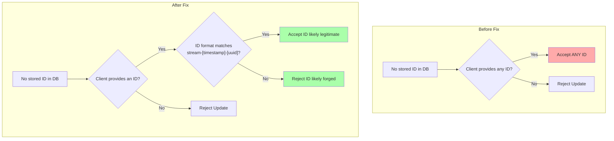
```mermaid
flowchart TB
    subgraph Before Fix
        A[No stored ID in DB] --> B{Client provides any ID?}
        B -->|Yes| C[Accept ANY ID]
        B -->|No| D[Reject Update]
    end
    
    subgraph After Fix
        E[No stored ID in DB] --> F{Client provides an ID?}
        F -->|Yes| G{"ID format matches<br>stream-[timestamp]-[uuid]?"}
        F -->|No| H[Reject Update]
        G -->|Yes| I[Accept ID likely legitimate]
        G -->|No| J[Reject ID likely forged]
    end
    
    style C fill:#ffaaaa
    style I fill:#aaffaa
    style J fill:#aaffaa
```

The improved solution:

1. Still handles race conditions (where DB update is slower than client response)
2. But adds format validation to prevent accepting arbitrary IDs

## Implementation Best Practices

For a robust implementation:

1. **Generate secure IDs**: Use timestamp + random component
2. **Set ID in headers before beginning stream**: Ensures client gets the ID
3. **Store ID in database**: For later verification
4. **Validate strictly**: Match both existence and value of ID
5. **Handle race conditions**: Use retries or format validation
6. **Log failures**: For security monitoring

## Technical Implementation Details

### System Architecture Overview

The chat application consists of three microservices that work together:

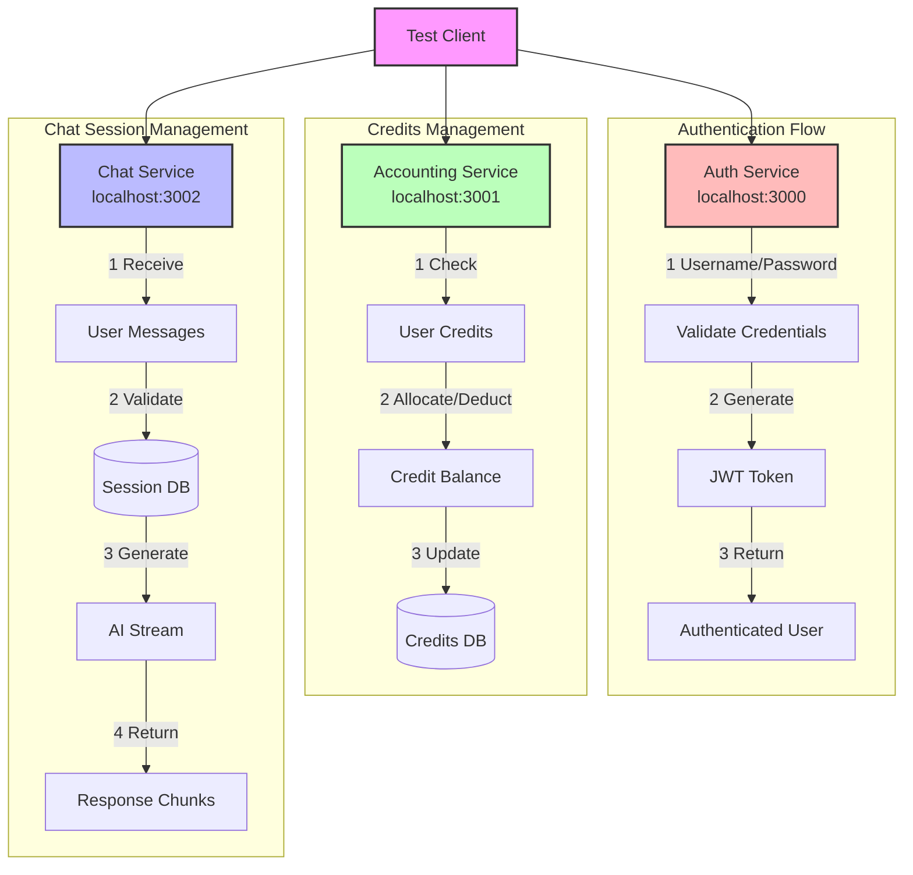
```mermaid
graph TD
    Client[Test Client] --> AuthSvc["Auth Service<br>localhost:3000"]
    Client --> AcctSvc["Accounting Service<br>localhost:3001"]
    Client --> ChatSvc["Chat Service<br>localhost:3002"]
    
    subgraph "Authentication Flow"
        AuthSvc --> |"1 Username/Password"|Validate[Validate Credentials]
        Validate --> |"2 Generate"|Token[JWT Token]
        Token --> |"3 Return"|User[Authenticated User]
    end
    
    subgraph "Credits Management"
        AcctSvc --> |"1 Check"|Credits[User Credits]
        Credits --> |"2 Allocate/Deduct"|Balance[Credit Balance]
        Balance --> |"3 Update"|Database[(Credits DB)]
    end
    
    subgraph "Chat Session Management"
        ChatSvc --> |"1 Receive"|Messages[User Messages]
        Messages --> |"2 Validate"|Sessions[(Session DB)]
        Sessions --> |"3 Generate"|Stream[AI Stream]
        Stream --> |"4 Return"|Response[Response Chunks]
    end

    style Client fill:#f9f,stroke:#333,stroke-width:2px
    style ChatSvc fill:#bbf,stroke:#333,stroke-width:2px
    style AuthSvc fill:#fbb,stroke:#333,stroke-width:2px
    style AcctSvc fill:#bfb,stroke:#333,stroke-width:2px
```

### Complete Test Flow Sequence

When testing streaming session IDs, the following sequence occurs:

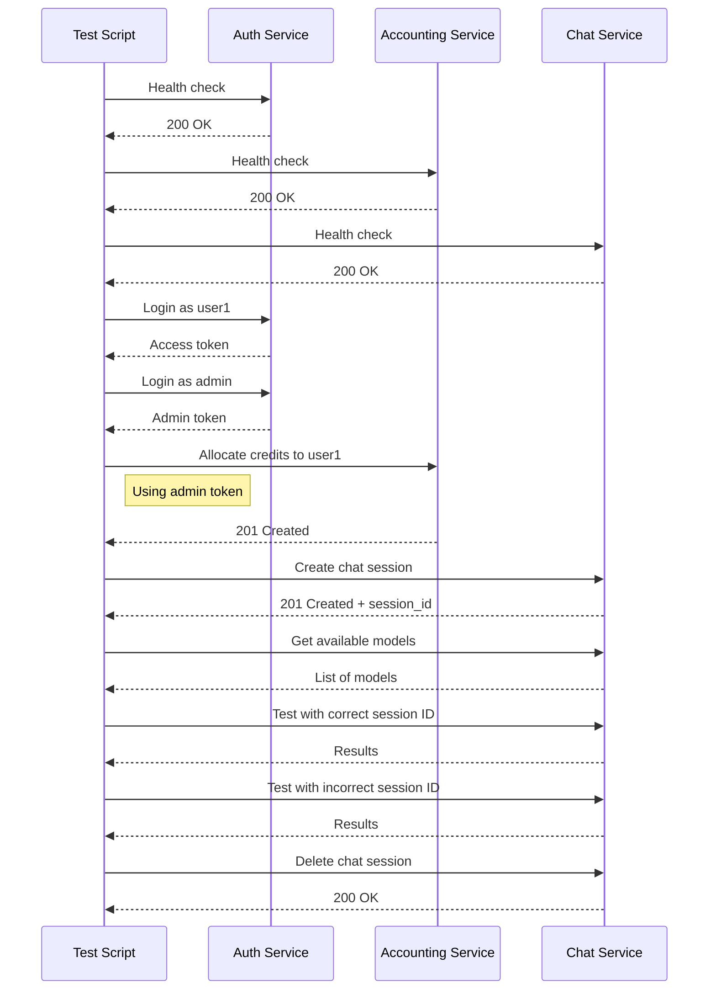
```mermaid
sequenceDiagram
    participant Test as Test Script
    participant Auth as Auth Service
    participant Acct as Accounting Service
    participant Chat as Chat Service
    
    Test->>Auth: Health check
    Auth-->>Test: 200 OK
    
    Test->>Acct: Health check
    Acct-->>Test: 200 OK
    
    Test->>Chat: Health check
    Chat-->>Test: 200 OK
    
    Test->>Auth: Login as user1
    Auth-->>Test: Access token
    
    Test->>Auth: Login as admin
    Auth-->>Test: Admin token
    
    Test->>Acct: Allocate credits to user1
    Note right of Test: Using admin token
    Acct-->>Test: 201 Created
    
    Test->>Chat: Create chat session
    Chat-->>Test: 201 Created + session_id
    
    Test->>Chat: Get available models
    Chat-->>Test: List of models
    
    Test->>Chat: Test with correct session ID
    Chat-->>Test: Results
    
    Test->>Chat: Test with incorrect session ID
    Chat-->>Test: Results
    
    Test->>Chat: Delete chat session
    Chat-->>Test: 200 OK
```

### Server-Sent Events (SSE) In Detail

SSE is a technology used to push updates from the server to client in real-time:

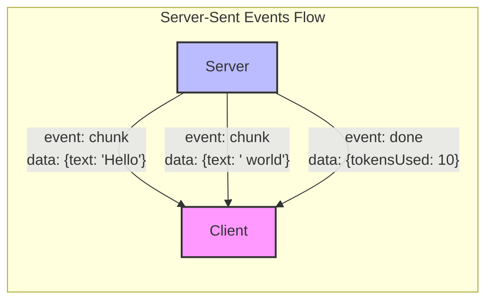
```mermaid
graph LR
    subgraph "Server-Sent Events Flow"
        Client[Client]
        Server[Server]
        Server -->|"event: chunk\ndata: {text: 'Hello'}"| Client
        Server -->|"event: chunk\ndata: {text: ' world'}"| Client
        Server -->|"event: done\ndata: {tokensUsed: 10}"| Client
    end
    
    style Client fill:#f9f,stroke:#333,stroke-width:2px
    style Server fill:#bbf,stroke:#333,stroke-width:2px
```

Each SSE message contains:
- An event type (e.g., "chunk" or "done")
- JSON data with the content or metadata
- Automatic reconnection if the connection drops

## Common Issues and Troubleshooting

When working with streaming session IDs, you might encounter these common issues:

### 1. Header Case Sensitivity Issues

HTTP headers can be case-insensitive in transmission but case-sensitive when accessed in code:

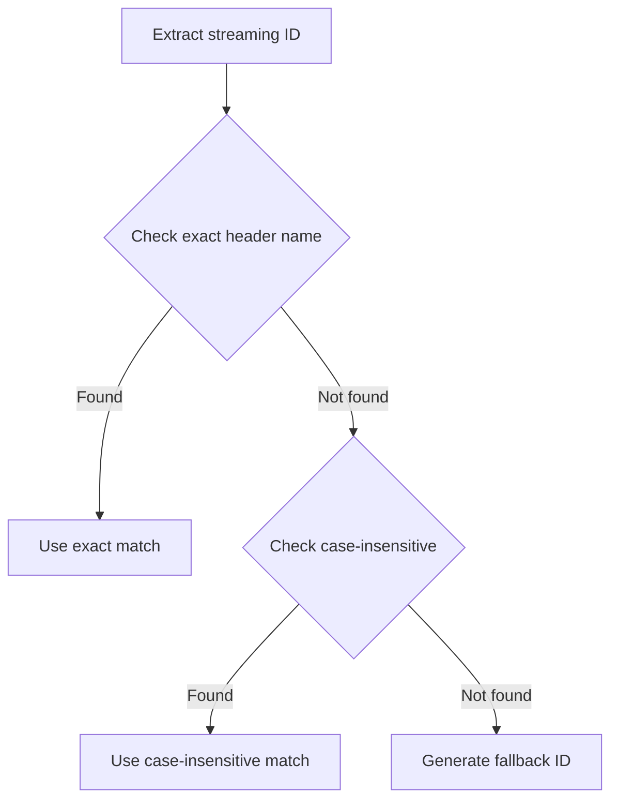
```mermaid
graph TD
    A[Extract streaming ID] --> B{Check exact header name}
    B -->|Found| C[Use exact match]
    B -->|Not found| D{Check case-insensitive}
    D -->|Found| E[Use case-insensitive match]
    D -->|Not found| F[Generate fallback ID]
```

**Solution**: Always check for headers in a case-insensitive manner or standardize header names across your application.

### 2. Race Conditions Between Services

Database operations might not complete before validation requests arrive:

**Solution**: Use these techniques to mitigate:
- Client-side retries with exponential backoff
- Format validation as a fallback mechanism
- Appropriate delays between streaming and updating

### 3. Header Transmission Issues

Some proxies or frameworks might strip custom headers:

**Solution**:
- Ensure CORS is configured to expose custom headers
- Use `Access-Control-Expose-Headers: X-Streaming-Session-Id` in your response
- Test with direct HTTP clients like curl to isolate browser issues

## Error Handling Best Practices

When implementing streaming session ID validation, follow these error handling best practices:

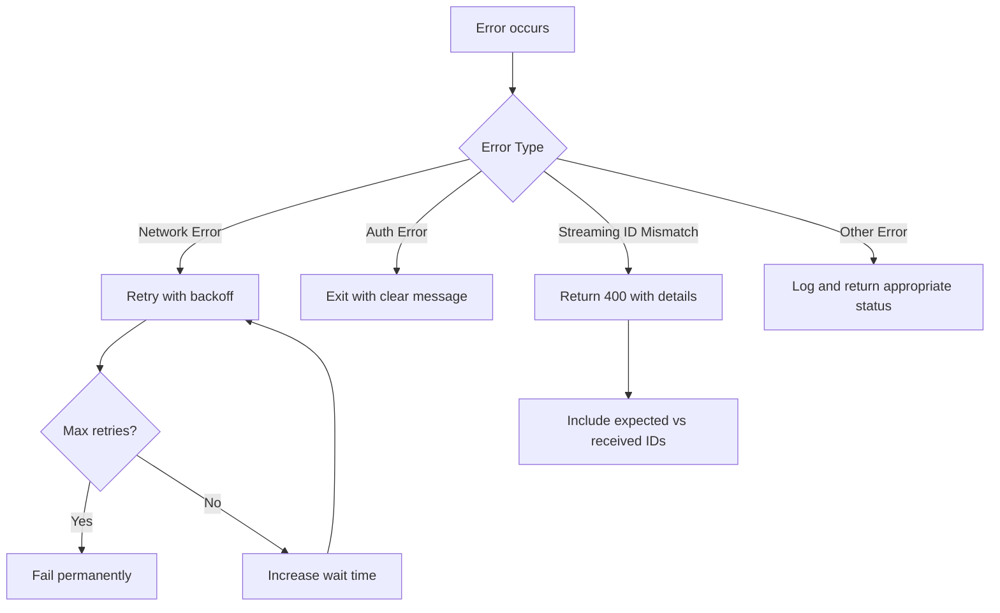
```mermaid
graph TD
    A[Error occurs] --> B{Error Type}
    
    B -->|Network Error| C[Retry with backoff]
    B -->|Auth Error| D[Exit with clear message]
    B -->|Streaming ID Mismatch| E[Return 400 with details]
    B -->|Other Error| F[Log and return appropriate status]
    
    C --> G{Max retries?}
    G -->|Yes| H[Fail permanently]
    G -->|No| I[Increase wait time]
    I --> C
    
    E --> J[Include expected vs received IDs]
```

Providing detailed error messages helps developers understand what went wrong while keeping security information appropriately obscured.

## What Happens Behind the Scenes

This diagram shows the complete flow of data and validation in the streaming system:

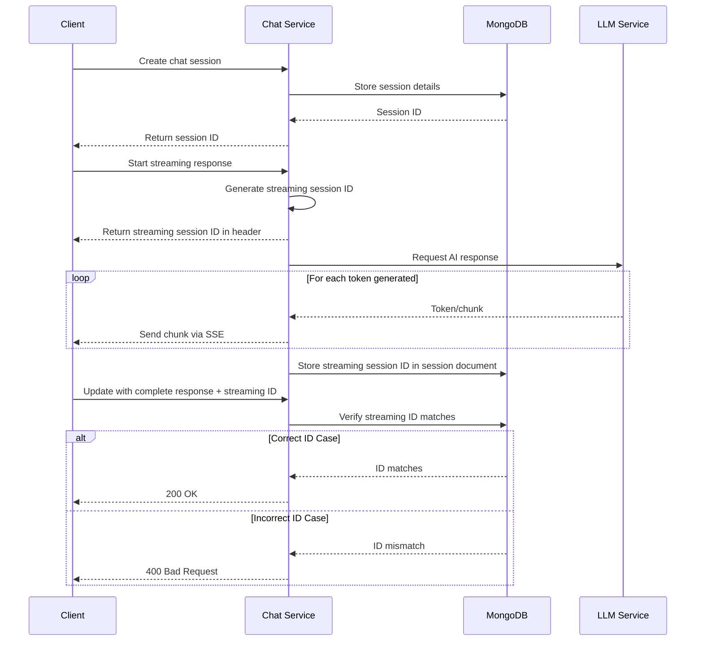
```mermaid
sequenceDiagram
    participant Client
    participant ChatSvc as Chat Service
    participant DB as MongoDB
    participant Model as LLM Service
    
    Client->>ChatSvc: Create chat session
    ChatSvc->>DB: Store session details
    DB-->>ChatSvc: Session ID
    ChatSvc-->>Client: Return session ID
    
    Client->>ChatSvc: Start streaming response
    ChatSvc->>ChatSvc: Generate streaming session ID
    ChatSvc-->>Client: Return streaming session ID in header
    ChatSvc->>Model: Request AI response
    
    loop For each token generated
        Model-->>ChatSvc: Token/chunk
        ChatSvc-->>Client: Send chunk via SSE
    end
    
    ChatSvc->>DB: Store streaming session ID in session document
    
    Client->>ChatSvc: Update with complete response + streaming ID
    ChatSvc->>DB: Verify streaming ID matches
    
    alt Correct ID Case
        DB-->>ChatSvc: ID matches
        ChatSvc-->>Client: 200 OK
    else Incorrect ID Case
        DB-->>ChatSvc: ID mismatch
        ChatSvc-->>Client: 400 Bad Request
    end
```

This behind-the-scenes process shows why having robust streaming session ID validation is critical for maintaining the integrity and security of your chat application.

## Conclusion

Streaming session IDs are a crucial security mechanism for streaming chat applications. The two complementary tests ensure that:

1. Legitimate users can update their chat sessions successfully
2. Attackers or malicious clients cannot forge updates

Both are essential for a system that is both secure and functional. The fix implemented adds format validation to prevent the acceptance of arbitrary IDs while still handling legitimate race conditions.
