# Comprehensive Chat Service Testing Guide

## Table of Contents
1. [Introduction](#introduction)
2. [Prerequisites](#prerequisites)
3. [Test Environment](#test-environment)
4. [Available Test Users](#available-test-users)
5. [Testing Tools](#testing-tools)
6. [Flow Diagrams](#flow-diagrams)
7. [Test Cases](#test-cases)
8. [End-to-End Test Scenario](#end-to-end-test-scenario)
9. [Automated Test Script](#automated-test-script)
10. [Troubleshooting Guide](#troubleshooting-guide)
11. [Monitoring Test Results](#monitoring-test-results)
12. [Conclusion](#conclusion)

## Introduction

This document provides a comprehensive testing guide for the Chat Service, covering all major flows and endpoints. It leverages the existing user accounts from the authentication service and tests integrations with the accounting service.

## Prerequisites

Before testing, ensure the following services are running:

- Authentication Service (`auth-service` container on port 3000 or `http://localhost:3000`)
- Accounting Service (`accounting-service` container on port 3001 or `http://localhost:3001`)
- Chat Service (`chat-service` container on port 3002 or `http://localhost:3002`)
- MongoDB for Chat Service (`mongo` container on port 27018 or `http://localhost:27018`)
- Redis for Chat Service (`redis` container on port 6380 or `http://localhost:6380`)
- Prometheus (`prometheus` container on port 9091 or `http://localhost:9091`)
- Grafana (`grafana` container on port 3003 or `http://localhost:3003`)

## Test Environment

The test environment is set up with the following containers:

- MongoDB for Chat Service: `mongo` (27018)
- Redis for Chat Service: `redis` (6380)
- PostgreSQL for Accounting Service: `postgres` (5432)
- Prometheus for monitoring: `prometheus` (9091)
- Grafana for visualization: `grafana` (3003)

## Available Test Users

```
Admin:
- Username: admin
- Email: admin@example.com
- Password: admin@admin

Supervisors:
- Username: supervisor1
- Email: supervisor1@example.com
- Password: Supervisor1@
- Role: supervisor

- Username: supervisor2
- Email: supervisor2@example.com
- Password: Supervisor2@
- Role: supervisor

Regular Users:
- Username: user1
- Email: user1@example.com
- Password: User1@123
- Role: enduser

- Username: user2
- Email: user2@example.com
- Password: User2@123
- Role: enduser
```

## Testing Tools

- Postman or cURL for API requests
- Web browser for SSE (Server-Sent Events) testing
- WebSocket client for real-time observation testing

## Network Configuration

The services communicate using a shared Docker network. Use service names (e.g., `auth-service`, `accounting-service`, `chat-service`) when running tests inside the Docker network. Alternatively, use `localhost` with the appropriate port mappings when running tests from the host machine. For example:

- Authentication Service: `http://auth-service:3000` or `http://localhost:3000`
- Accounting Service: `http://accounting-service:3001` or `http://localhost:3001`
- Chat Service: `http://chat-service:3002` or `http://localhost:3002`

Ensure the shared network is properly configured in the `docker-compose.yml` files.

## JWT Secret Configuration

Ensure that the JWT secrets match across all services. For example:

- `JWT_ACCESS_SECRET=dev_access_secret_key_change_this_in_production`
- `JWT_REFRESH_SECRET=dev_refresh_secret_key_change_this_in_production`

These secrets must be consistent to allow proper token validation.

## Flow Diagrams

### 1. User Authentication Flow

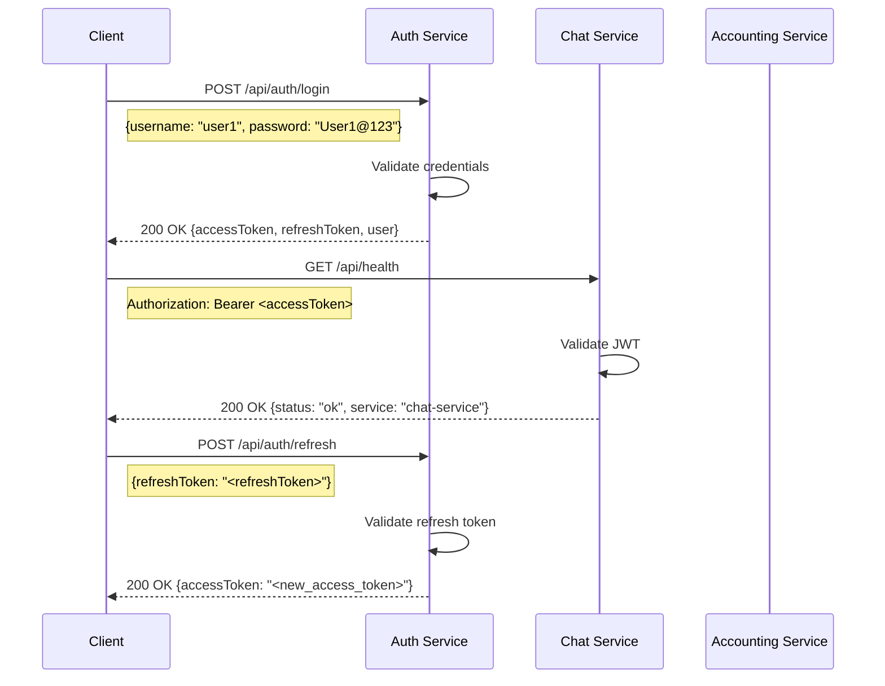

### 2. Chat Session Management Flow

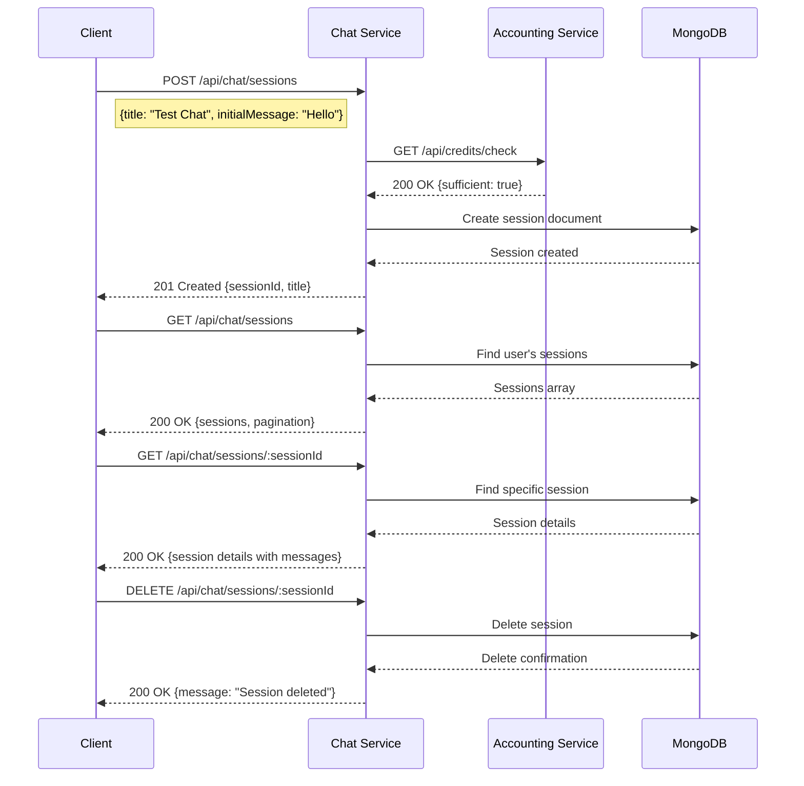

### 3. Non-Streaming Message Flow

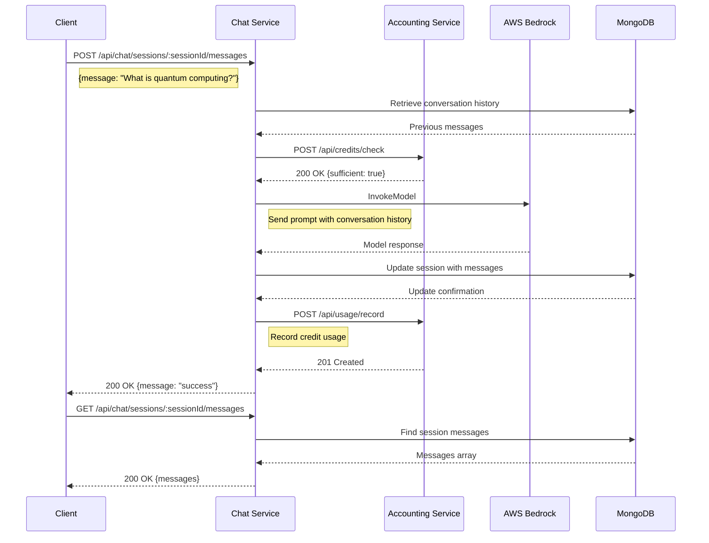

### 4. Streaming Chat Response Flow

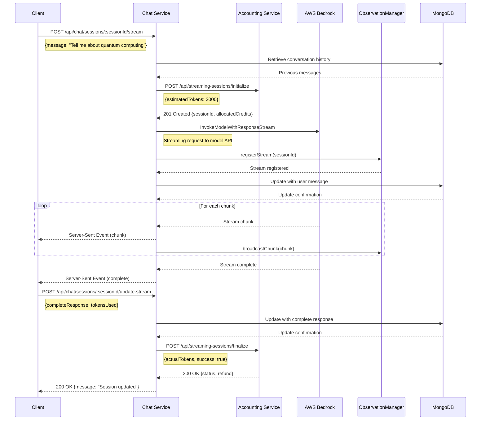

### 5. Model Recommendation Flow

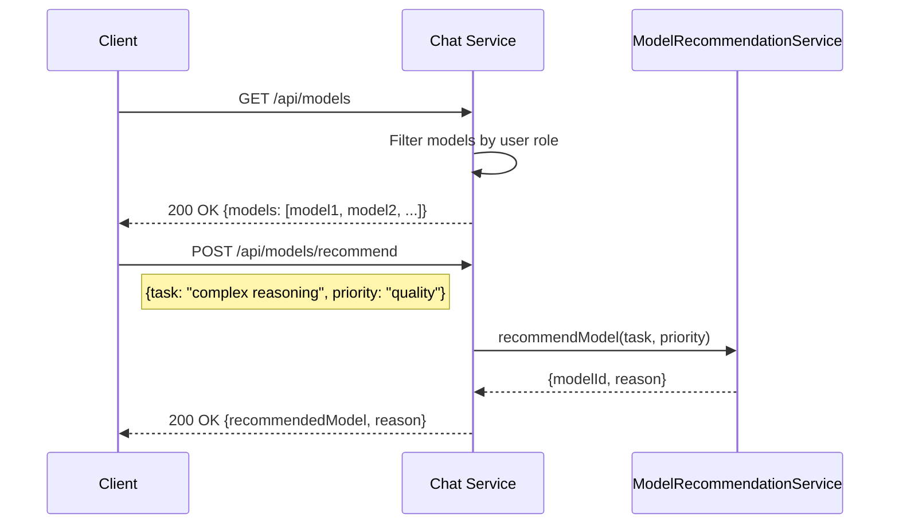

### 6. Supervisor Observation Flow

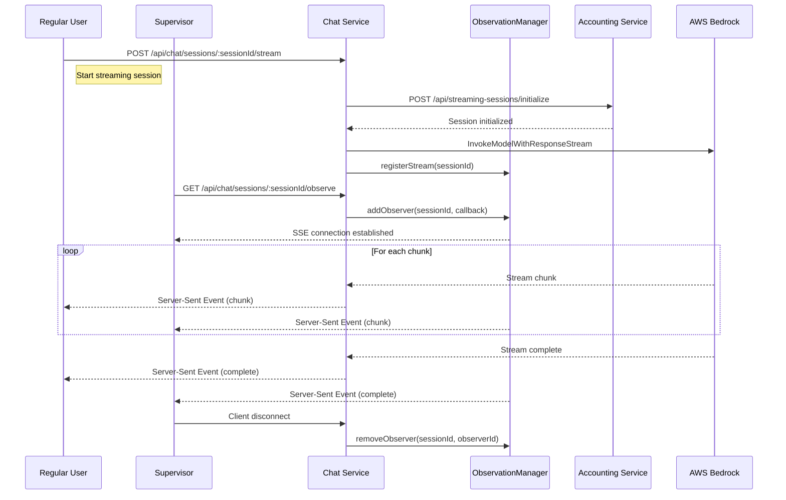

### 7. Insufficient Credits Flow

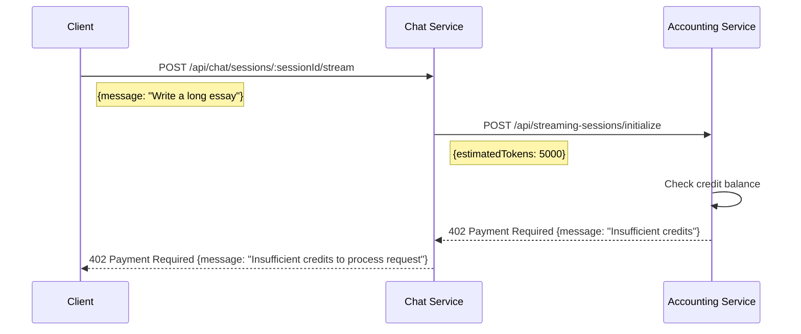

### 8. Admin Credit Allocation Flow

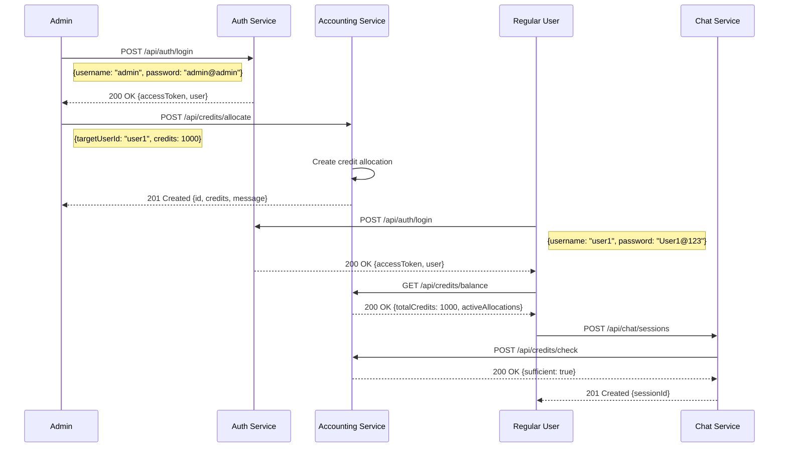

### 9. End-to-End Test Flow

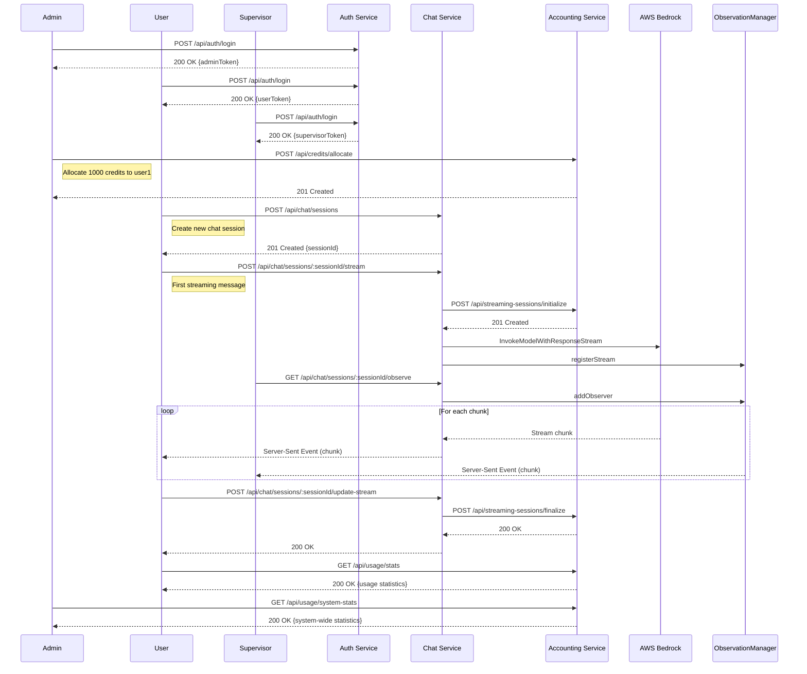

### 10. Rate Limiting Flow

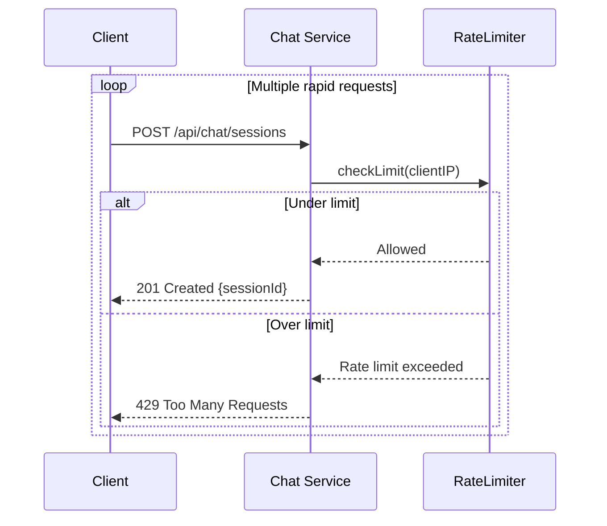

### 11. Invalid Model ID Flow

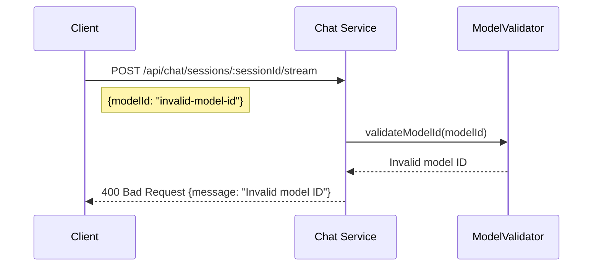

### 12. Service Authentication Failure Flow

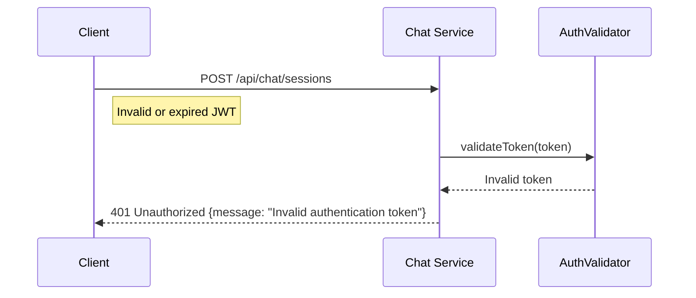

## Test Cases

### 5.1. Authentication Flow Tests

#### TC-01: User Authentication

1. **Login to obtain access token**:

```bash
curl -X POST http://localhost:3000/api/auth/login \
  -H "Content-Type: application/json" \
  -d '{
    "username": "user1",
    "password": "User1@123"
  }'
```

Expected Response: 200 OK with access and refresh tokens.

2. **Verify token works with Chat Service**:

```bash
curl -X GET http://localhost:3002/api/health \
  -H "Authorization: Bearer <access_token>"
```

Expected Response: 200 OK with service health information.

#### TC-02: Token Refresh

1. **Use refresh token to get new access token**:

```bash
curl -X POST http://localhost:3000/api/auth/refresh \
  -H "Content-Type: application/json" \
  -d '{
    "refreshToken": "<refresh_token>"
  }'
```

Expected Response: 200 OK with new access token.

### 5.2. Chat Session Management Tests

#### TC-03: Create Chat Session

1. **Create a new chat session**:

```bash
curl -X POST http://localhost:3002/api/chat/sessions \
  -H "Authorization: Bearer <access_token>" \
  -H "Content-Type: application/json" \
  -d '{
    "title": "Test Chat Session",
    "initialMessage": "Hello, how can you help me today?",
    "modelId": "anthropic.claude-3-sonnet-20240229-v1:0"
  }'
```

Expected Response: 201 Created with session ID and title.

2. **Verify credit allocation in Accounting Service**:

```bash
curl -X GET http://localhost:3001/api/credits/balance \
  -H "Authorization: Bearer <access_token>"
```

Expected Response: 200 OK with credit information showing allocation for the session.

#### TC-04: List Chat Sessions

```bash
curl -X GET http://localhost:3002/api/chat/sessions \
  -H "Authorization: Bearer <access_token>"
```

Expected Response: 200 OK with array of sessions.

#### TC-05: Get Session Details

```bash
curl -X GET http://localhost:3002/api/chat/sessions/<sessionId> \
  -H "Authorization: Bearer <access_token>"
```

Expected Response: 200 OK with session details including messages.

#### TC-06: Delete Chat Session

```bash
curl -X DELETE http://localhost:3002/api/chat/sessions/<sessionId> \
  -H "Authorization: Bearer <access_token>"
```

Expected Response: 200 OK with success message.

### 5.3. Chat Messaging Tests

#### TC-07: Send Non-Streaming Message

```bash
curl -X POST http://localhost:3002/api/chat/sessions/<sessionId>/messages \
  -H "Authorization: Bearer <access_token>" \
  -H "Content-Type: application/json" \
  -d '{
    "message": "What are the key principles of microservice architecture?",
    "modelId": "anthropic.claude-3-sonnet-20240229-v1:0"
  }'
```

Expected Response: 200 OK with message acknowledgment.

#### TC-08: Get Session Messages

```bash
curl -X GET http://localhost:3002/api/chat/sessions/<sessionId>/messages \
  -H "Authorization: Bearer <access_token>"
```

Expected Response: 200 OK with array of messages.

### 5.4. Streaming Chat Tests

#### TC-09: Streaming Chat Response

This test requires a client that supports Server-Sent Events (SSE). Use a browser or specialized tool.

1. **Initiate streaming request**:

```javascript
// Browser JavaScript
const eventSource = new EventSource(`http://localhost:3002/api/chat/sessions/${sessionId}/stream?message=Tell me about quantum computing&modelId=anthropic.claude-3-sonnet-20240229-v1:0`, {
  headers: {
    "Authorization": "Bearer <access_token>"
  }
});

eventSource.addEventListener("model", (event) => {
  console.log("Model info:", JSON.parse(event.data));
});

eventSource.addEventListener("chunk", (event) => {
  console.log("Chunk:", JSON.parse(event.data));
});

eventSource.addEventListener("complete", (event) => {
  console.log("Complete:", JSON.parse(event.data));
  eventSource.close();
});

eventSource.addEventListener("error", (event) => {
  console.error("Error:", event);
  eventSource.close();
});
```

Expected Result: Streaming chunks of text with token counts.

2. **Update session with complete response**:

```bash
curl -X POST http://localhost:3002/api/chat/sessions/<sessionId>/update-stream \
  -H "Authorization: Bearer <access_token>" \
  -H "Content-Type: application/json" \
  -d '{
    "completeResponse": "Quantum computing is a field that uses quantum mechanics to develop computer technology...",
    "streamingSessionId": "<streaming_session_id>",
    "tokensUsed": 356
  }'
```

Expected Response: 200 OK with update confirmation.

3. **Verify credit usage in Accounting Service**:

```bash
curl -X GET http://localhost:3001/api/usage/stats \
  -H "Authorization: Bearer <access_token>"
```

Expected Response: 200 OK with usage statistics reflecting the streaming session.

### 5.5. Model Recommendation Tests

#### TC-10: Get Available Models

```bash
curl -X GET http://localhost:3002/api/models \
  -H "Authorization: Bearer <access_token>"
```

Expected Response: 200 OK with array of available models.

#### TC-11: Get Model Recommendation

```bash
curl -X POST http://localhost:3002/api/models/recommend \
  -H "Authorization: Bearer <access_token>" \
  -H "Content-Type: application/json" \
  -d '{
    "task": "complex reasoning",
    "priority": "quality"
  }'
```

Expected Response: 200 OK with recommended model and reason.

### 5.6. Session Observation Tests (Admin/Supervisor)

#### TC-12: Supervisor Observing Active Session

This test requires one user to start a streaming session and a supervisor to observe it.

1. **Regular user starts streaming** (as in TC-09)

2. **Supervisor connects to observe**:

```javascript
// Browser JavaScript for Supervisor
const supervisorToken = "<supervisor_access_token>";
const sessionId = "<active_session_id>";

const observerEventSource = new EventSource(`http://localhost:3002/api/chat/sessions/${sessionId}/observe`, {
  headers: {
    "Authorization": "Bearer " + supervisorToken
  }
});

observerEventSource.addEventListener("observer", (event) => {
  console.log("Observer event:", JSON.parse(event.data));
});

observerEventSource.addEventListener("chunk", (event) => {
  console.log("Observed chunk:", JSON.parse(event.data));
});

observerEventSource.addEventListener("error", (event) => {
  console.error("Observer error:", event);
  observerEventSource.close();
});
```

Expected Result: Supervisor receives same streaming chunks as user.

### 5.7. Edge Cases and Error Handling Tests

#### TC-13: Insufficient Credits

1. **Login as user with no credits**:

```bash
# First, check current balance
curl -X GET http://localhost:3001/api/credits/balance \
  -H "Authorization: Bearer <user_access_token>"

# If credits exist, make a large request to deplete them
```

2. **Attempt to create a streaming session**:

```bash
curl -X POST http://localhost:3002/api/chat/sessions/<sessionId>/stream \
  -H "Authorization: Bearer <user_access_token>" \
  -H "Content-Type: application/json" \
  -d '{
    "message": "Write a long essay about artificial intelligence",
    "modelId": "anthropic.claude-3-sonnet-20240229-v1:0"
  }'
```

Expected Response: 402 Payment Required with message about insufficient credits.

#### TC-14: Rate Limiting

Rapidly make multiple requests to test rate limiting:

```bash
for i in {1..20}; do
  curl -X POST http://localhost:3002/api/chat/sessions \
    -H "Authorization: Bearer <access_token>" \
    -H "Content-Type: application/json" \
    -d '{
      "title": "Rate limit test '$i'"
    }'
  sleep 0.1
done
```

Expected Response: After threshold, 429 Too Many Requests.

#### TC-15: Invalid Model ID

```bash
curl -X POST http://localhost:3002/api/chat/sessions/<sessionId>/stream \
  -H "Authorization: Bearer <access_token>" \
  -H "Content-Type: application/json" \
  -d '{
    "message": "Hello world",
    "modelId": "invalid-model-id"
  }'
```

Expected Response: 400 Bad Request with invalid model error.

### 5.8. Performance and Load Testing

#### TC-16: Concurrent User Sessions

Run multiple sessions simultaneously using different users:

1. Create a script that starts 5-10 concurrent streaming sessions with different user accounts.
2. Monitor server performance, response times, and resource usage.
3. Verify all sessions receive appropriate responses and accounting is correct.

Expected Result: System handles concurrent sessions without significant degradation.

## End-to-End Test Scenario

This test integrates all components in a realistic user flow:

1. **Admin creates credits for users** (using Admin token):

```bash
curl -X POST http://localhost:3001/api/credits/allocate \
  -H "Authorization: Bearer <admin_access_token>" \
  -H "Content-Type: application/json" \
  -d '{
    "targetUserId": "user1",
    "credits": 1000,
    "expiryDays": 30,
    "notes": "Testing allocation"
  }'
```

2. **User1 logs in** (as in TC-01)

3. **User1 creates a new chat session** (as in TC-03)

4. **User1 sends a series of streaming messages**:
   - First message about a simple topic
   - Follow-up questions that build on previous responses
   - Test complex reasoning capability

5. **Supervisor observes the session** (as in TC-12)

6. **User1 ends session and checks credit usage**:

```bash
curl -X GET http://localhost:3001/api/usage/stats \
  -H "Authorization: Bearer <user1_access_token>"
```

7. **Admin reviews system-wide statistics**:

```bash
curl -X GET http://localhost:3001/api/usage/system-stats \
  -H "Authorization: Bearer <admin_access_token>"
```

Expected Result: Complete flow works seamlessly with proper authorization, credit management, and usage tracking.

## Automated Test Script

Below is a shell script that automates several of the core test flows:

```bash
#!/bin/bash

# Configuration
AUTH_URL="http://localhost:3000"
ACCOUNTING_URL="http://localhost:3001"
CHAT_URL="http://localhost:3002"

# Step 1: Login as admin
echo "Logging in as admin..."
ADMIN_AUTH=$(curl -s -X POST $AUTH_URL/api/auth/login \
  -H "Content-Type: application/json" \
  -d '{
    "username": "admin",
    "password": "admin@admin"
  }')
ADMIN_TOKEN=$(echo $ADMIN_AUTH | grep -o '"accessToken":"[^"]*' | cut -d'"' -f4)

# Step 2: Login as user1
echo "Logging in as user1..."
USER_AUTH=$(curl -s -X POST $AUTH_URL/api/auth/login \
  -H "Content-Type: application/json" \
  -d '{
    "username": "user1",
    "password": "User1@123"
  }')
USER_TOKEN=$(echo $USER_AUTH | grep -o '"accessToken":"[^"]*' | cut -d'"' -f4)

# Step 3: Login as supervisor
echo "Logging in as supervisor1..."
SUPERVISOR_AUTH=$(curl -s -X POST $AUTH_URL/api/auth/login \
  -H "Content-Type: application/json" \
  -d '{
    "username": "supervisor1",
    "password": "Supervisor1@"
  }')
SUPERVISOR_TOKEN=$(echo $SUPERVISOR_AUTH | grep -o '"accessToken":"[^"]*' | cut -d'"' -f4)

# Step 4: Allocate credits to user1
echo "Allocating credits to user1..."
ALLOCATION=$(curl -s -X POST $ACCOUNTING_URL/api/credits/allocate \
  -H "Authorization: Bearer $ADMIN_TOKEN" \
  -H "Content-Type: application/json" \
  -d '{
    "targetUserId": "user1",
    "credits": 1000,
    "expiryDays": 30,
    "notes": "Testing allocation"
  }')
echo "Allocation result: $ALLOCATION"

# Step 5: Create chat session
echo "Creating chat session..."
SESSION=$(curl -s -X POST $CHAT_URL/api/chat/sessions \
  -H "Authorization: Bearer $USER_TOKEN" \
  -H "Content-Type: application/json" \
  -d '{
    "title": "Automated Test Session",
    "initialMessage": "Hello, this is an automated test."
  }')
SESSION_ID=$(echo $SESSION | grep -o '"sessionId":"[^"]*' | cut -d'"' -f4)
echo "Session created with ID: $SESSION_ID"

# Step 6: Send a message
echo "Sending message..."
MESSAGE=$(curl -s -X POST $CHAT_URL/api/chat/sessions/$SESSION_ID/messages \
  -H "Authorization: Bearer $USER_TOKEN" \
  -H "Content-Type: application/json" \
  -d '{
    "message": "What are three key principles of effective microservice architecture?"
  }')
echo "Message sent, response: $MESSAGE"

# Step 7: Get session details
echo "Getting session details..."
SESSION_DETAILS=$(curl -s -X GET $CHAT_URL/api/chat/sessions/$SESSION_ID \
  -H "Authorization: Bearer $USER_TOKEN")
echo "Session details: $SESSION_DETAILS"

# Step 8: Check credit usage
echo "Checking credit usage..."
USAGE=$(curl -s -X GET $ACCOUNTING_URL/api/usage/stats \
  -H "Authorization: Bearer $USER_TOKEN")
echo "Usage: $USAGE"

# Step 9: Supervisor checks user stats
echo "Supervisor checking user stats..."
SUPERVISOR_CHECK=$(curl -s -X GET $ACCOUNTING_URL/api/usage/stats/user1 \
  -H "Authorization: Bearer $SUPERVISOR_TOKEN")
echo "Supervisor check: $SUPERVISOR_CHECK"

# Step 10: Delete session
echo "Deleting session..."
DELETE=$(curl -s -X DELETE $CHAT_URL/api/chat/sessions/$SESSION_ID \
  -H "Authorization: Bearer $USER_TOKEN")
echo "Delete result: $DELETE"

echo "Test completed!"
```

## Troubleshooting Guide

If you encounter issues during testing:

1. **Authentication Issues**:
   - Verify the access token is valid and not expired
   - Check JWT secret matches between services
   - Ensure user has appropriate role for the endpoint

2. **Streaming Issues**:
   - Check MongoDB connectivity
   - Ensure AWS credentials are properly configured
   - Verify Redis connection for observation functionality

3. **Credit Management Issues**:
   - Check user has sufficient credits allocated
   - Verify accounting service is properly tracking usage
   - Look for error messages in accounting service logs

4. **Connection Issues**:
   - Ensure all services are running and healthy
   - Check network connectivity between containers
   - Verify port mappings in docker-compose files

5. **Model Issues**:
   - Verify model IDs match the expected format
   - Check AWS Bedrock service status
   - Look for error messages related to model invocation

## Monitoring Test Results

During testing, monitor:

1. **Service Logs**: Check logs for each service for errors or warnings
2. **Response Times**: Note any endpoints with slow response times
3. **Credit Flow**: Verify credits are allocated, used, and refunded correctly
4. **Session Persistence**: Ensure chat sessions and messages are properly stored
5. **Metrics Dashboard**: Monitor Prometheus/Grafana for system performance

## Conclusion

This comprehensive testing document covers all the major flows and functionality of the Chat Service, including:

- Authentication and authorization
- Chat session management
- Message sending and retrieval
- Streaming responses
- Credit allocation and usage tracking
- Supervisor observation
- Error handling

The detailed flow diagrams provide a clear visualization of how the different components interact, making it easier to identify potential issues or bottlenecks. The test cases cover both happy paths and edge cases, ensuring robust validation of the service.

By following these test procedures and using the automated script, you can ensure the Chat Service is functioning correctly and integrating properly with the Authentication and Accounting services. Regular execution of these tests will help maintain the quality and reliability of the system as new features are added or changes are made.