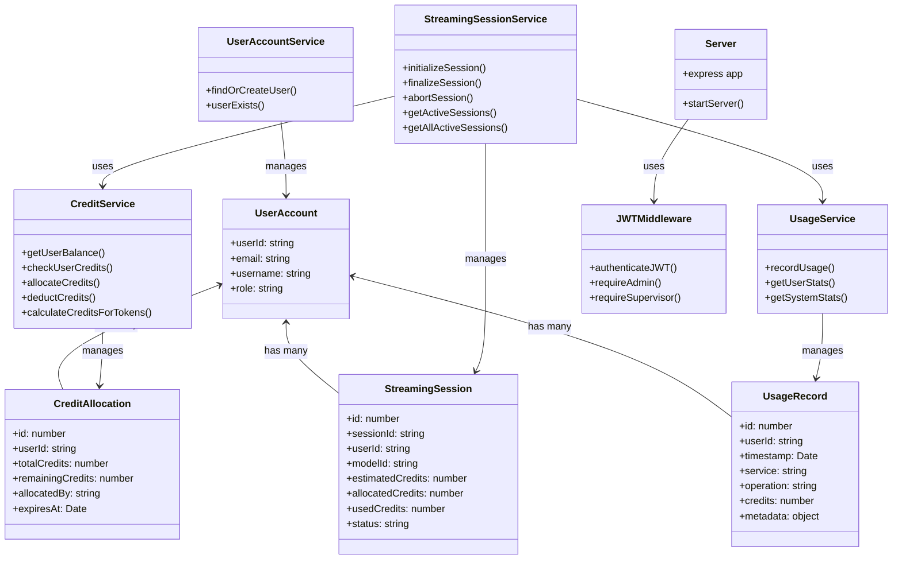
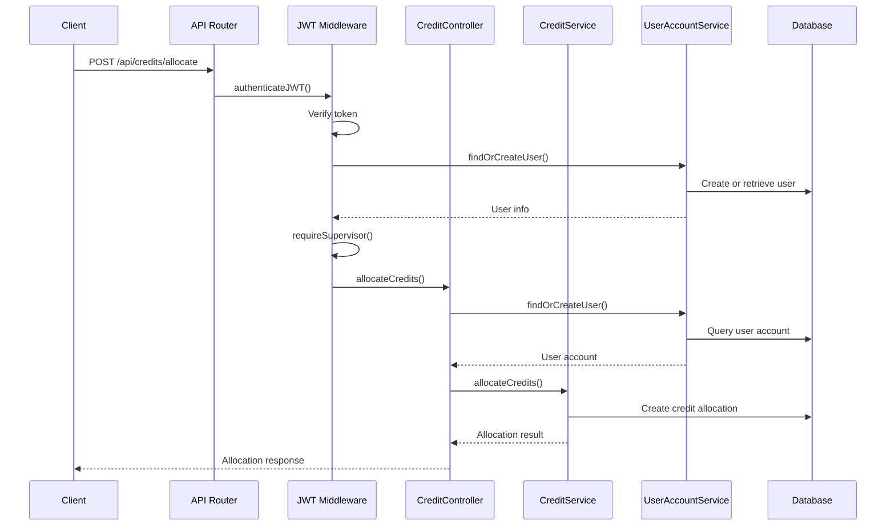
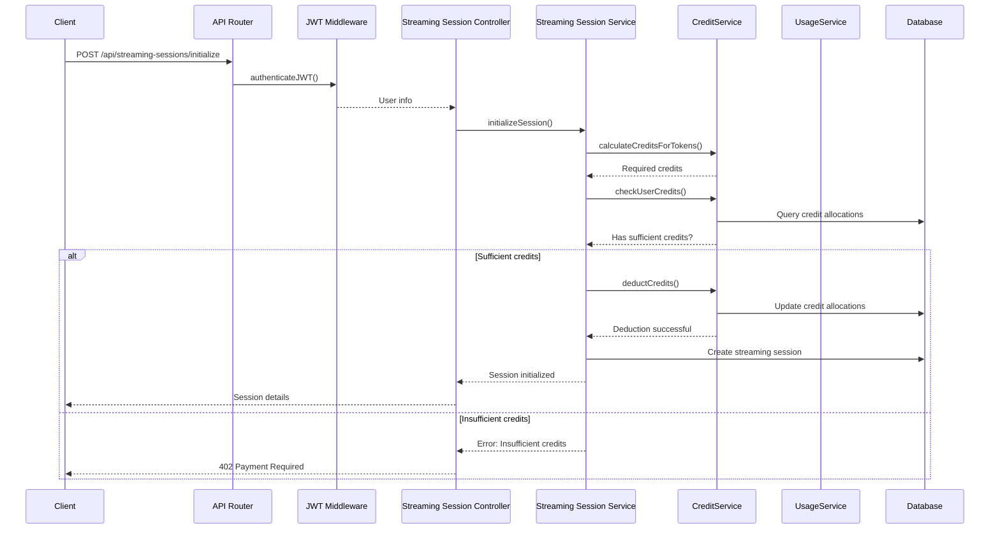
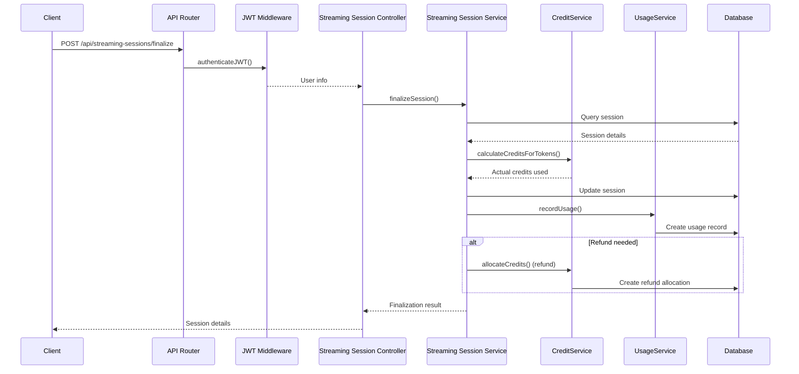
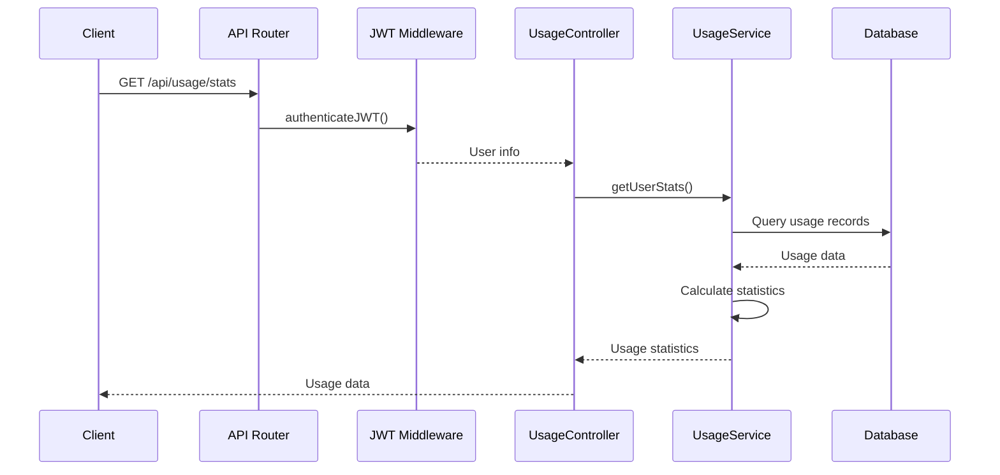

# Accounting Service Code Map

This document provides a comprehensive overview of the Accounting Service architecture, components, and workflows.

## Overview

The Accounting Service is responsible for managing user credit allocations, tracking usage, and monitoring streaming sessions. It provides API endpoints for credit management, usage tracking, and streaming session management.

## Key Components

- **User Management**: Keeps track of users and their roles
- **Credit Management**: Allocates, deducts, and refunds credits to users
- **Usage Tracking**: Records service usage for billing and analytics
- **Streaming Sessions**: Manages credit allocation for streaming LLM responses

## Directory Structure

```
accounting-service/
├── src/
│   ├── server.ts                    # Main application entry point
│   ├── config/
│   │   └── sequelize.ts             # Database configuration
│   ├── controllers/                 # API endpoint handlers
│   │   ├── credit.controller.ts     # Credit management endpoints
│   │   ├── streaming-session.controller.ts  # Streaming session endpoints
│   │   └── usage.controller.ts      # Usage tracking endpoints
│   ├── middleware/
│   │   └── jwt.middleware.ts        # Authentication middleware
│   ├── models/                      # Database models
│   │   ├── credit-allocation.model.ts
│   │   ├── streaming-session.model.ts
│   │   ├── usage-record.model.ts
│   │   └── user-account.model.ts
│   ├── routes/                      # API route definitions
│   │   ├── api.routes.ts            # Main API router
│   │   ├── credit.routes.ts         # Credit management routes
│   │   ├── streaming-session.routes.ts # Streaming session routes
│   │   └── usage.routes.ts          # Usage tracking routes
│   └── services/                    # Business logic
│       ├── credit.service.ts        # Credit management logic
│       ├── streaming-session.service.ts # Streaming session logic
│       ├── usage.service.ts         # Usage tracking logic
│       └── user-account.service.ts  # User account management logic
```

## Architecture Overview

### Class Diagram



## Key Workflows

### Credit Allocation Workflow



### Streaming Session Initialization Workflow



### Streaming Session Finalization Workflow



### Usage Stats Retrieval Workflow



## API Endpoints

### Credit Management
- `GET /api/credits/balance` - Get current user's credit balance
- `POST /api/credits/check` - Check if user has sufficient credits
- `POST /api/credits/calculate` - Calculate required credits for an operation
- `POST /api/credits/allocate` - Allocate credits to a user (admin/supervisor)
- `GET /api/credits/balance/:userId` - Get a user's credit balance (admin/supervisor)

### Streaming Sessions
- `POST /api/streaming-sessions/initialize` - Initialize a streaming session
- `POST /api/streaming-sessions/finalize` - Finalize a streaming session
- `POST /api/streaming-sessions/abort` - Abort a streaming session
- `GET /api/streaming-sessions/active` - Get active sessions for current user
- `GET /api/streaming-sessions/active/all` - Get all active sessions (admin)

### Usage Tracking
- `POST /api/usage/record` - Record a usage event
- `GET /api/usage/stats` - Get current user's usage statistics
- `GET /api/usage/stats/:userId` - Get user's usage stats (admin/supervisor)
- `GET /api/usage/system-stats` - Get system-wide usage statistics (admin)

## Database Models

### UserAccount
Stores user information synchronized from the Authentication service.

### CreditAllocation
Tracks credit allocations to users, including remaining credits and expiration.

### StreamingSession
Manages active and completed streaming sessions, tracking credit allocation and usage.

### UsageRecord
Records all service usage for billing and analytics purposes.