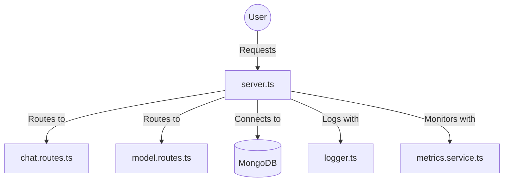
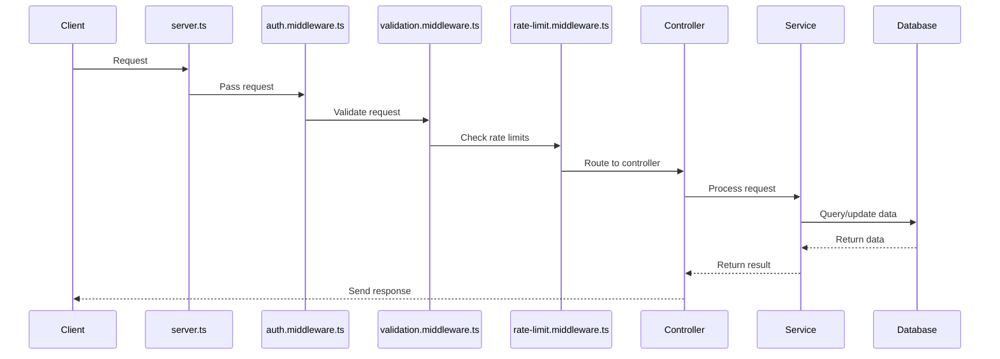
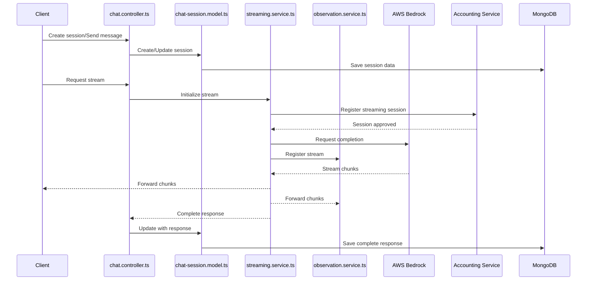
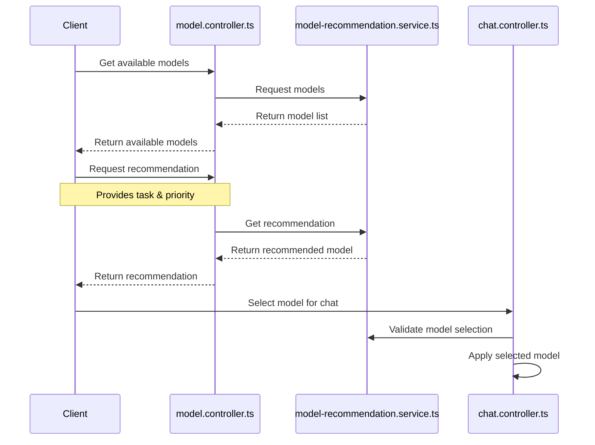
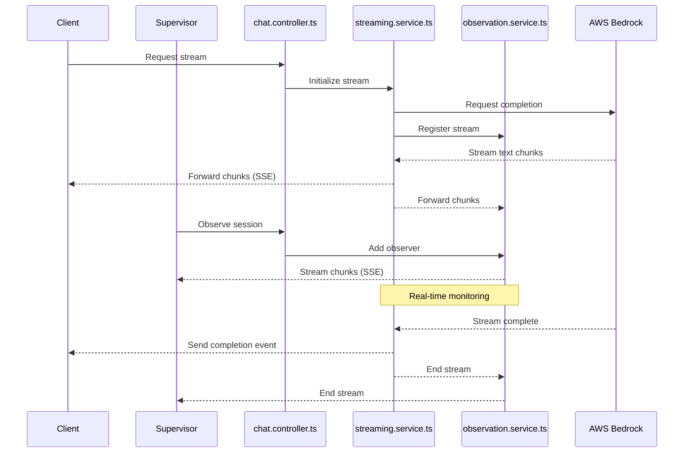
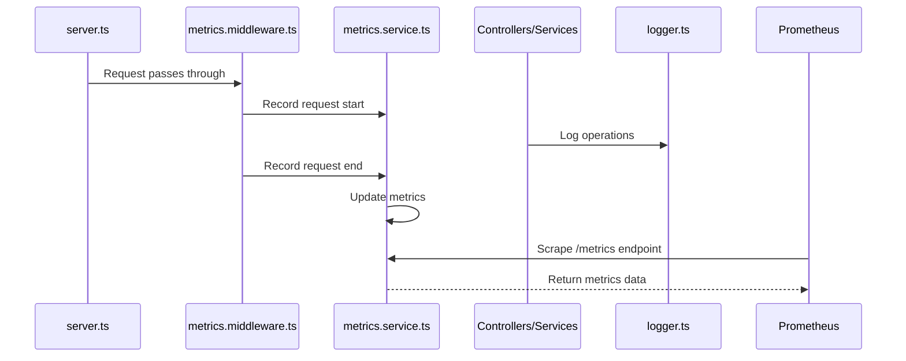

# Chat Service Code Map

## Overview
This document provides an overview of the Chat Service codebase, detailing the purpose of each file in the `src` directory and illustrating the interactions between components using Mermaid diagrams.

## File Descriptions

### `src/server.ts`
- **Purpose**: Entry point of the Chat Service application. Sets up the Express server, middleware, and routes.

### `src/config/config.ts`
- **Purpose**: Centralized configuration file for environment variables and application settings.

### `src/config/db.ts`
- **Purpose**: Handles MongoDB connection setup, events, and graceful shutdown procedures.

### `src/controllers/chat.controller.ts`
- **Purpose**: Contains route handlers for chat-related operations, such as creating sessions, sending messages, and streaming responses.

### `src/controllers/model.controller.ts`
- **Purpose**: Handles requests related to model operations, such as fetching available models and recommending models based on user input.

### `src/services/streaming.service.ts`
- **Purpose**: Handles interactions with AWS Bedrock for streaming responses and manages streaming sessions with the accounting service.

### `src/services/observation.service.ts`
- **Purpose**: Manages stream observers for supervisors to monitor student conversations using a Singleton pattern.

### `src/services/model-recommendation.service.ts`
- **Purpose**: Provides functions for recommending LLM models based on tasks and priorities, and defines available models.

### `src/services/metrics.service.ts`
- **Purpose**: Sets up Prometheus metrics for monitoring service performance and usage.

### `src/models/chat-session.model.ts`
- **Purpose**: Defines the Mongoose schema and model for storing chat session data in MongoDB.

### `src/routes/chat.routes.ts`
- **Purpose**: Defines the API endpoints for chat-related operations and maps them to controller functions.

### `src/routes/model.routes.ts`
- **Purpose**: Defines the API endpoints for model-related operations and maps them to controller functions.

### `src/middleware/auth.middleware.ts`
- **Purpose**: Middleware for authenticating and authorizing API requests using JWT tokens.

### `src/middleware/validation.middleware.ts`
- **Purpose**: Provides validation chains for request parameters using express-validator.

### `src/middleware/rate-limit.middleware.ts`
- **Purpose**: Implements rate limiting functionality to prevent API abuse.

### `src/middleware/metrics.middleware.ts`
- **Purpose**: Middleware to track HTTP request durations and responses for Prometheus metrics.

### `src/utils/logger.ts`
- **Purpose**: Provides a centralized logging utility for the application using Winston.

## Component Interactions

### 1. System Overview
The following diagram provides a high-level overview of the Chat Service architecture:

### 2. Request Flow
This diagram illustrates the typical flow of a request through the system:

### 3. Chat Session Management
This diagram shows how chat sessions are created, managed, and streamed:

### 4. Model Management Flow
This diagram shows the model recommendation and selection flow:

### 5. Streaming and Observation
This diagram illustrates the streaming and observation mechanism:

### 6. Metrics and Logging
This diagram shows the metrics collection and logging system:

## Summary
This document provides a high-level overview of the Chat Service codebase, detailing the purpose of each file and illustrating the flow of interactions between components. The Mermaid diagrams help visualize the relationships and dependencies within the system from different perspectives.
