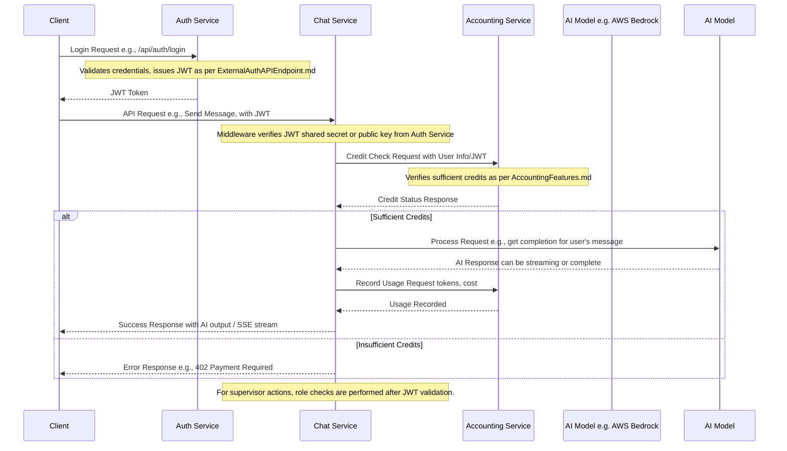
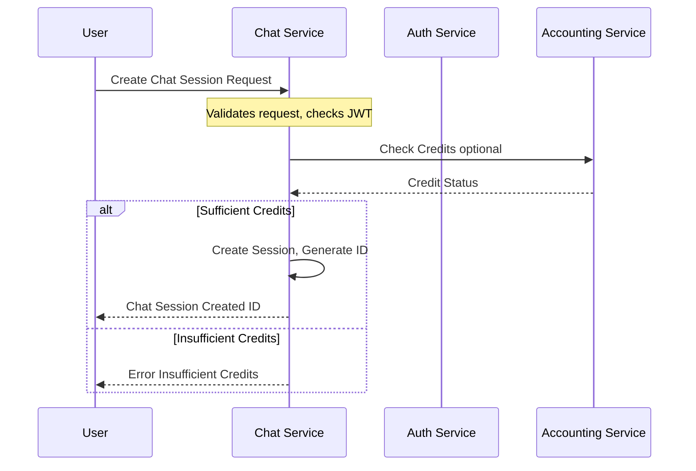
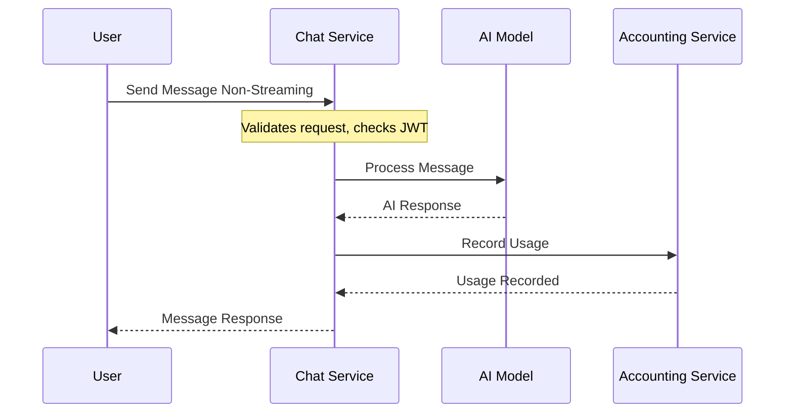
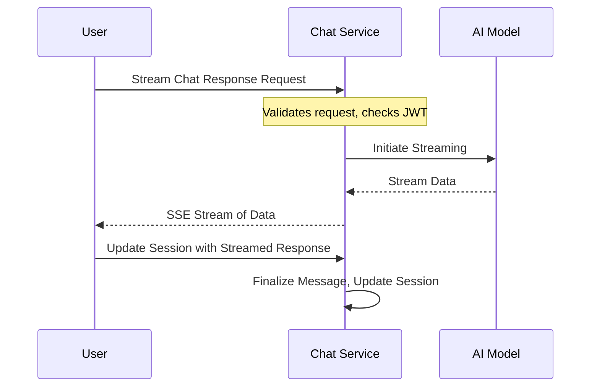
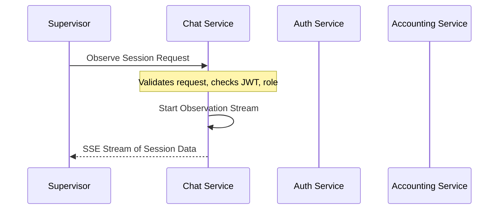

# Chat Service Features

## Introduction

The Chat Service is a core component responsible for managing chat sessions, interacting with AI language models, and providing real-time messaging capabilities. It integrates with an Authentication Service for security and an Accounting Service for credit management and usage tracking. This document outlines its key features, API endpoints, and operational workflows.

## Core Features

### 1. Session Management

Users can manage their chat sessions through the following actions:

* **Create Chat Session (`POST /api/chat/sessions`)**:
  * Allows users to start a new conversation.
  * Optionally, users can specify a title, an initial message, the AI model to use, and the source client (e.g., web, mobile).
  * Returns a unique session ID upon successful creation.
* **Get Chat Session Details (`GET /api/chat/sessions/:sessionId`)**:
  * Retrieves details for a specific chat session, including its metadata and message history, if the user owns the session.
* **List User's Chat Sessions (`GET /api/chat/sessions`)**:
  * Provides a paginated list of all chat sessions belonging to the authenticated user.
  * Supports query parameters for pagination (`page`, `limit`).
* **Delete Chat Session (`DELETE /api/chat/sessions/:sessionId`)**:
  * Permanently removes a chat session and all its associated messages, provided the user owns the session.

### 2. Messaging

The service supports both standard request-response messaging and real-time streaming:

* **Send Non-Streaming Message (`POST /api/chat/sessions/:sessionId/messages`)**:
  * Users send a message to a specific chat session.
  * The service interacts with the configured AI model and returns the complete response.
  * Allows overriding the session's default model for a specific message.
* **Get Messages from Session (`GET /api/chat/sessions/:sessionId/messages`)**:
  * Retrieves the message history for a specific chat session, with pagination options.
* **Stream Chat Response (`POST /api/chat/sessions/:sessionId/stream`)**:
  * Initiates a streaming response from the AI model using Server-Sent Events (SSE).
  * Allows clients to receive parts of the AI response as they are generated, enabling real-time interaction.
  * Events include data chunks, errors, and a completion signal.
* **Update Session with Streamed Response (`POST /api/chat/sessions/:sessionId/update-stream`)**:
  * Finalizes a streaming interaction by updating the chat session in the database with the complete AI-generated message and token usage details. This is typically called by the client after the stream has ended.

### 3. AI Model Interaction

The service provides flexibility in using different AI language models:

* **Get Available Models (`GET /api/models`)**:
  * Lists all configured AI models, including their IDs, names, capabilities, credit costs, maximum token limits, and availability status.
* **Get Model Recommendation (`POST /api/models/recommend`)**:
  * Recommends a suitable AI model based on user-specified criteria like the task type (e.g., "general", "code", "creative") and priority (e.g., "speed", "quality", "cost").

### 4. Supervision and Monitoring (Admin/Supervisor Roles)

These features are restricted to users with 'admin' or 'supervisor' roles and are crucial for quality assurance, support, and system oversight.

* **Observe Active Chat Session (`GET /api/chat/sessions/:sessionId/observe`)**:
  * Allows real-time monitoring of an active (streaming) chat session via SSE.
  * Supervisors receive a mirrored stream of the conversation, including historical data replay for context.
  * The `ObservationManager` service handles buffering and fan-out of stream data.
* **List Chat Sessions for a Specific User (`GET /api/chat/users/:userId/sessions`)**:
  * Enables supervisors to view all chat sessions belonging to a particular user. Supports pagination.
* **Get Specific User Chat Session (`GET /api/chat/users/:userId/sessions/:sessionId`)**:
  * Allows supervisors to retrieve the full details and message history of any specific chat session for any user.
* **Search Users (`GET /api/chat/users/search`)**:
  * Provides functionality to search for users by username, email, or other criteria. Returns a list of matching users and their session counts. Supports pagination.

### 5. Service Health and Versioning

* **Health Check (`GET /api/health`)**:
  * An unauthenticated endpoint that returns the operational status of the Chat Service, its version, and a timestamp. Used for monitoring.
* **API Version (`GET /api/version`)**:
  * Returns the current version of the deployed Chat Service code.

## Workflow Overview

The Chat Service interacts with several other services to provide its functionality. The typical workflow involves authentication, optional credit checks, AI model processing, and usage recording.

## Security

* All API endpoints (except `/api/health`) are protected by JWT authentication.
* Role-based access control (RBAC) is enforced for administrative and supervisor endpoints.
* Input validation middleware is used to sanitize and validate request payloads, preventing common vulnerabilities.

## Features Potentially Requiring More Test Coverage

While `test_chat_service.py` covers many core functionalities, the following areas could benefit from more explicit or in-depth end-to-end testing:

1. **API Version Endpoint (`GET /api/version`)**:
    * The main `test_chat_service.py` suite does not have a dedicated test function to call and verify the `/api/version` endpoint. (Note: `test_chat_service.py` comments indicate `test_send_messages.py` covers this).
2. **Stream Finalization Logic (`POST /api/chat/sessions/:sessionId/update-stream`)**:
    * The `send_message(streaming=True)` test in `test_chat_service.py` focuses on the client receiving SSE events from the `/stream` endpoint. It does not explicitly demonstrate a subsequent client call to `/api/chat/sessions/:sessionId/update-stream` to persist the complete streamed message and token usage. (Note: `test_chat_service.py` comments indicate `test_send_messages.py` covers this specific call).
3. **Detailed Pagination Testing**:
    * Endpoints like `GET /api/chat/sessions` (user's sessions), `GET /api/chat/users/:userId/sessions` (supervisor listing user sessions), and `GET /api/chat/users/search` (supervisor user search) support pagination (`page`, `limit`).
    * `test_chat_service.py` calls these endpoints but does not include tests for various pagination scenarios (e.g., different page numbers, limits, empty pages, out-of-bounds pages) to verify the correctness of the paginated responses and the `pagination` object.
4. **Comprehensive Input Validation and Error Handling**:
    * While some positive paths and specific error cases (like insufficient credits) are tested, `test_chat_service.py` does not systematically test all input validation rules defined in `validation.middleware.ts` (e.g., for `validateCreateSession`, `validateSendMessage`, `validateStreamChat`, `validateUpdateStream`).
    * Exhaustive testing of boundary conditions, invalid data types, and specific HTTP error codes (400, 401, 403, 404, 500 series) for each endpoint as documented in `api.routes.ts` could be expanded.
5. **Supervisor Observation - Detailed Event and State Testing**:
    * The `supervisor_observe_session` test verifies basic connectivity and some data flow for observation.
    * More detailed assertions could be added for:
        * Specific SSE events unique to observers (e.g., `observer` status messages, `history-start`, `history-end`).
        * Behavior during the stream buffer time (`streamBufferTime` in `ObservationManager`), including history replay accuracy for late-joining observers.
        * Error handling for unavailable streams (e.g., correct SSE error events or HTTP status if connection fails).
        * Scenarios with multiple supervisors observing the same session.
6. **`source` Parameter in Session Creation (`POST /api/chat/sessions`)**:
    * The `create_chat_session` test function does not include the optional `source` parameter in the request payload. Testing the handling and storage of this parameter could be more explicit.
7. **Role-Based Access Control (RBAC) - Negative Cases**:
    * While supervisor tests access supervisor-protected routes, there are no explicit tests in `test_chat_service.py` where a user with an insufficient role (e.g., an `enduser`) attempts to access supervisor/admin endpoints to ensure a 403 Forbidden response is consistently returned.
8. **Full Session Details Retrieval (`GET /api/chat/sessions/:sessionId`)**:
    * `test_chat_service.py` calls `get_chat_messages` which maps to `GET /api/chat/sessions/:sessionId/messages`.
    * It does not have a dedicated test for `GET /api/chat/sessions/:sessionId` (handled by `chatController.getChatSession` in `api.routes.ts`) to verify the retrieval of the complete session object including all its metadata fields (title, modelId, createdAt, updatedAt, etc.), not just the messages.

## 6. Workflow Diagrams

The following sequence diagrams illustrate the workflows for key features of the Chat Service: session management, messaging, AI model interaction, and supervisor monitoring.

### 6.1. Session Management Workflow

### 6.2. Messaging Workflow

### 6.3. Streaming Workflow

### 6.4. Supervisor Monitoring Workflow

## 7. API Endpoints

The following table summarizes the key API endpoints for the Chat Service, including their HTTP methods, paths, and descriptions.

| HTTP Method | Path                                    | Description                                      |
|-------------|-----------------------------------------|--------------------------------------------------|
| POST        | /api/chat/sessions                      | Create a new chat session                        |
| GET         | /api/chat/sessions/:sessionId          | Get details of a specific chat session          |
| GET         | /api/chat/sessions                      | List all chat sessions for the authenticated user |
| DELETE      | /api/chat/sessions/:sessionId          | Delete a specific chat session                  |
| POST        | /api/chat/sessions/:sessionId/messages | Send a message to a chat session                |
| GET         | /api/chat/sessions/:sessionId/messages | Get message history for a chat session          |
| POST        | /api/chat/sessions/:sessionId/stream   | Stream chat response from the AI model          |
| POST        | /api/chat/sessions/:sessionId/update-stream | Update session with the final streamed response |
| GET         | /api/models                            | Get available AI models                          |
| POST        | /api/models/recommend                   | Get model recommendation                          |
| GET         | /api/chat/sessions/:sessionId/observe  | Observe an active chat session                   |
| GET         | /api/chat/users/:userId/sessions       | List chat sessions for a specific user          |
| GET         | /api/chat/users/:userId/sessions/:sessionId | Get a specific user chat session              |
| GET         | /api/chat/users/search                  | Search for users                                 |
| GET         | /api/health                            | Health check for the Chat Service                |
| GET         | /api/version                           | Get the current version of the Chat Service     |

## 8. Security

The Chat Service implements robust security measures to protect user data and ensure authorized access:

* **Authentication**:
  * All endpoints (except `/api/health`) require JWT authentication.
  * The Auth Service validates user credentials and issues JWTs.
* **Authorization**:
  * Role-based access control (RBAC) restricts access to admin and supervisor features.
  * Supervisors have additional permissions to monitor and manage user sessions.
* **Data Protection**:
  * Sensitive data, such as user credentials and chat messages, are encrypted in transit (TLS) and at rest (encryption keys managed by the cloud provider).
  * The service complies with data protection regulations (e.g., GDPR, CCPA) by implementing data minimization, purpose limitation, and user consent mechanisms.
* **Input Validation**:
  * All user inputs are validated and sanitized to prevent common vulnerabilities like SQL injection, XSS, and CSRF.
  * The service uses a comprehensive set of validation rules for each API endpoint, defined in `validation.middleware.ts`.
* **Error Handling**:
  * The service provides generic error messages to users, hiding internal implementation details.
  * Specific error codes and messages are logged for monitoring and debugging purposes.

## 9. Monitoring and Logging

The Chat Service includes monitoring and logging features to ensure operational visibility and facilitate troubleshooting:

* **Health Monitoring**:
  * The service exposes a health check endpoint (`/api/health`) that returns the operational status, version, and timestamp.
  * This endpoint is used by external monitoring systems to check the service's availability.
* **Logging**:
  * The service logs all requests and responses, including headers and payloads, for auditing and debugging purposes.
  * Logs are stored in a centralized logging system (e.g., AWS CloudWatch Logs, ELK Stack) and are rotated and archived regularly.
* **Performance Monitoring**:
  * The service tracks key performance metrics, such as response times, error rates, and resource utilization (CPU, memory, disk I/O).
  * These metrics are used to identify performance bottlenecks and optimize the service.

## 10. Rate Limiting and Quotas

To prevent abuse and ensure fair usage, the Chat Service enforces rate limiting and quotas:

* **Rate Limiting**:
  * The service limits the number of requests a user can make in a given time period (e.g., 100 requests per minute).
  * Exceeding the limit results in a `429 Too Many Requests` response.
* **Quotas**:
  * The service enforces daily and monthly quotas on the number of chat sessions, messages, and AI model usage (tokens, compute time).
  * Quota limits are based on the user's subscription plan and are enforced by the Accounting Service.

## 11. Data Retention and Deletion

The Chat Service follows strict data retention and deletion policies:

* **Data Retention**:
  * Chat messages and session data are retained for a minimum period (e.g., 30 days) to support user access and compliance requirements.
  * Retention periods are configurable based on regulatory and business needs.
* **Data Deletion**:
  * Users can delete their chat sessions and messages at any time, permanently removing them from the service.
  * The service provides a `DELETE` API endpoint for chat sessions and messages.
  * Deleted data is immediately removed from the active database and is not recoverable.

## 12. Compliance and Legal

The Chat Service is designed to comply with relevant legal and regulatory requirements:

* **GDPR**:
  * The service implements data protection by design and by default, ensuring user privacy and data security.
  * Users have rights to access, rectify, delete, and restrict the processing of their personal data.
* **CCPA**:
  * The service provides transparency about data collection, use, and sharing practices.
  * Users have the right to opt-out of the sale of their personal information and to access and delete their data.
* **HIPAA**:
  * If the service handles protected health information (PHI), it complies with HIPAA requirements for data privacy and security.
  * The service signs business associate agreements (BAAs) with covered entities and implements necessary safeguards.

## 13. Future Enhancements

The following enhancements are planned for future releases of the Chat Service:

* **AI Model Improvements**:
  * Integrate with additional AI models and providers to offer users more choices and capabilities.
  * Continuously improve the quality and performance of AI-generated responses.
* **User Experience Enhancements**:
  * Improve the chat interface and user interactions for better engagement and satisfaction.
  * Add support for rich media messages (images, videos, files) and interactive elements (buttons, quick replies).
* **Advanced Analytics and Insights**:
  * Provide users with detailed analytics and insights about their chat sessions, message trends, and AI usage.
  * Offer recommendations for optimizing AI model usage and improving response quality.
* **Integration with Third-Party Services**:
  * Enable integration with popular third-party services and platforms (e.g., CRM, helpdesk, collaboration tools) to streamline workflows and data exchange.
  * Provide APIs and webhooks for developers to build custom integrations and automations.

## 14. Conclusion

The Chat Service is a powerful and flexible solution for managing chat sessions and interacting with AI language models. It provides a wide range of features and capabilities for users, administrators, and supervisors. The service is designed with security, compliance, and performance in mind, and is continuously evolving to meet the needs of its users and the demands of the market.

---

*Document Version: 1.0.0*
