# Understanding `test_streaming_session_id.py` 

This document provides a detailed explanation of the `test_streaming_session_id.py` script, which tests the streaming session functionality in a microservice-based chat application.

## Overview

The script tests how streaming session IDs are handled in chat sessions, specifically validating that:
1. Using the **correct streaming session ID** allows updating a chat session
2. Using an **incorrect streaming session ID** properly fails with an error

## System Architecture

The chat application consists of three microservices:

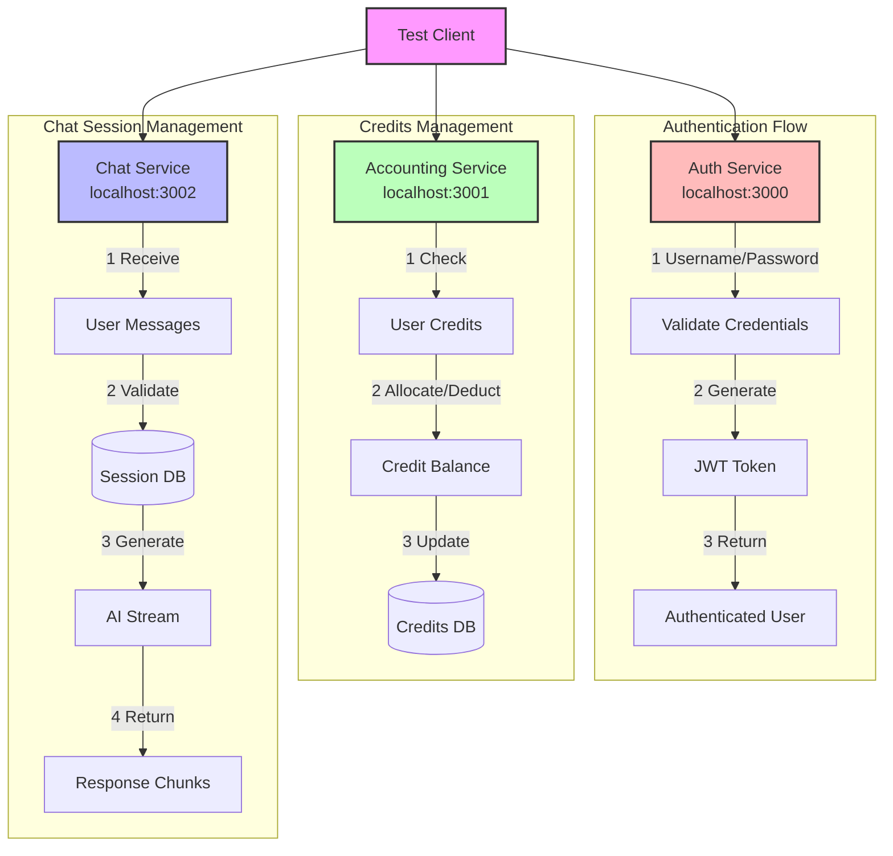

## Core Concepts

### 1. Streaming Sessions

In a streaming setup, AI responses are sent in small chunks as they are generated, rather than waiting for the complete response. This provides a better user experience but requires proper tracking.

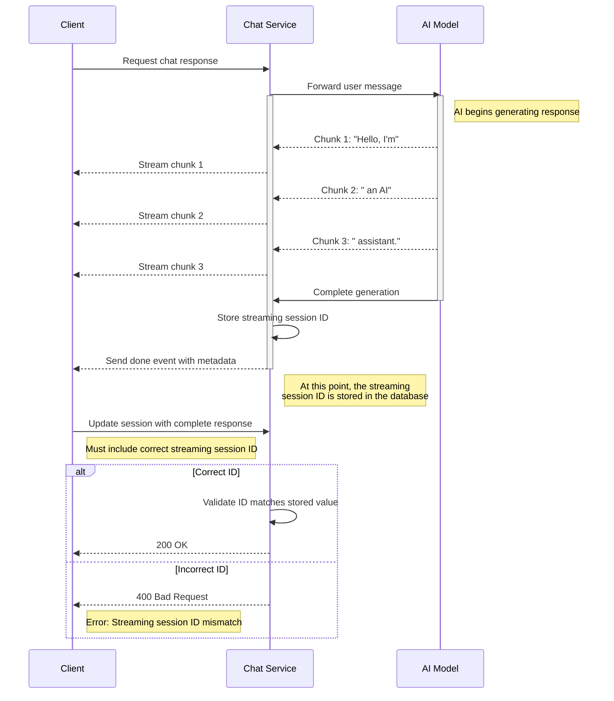

### 2. Server-Sent Events (SSE)

The script uses Server-Sent Events for receiving streaming responses. Unlike WebSockets, SSE is a one-way communication channel from server to client.

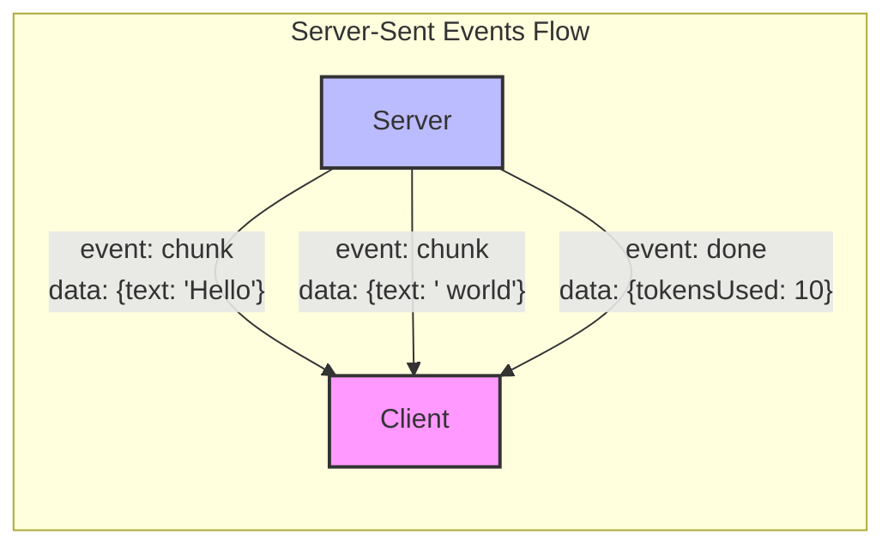

## Key Components of the Script

### 1. `StreamingTester` Class

This is the main test harness that handles:
- Authentication with services
- Creating chat sessions
- Testing streaming with correct and incorrect IDs
- Cleanup after tests

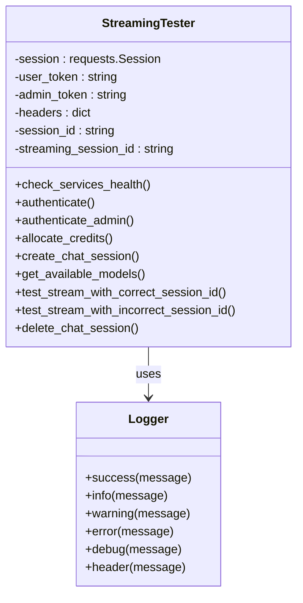

### 2. `Logger` Class

Provides colorized logging to make test output more readable.

## Detailed Test Flow

### 1. Complete Test Sequence

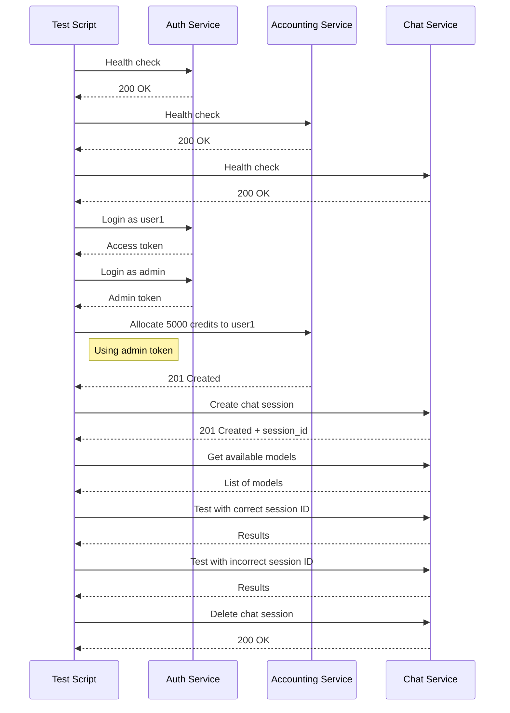

### 2. Correct Streaming ID Test

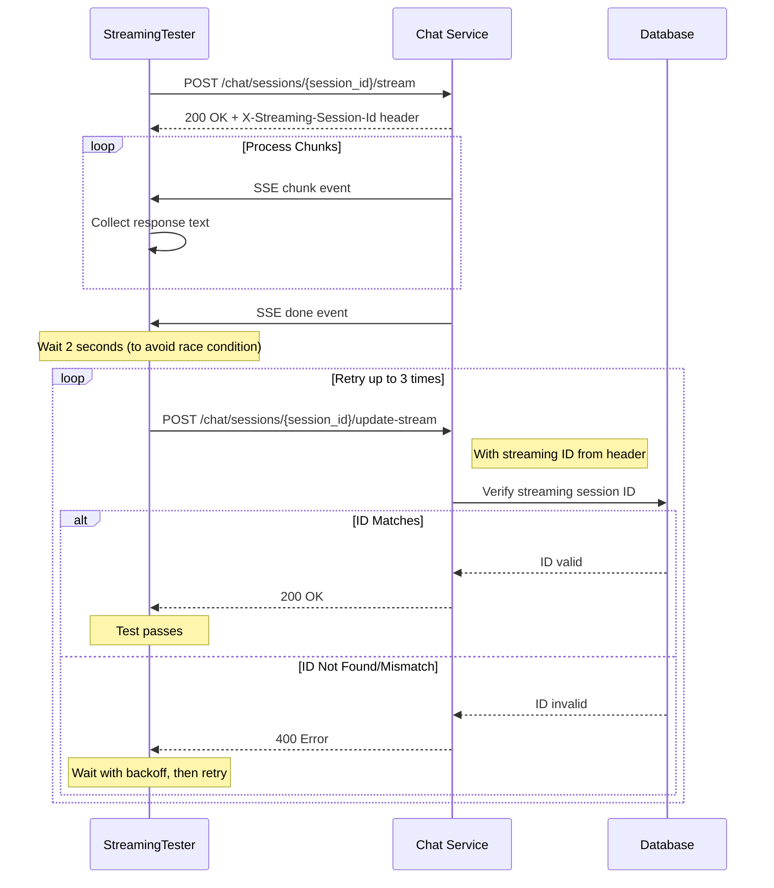

### 3. Incorrect Streaming ID Test

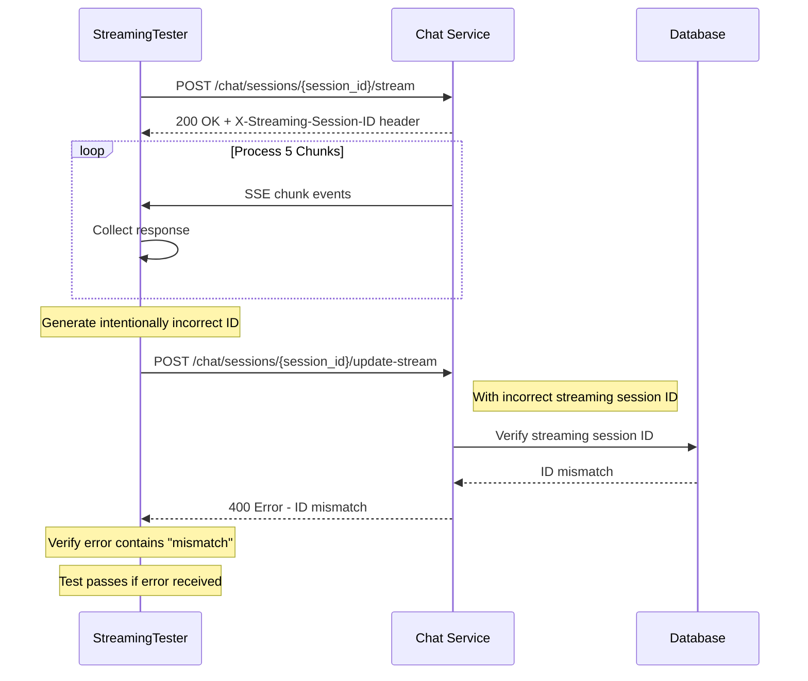

## Error Handling and Resilience

The script incorporates several robust error handling mechanisms:

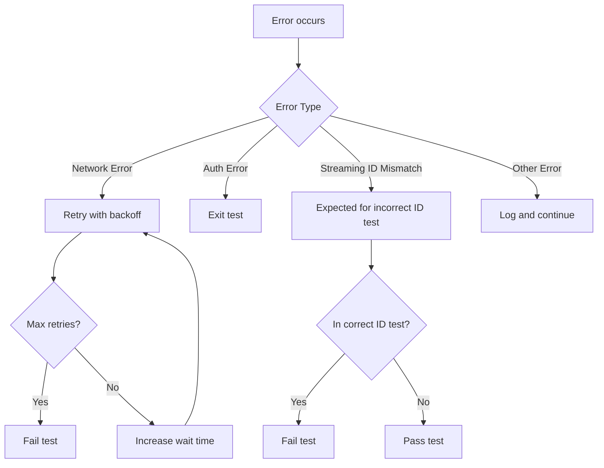

## Key Test Phases

1. **Setup**: Health check, authentication, credit allocation
2. **Preparation**: Create chat session, get available models
3. **Testing**: Run correct and incorrect streaming ID tests
4. **Cleanup**: Delete chat session
5. **Reporting**: Print test results and summary

## Technical Challenges Addressed

### 1. Race Conditions

The script includes delays to prevent race conditions between streaming events and database updates. This is crucial because the server needs time to store the streaming session ID before it can be validated.

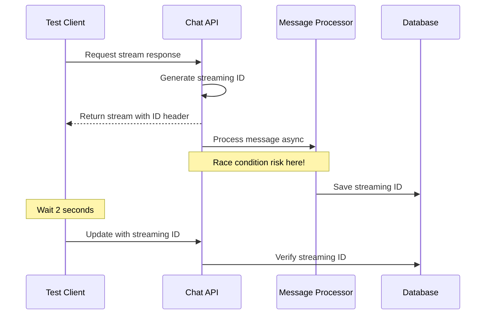

### 2. Header Case Sensitivity

The script handles potential case sensitivity issues in HTTP headers by checking for the streaming ID header in multiple formats:

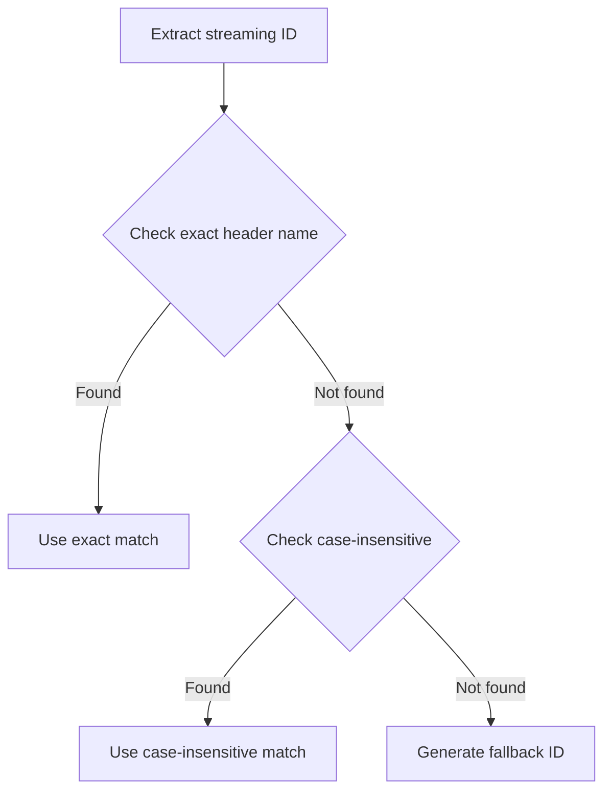

## What Happens Behind the Scenes

When you run this test, the following happens in the system:

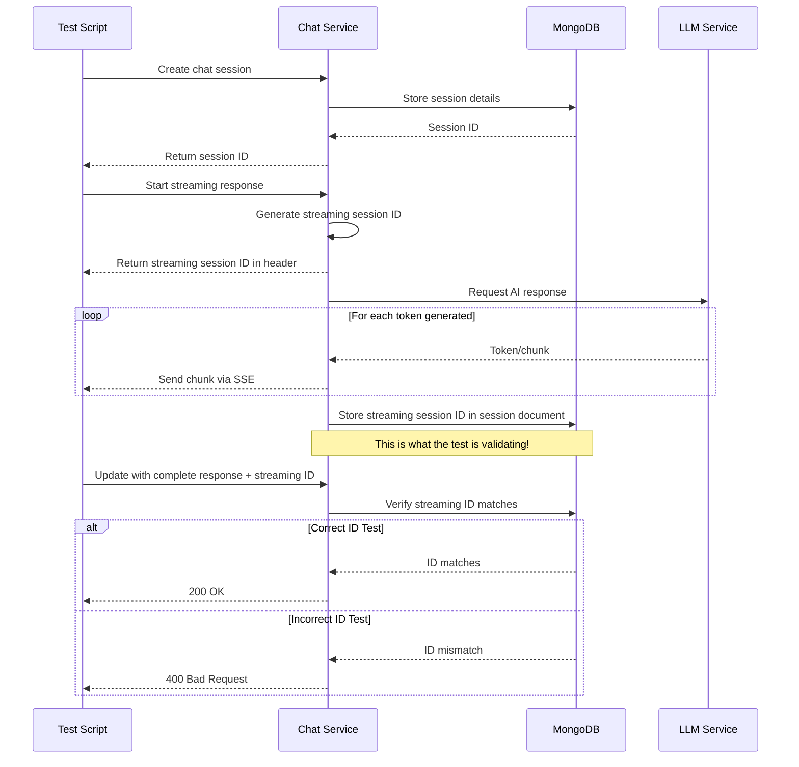

## Common Issues & Troubleshooting

1. **Missing Streaming IDs**: The script has multiple fallback mechanisms if the streaming ID header isn't found
2. **Race Conditions**: The test uses delays and retries to handle database latency
3. **Connection Issues**: Health checks ensure all services are available
4. **Authentication Failures**: Detailed error logging for auth problems

## Conclusion

The `test_streaming_session_id.py` script performs a critical security test to ensure that streaming chat sessions cannot be manipulated by unauthorized parties. It validates that:

1. The streaming session ID mechanism works correctly for legitimate updates
2. The system properly rejects update attempts with incorrect session IDs

This security measure prevents potential session hijacking and ensures the integrity of user chat sessions.