# Supervisor Features Test Documentation

## Overview

The `test_supervisor_features.py` implements comprehensive tests for supervisor capabilities in a multi-service chatbot system. This system consists of three main services:

- **Auth Service**: Handles user authentication and authorization
- **Accounting Service**: Manages credit allocation and usage
- **Chat Service**: Core service handling chat sessions, messaging, and supervisor features

## System Architecture

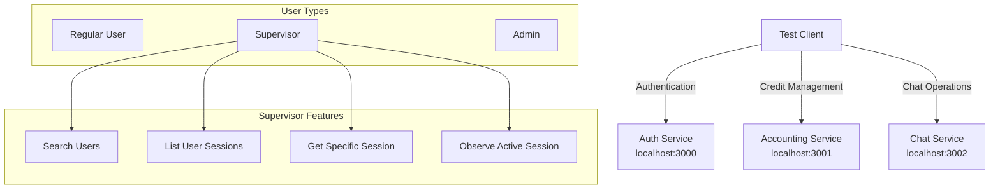

## Test Workflow

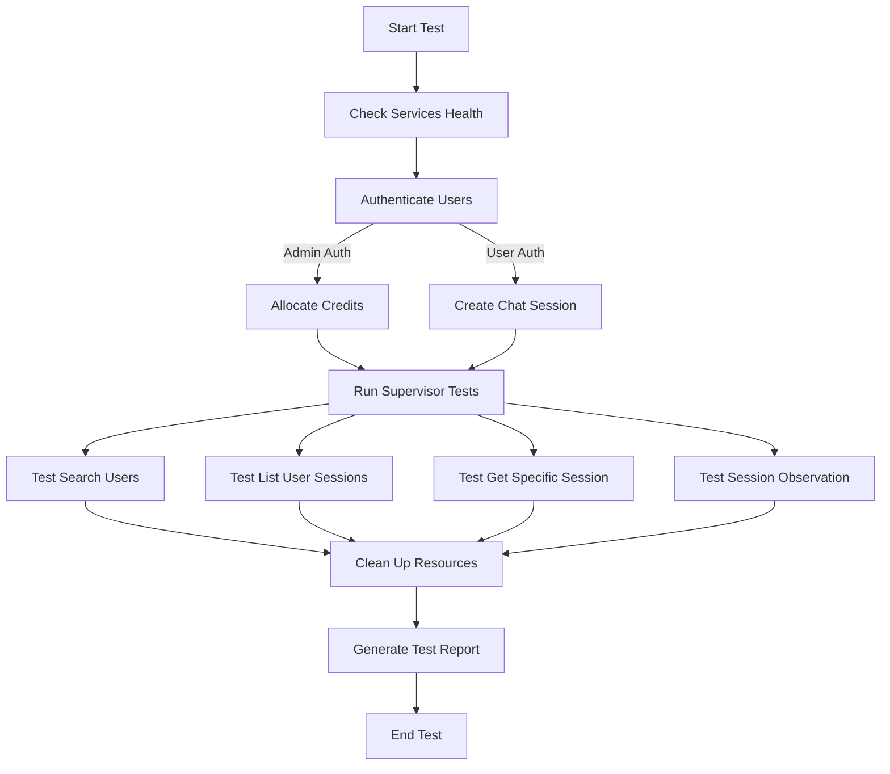

## Key Components

### Configuration

The test script uses the following configuration:
- **Service URLs**:
  - Auth Service: `http://localhost:3000/api`
  - Accounting Service: `http://localhost:3001/api`
  - Chat Service: `http://localhost:3002/api`
  
- **Test Users**:
  - Regular users (e.g., `user1`)
  - Supervisor users (e.g., `supervisor1`)
  - Admin user

### SupervisorTester Class

This is the main test class that contains methods for each test scenario:

#### Service Health Check
`check_services_health()` verifies all services are running by sending requests to their health endpoints.

#### Authentication
`authenticate_all_users()` handles authentication for:
- Regular user - to create and use chat sessions
- Supervisor - to access supervisor features
- Admin - to allocate credits

#### Credit Allocation
`allocate_credits_to_test_user()` uses the admin account to allocate credits to the test user.

#### Chat Session Creation
`create_chat_session_as_user()` creates a new chat session as the regular user with an initial message.

#### Supervisor Features

1. `supervisor_search_users()`: Tests the supervisor's ability to search for users with various queries.
2. `supervisor_list_user_sessions()`: Tests listing a specific user's chat sessions.
3. `supervisor_get_specific_session()`: Tests retrieving details of a specific chat session.
4. `test_supervisor_observation()`: Tests real-time observation of an active chat session.

#### Cleanup
`delete_chat_session()` deletes the test chat session to clean up resources.

## Authentication Flow

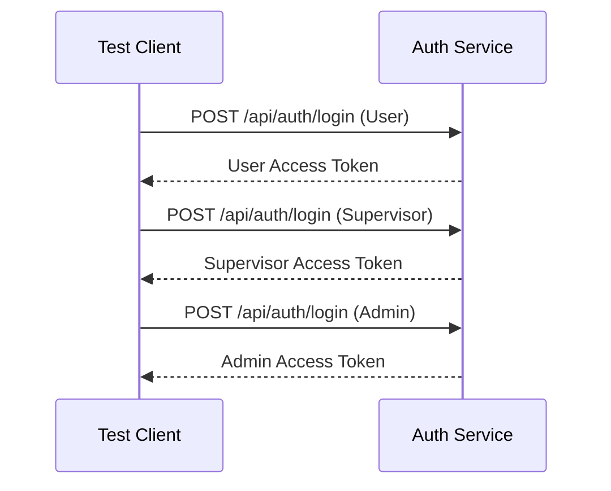

## Credit Allocation

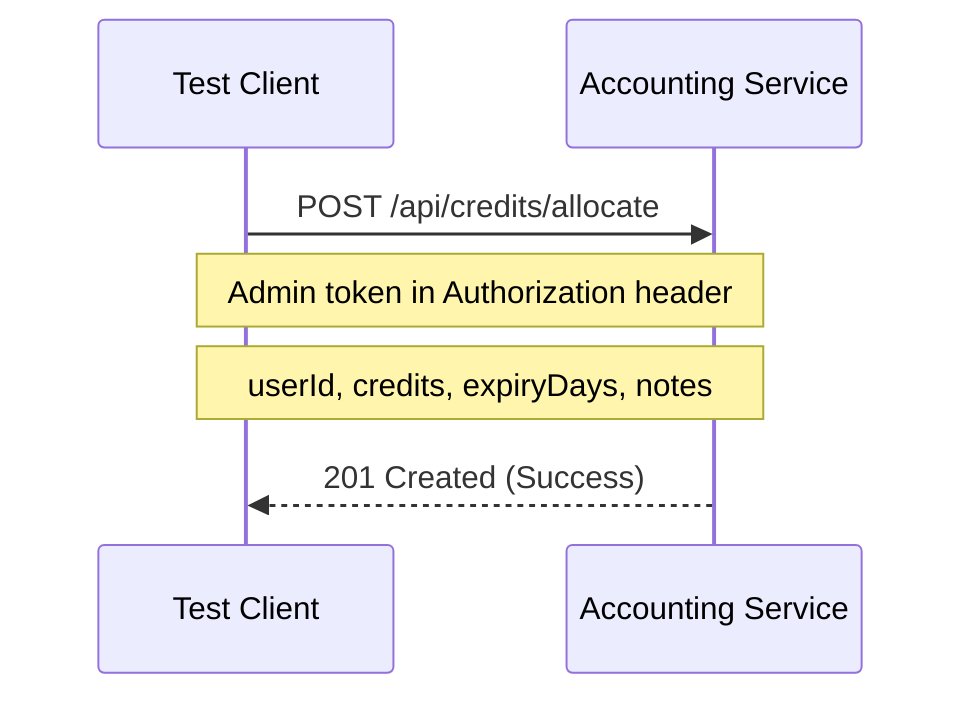

## Chat Session Operations

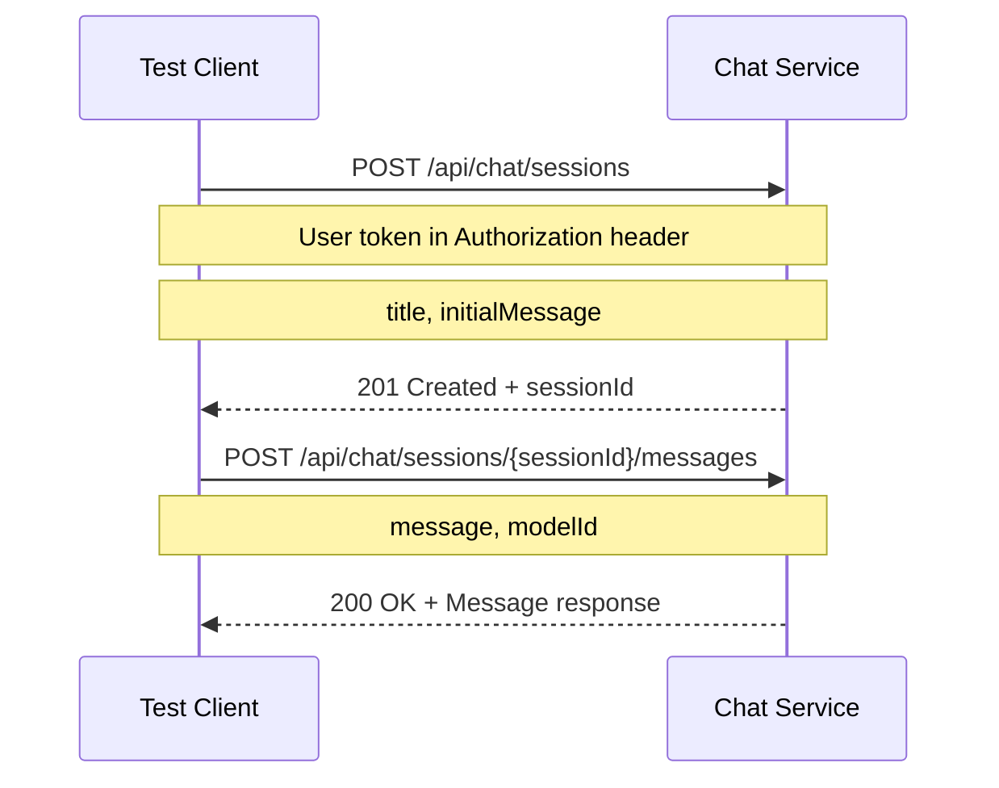

## Supervisor Search Users Sequence

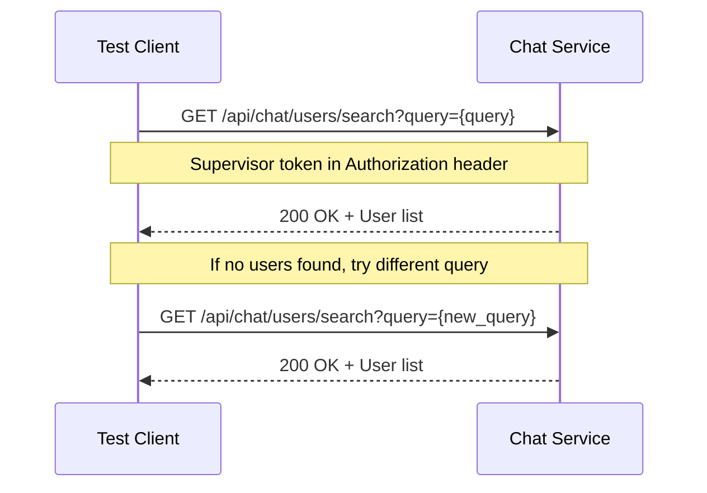

## Supervisor List User Sessions

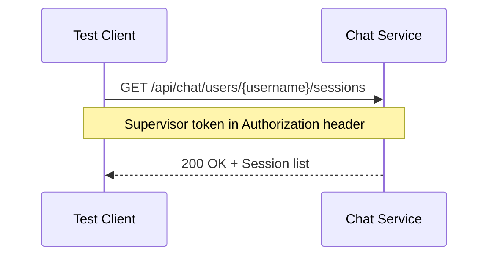

## Supervisor Get Specific Session

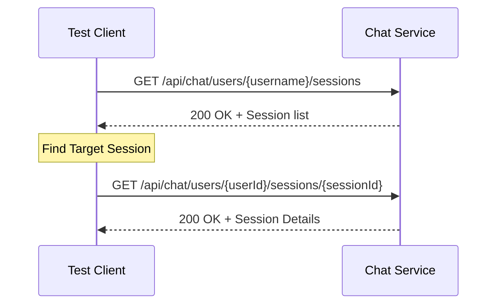

## Supervisor Session Observation

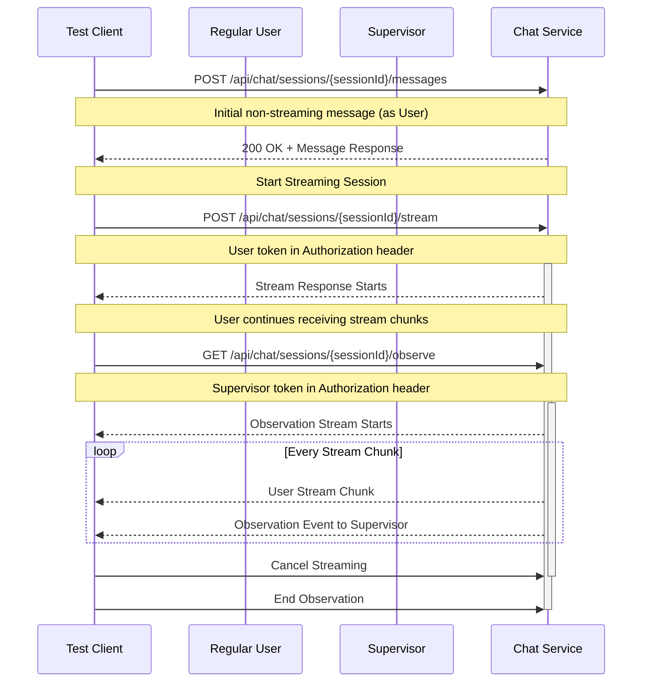

## Error Handling & Retry Logic

The test includes robust error handling and retry mechanisms, particularly for the observation test:

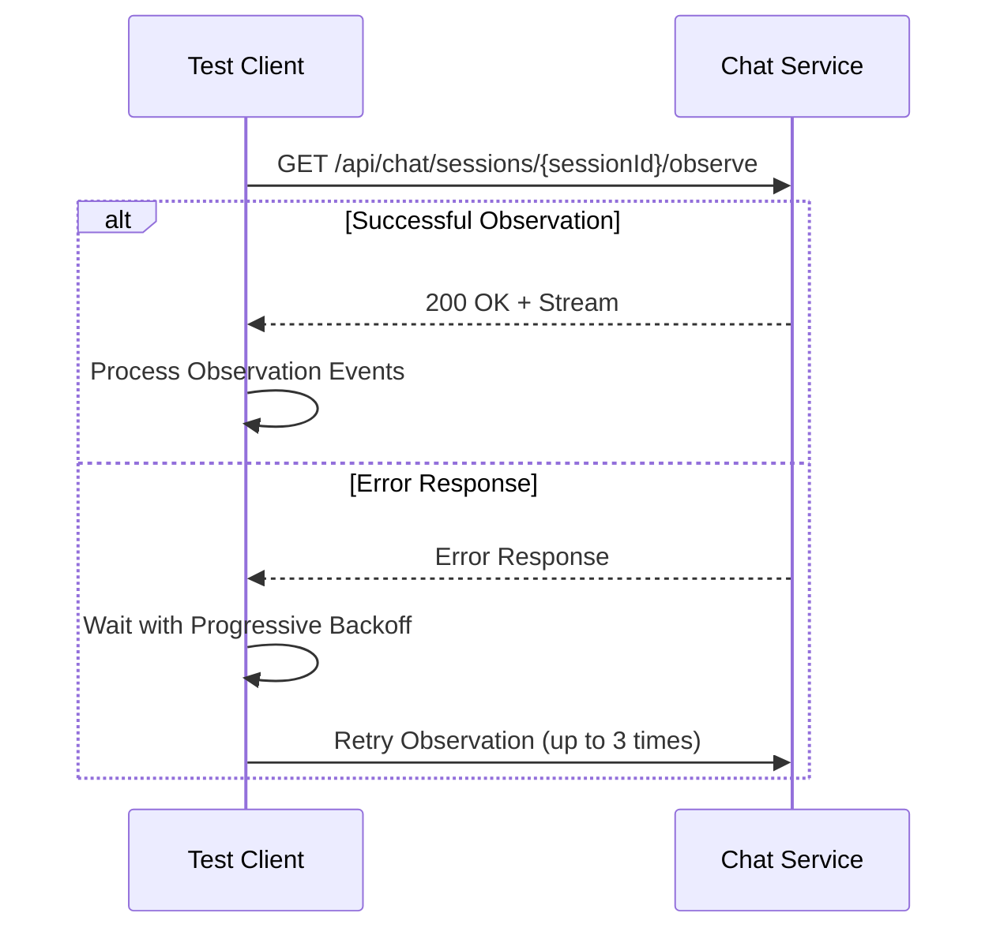

## Test Execution Flow

The main test execution is handled by the `run_test()` async function:

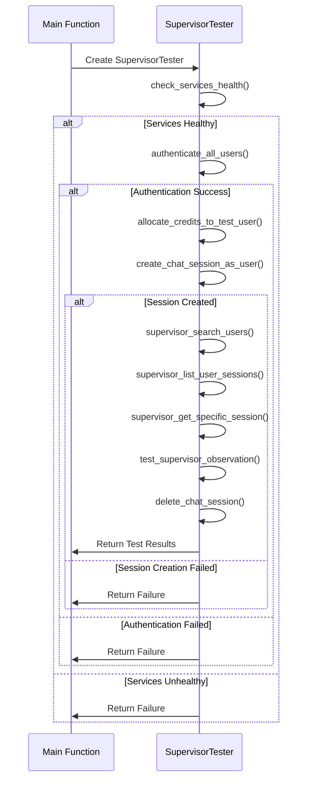

## Detailed Components

### Logger Class
The test uses a custom `Logger` class with colorized output for:
- Success messages (green)
- Info messages (cyan)
- Warning messages (yellow)
- Error messages (red)
- Section headers (magenta)

### Asynchronous Methods
The test uses `asyncio` for handling asynchronous operations, particularly in:
- `test_supervisor_observation()`: Manages parallel streaming and observation
- `_continuous_stream()`: Helper method for maintaining an open stream connection

### Retry Mechanism
The observation test includes a sophisticated retry mechanism with:
- Maximum of 3 retry attempts
- Progressive backoff (waiting longer between retries)
- Detailed error reporting and debugging

## Test Validation

- Each test function returns `True` for success or `False` for failure
- All test results are collected and displayed in a final summary
- The script exits with status code 0 for overall success or 1 for failure

## Usage

Run the test script from the command line:

```shell
python test_supervisor_features.py
```

The output will be colorized with clear indications of test progress and results.

## Recommended Fix

The simplest fix is to add a username field to the chat session model and store both the internal user ID and the username during session creation. Then modify the supervisor endpoints to query by either field.

## Fixing the Observation Event Reading Error

The main error we're addressing is the issue observed when attempting to read observation events:
```
[ERROR] Error reading observation events: 
[INFO] Attempting to get additional error context...
```

### Root Cause Analysis

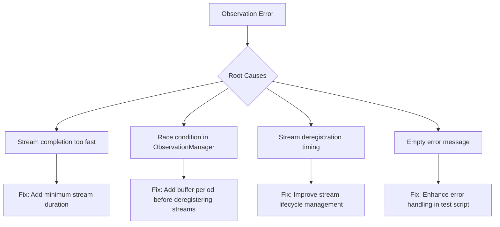

### Issue 1: Stream Deregistration Timing

The ObservationManager is deregistering streams too quickly after they complete, causing attempts to read observation events to fail.

```typescript
// Current implementation in observation.service.ts
stream.on('end', () => {
  logger.debug(`Stream ended for session ${sessionId}, keeping available for ${this.streamBufferTime}ms`);
  
  // Schedule delayed cleanup
  const timeout = setTimeout(() => {
    this.deregisterStream(sessionId);
  }, this.streamBufferTime);
  
  // Store the timeout reference for potential cancellation
  this.streamTimeouts.set(sessionId, timeout);
});
```

#### Solution: Extend Stream Buffer Time

```typescript
// Modified implementation with longer buffer time and notification
export class ObservationManager {
  // Increase buffer time from 60 seconds to 2 minutes
  private streamBufferTime: number = 120000; // 2 minutes
  
  // ...existing code...
  
  public registerStream(sessionId: string, stream: PassThrough): void {
    // ...existing code...
    
    stream.on('end', () => {
      logger.debug(`Stream ended for session ${sessionId}, keeping available for ${this.streamBufferTime}ms`);
      
      // Notify any observers that the original stream has ended but observation continues
      this.eventEmitter.emit(`stream:${sessionId}`, `event: info\ndata: ${JSON.stringify({
        message: "Original stream ended, remaining in observation buffer",
        timestamp: new Date().toISOString(),
      })}\n\n`);
      
      // Schedule delayed cleanup with longer duration
      const timeout = setTimeout(() => {
        // Notify before deregistering
        this.eventEmitter.emit(`stream:${sessionId}`, `event: info\ndata: ${JSON.stringify({
          message: "Observation period ending",
          timestamp: new Date().toISOString(),
        })}\n\n`);
        
        // Add small delay to ensure notification is sent before deregistration
        setTimeout(() => this.deregisterStream(sessionId), 500);
      }, this.streamBufferTime);
      
      this.streamTimeouts.set(sessionId, timeout);
    });
  }
}
```

### Issue 2: Race Condition in Stream Completion

The original stream is completing too quickly with just 2 chunks, before the supervisor observation can properly connect.

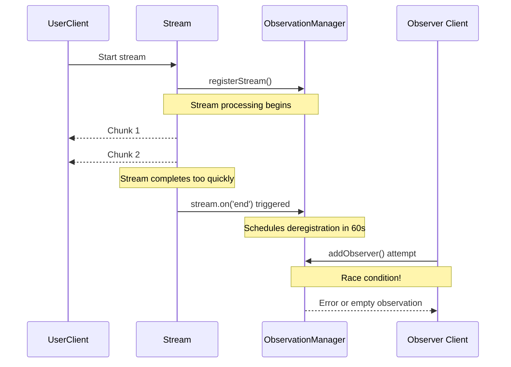

#### Solution: Add Minimum Stream Duration in Test Script

```python
async def _continuous_stream(self, session, url, headers):
    try:
        start_time = time.time()
        min_duration = 10  # Seconds - ensure stream stays open at least this long
        
        async with session.post(
            url,
            headers=headers,
            json={
                "message": "Please provide a very detailed explanation about artificial intelligence, machine learning, and neural networks",
                "modelId": "amazon.titan-text-express-v1:0"
            },
            timeout=aiohttp.ClientTimeout(total=60)  # Increased timeout
        ) as response:
            if response.status != 200:
                error_text = await response.text()
                Logger.error(f"Streaming failed: {error_text}")
                return False
            
            Logger.success("User streaming established successfully")
            
            # Process response chunks
            chunk_count = 0
            async for line in response.content:
                line_str = line.decode('utf-8').strip()
                if line_str:
                    chunk_count += 1
                    if chunk_count % 5 == 0:
                        Logger.info(f"Stream received chunk #{chunk_count}")
                    
                    await asyncio.sleep(0.2)  # Increased delay between chunks
            
            # Ensure minimum stream duration
            elapsed = time.time() - start_time
            if elapsed < min_duration:
                remaining_time = min_duration - elapsed
                Logger.info(f"Ensuring minimum stream duration, waiting {remaining_time:.1f}s")
                await asyncio.sleep(remaining_time)
                
            Logger.success(f"Stream completed with {chunk_count} chunks after {time.time() - start_time:.1f}s")
            return True
                
    except asyncio.CancelledError:
        # Handled gracefully elsewhere
        return False
    except Exception as e:
        Logger.error(f"Error in continuous stream: {str(e)}")
        return False
```

### Issue 3: Improved Error Handling in Test Script

The empty error message suggests a connection reset or similar network issue.

#### Solution: Enhanced Error Handling

```python
try:
    async with observe_response:
        Logger.info("Starting to read observation events stream")
        observation_count = 0
        
        # Set a timeout for reading the stream
        start_time = time.time()
        timeout_duration = 30  # seconds
        
        while time.time() - start_time < timeout_duration:
            try:
                # Use a timeout for each read attempt
                line_data = await asyncio.wait_for(
                    observe_response.content.readline(), 
                    timeout=5.0
                )
                
                if not line_data:
                    Logger.warning("Empty line received, possible end of stream")
                    # Short pause before trying again
                    await asyncio.sleep(0.5)
                    continue
                    
                line_str = line_data.decode('utf-8').strip()
                if line_str.startswith('data:'):
                    Logger.info(f"Observation event: {line_str[:50]}...")
                    observation_count += 1
                    
                    if observation_count >= 3:
                        Logger.success(f"Received {observation_count} observation events")
                        return True
                        
            except asyncio.TimeoutError:
                Logger.warning("Timeout waiting for observation event, retrying...")
                continue
            except Exception as inner_e:
                Logger.error(f"Error processing event: {type(inner_e).__name__}: {str(inner_e)}")
                # Continue reading instead of failing immediately
                continue
                
        Logger.warning(f"Observation read timed out after {timeout_duration}s with {observation_count} events")
        return observation_count > 0
        
except aiohttp.ClientError as e:
    Logger.error(f"Connection error during observation: {type(e).__name__}: {str(e)}")
    return False
except asyncio.CancelledError:
    Logger.info("Observation task was cancelled")
    return False
except Exception as e:
    Logger.error(f"Error reading observation events: {type(e).__name__}: {str(e)}")
    # Additional debug information gathering code here
    return False
```

### Issue 4: Improving ObservationManager Stream Registration and Buffer Management

Add more robust handling for the ObservationManager's stream registration and buffer handling.

```typescript
/**
 * Observation Manager Class Improvements
 */
export class ObservationManager {
  // ...existing code...
  
  /**
   * Check Stream Availability with Enhanced Status Detection
   */
  public isStreamActive(sessionId: string): boolean {
    // First check active streams
    const isActive = this.activeStreams.has(sessionId);
    
    // Then check buffered streams
    const isBuffered = this.streamTimeouts.has(sessionId);
    
    // Log detailed status for debugging
    if (isActive) {
      logger.debug(`Stream ${sessionId} is active`);
    } else if (isBuffered) {
      logger.debug(`Stream ${sessionId} is in buffer period`);
    } else {
      logger.debug(`Stream ${sessionId} is not available for observation`);
    }
    
    // A stream is available if it's either active or in buffer period
    return isActive || isBuffered;
  }
  
  /**
   * Add Observer with Enhanced History and Error Handling
   */
  public addObserver(sessionId: string, callback: ObserverCallback): () => void {
    // Check if the session is available for observation
    const isActive = this.activeStreams.has(sessionId);
    const isBuffered = this.streamTimeouts.has(sessionId);
    
    if (!isActive && !isBuffered) {
      logger.warn(`Attempted to observe unavailable stream: ${sessionId}`);
      
      // Send error notification to the observer
      callback(`event: error\ndata: ${JSON.stringify({ 
        message: 'Stream not available for observation',
        error: 'STREAM_NOT_AVAILABLE',
        sessionId: sessionId,
        timestamp: new Date().toISOString()
      })}\n\n`);
      
      return () => {}; // Return no-op function when session isn't available
    }
    
    // If stream is in buffer period (completed but still available)
    if (!isActive && isBuffered) {
      logger.info(`Observer connected to completed stream in buffer period: ${sessionId}`);
      callback(`event: info\ndata: ${JSON.stringify({ 
        message: 'Connected to recently completed stream in buffer period',
        sessionId: sessionId,
        timestamp: new Date().toISOString()
      })}\n\n`);
    }
    
    // Generate a unique identifier for this observer
    const observerId = `obs_${Date.now()}_${Math.random().toString(36).substring(2, 9)}`;
    
    // Create or get the observers map for this session
    if (!this.observers.has(sessionId)) {
      this.observers.set(sessionId, new Map());
    }
    const sessionObservers = this.observers.get(sessionId)!;
    sessionObservers.set(observerId, callback);
    
    // Create listener function for event subscription
    const listener = (data: string) => {
      try {
        callback(data);
      } catch (error) {
        logger.error(`Error in observer callback for session ${sessionId}:`, error);
      }
    };
    
    // Subscribe to session events with error handling
    this.eventEmitter.on(`stream:${sessionId}`, listener);
    
    // Send historical data replay with clear start/end markers
    const history = this.streamHistory.get(sessionId);
    if (history && history.length > 0) {
      try {
        // Mark the start of historical data replay
        callback(`event: history-start\ndata: ${JSON.stringify({ 
          message: 'Starting historical data replay',
          count: history.length,
          timestamp: new Date().toISOString()
        })}\n\n`);
        
        // Send each historical chunk with a small delay to avoid overwhelming the client
        history.forEach((chunk, index) => {
          setTimeout(() => {
            try {
              callback(chunk);
            } catch (error) {
              logger.error(`Error sending historical chunk ${index} for session ${sessionId}:`, error);
            }
          }, index * 50); // 50ms delay between chunks
        });
        
        // Mark the end of historical data replay after all chunks
        setTimeout(() => {
          callback(`event: history-end\ndata: ${JSON.stringify({ 
            message: 'End of historical data, now receiving live updates',
            timestamp: new Date().toISOString()
          })}\n\n`);
        }, history.length * 50 + 100);
      } catch (error) {
        logger.error(`Error during history replay for session ${sessionId}:`, error);
        
        // Send error notification
        callback(`event: error\ndata: ${JSON.stringify({ 
          message: 'Error during history replay',
          error: error instanceof Error ? error.message : String(error),
          timestamp: new Date().toISOString()
        })}\n\n`);
      }
    } else {
      // No history available
      callback(`event: info\ndata: ${JSON.stringify({ 
        message: 'No history available, receiving live updates only',
        timestamp: new Date().toISOString()
      })}\n\n`);
    }
    
    logger.debug(`Observer ${observerId} added to session ${sessionId}`);
    
    // Return unsubscribe function
    return () => {
      sessionObservers.delete(observerId);
      this.eventEmitter.off(`stream:${sessionId}`, listener);
      logger.debug(`Observer ${observerId} removed from session ${sessionId}`);
    };
  }
  
  // ...existing code...
}
```

## Complete Solution for the User ID Mismatch Problem

### 1. Update Chat Session Model

First, modify the chat session model to store both the internal ID and username:

```typescript
// In chat-session.model.ts
import mongoose, { Schema, Document } from 'mongoose';

export interface IChatSession extends Document {
  userId: string;       // Internal user ID (from JWT)
  username: string;     // User's username (for easier lookup)
  title: string;
  messages: Array<{
    role: 'user' | 'assistant' | 'system';
    content: string;
    timestamp?: Date;
  }>;
  modelId: string;
  createdAt: Date;
  updatedAt: Date;
  metadata?: {
    activeStreamingSession?: boolean;
    streamingSessionId?: string;
    [key: string]: any;
  };
}

const ChatSessionSchema: Schema = new Schema({
  userId: { type: String, required: true, index: true },
  username: { type: String, required: true, index: true },  // Add username field with index
  title: { type: String, required: true },
  messages: [{
    role: { type: String, required: true, enum: ['user', 'assistant', 'system'] },
    content: { type: String, required: true },
    timestamp: { type: Date, default: Date.now }
  }],
  modelId: { type: String, required: true },
  metadata: {
    activeStreamingSession: { type: Boolean, default: false },
    streamingSessionId: { type: String },
    type: Map,
    of: Schema.Types.Mixed
  }
}, { timestamps: true });

// Create text indices for search functionality
ChatSessionSchema.index({ title: 'text', 'messages.content': 'text' });

export default mongoose.model<IChatSession>('ChatSession', ChatSessionSchema);
```

### 2. Update Session Creation Function

Modify the `createChatSession` function to store both userId and username:

```typescript
export const createChatSession = async (req: Request, res: Response) => {
  try {
    const userId = req.user?.userId;
    // Extract username from JWT or X-User-ID header
    const username = req.user?.username || req.headers['x-user-id'] as string || userId;
    
    const { title, initialMessage, modelId = 'amazon.titan-text-express-v1:0' } = req.body;
    
    if (!userId) {
      return res.status(401).json({ message: 'User not authenticated' });
    }
    
    // Validate required fields
    if (!title) {
      return res.status(400).json({ message: 'Title is required' });
    }
    
    // Initialize messages array with initial message if provided
    const messages = [];
    if (initialMessage) {
      messages.push({
        role: 'user' as const,
        content: initialMessage,
        timestamp: new Date()
      });
    }
    
    // Create new session with both userId and username
    const session = new ChatSession({
      userId,
      username,  // Store username along with userId
      title,
      messages,
      modelId
    });
    
    // Save session to database
    await session.save();
    logger.info(`Created new chat session for user ${userId} (${username})`);
    
    // Get assistant response for initial message if provided
    if (initialMessage) {
      // ... existing code for initial message processing ...
    }
    
    return res.status(201).json({
      sessionId: session._id,
      title: session.title,
      modelId: session.modelId,
      createdAt: session.createdAt
    });
  } catch (error:any) {
    logger.error('Error creating chat session:', error);
    return res.status(500).json({ message: 'Failed to create chat session', error: error.message });
  }
};
```

### 3. Update Supervisor List Sessions Function

Modify the supervisor functions to query by either userId or username:

```typescript
export const supervisorListChatSessions = async (req: Request, res: Response) => {
  try {
    const role = req.user?.role;
    const targetUserId = req.params.userId;
    const page = parseInt(req.query.page as string || '1');
    const limit = parseInt(req.query.limit as string || '20');
    const skip = (page - 1) * limit;
    
    // Permission check: only supervisors and admins can access
    if (role !== 'admin' && role !== 'supervisor') {
      return res.status(403).json({ message: 'Insufficient permissions to list user sessions' });
    }
    
    // Look for sessions with either userId or username matching the target
    // This handles cases where userId in JWT is different from username
    const sessions = await ChatSession.find({ 
      $or: [
        { userId: targetUserId }, 
        { username: targetUserId }
      ]
    })
      .sort({ updatedAt: -1 })
      .skip(skip)
      .limit(limit)
      .select('_id userId username title createdAt updatedAt modelId metadata');
    
    const total = await ChatSession.countDocuments({ 
      $or: [
        { userId: targetUserId }, 
        { username: targetUserId }
      ]
    });
    
    // Log the access for audit trail
    logger.supervisorAction(`Supervisor ${req.user?.userId} listed chat sessions for user ${targetUserId}`);
    
    return res.status(200).json({
      userId: targetUserId,
      sessions,
      pagination: {
        total,
        pages: Math.ceil(total / limit),
        currentPage: page,
        perPage: limit
      }
    });
  } catch (error:any) {
    logger.error('Error listing user chat sessions as supervisor:', error);
    return res.status(500).json({ message: 'Failed to list user sessions', error: error.message });
  }
};
```

### 4. Update Supervisor Get Session Function

```typescript
export const supervisorGetChatSession = async (req: Request, res: Response) => {
  try {
    const role = req.user?.role;
    const targetUserId = req.params.userId;
    const sessionId = req.params.sessionId;
    
    // Permission check: only supervisors and admins can access
    if (role !== 'admin' && role !== 'supervisor') {
      return res.status(403).json({ message: 'Insufficient permissions to view user sessions' });
    }
    
    // Find the session by session ID and either user ID or username
    const session = await ChatSession.findOne({ 
      _id: sessionId,
      $or: [
        { userId: targetUserId },
        { username: targetUserId }
      ]
    });
    
    if (!session) {
      return res.status(404).json({ message: 'Chat session not found' });
    }
    
    // Log the access for audit trail
    logger.supervisorAction(`Supervisor ${req.user?.userId} accessed session ${sessionId} of user ${targetUserId}`);
    
    return res.status(200).json({
      sessionId: session._id,
      userId: session.userId,
      username: session.username,
      title: session.title,
      messages: session.messages,
      modelId: session.modelId,
      createdAt: session.createdAt,
      updatedAt: session.updatedAt,
      metadata: session.metadata
    });
  } catch (error:any) {
    logger.error('Error retrieving chat session as supervisor:', error);
    return res.status(500).json({ message: 'Failed to retrieve chat session', error: error.message });
  }
};
```

### 5. Complete Observation Error Fix Sequence Diagram

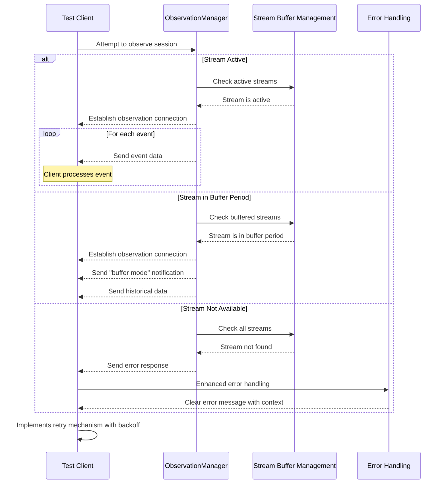

## Testing the Solutions

After implementing these fixes, the test script's `test_supervisor_observation` method should be much more robust, with:

1. More reliable stream timing
2. Better error handling and reporting
3. More comprehensive observation capabilities
4. Fixed user ID/username mapping

The following changes should resolve the reported issues:
- Empty error message when reading observation events
- Race condition in stream completion
- Short buffer periods causing premature stream deregistration
- User ID vs. username mapping inconsistencies

These solutions address both the immediate issues in the test script as well as underlying architectural concerns in the system's design.