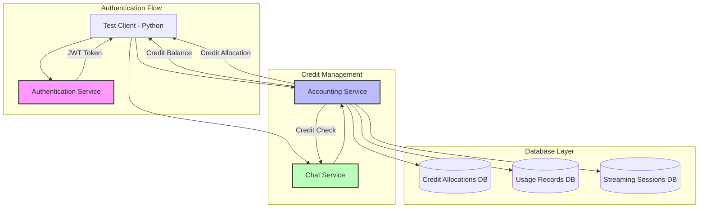
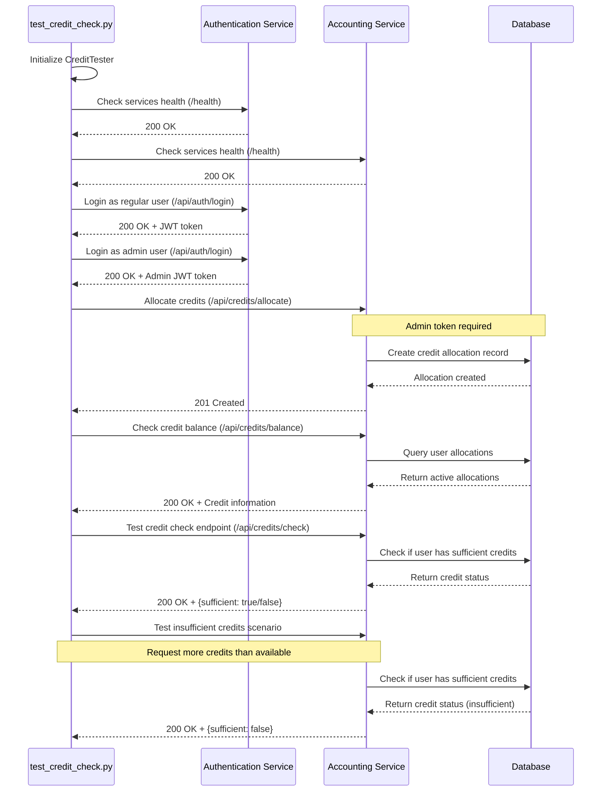
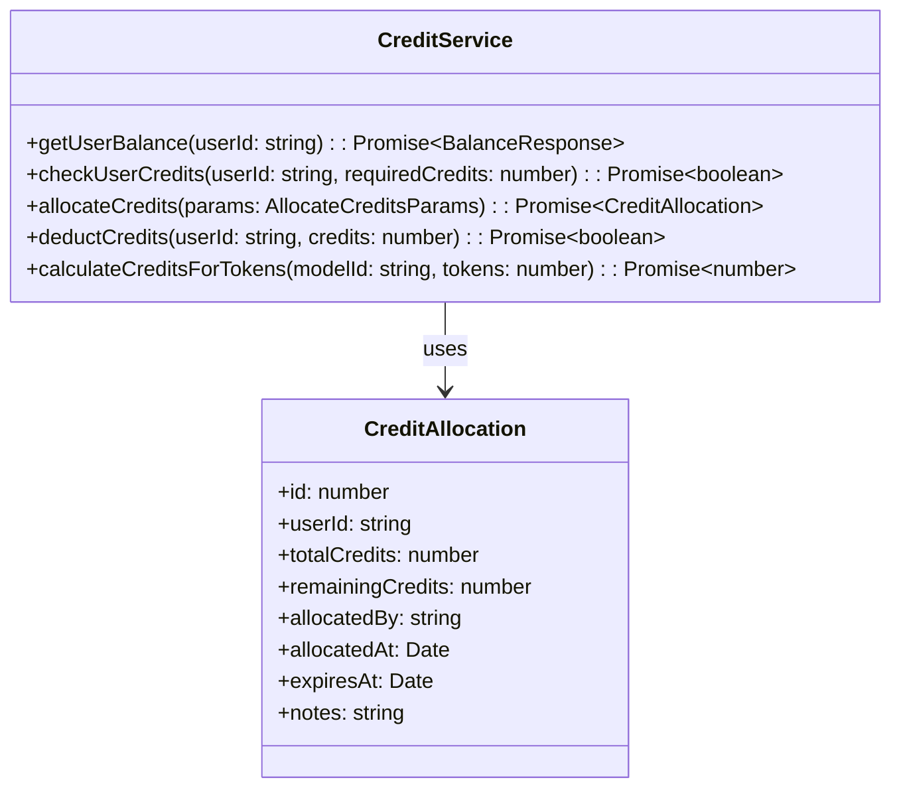
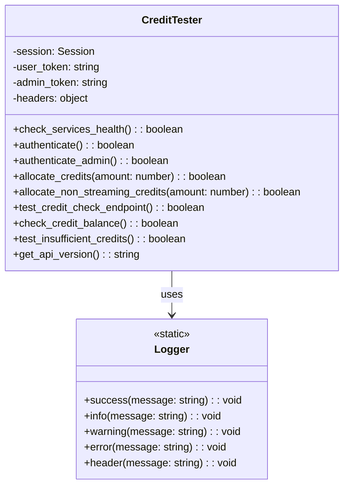
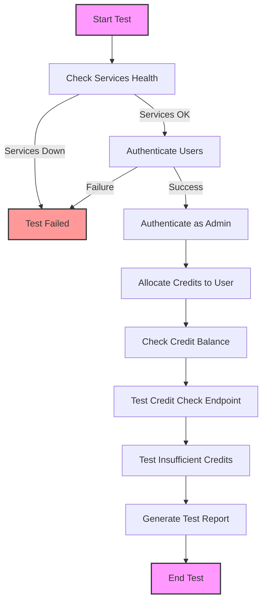
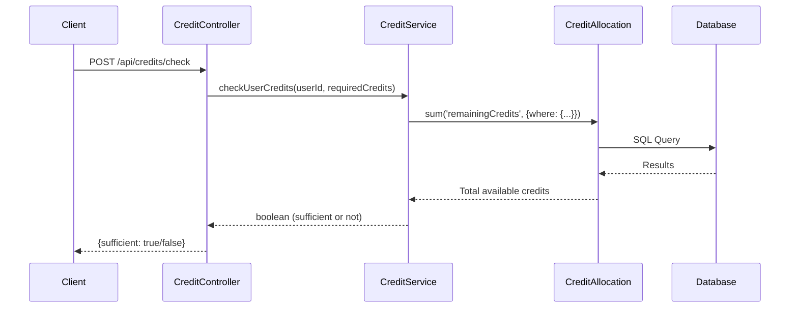
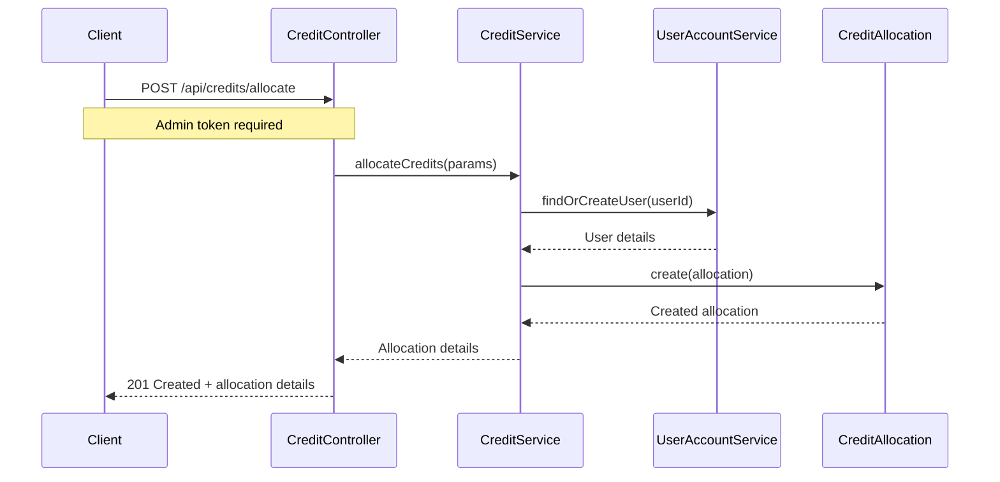
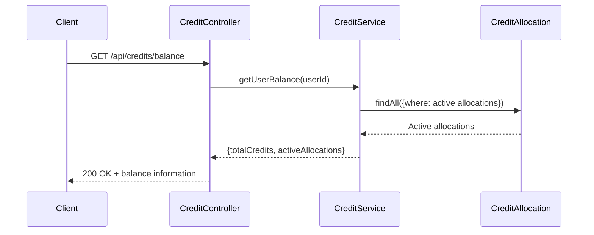

# Understanding the Credit Check Testing System

This document explains how the credit checking functionality works and how it's tested within our microservices architecture.

## What is Credit Checking?

Credit checking is a core functionality that ensures users have sufficient credits before they can use certain services. This is similar to how a prepaid phone plan works - you need to have enough credits in your account to make calls or use data.

## Overview of Components

The credit check system spans multiple services:

- **Authentication Service**: Validates user identity and provides JWT tokens
- **Accounting Service**: Manages credit allocations, balances, and usage
- **Chat Service**: Consumes credits when users interact with the system

The Python test script `test_credit_check.py` verifies that this system works correctly.

## System Architecture Diagram



## Test Flow Sequence Diagram

This diagram shows how the test script interacts with the services:



## Credit Service Class Structure

This diagram shows the TypeScript class that handles credit operations in the accounting service:



## CreditTester Class Structure

This diagram shows the structure of the Python test class:



## Credit Check Testing Flow

This flowchart shows the testing process from start to finish:



## Key TypeScript Components

The test interacts with several TypeScript files in the backend:

### 1. Credit Service Implementation

The main implementation in the accounting service is handled by `credit.service.ts` which provides these key methods:

- **getUserBalance**: Gets the current credit balance for a user
- **checkUserCredits**: Verifies if a user has enough credits for an operation
- **allocateCredits**: Gives credits to a user (admin only)
- **deductCredits**: Removes credits when a user consumes a service
- **calculateCreditsForTokens**: Converts token usage to credit cost

### 2. Credit Allocation Model

The database structure for credit allocations is defined in `credit-allocation.model.ts`.

### 3. Credit Controller

The REST API endpoints that the Python test calls are defined in `credit.controller.ts`:
- GET `/api/credits/balance`: Returns a user's current credit balance
- POST `/api/credits/allocate`: Allocates credits to a user (admin only)
- POST `/api/credits/check`: Checks if a user has sufficient credits

## API Flow Diagrams

### Credit Check API Flow



### Credit Allocation Process



### User Balance Check Process



## Key Concepts for Beginners

### What are Credits?

Credits are a virtual currency in the system that users consume when using services. Think of them like tokens in an arcade - you need them to play games.

### What is a JWT Token?

JWT (JSON Web Token) is used for authentication. It's like a digital ID card that proves who you are to the services. The test gets tokens for both regular and admin users.

### What is an API Endpoint?

An API endpoint is like a specific doorway into the service. Each endpoint has a unique address (URL) and performs a specific function:
- `/health` checks if a service is running properly
- `/api/auth/login` lets users log in and get tokens
- `/api/credits/allocate` adds credits to a user account
- `/api/credits/check` verifies if a user has enough credits

### What is the Test Actually Checking?

The test verifies that:
1. Users can't use services if they don't have enough credits
2. Users with sufficient credits can access services
3. Admins can allocate credits to users
4. The credit balance is correctly tracked

## Running the Test

To run this test, execute:

```bash
python test_credit_check.py
```

The test will output its progress and results, letting you know if the credit checking system is working correctly.

## Debugging the Credit Check Test

This section documents the troubleshooting process for issues encountered with the credit check test.

### Initial Problem

When running the insufficient credits scenario test, we encountered the following error:

```
================================================================================
TESTING INSUFFICIENT CREDITS SCENARIO
================================================================================
[INFO] Current balance: 29829 credits
[INFO] Testing credit check with 30829 credits (more than available)
[ERROR] Credit check incorrectly reported sufficient credits
```

The test was showing that the system reported sufficient credits even when the user didn't have enough.

### Investigation Process

#### Step 1: Parameter Name Analysis

Our first investigation focused on the parameter names being used in the API request. We found potential inconsistency between the test code and API expectations:

```python
# In test_insufficient_credits method
json={
    "credits": current_balance + 1000  # Using "credits" parameter name
}

# In test_credit_check_endpoint method
json={
    "requiredCredits": 100  # Using "requiredCredits" parameter name
}
```

This inconsistency could lead to confusing behavior where one endpoint works and another fails.

#### Step 2: Examining Controller Code

Looking at the `credit.controller.ts` file in the accounting service, we found:

```typescript
const { credits: requiredCredits } = req.body;

if (typeof requiredCredits !== 'number' || requiredCredits <= 0) {
  return res.status(400).json({ message: 'Valid credits amount required' });
}
```

This confirmed that the API expected a parameter named `credits`, and was using destructuring to rename it to `requiredCredits` internally.

#### Step 3: Error Handling in Chat Service

We found a key issue in the chat service's credit.service.ts file:

```typescript
// In chat-service/src/services/credit.service.ts
catch (error) {
  logger.error('Error checking user credits:', error);
  
  // Instead of failing, default to allowing the operation if credit check fails
  logger.warn(`Credit check failed, defaulting to allow operation for user ${userId}`);
  return true;  // THIS IS THE ISSUE - DEFAULTS TO TRUE ON ERROR
}
```

The service was defaulting to allowing operations when credit checks failed, creating a security issue.

### Root Causes

We identified several issues that contributed to the problem:

1. **Parameter Name Inconsistency**: The test code was using inconsistent parameter names across different methods (`credits` in one place, `requiredCredits` in another).

2. **Fail-Open Error Handling**: The chat service was defaulting to allowing operations when credit checks failed, which is a security vulnerability.

3. **Response Field Handling**: The code was checking for both `hasSufficientCredits` and `sufficient` in the response, indicating potential API evolution without proper updates.

4. **Debug Logging**: Insufficient logging made it difficult to trace exactly what was happening during the API calls.

### Solution Implemented

We made the following changes to resolve the issues:

1. **Fixed Parameter Naming**:
   - Updated all tests to consistently use the `credits` parameter name
   - Updated the controller to support both parameter names for backward compatibility

```typescript
// Support both parameter names for backward compatibility  
const { credits, requiredCredits: reqCredits } = req.body;
const requiredCredits = credits !== undefined ? credits : reqCredits;
```

2. **Improved Error Handling**:
   - Changed the chat service to fail securely (deny operation) when credit checks encounter errors
   - Added more detailed error logging with response data

```typescript
// In case of error, fail securely - don't allow operations without confirmed credits
logger.warn(`Credit check failed, defaulting to deny operation for user ${userId}`);
return false;
```

3. **Added Robust Parameter Validation**:
   - Added explicit validation for the required credits parameter
   - Added debug logging to show exactly what parameters were being used

4. **Improved Response Handling**:
   - Standardized on using the `sufficient` field from the API response
   - Added debug logging for the full API response

### Key Takeaways

1. **API Parameter Consistency**: Always ensure consistent parameter names across your API endpoints and client code.

2. **Fail Securely**: Security-critical operations should default to a secure state (deny) when errors occur, not to a permissive state.

3. **Robust Validation**: Always validate input parameters, especially for type and range constraints.

4. **Detailed Logging**: Add sufficient logging to help trace issues in API interactions, especially in testing environments.

5. **Backward Compatibility**: When updating APIs, consider supporting both old and new parameter names to avoid breaking clients during transition periods.

### Testing After Fixes

After implementing the fixes, the credit check system correctly identifies insufficient credits scenarios, returning:

```
================================================================================
TESTING INSUFFICIENT CREDITS SCENARIO
================================================================================
[INFO] Current balance: 29829 credits
[INFO] Testing credit check with 30829 credits (more than available)
[SUCCESS] Credit check correctly identified insufficient credits
[INFO] {"sufficient": false, "message": "Insufficient credits"}
```