# Test Flows Documentation

This document outlines the various test flows within the system, illustrated with Mermaid sequence diagrams.

## 1. User Authentication Flow

**Description:** This flow covers the process of a user authenticating with the system, typically involving credential validation and token issuance.

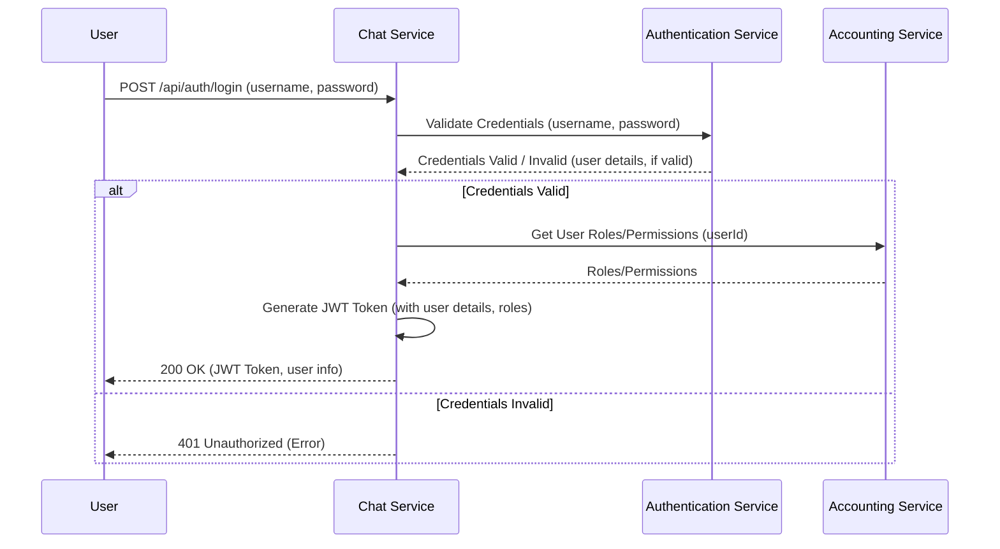

**Relevant Files and Functions:**
*   **`ChatService`** (if it proxies authentication as per diagram):
    *   `src/server.ts`: Routes `/api/auth` (hypothetical).
    *   `src/controllers/auth.controller.ts` (hypothetical): `login()` method.
        *   Makes an external call to `Authentication Service`.
        *   Calls `AccountingService` for roles/permissions.
    *   `src/services/auth.service.ts` (hypothetical): For JWT generation if done by ChatService.
*   **`Authentication Service`** (External):
    *   Handles user credential validation (e.g., `/auth/login` endpoint).
*   **`AccountingService`** (when called by ChatService for roles):
    *   `src/server.ts`: Routes `/api/users` or a specific role endpoint.
    *   `src/controllers/user.controller.ts` (hypothetical): `getUserRoles()` or `getUserPermissions()`.
    *   `src/services/user.service.ts` (hypothetical): Logic for fetching user roles.
*   **Note:** `test_chat_service.py` authenticates directly with `AUTH_SERVICE_URL`. If `ChatService` doesn't proxy login, the user client gets the token from `AuthService` and then uses it with `ChatService`.

## 2. Chat Session Management Flow

**Description:** This flow encompasses operations related to managing chat sessions, including creation, listing, retrieving details, and deletion.

### 2.1. Create Chat Session

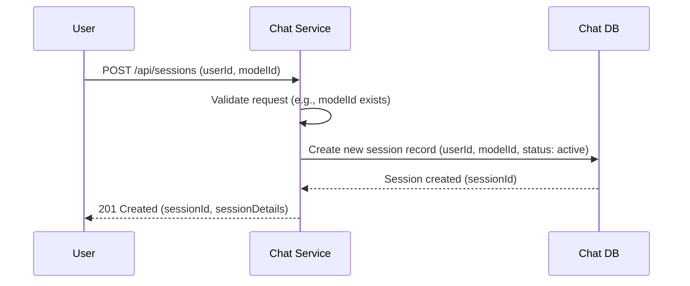

**Relevant Files and Functions:**
*   **`ChatService`**:
    *   `src/server.ts`: Routes `/api/chat/sessions`.
    *   `src/controllers/chat/session.controller.ts`: `createSession()` // 20250523_test_flow
    *   Database interaction for creating session record (e.g., via a model like `src/models/session.model.ts` - hypothetical).

### 2.2. List Chat Sessions

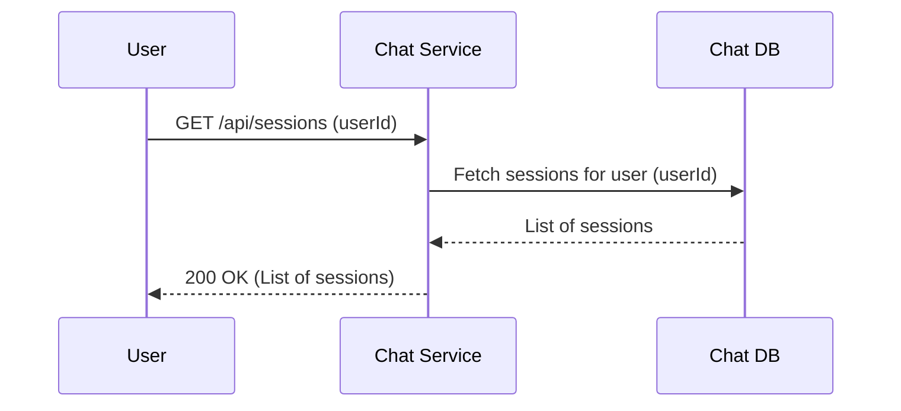

**Relevant Files and Functions:**
*   **`ChatService`**:
    *   `src/server.ts`: Routes `/api/chat/sessions`.
    *   `src/controllers/chat/session.controller.ts`: `listSessions()` // 20250523_test_flow
    *   Database interaction for fetching sessions.

### 2.3. Get Session Details

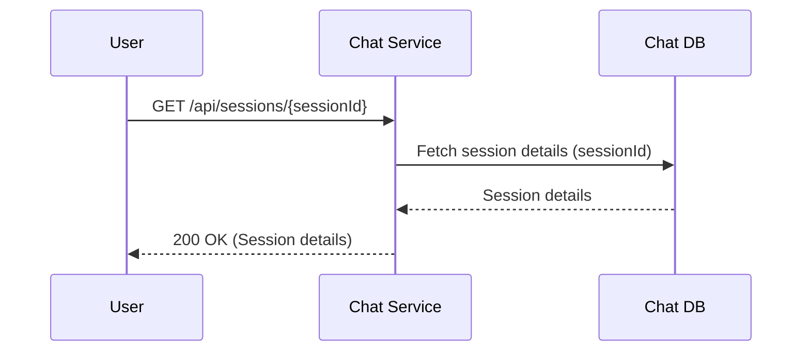

**Relevant Files and Functions:**
*   **`ChatService`**:
    *   `src/server.ts`: Routes `/api/chat/sessions/{sessionId}`.
    *   `src/controllers/chat/session.controller.ts`: `getSession()` // 20250523_test_flow
    *   Database interaction for fetching session details.

### 2.4. Delete Chat Session

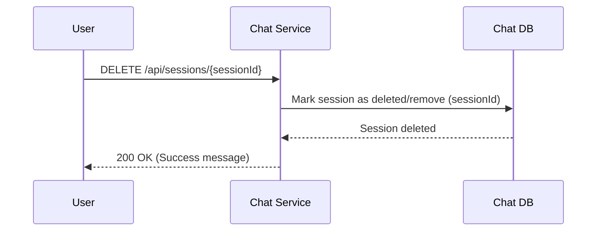

**Relevant Files and Functions:**
*   **`ChatService`**:
    *   `src/server.ts`: Routes `/api/chat/sessions/{sessionId}`.
    *   `src/controllers/chat/session.controller.ts`: `deleteSession()` // 20250523_test_flow
    *   Database interaction for deleting/marking session.

## 3. Non-Streaming Message Flow

**Description:** This flow details the process of sending a message and receiving a complete, non-streamed response from an LLM.

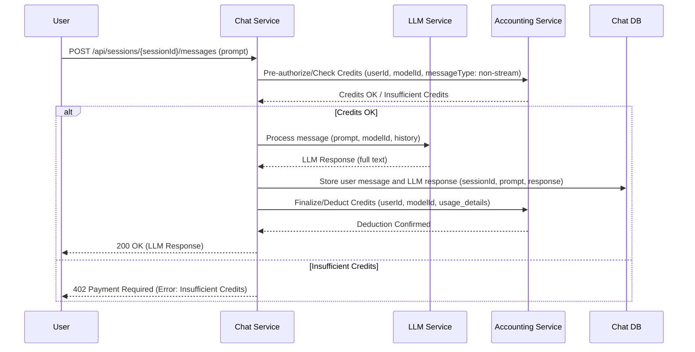

**Relevant Files and Functions:**
*   **`ChatService`**:
    *   `src/server.ts`: Routes `/api/chat/sessions/{sessionId}/messages`.
    *   `src/controllers/chat/message.controller.ts`: `sendMessage()` // 20250523_test_flow
    *   `src/services/credit.service.ts`:
        *   `checkUserCredits()` // 20250523_test_flow (calls AccountingService)
        *   `calculateRequiredCredits()` // 20250523_test_flow (calls AccountingService)
        *   `recordChatUsage()` // 20250523_test_flow (calls AccountingService)
    *   `src/services/llm.service.ts` (hypothetical) or direct SDK usage: For `Process message` to `LLMService`.
    *   Database interaction: To store messages (e.g., `src/models/message.model.ts` - hypothetical).
*   **`AccountingService`**:
    *   `src/server.ts`: Routes `/api/credits/check`, `/api/credits/calculate`, `/api/usage/record`.
    *   `src/controllers/credit.controller.ts`:
        *   `checkCredits()` // 20250523_test_flow
        *   `calculateCredits()` // 20250523_test_flow
    *   `src/services/credit.service.ts`:
        *   `checkUserCredits()` // 20250523_test_flow
        *   `calculateCreditsForTokens()` // 20250523_test_flow
    *   `src/controllers/usage.controller.ts`: `recordUsage()` // 20250523_test_flow
    *   `src/services/usage.service.ts`: `recordUsage()` // 20250523_test_flow
*   **`LLMService`**: External service.

## 4. Streaming Chat Response Flow

**Description:** This flow illustrates how a user receives a chat response streamed in chunks from the LLM.

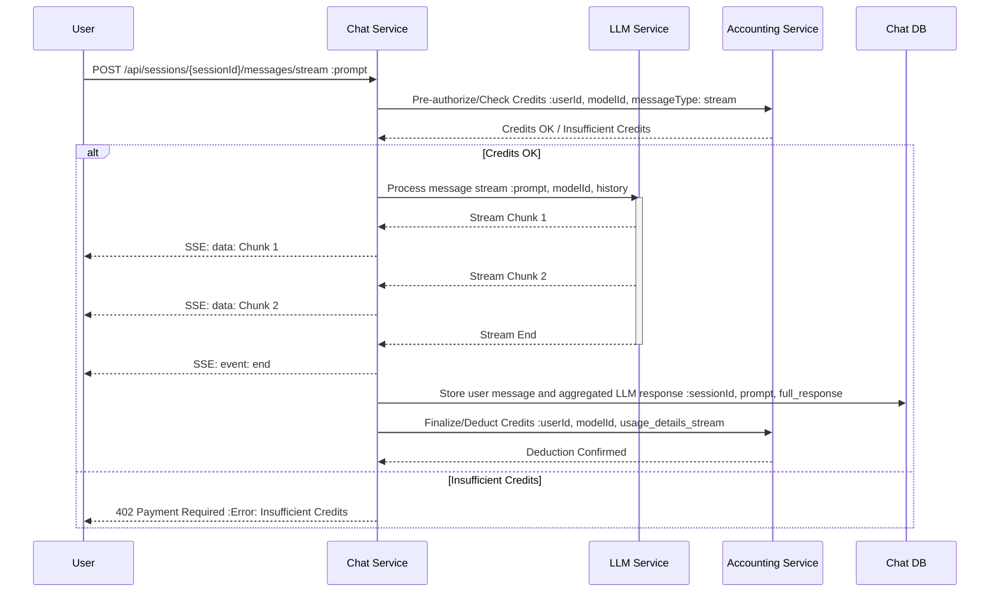

**Relevant Files and Functions:**
*   **`ChatService`**:
    *   `src/server.ts`: Routes `/api/chat/sessions/{sessionId}/stream` (Note: `test_chat_service.py` uses `/stream`, diagram `/messages/stream`).
    *   `src/controllers/chat/message.controller.ts`: `streamChatResponse()` (or similar method for streaming) // 20250523_test_flow
    *   `src/services/credit.service.ts`: (Same as Non-Streaming Flow for credit checks and recording)
        *   `checkUserCredits()` // 20250523_test_flow
        *   `calculateRequiredCredits()` // 20250523_test_flow
        *   `recordChatUsage()` // 20250523_test_flow
    *   `src/services/streaming.service.ts`: // 20250523_test_flow
        *   `initializeStreamingSession()`
        *   `streamResponse()`
        *   `extractTextFromChunk()`
    *   `src/controllers/chat/session.controller.ts` or `message.controller.ts`: Handles `POST /update-stream` (from `test_chat_service.py`) for storing aggregated response.
    *   Database interaction: To store aggregated response.
*   **`AccountingService`**: (Same as Non-Streaming Flow)
*   **`LLMService`**: External service (supports streaming).

## 5. Model Recommendation Flow

**Description:** This flow describes how the system recommends suitable LLM models to the user, possibly based on context or user preferences.

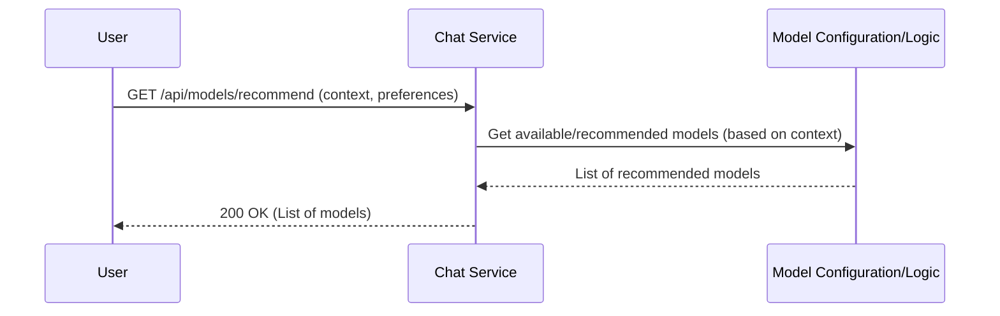

**Relevant Files and Functions:**
*   **`ChatService`**:
    *   `src/server.ts`: Routes `/api/models/recommend`.
    *   `src/controllers/model.controller.ts`: `getModelRecommendation()` // 20250523_test_flow
    *   `src/services/model-recommendation.service.ts`: `recommendModel()` // 20250523_test_flow, `getAvailableModels()` // 20250523_test_flow

## 6. Supervisor Observation Flow

**Description:** This flow allows a supervisor to observe an active chat session between a user and the LLM in real-time.

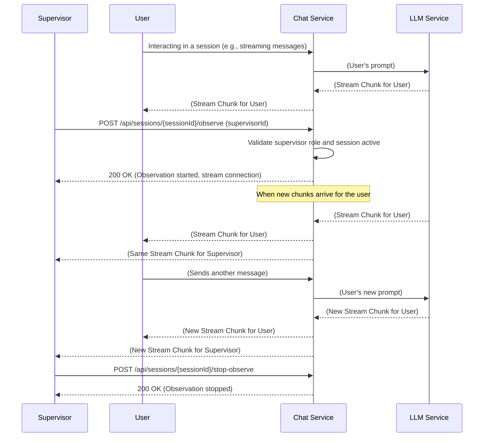

**Relevant Files and Functions:**
*   **`ChatService`**:
    *   User Interaction: (Covered by Flow 3 or 4, e.g., `message.controller.ts`, `streaming.service.ts`)
    *   `src/server.ts`: Routes `/api/chat/sessions/{sessionId}/observe` and `/stop-observe`.
    *   `src/controllers/chat/supervisor.controller.ts`:
        *   `observeSession()` // 20250523_test_flow
        *   `stopObserveSession()` (hypothetical, for `/stop-observe`)
    *   `src/services/observation.service.ts` (`ObservationManager`): // 20250523_test_flow
        *   `addObserver()`
        *   `registerStream()` (called by message streaming flow)
        *   Handles distributing stream chunks to supervisor.
*   **`LLMService`**: External service.

## 7. Insufficient Credits Flow

**Description:** This flow details how the system handles a situation where a user attempts an action but lacks sufficient credits.

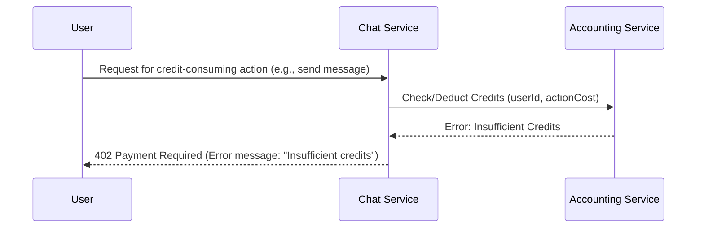

**Relevant Files and Functions:**
*   **`ChatService`**:
    *   `src/controllers/chat/message.controller.ts`: In `sendMessage()` or `streamChatResponse()`, handles the error from `credit.service.ts`.
    *   `src/services/credit.service.ts`: `checkUserCredits()` returns false or error. // 20250523_test_flow
*   **`AccountingService`**:
    *   `src/controllers/credit.controller.ts`: `checkCredits()` method returns insufficient credits. // 20250523_test_flow
    *   `src/services/credit.service.ts`: `checkUserCredits()` logic determines insufficiency. // 20250523_test_flow

## 8. Admin Credit Allocation Flow

**Description:** This flow shows an administrator allocating credits to a user.

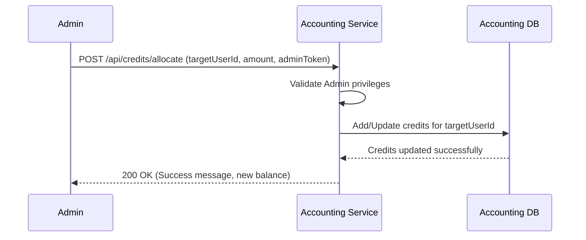

**Relevant Files and Functions:**
*   **`AccountingService`**:
    *   `src/server.ts`: Routes `/api/credits/allocate`.
    *   `src/controllers/credit.controller.ts`: `allocateCredits()` // 20250523_test_flow
    *   `src/services/credit.service.ts`: `allocateCredits()` // 20250523_test_flow
    *   Database interaction: To update user credits (e.g., `src/models/user.model.ts` or `credit.model.ts`).

## 9. End-to-End Test Flow

**Description:** A comprehensive flow that integrates multiple system components, simulating a realistic user journey. (Adapted from `comprehensiveTesting.md`)

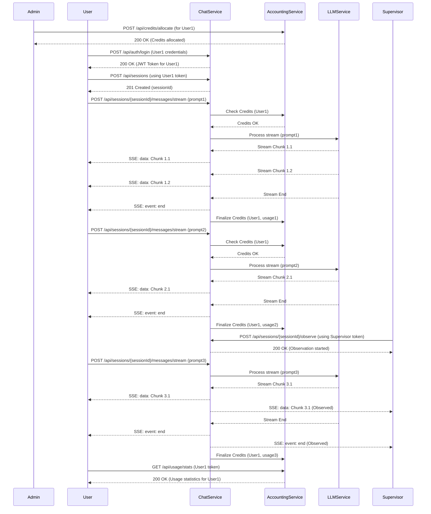

**Relevant Files and Functions (Highlights):**
*   **Admin Allocates Credits (`AccountingService`)**:
    *   `src/controllers/credit.controller.ts`: `allocateCredits()` // 20250523_test_flow
    *   `src/services/credit.service.ts`: `allocateCredits()` // 20250523_test_flow
*   **User Login (`AuthService`)**: External.
*   **User Creates Session (`ChatService`)**:
    *   `src/controllers/chat/session.controller.ts`: `createSession()` // 20250523_test_flow
*   **User Sends Streaming Message (`ChatService`, `AccountingService`, `LLMService`)**:
    *   `ChatService`:
        *   `src/controllers/chat/message.controller.ts`: `streamChatResponse()` // 20250523_test_flow
        *   `src/services/credit.service.ts`: `checkUserCredits()`, `calculateRequiredCredits()`, `recordChatUsage()` // 20250523_test_flow
        *   `src/services/streaming.service.ts` // 20250523_test_flow
    *   `AccountingService`:
        *   `src/controllers/credit.controller.ts`: `checkCredits()`, `calculateCredits()` // 20250523_test_flow
        *   `src/controllers/usage.controller.ts`: `recordUsage()` // 20250523_test_flow
*   **Supervisor Observes Session (`ChatService`)**:
    *   `src/controllers/chat/supervisor.controller.ts`: `observeSession()` // 20250523_test_flow
    *   `src/services/observation.service.ts` // 20250523_test_flow
*   **User Gets Usage Stats (`AccountingService`)**:
    *   Endpoint: `/api/statistics/usage` (from `test_chat_service.py`)
    *   `src/controllers/usage.controller.ts`: `getUserStats()` // 20250523_test_flow
    *   `src/services/usage.service.ts`: `getUserStats()` // 20250523_test_flow

## 10. Rate Limiting Flow

**Description:** This flow demonstrates how the system enforces rate limits on user requests to prevent abuse.

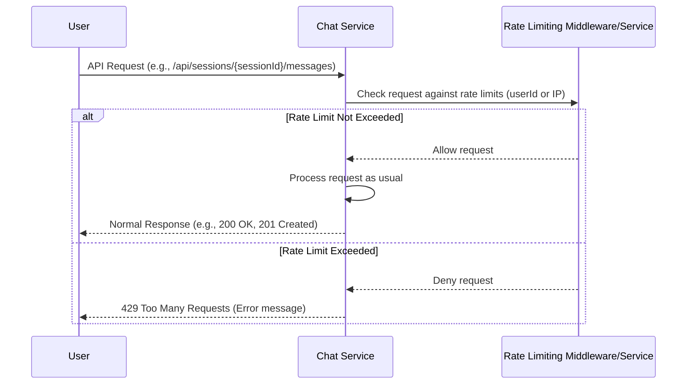

**Relevant Files and Functions:**
*   **`ChatService`**:
    *   `src/server.ts`: Applies rate limiting middleware.
    *   `src/middleware/rateLimiter.middleware.ts` (hypothetical): Contains the rate limiting logic (e.g., using `express-rate-limit`).

## 11. Invalid Model ID Flow

**Description:** This flow shows system behavior when a user requests a model that is not available or invalid.

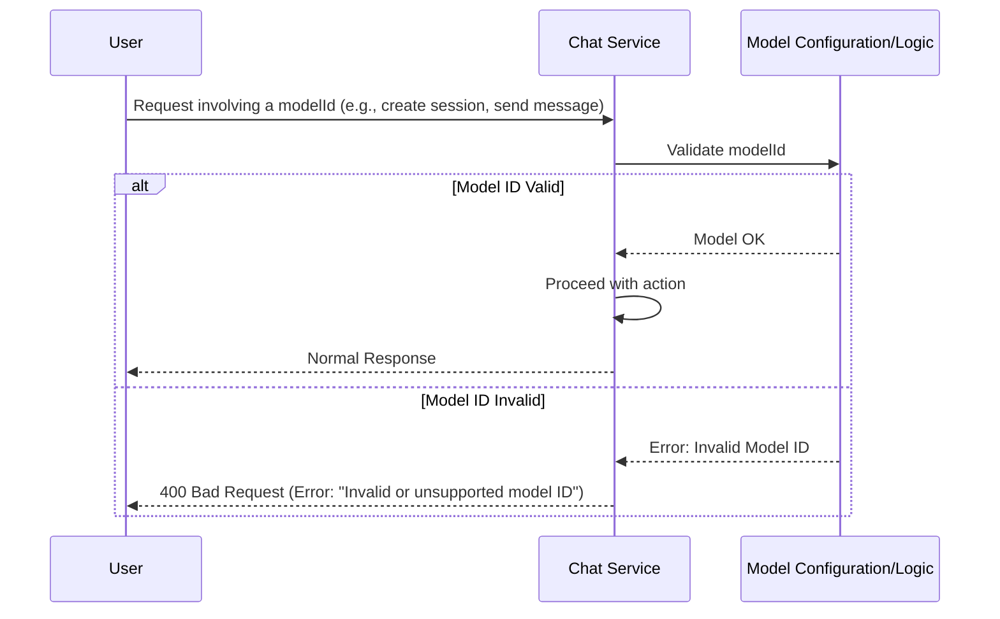

**Relevant Files and Functions:**
*   **`ChatService`**:
    *   `src/controllers/chat/session.controller.ts`: In `createSession()`, validates `modelId`.
    *   `src/controllers/chat/message.controller.ts`: In `sendMessage()` or `streamChatResponse()`, validates `modelId`.
    *   `src/services/model-recommendation.service.ts`: `getAvailableModels()` could be used for validation. // 20250523_test_flow

## 12. Service Authentication Failure Flow

**Description:** This flow outlines how the system handles authentication failures when one internal service tries to communicate with another.

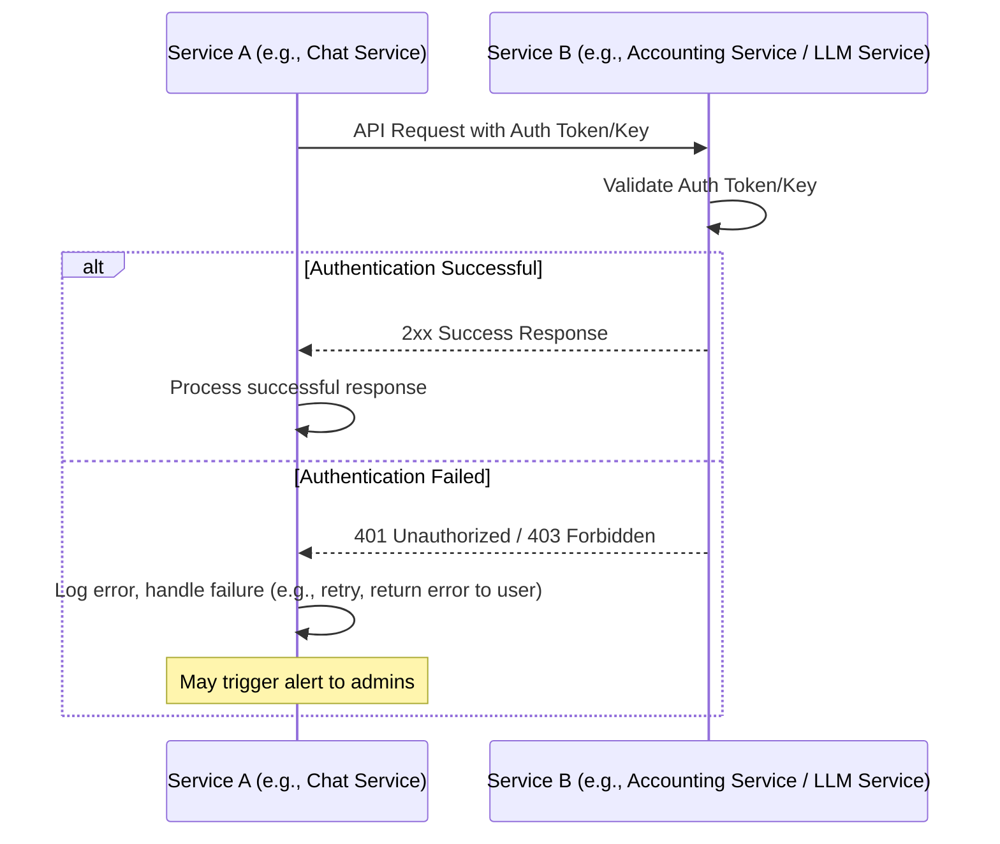

**Relevant Files and Functions:**
*   **`InitiatingService`** (e.g., `ChatService` calling `AccountingService`):
    *   The service making the call, e.g., `chat-service/src/services/credit.service.ts` // 20250523_test_flow, would handle HTTP errors like 401/403 from the `TargetService`.
*   **`TargetService`** (e.g., `AccountingService`):
    *   `src/server.ts`: Applies authentication middleware.
    *   `src/middleware/auth.middleware.ts` (hypothetical): Validates incoming tokens/keys for inter-service communication.

