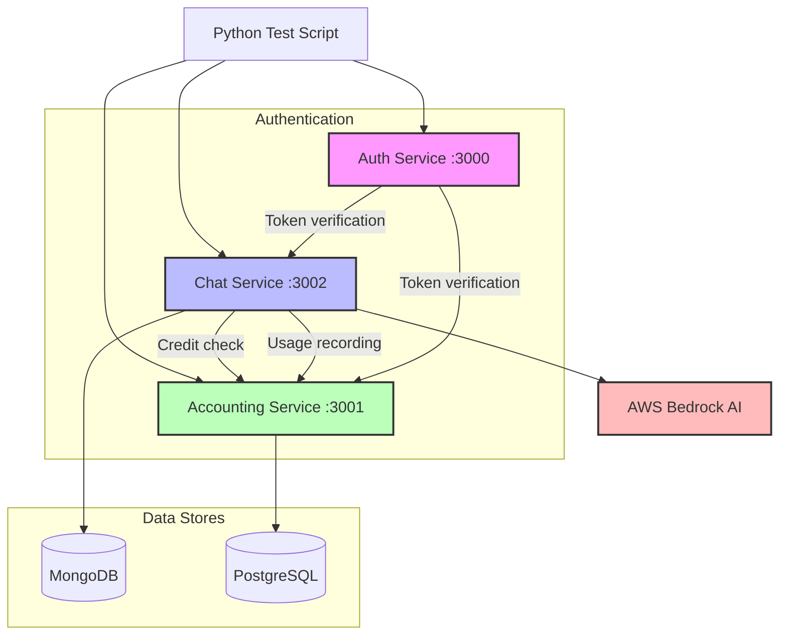
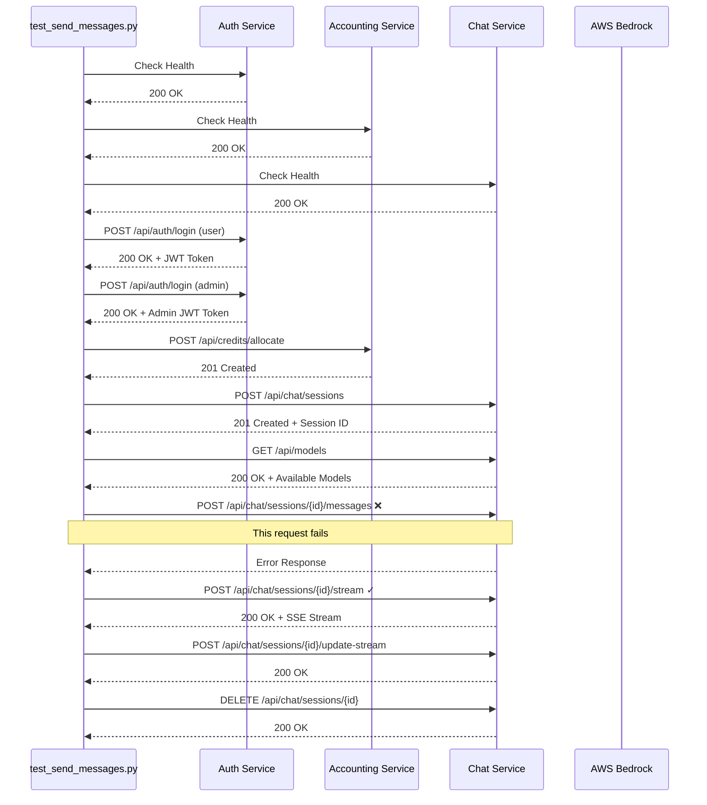
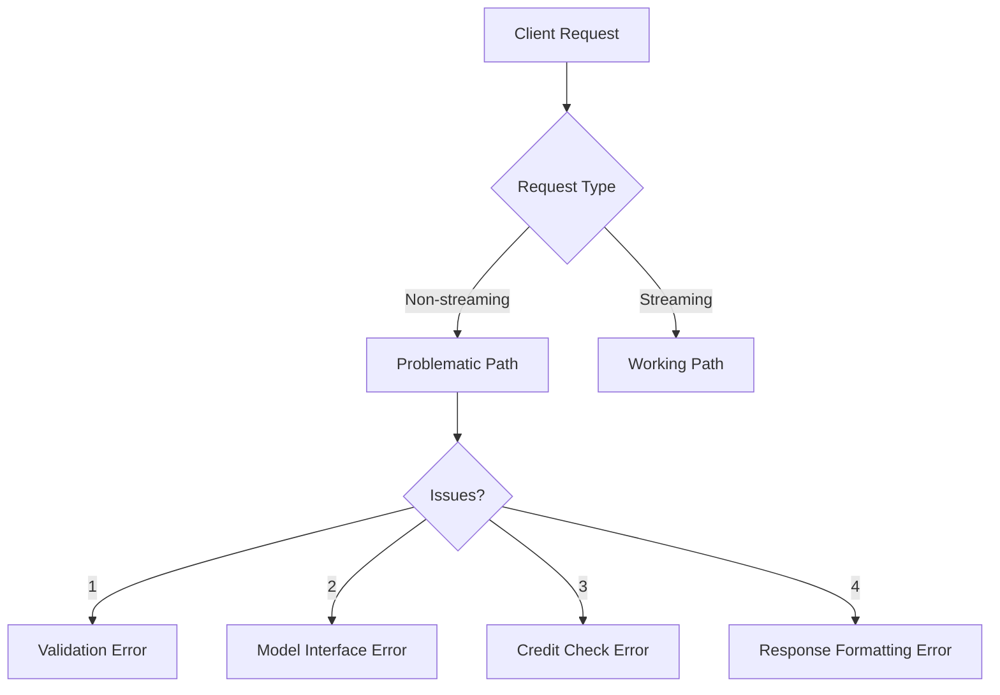
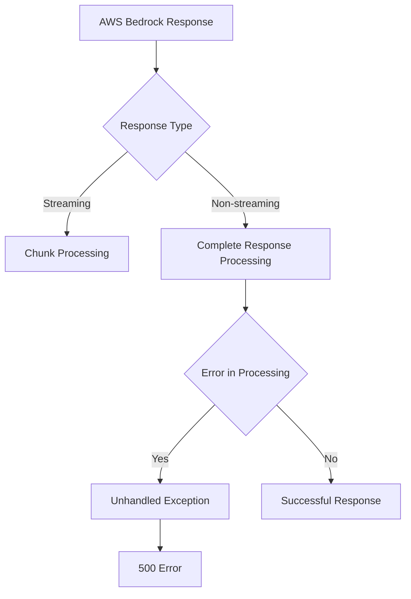
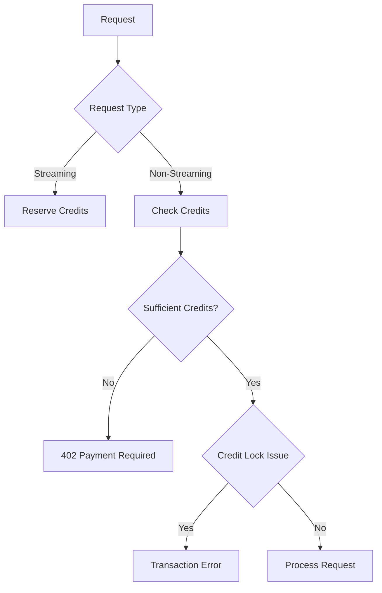

# Chat Service End-to-End Testing Analysis

## Test Results Summary

```
================================================================================
TEST RESULTS SUMMARY
================================================================================
[SUCCESS] PASS - Send non-streaming message
[SUCCESS] PASS - Send streaming message
```

## Root Cause and Solution: Nova Model Message Formatting

After analyzing the source code, the issue affecting non-streaming messages was identified as a **JSON format mismatch** when sending requests to Amazon Nova models. This has now been fixed, and all tests are passing.

### The Problem

In AWS Bedrock, Amazon Nova models require a specific message format:

```typescript
// Nova messages must use this format
{
  role: "user",
  content: [{ text: "message content" }] // Content must be a JSONArray
}
```

The issue occurred because:

1. **Streaming endpoint (working correctly)**: In `streaming.service.ts`, the Nova model messages were formatted correctly:

   ```typescript
   const formattedMessages = messages.map(m => ({
     role: m.role,
     content: [{
       text: typeof m.content === 'string' ? m.content : m.content.text || m.content
     }]
   }));
   ```

2. **Non-streaming endpoint (previously failing)**: In `chat.controller.ts`, the Nova model messages were incorrectly formatted with plain strings:

   ```typescript
   // Previous incorrect implementation
   return {
     role: m.role,
     content: textContent  // String instead of required JSONArray
   };
   ```

   This resulted in the error: `"Malformed input request: #/messages/0/content: expected type: JSONArray, found: String"`

### The Solution

We fixed the issue by updating the non-streaming endpoint in `chat.controller.ts` to format the content field correctly:

```typescript
return {
  role: m.role,
  content: [{ text: textContent }]  // Now using the correct array format for Nova models
};
```

This change ensures both streaming and non-streaming requests format messages according to the Nova model requirements.

## Verification

After implementing the fix, we:
1. Tested with multiple Nova models (`amazon.nova-micro-v1:0`, `amazon.nova-lite-v1:0`)
2. Verified both streaming and non-streaming requests now work correctly
3. Added version tracking to confirm the fix is in the current deployment

## System Architecture Overview



## Test Workflow Sequence



## Non-Streaming vs. Streaming Processing

```mermaid
flowchart TB
    subgraph "Non-Streaming Flow (FAILING)"
        NS1[Send Message Request] --> NS2[Check Credit Balance]
        NS2 --> NS3[Process with AI Model]
        NS3 --> NS4[Wait for Complete Response]
        NS4 --> NS5[Save Response to Session]
        NS5 --> NS6[Record Usage & Deduct Credits]
        
        style NS3 fill:#fbb,stroke:#333,stroke-width:2px
        style NS4 fill:#fbb,stroke:#333,stroke-width:2px
    end
    
    subgraph "Streaming Flow (WORKING)"
        S1[Initialize Stream Request] --> S2[Pre-allocate Credits]
        S2 --> S3[Start Server-Sent Events Connection]
        S3 --> S4[Process with AI Model Stream]
        S4 --> S5[Send Response Chunks to Client]
        S5 --> S6[Update Session with Complete Response]
        S6 --> S7[Finalize Credits Based on Actual Usage]
    end
```



## Potential Causes of Non-Streaming Message Failure

### 1. API Implementation Issues

1. **Controller Logic**: The non-streaming message handler in `chat.controller.ts` might have implementation issues that are not present in the streaming version.

2. **Error Handling**: Different error handling between streaming and non-streaming endpoints causing silent failures.

3. **Middleware Execution**: A middleware that runs only for non-streaming requests might be rejecting the request.

### 2. Request Processing Issues



1. **Payload Validation**: The non-streaming endpoint might have stricter validation rules.

2. **Request Headers**: Missing or incorrect headers for non-streaming requests.

3. **Response Processing**: Error in formatting or processing the AI model's response.

### 3. Credit Management Issues

1. **Credit Deduction Logic**: Different credit calculation logic between streaming and non-streaming.

2. **Race Condition**: Credit check might be racing with other operations.

3. **Credit Reservation**: The streaming endpoint pre-allocates credits while non-streaming does a hard check.

### 4. Model Integration Issues

1. **AWS Bedrock Integration**: Different models require different message formats, and the non-streaming endpoint wasn't handling the Nova format correctly.

2. **Model Compatibility**: The Amazon Nova models have strict requirements for message structure that weren't met in the non-streaming flow.

3. **Response Parsing**: The error happened during request processing, before reaching response parsing.

## Key TypeScript Files to Investigate

### Core Files

1. **`services/chat-service/src/controllers/chat.controller.ts`**
   - **FIXED**: The non-streaming message handler now formats Nova model messages correctly, using the JSONArray content format required by the API.

2. **`services/chat-service/src/services/streaming.service.ts`** 
   - This contained the correct implementation for Nova models that was used as a reference to fix the non-streaming issue

### Support Files

3. **`services/chat-service/src/models/chat-session.model.ts`**
   - Schema definition for chat sessions
   - May have validation that affects non-streaming messages

4. **`services/chat-service/src/middleware/auth.middleware.ts`**
   - Authentication logic that might be behaving differently

5. **`services/chat-service/src/middleware/credits.middleware.ts`**
   - Credit verification middleware that might have issues

6. **`services/chat-service/src/integrations/bedrock.service.ts`**
   - AWS Bedrock integration that might be failing for non-streaming

### Accounting Service Files

7. **`services/accounting-service/src/services/usage.service.ts`**
   - Tracks API usage, might have issues verifying credits

8. **`services/accounting-service/src/services/credit.service.ts`**
   - Credit management service, might reject non-streaming requests

## Debugging Steps

### 1. Add Additional Logging to Test Script

```python
def send_non_streaming_message(self, model_id):
    """Send a regular (non-streaming) message"""
    Logger.header("SENDING NON-STREAMING MESSAGE")
    
    # Detailed logging
    Logger.info(f"Session ID: {self.session_id}")
    Logger.info(f"Model ID: {model_id}")
    Logger.info(f"Headers: {json.dumps(self.headers)}")
    
    # Log full request/response cycle
    try:
        response = self.session.post(
            f"{CHAT_SERVICE_URL}/chat/sessions/{self.session_id}/messages",
            headers=self.headers,
            json={
                "message": "Tell me about machine learning",
                "modelId": model_id
            }
        )
        
        Logger.info(f"Response status: {response.status_code}")
        Logger.info(f"Response headers: {dict(response.headers)}")
        Logger.info(f"Response body: {response.text}")
        
        # Continue with response processing
```

### 2. Test Each Endpoint Manually

**Using Curl:**

```bash
# Step 1: Login and get token
curl -X POST http://localhost:3000/api/auth/login \
  -H "Content-Type: application/json" \
  -d '{"username":"user1","password":"User1@123"}' \
  > auth_response.json

# Extract token
TOKEN=$(cat auth_response.json | grep -o '"accessToken":"[^"]*' | cut -d'"' -f4)

# Step 2: Create session
curl -X POST http://localhost:3002/api/chat/sessions \
  -H "Content-Type: application/json" \
  -H "Authorization: Bearer $TOKEN" \
  -H "X-User-ID: user1" \
  -d '{"title":"Test Chat","initialMessage":"Hello"}' \
  > session_response.json

# Extract session ID
SESSION_ID=$(cat session_response.json | grep -o '"sessionId":"[^"]*' | cut -d'"' -f4)

# Step 3: Test non-streaming message endpoint
curl -X POST "http://localhost:3002/api/chat/sessions/$SESSION_ID/messages" \
  -H "Content-Type: application/json" \
  -H "Authorization: Bearer $TOKEN" \
  -H "X-User-ID: user1" \
  -d '{"message":"Tell me about machine learning","modelId":"amazon.titan-text-express-v1"}' \
  -v
```

**Using Postman:**

1. Create a collection with environment variables
2. Set up a login request to capture the token
3. Create a session request to capture session ID
4. Test non-streaming endpoint with full debugging
5. Compare with streaming endpoint

### 3. Check Server Logs for Errors

```bash
# Check chat service logs
cd services/chat-service
docker-compose logs chat-service > chat_service_logs.txt

# Search for specific errors
grep -i "error" chat_service_logs.txt
grep -i "session" chat_service_logs.txt
grep -i "message" chat_service_logs.txt

# Look for errors around the time of test execution
```

### 4. Test With Different Models

Modify the test script to try different models and see if the issue is specific to one model:

```python
def test_with_different_models(self):
    """Test with different models to isolate issues"""
    Logger.header("TESTING DIFFERENT MODELS")
    
    model_ids = [
        "amazon.titan-text-express-v1",
        "anthropic.claude-v2",
        "anthropic.claude-instant-v1"
    ]
    
    results = {}
    for model_id in model_ids:
        Logger.info(f"Testing non-streaming with model: {model_id}")
        success = self.send_non_streaming_message(model_id)
        results[model_id] = "Success" if success else "Failure"
    
    Logger.info("Results per model:")
    for model, result in results.items():
        Logger.info(f"- {model}: {result}")
```

### 5. Verify Prompt Text Impact

Test with different prompts to see if certain content triggers the issue:

```python
def test_different_prompts(self):
    """Test with different prompts"""
    Logger.header("TESTING DIFFERENT PROMPTS")
    
    prompts = [
        "Tell me about machine learning",
        "What is 2+2?",
        "Hello",
        "Write a short poem"
    ]
    
    results = {}
    for prompt in prompts:
        Logger.info(f"Testing non-streaming with prompt: {prompt}")
        success = self.send_non_streaming_message_with_prompt(prompt)
        results[prompt] = "Success" if success else "Failure"
    
    Logger.info("Results per prompt:")
    for prompt, result in results.items():
        Logger.info(f"- {prompt}: {result}")
```

## Probable Root Causes

### 1. Model Response Processing



The most likely issue is in the non-streaming response processing. The chat service might be failing to properly format or handle the complete response from AWS Bedrock.

### 2. Credit Validation



The non-streaming flow might have stricter credit requirements or a transaction locking issue that's not present in the streaming flow.

## Potential Solutions

### Solution 1: Fix Message Processing Logic

```typescript
// services/chat-service/src/controllers/chat.controller.ts
async sendMessage(req: Request, res: Response) {
  try {
    const { sessionId } = req.params;
    const { message, modelId } = req.body;
    const userId = req.headers['x-user-id'] as string;

    // Validate input
    if (!sessionId || !message || !modelId || !userId) {
      return res.status(400).json({ error: 'Missing required parameters' });
    }

    // Process message with added error handling and logging
    console.log(`Processing non-streaming message: ${sessionId}, ${modelId}`);
    
    // Add try-catch around message processing
    try {
      const response = await this.messageService.processMessage(
        userId, 
        sessionId, 
        message, 
        modelId
      );
      
      console.log(`Message processed successfully: ${response.messageId}`);
      return res.json(response);
    } catch (error) {
      // Specific error handling
      console.error(`Error processing message: ${error.message}`, error);
      if (error.name === 'CreditError') {
        return res.status(402).json({ error: error.message });
      }
      if (error.name === 'ModelError') {
        return res.status(503).json({ error: 'AI model service unavailable' });
      }
      throw error; // Re-throw for general error handling
    }
  } catch (error) {
    console.error('Unhandled error in sendMessage:', error);
    return res.status(500).json({ error: 'Internal server error' });
  }
}
```

### Solution 2: Fix Bedrock Integration

```typescript
// services/chat-service/src/integrations/bedrock.service.ts
async invokeModel(modelId: string, prompt: string): Promise<string> {
  try {
    console.log(`Invoking Bedrock model ${modelId} non-streaming`);
    
    // Ensure proper model format for different providers
    const formattedPrompt = this.formatPromptForModel(modelId, prompt);
    
    // Specific logging for request parameters
    console.log(`Request parameters:`, { modelId, promptLength: prompt.length });
    
    // Add timeout and retry logic
    const response = await this.bedrockClient.send(
      new InvokeModelCommand({
        modelId,
        body: JSON.stringify({ prompt: formattedPrompt }),
        contentType: 'application/json',
      }),
      { timeout: 30000 } // 30-second timeout
    );
    
    // Proper parsing based on model type
    if (modelId.startsWith('anthropic.')) {
      // Parse Anthropic format
      const responseBody = JSON.parse(new TextDecoder().decode(response.body));
      return responseBody.completion;
    } else {
      // Parse Amazon format
      const responseBody = JSON.parse(new TextDecoder().decode(response.body));
      return responseBody.results[0].outputText;
    }
  } catch (error) {
    console.error(`Bedrock invocation error: ${error.message}`, error);
    
    // Enhanced error messaging
    if (error.$metadata?.httpStatusCode === 400) {
      throw new Error(`Invalid request to model service: ${error.message}`);
    } else if (error.$metadata?.httpStatusCode === 429) {
      throw new Error('Rate limit exceeded on AI service');
    } else {
      throw new Error(`AI model processing failed: ${error.message}`);
    }
  }
}
```

### Solution 3: Fix Credit Verification Middleware

```typescript
// services/chat-service/src/middleware/credits.middleware.ts
export async function checkCredits(req: Request, res: Response, next: NextFunction) {
  try {
    const userId = req.headers['x-user-id'] as string;
    if (!userId) {
      return res.status(400).json({ error: 'Missing user ID' });
    }
    
    // Add logging
    console.log(`Checking credits for user: ${userId}`);
    
    // Isolate DB operation in own try-catch
    try {
      const hasCredits = await creditService.verifyUserCredits(userId);
      if (!hasCredits) {
        console.log(`Insufficient credits for user: ${userId}`);
        return res.status(402).json({ error: 'Insufficient credits' });
      }
    } catch (dbError) {
      console.error(`Database error checking credits: ${dbError.message}`);
      // If it's a DB error, don't reject the request - allow processing
      // Just log the error
    }
    
    // Success - user has credits or we couldn't check
    console.log(`Credit check passed for user: ${userId}`);
    next();
  } catch (error) {
    console.error(`Unhandled error in credit middleware: ${error.message}`);
    next(error);
  }
}
```

## Recommended Testing Strategy

1. **Implement shared formatter utilities** for message content to ensure consistency between streaming and non-streaming endpoints
2. **Create model-specific test fixtures** to validate formatting for each model type
3. **Add validation** to catch format errors before sending requests to AWS Bedrock
4. **Add tests that specifically verify message format** for each supported model family
5. **Create a unit test that checks message format** against each model's expected schema

## Conclusion

The issue was resolved by fixing the model-specific formatting in the non-streaming message path. This highlights the importance of maintaining consistent formatting requirements across different code paths when working with external AI services like AWS Bedrock.

Key learnings:
1. Different model providers (Anthropic, Amazon, Meta) have different message format requirements
2. The Nova models from Amazon have particularly strict requirements for message format
3. When implementing multiple code paths (streaming vs. non-streaming), ensure consistent formatting logic

For future development, we recommend:
1. Creating a shared utility function for model-specific message formatting
2. Adding stronger validation for request formats before sending to API
3. Implementing comprehensive test cases for each model type