# Understanding the Streaming Session ID Test

This document explains how the `test_streaming_session_id.py` script works, including its purpose, components, and flow.

## Purpose of the Test

The test verifies that the chat service correctly validates streaming session IDs when updating chat sessions with streaming responses. This validation is crucial because:

1. It ensures that only authorized clients can update a streaming session
2. It prevents response mixups between different streaming sessions
3. It maintains data integrity between streaming chunks and final responses

## System Architecture

The test interacts with three microservices:

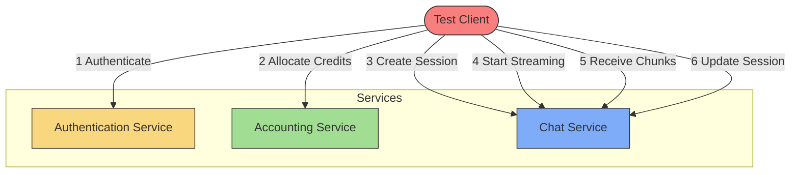

## Test Sequence Diagram

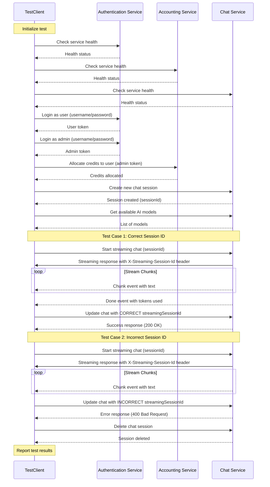

## Key Components of the Script

### 1. Configuration and Setup

The script configures connection URLs for three microservices:

- Authentication Service (port 3000)
- Accounting Service (port 3001)
- Chat Service (port 3002)

It also defines test users:

- Admin user for administration tasks
- Supervisor users (not used in this test)
- Regular users (test uses the first regular user)

### 2. Logger Class

The `Logger` class provides colored console output for different message types:

- Success (green)
- Info (cyan)
- Warning (yellow)
- Error (red)
- Debug (blue)
- Header (magenta)

### 3. StreamingTester Class

This is the main test class with methods for:

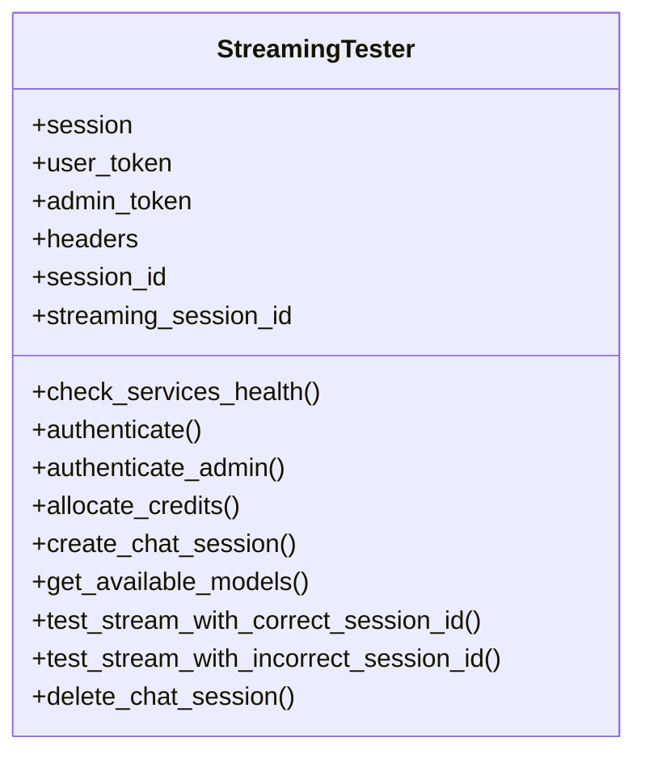

## Test Flow Explanation

### Step 1: Check Service Health

The test begins by checking if all three services (auth, accounting, chat) are running and responding to health checks.

### Step 2: User Authentication

The test authenticates as a regular user to get an access token. This token is added to request headers for subsequent API calls.

### Step 3: Admin Authentication and Credit Allocation

The test:

1. Authenticates as an admin user
2. Uses the admin token to allocate credits to the test user
3. Credits are required to use the chat service

### Step 4: Create Chat Session

The test creates a new chat session with a title and initial message. The chat service returns a session ID that is used in later steps.

### Step 5: Test Case 1 - Correct Session ID Flow

1. Start a streaming chat request
2. Extract the streaming session ID from response headers
3. Receive text chunks from the server (Server-Sent Events)
4. Collect the complete response
5. Send an update request with the correct streaming session ID
6. Verify the update succeeds (200 OK)

### Step 6: Test Case 2 - Incorrect Session ID Flow

1. Start another streaming chat request
2. Receive some text chunks
3. Send an update request with an incorrect streaming session ID
4. Verify the update fails with a 400 error containing "mismatch" in the message

### Step 7: Cleanup

The test deletes the chat session and reports the test results.

## How Streaming Session ID Works

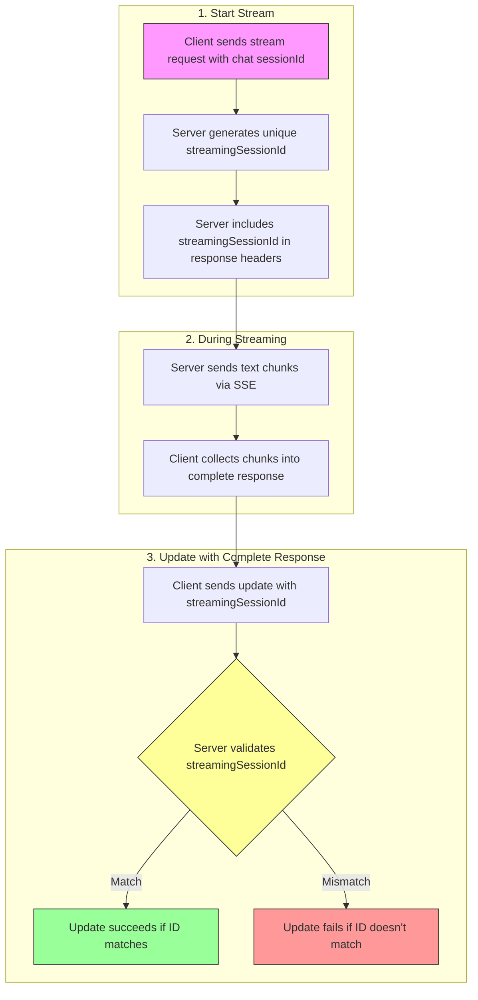

## Why Session ID Validation Matters

1. **Security**: Prevents unauthorized clients from injecting responses
2. **Data Integrity**: Ensures the final update comes from the same client that started streaming
3. **Error Prevention**: Avoids mixing responses between concurrent streaming sessions

## Common Issues and Debugging

If the test fails, check:

1. Are all three services running? (Check health endpoints)
2. Do the test users exist in the system?
3. Does the chat service properly set the X-Streaming-Session-Id header?
4. Is the validation logic for streaming session IDs implemented correctly?
5. Do you have enough credits allocated to the test user?

## Requirements for Running the Test

1. Python 3.x with required packages:
   - requests
   - sseclient
   - colorama
2. All three services running locally on ports 3000, 3001, and 3002
3. Test users created in the system

# Debugging "Streaming Session ID Mismatch" Errors

This section provides a comprehensive guide for debugging the "Streaming Session ID Mismatch" error.

## Understanding the Error

When you see this error:

```
[ERROR] Failed to update stream response: 400, {"message":"Streaming session ID mismatch"}
```

It means that the server rejected your attempt to update a streaming chat session because the streamingSessionId you provided doesn't match what the server expects.

## Root Causes of the Error

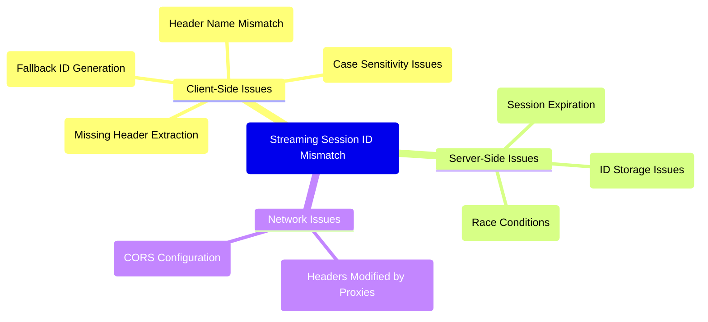

## Detailed Error Flow

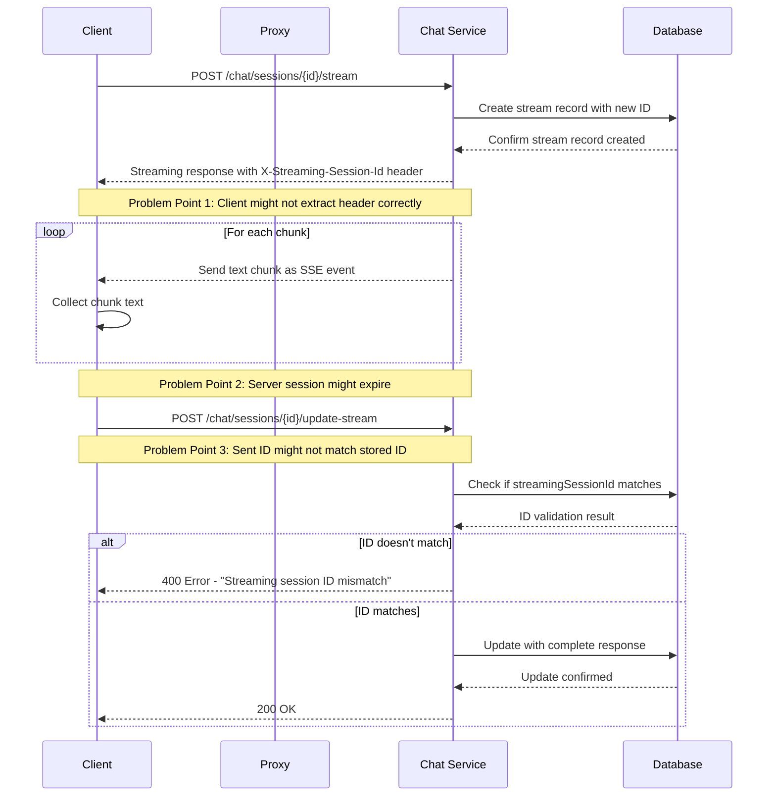

## Step-by-Step Debugging

### 1. Add Detailed Header Logging

The first step is to verify what headers are actually being sent by the server:

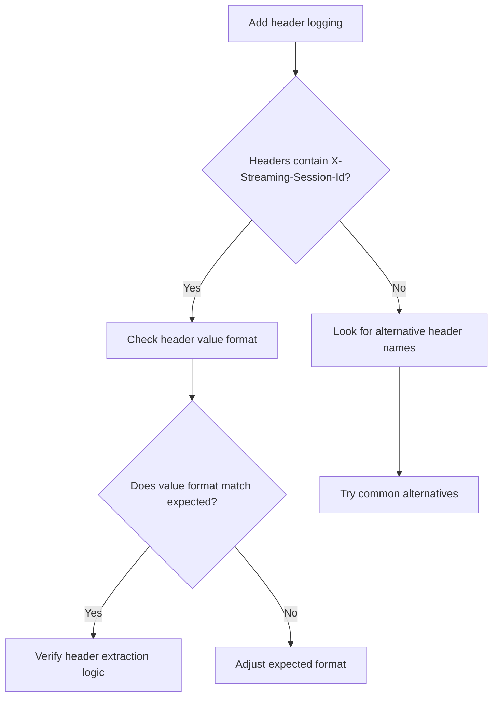

Add this code in the `test_stream_with_correct_session_id` method right after receiving the streaming response:

```python
Logger.debug("==== HEADER INSPECTION ====")
for header_name, header_value in streaming_response.headers.items():
    Logger.debug(f"HEADER: '{header_name}' = '{header_value}'")
Logger.debug("==========================")
```

### 2. Check for Common Header Variations

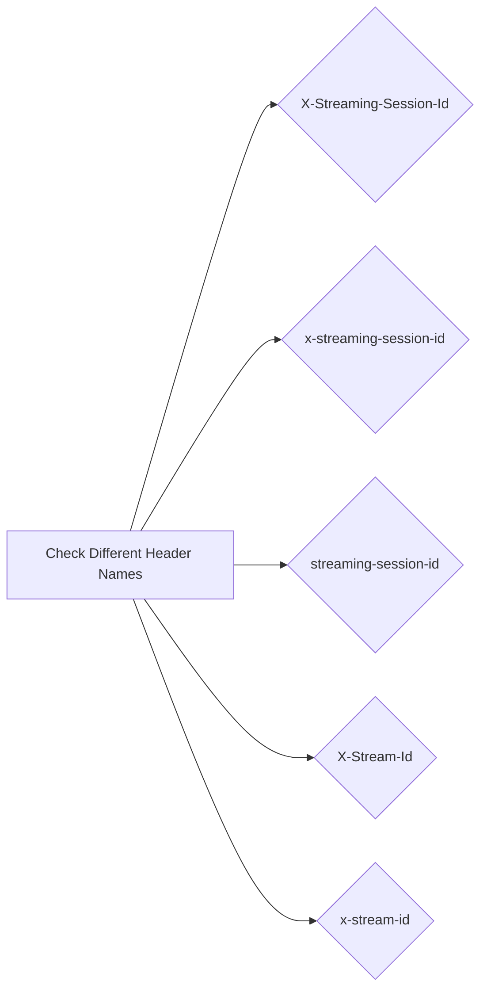

The server might be using a different header name than expected. Add this code to try common variations:

```python
# Try multiple header name variations
possible_headers = [
    "X-Streaming-Session-Id",
    "x-streaming-session-id",
    "streaming-session-id",
    "X-Stream-Id",
    "x-stream-id"
]

found_header = False
for header in possible_headers:
    if header in streaming_response.headers:
        self.streaming_session_id = streaming_response.headers[header]
        Logger.info(f"Found streaming ID in header: '{header}'")
        found_header = True
        break

if not found_header:
    Logger.warning("No streaming session ID found in any expected headers")
```

### 3. Server-Side ID Storage Check

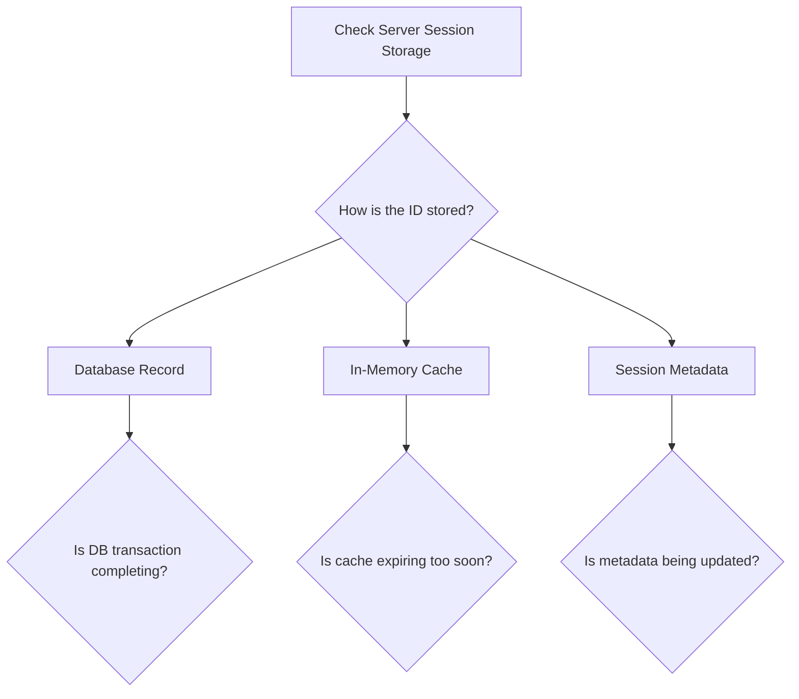

Verify that the server correctly stores the session ID. Look at the chat service logs after running a test:

```
# Check the chat service logs
grep -i "streaming" chat_service_logs.txt
grep -i "session id" chat_service_logs.txt
```

### 4. Add Delay Before Update

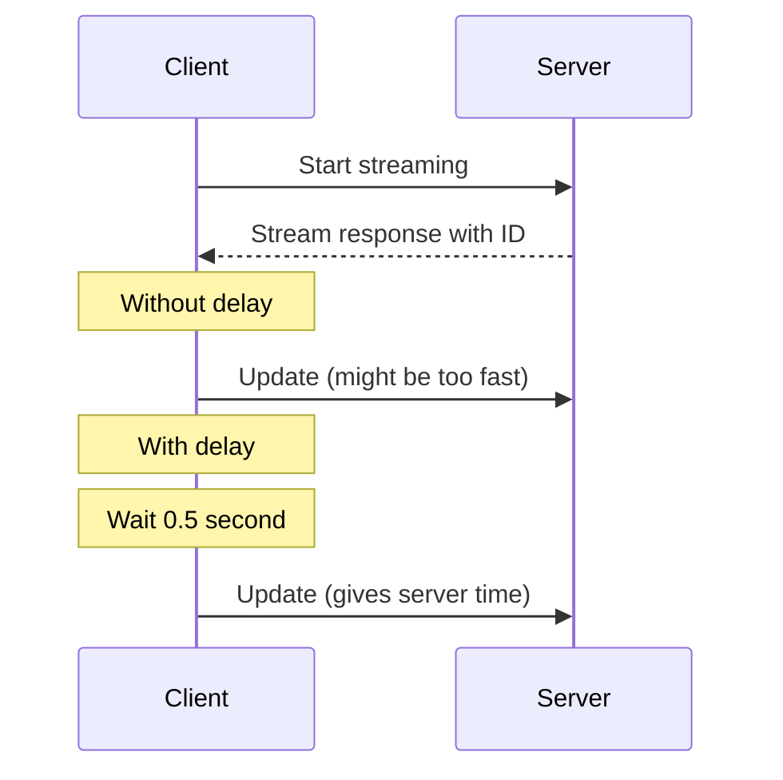

Sometimes race conditions cause issues. Add a small delay before updating:

```python
# Add a small delay before updating to avoid race conditions
Logger.info("Adding delay before update to avoid potential race conditions...")
time.sleep(0.5)
```

### 5. Fix Fallback ID Generation

The current fallback mechanism creates an ID that won't match the server's expected format:

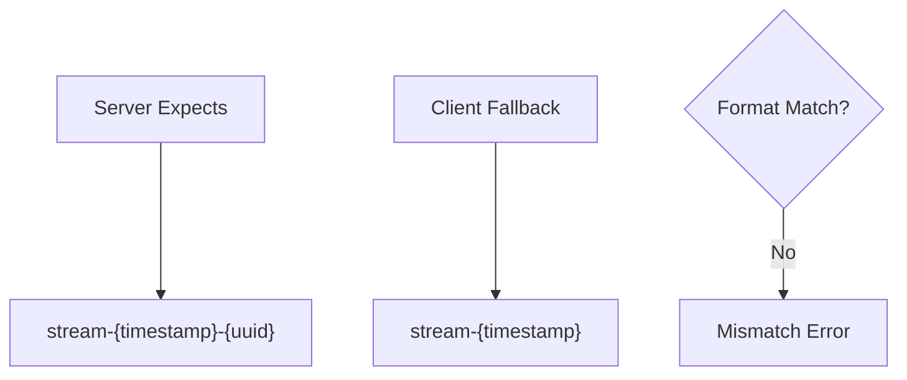

Update the fallback ID generation to match the server's expected format:

```python
import uuid

# If no streaming session ID is found, create a fallback that matches expected format
if not self.streaming_session_id:
    timestamp = int(time.time())
    random_uuid = str(uuid.uuid4())
    self.streaming_session_id = f"stream-{timestamp}-{random_uuid}"
    Logger.warning(f"No streaming session ID found. Using generated format: {self.streaming_session_id}")
```

### 6. Check for CORS Issues

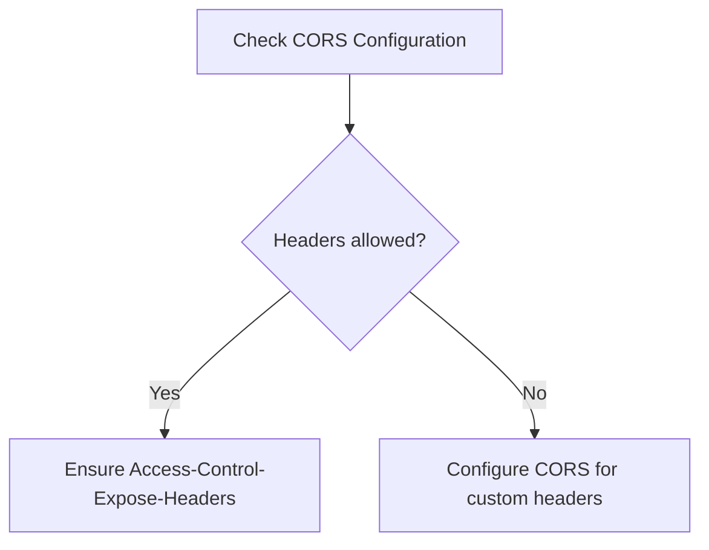

If requests go through different domains, CORS might prevent header access:

1. Server should include:

   ```
   Access-Control-Expose-Headers: X-Streaming-Session-Id
   ```

2. Check for this header in the response:

   ```python
   if "Access-Control-Expose-Headers" in streaming_response.headers:
       Logger.debug(f"CORS exposed headers: {streaming_response.headers['Access-Control-Expose-Headers']}")
   ```

## Conceptual Understanding for Beginners

### What is a Streaming Session ID?

Think of a streaming session ID as a unique ticket number for a conversation:

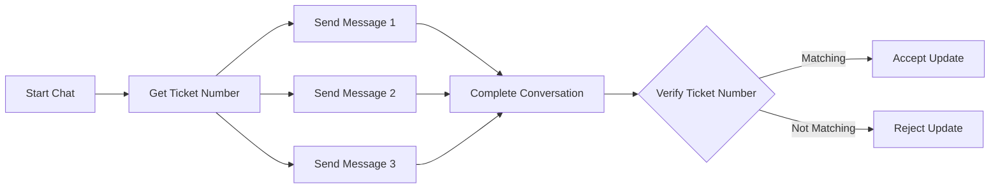

1. When you start streaming, the server creates a unique ID for this specific conversation.
2. This ID connects the initial request to the final update.
3. When you finish receiving chunks and want to save the complete message, you must present the same "ticket number" (streaming session ID).

### Why HTTP Headers Matter

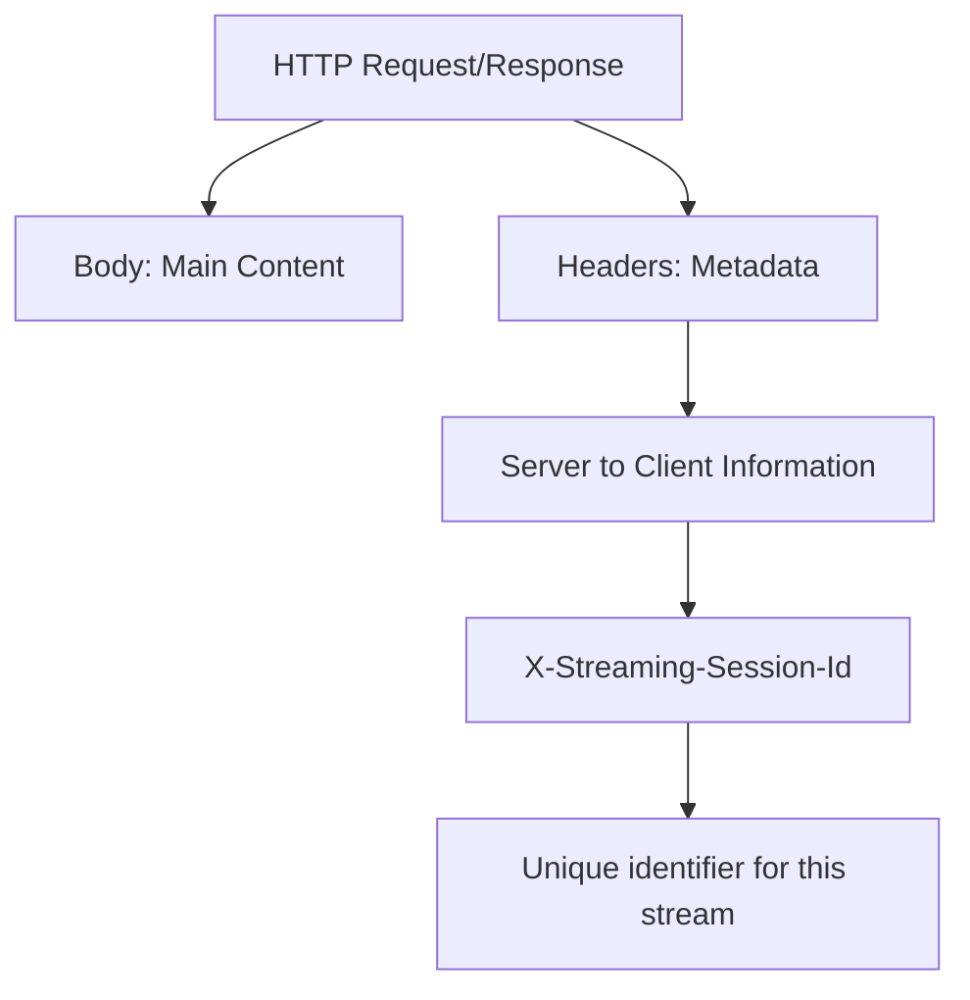

Headers are like the envelope information for web requests:

1. They contain metadata about the request or response
2. Custom headers (those starting with "X-") are used for application-specific information
3. The `X-Streaming-Session-ID` header is how the server tells your client "here's your unique ticket number"

### Server-Sent Events (SSE)

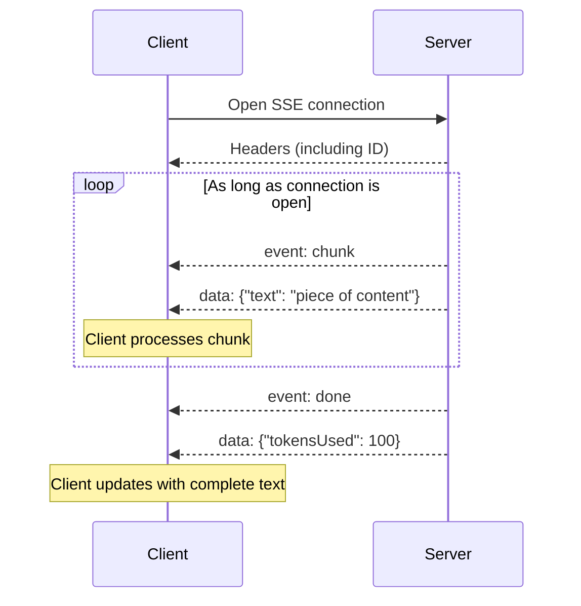

SSE is a way for servers to push data to clients:

1. The client opens a connection
2. The server can send multiple messages over time
3. The connection stays open until closed by either side
4. Each chunk arrives as an "event" with associated data

## Debugging Checklist

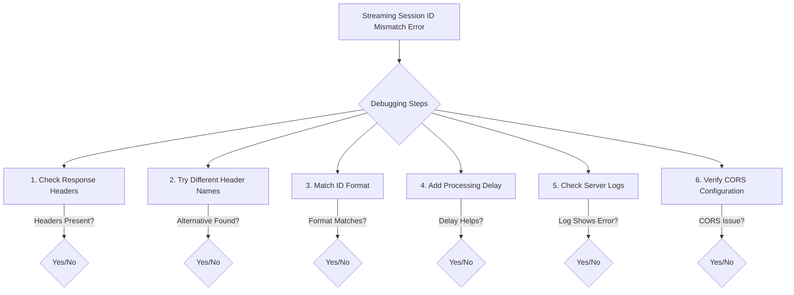

## Advanced Testing Tips

### 1. Test with curl to isolate browser/client issues

```bash
# Start the stream
curl -v -N -H "Authorization: Bearer YOUR_TOKEN" \
  -H "Content-Type: application/json" \
  -d '{"message": "test", "modelId": "model-id"}' \
  http://localhost:3002/api/chat/sessions/SESSION_ID/stream
  
# Look for the X-Streaming-Session-Id in the response headers
```

### 2. Check if the server is actually validating the ID

Add intentionally incorrect IDs with different formats to see error patterns:

```python
test_ids = [
    None,  # Should fail
    "",  # Should fail
    "incorrect-format",  # Should fail
    "stream-12345",  # Might fail if timestamp-only format is invalid
    "stream-12345-uuid",  # Might work if format matches but values differ
    actual_id  # Should work
]

for test_id in test_ids:
    # Try update with this ID and log result
```

### 3. Add server-side console logging

In the chat service code (typically in a controller/route handler), add detailed logging:

```javascript
console.log(`Received update request with streamingSessionId: ${req.body.streamingSessionId}`);
console.log(`Stored streamingSessionId for this session: ${storedId}`);
console.log(`Types: ${typeof req.body.streamingSessionId} vs ${typeof storedId}`);
console.log(`Strict equality check: ${req.body.streamingSessionId === storedId}`);
```

## Final Tips for Newcomers

If you're new to web development and APIs:

1. **Think sequentially**: Request → Response → Headers → Body → Process → Update
2. **Use the right tools**: Browser dev tools (Network tab) or Postman can help inspect headers
3. **Learn HTTP basics**: Understanding headers, status codes, and request methods helps
4. **Read error messages carefully**: They often tell you exactly what's wrong
5. **Remember synchronization**: Server and client need to agree on the same ID value

By following this debug guide, you should be able to identify and fix the "Streaming Session ID Mismatch" error in your system.
