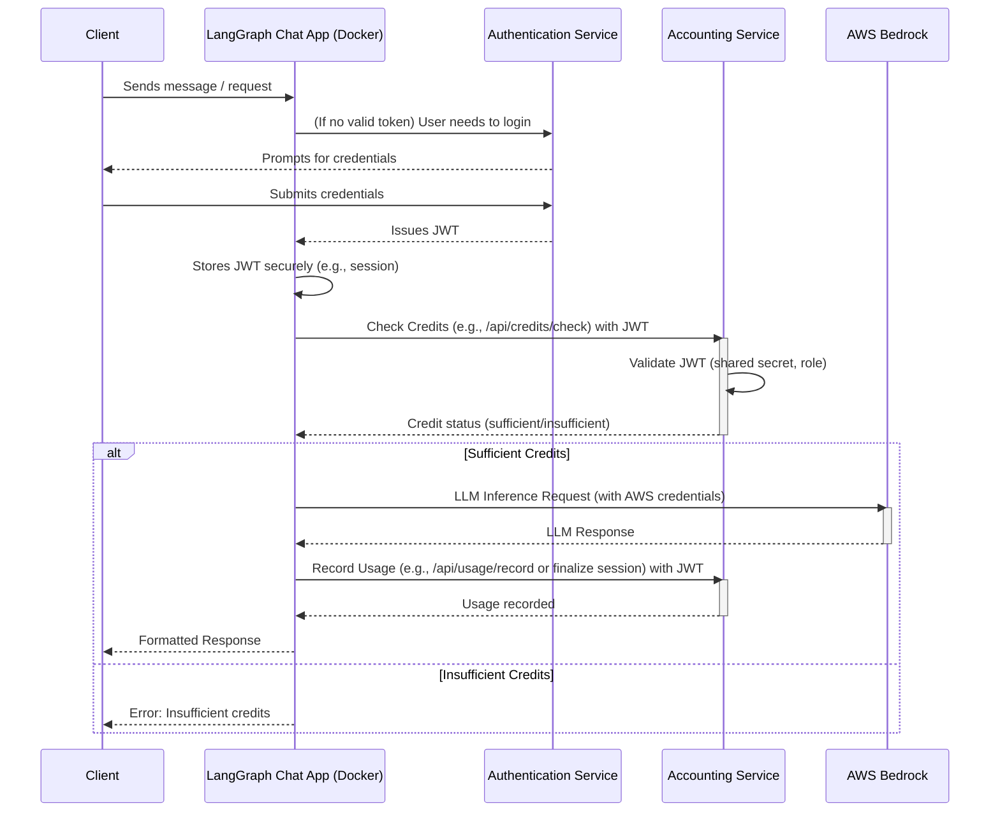

Thanks for providing the details on the Accounting Service and specifying AWS Bedrock for LLM inference! This gives us a much clearer picture.

Here's a guide to help you design your Dockerized LangGraph chat application:

**I. Overall Architecture**

Your system will likely have these main components:

1.  **User/Client:** Interacts with the LangGraph Chat Application.
2.  **LangGraph Chat Application (Dockerized):**
    *   The core of your application, built with LangGraph.
    *   Handles user interactions and orchestrates calls to other services.
    *   Communicates with the Authentication Service, Accounting Service, and AWS Bedrock.
3.  **Authentication Service:**
    *   As described in your `AuthAPIEndpoint.md`.
    *   Handles user registration, login, and issues JWTs.
4.  **Accounting Service (Dockerized or separate deployment):**
    *   As described in your `AccountingFeatures.md`.
    *   Manages user credits, tracks usage, and handles streaming sessions.
    *   Validates JWTs issued by the Authentication Service using a shared secret.
5.  **AWS Bedrock:**
    *   Provides the LLM inference capabilities.

**Diagrammatic Flow:**



**II. LangGraph Chat Application Design**

1.  **State Management:** Your LangGraph graph will need to manage state, including:
    *   User's authentication status (e.g., JWT).
    *   Conversation history.
    *   Current credit status (optional, can be checked on demand).

2.  **Key Nodes/Steps in your Graph:**
    *   **Authentication Node:**
        *   Checks if a valid JWT is present.
        *   If not, directs the user through a login flow (interacting with `AuthService` endpoints like `/api/auth/login`).
        *   Stores the JWT.
    *   **Credit Check Node:**
        *   Takes the JWT and estimated cost of the operation.
        *   Calls `AccountingService` (`POST /api/credits/check` or `POST /api/credits/calculate` then check).
        *   Routes based on whether credits are sufficient.
    *   **Bedrock LLM Node:**
        *   If credits are sufficient, prepares the prompt.
        *   Uses the AWS SDK (boto3 for Python) to call the desired Bedrock model.
        *   Handles the response from Bedrock.
    *   **Usage Recording Node:**
        *   After a successful Bedrock call (or during streaming finalization).
        *   Calls `AccountingService` (`POST /api/usage/record` or `POST /api/streaming-sessions/finalize`).
    *   **Error Handling Node:** Manages errors from any service and provides appropriate user feedback.

3.  **Configuration:**
    *   Store base URLs for `AuthService` and `AccountingService`.
    *   Store AWS region and Bedrock model ID(s).
    *   Securely manage the shared JWT secret if the LangGraph app needs to inspect token contents (though validation is primarily the Accounting Service's job).

**III. Docker Setup**

1.  **`Dockerfile` for your LangGraph Application:**

    ```dockerfile name=Dockerfile
    # Choose an appropriate Python base image
    FROM python:3.10-slim

    WORKDIR /app

    # Install Poetry (or pip if you use requirements.txt)
    # RUN pip install poetry
    # COPY poetry.lock pyproject.toml ./
    # RUN poetry install --no-root --no-dev

    # Or for pip:
    COPY requirements.txt .
    RUN pip install --no-cache-dir -r requirements.txt

    COPY . .

    # Environment variables (can be overridden in docker-compose.yml or at runtime)
    ENV AUTH_SERVICE_BASE_URL="http://auth-service:3000"
    ENV ACCOUNTING_SERVICE_BASE_URL="http://accounting-service:3001" # Assuming different port
    ENV AWS_REGION="your-aws-region"
    # AWS credentials should be handled securely (see section below)

    CMD ["python", "main.py"] # Or your application's entrypoint
    ```

2.  **`requirements.txt` (example):**

    ```text name=requirements.txt
    langgraph
    langchain
    boto3
    requests
    # Add other dependencies like FastAPI/Flask if exposing as an API
    ```

3.  **`docker-compose.yml` (for local development):**

    ```yaml name=docker-compose.yml
    version: '3.8'

    services:
      langgraph_app:
        build: .
        ports:
          - "8000:8000" # If your LangGraph app serves an API
        environment:
          - AUTH_SERVICE_BASE_URL=http://auth_service_host:port # Replace with actual or mock
          - ACCOUNTING_SERVICE_BASE_URL=http://accounting_service_host:port # Replace with actual or mock
          - AWS_REGION=us-east-1
          # For local AWS development, you can pass credentials here (NOT FOR PRODUCTION)
          # - AWS_ACCESS_KEY_ID=${AWS_ACCESS_KEY_ID}
          # - AWS_SECRET_ACCESS_KEY=${AWS_SECRET_ACCESS_KEY}
          # - AWS_SESSION_TOKEN=${AWS_SESSION_TOKEN} # If using temporary credentials
        # volumes:
          # - ~/.aws:/root/.aws:ro # Another way to mount AWS credentials for local dev

      # Placeholder for your auth service (if you run it in Docker too)
      # auth_service:
      #   image: your_auth_service_image
      #   ports:
      #     - "3000:3000"

      # Placeholder for your accounting service
      # accounting_service:
      #   image: your_accounting_service_image
      #   ports:
      #     - "3001:3001"
    ```

**IV. AWS Credentials Handling in Docker**

*   **Local Development:**
    *   **Environment Variables:** Pass `AWS_ACCESS_KEY_ID`, `AWS_SECRET_ACCESS_KEY`, `AWS_REGION` directly in `docker-compose.yml` or as Docker run arguments.
    *   **Volume Mount:** Mount your `~/.aws` directory into the container. The SDK will pick up credentials from there.
*   **Production (AWS Deployment e.g., ECS, EKS, EC2):**
    *   **IAM Roles:** This is the most secure and recommended method. Assign an IAM role with Bedrock permissions to your ECS task, EKS pod, or EC2 instance. The AWS SDK within your container will automatically use these credentials. No need to embed keys.
*   **Other Cloud/On-premise:**
    *   Use a secrets management tool (e.g., HashiCorp Vault, AWS Secrets Manager) to inject credentials as environment variables at runtime.

**V. Interacting with Services**

1.  **Authentication Service (`AuthAPIEndpoint.md`):**
    *   Use a library like `requests` in Python to make HTTP calls.
    *   Example: Logging in (`POST /api/auth/login`)
        ```python
        import requests

        auth_base_url = os.getenv("AUTH_SERVICE_BASE_URL")
        try:
            response = requests.post(
                f"{auth_base_url}/api/auth/login",
                json={"username": "user", "password": "password"}
            )
            response.raise_for_status() # Raise an exception for HTTP errors
            jwt_token = response.json()["accessToken"]
            # Store and use this token
        except requests.exceptions.RequestException as e:
            print(f"Login failed: {e}")
            # Handle error
        ```

2.  **Accounting Service (`AccountingFeatures.md`):**
    *   Also use `requests`. Remember to include the JWT in the `Authorization` header.
    *   Example: Checking credits (`POST /api/credits/check`)
        ```python
        accounting_base_url = os.getenv("ACCOUNTING_SERVICE_BASE_URL")
        headers = {"Authorization": f"Bearer {jwt_token}"}
        try:
            response = requests.post(
                f"{accounting_base_url}/api/credits/check",
                headers=headers,
                json={"requiredCredits": 10} # Example
            )
            response.raise_for_status()
            if response.json().get("sufficient"): # Assuming this is the response structure
                 print("Credits are sufficient.")
            else:
                 print("Insufficient credits.")
                 # Handle insufficient credits
        except requests.exceptions.RequestException as e:
            print(f"Credit check failed: {e}")
            # Handle error, potentially token expiry (401)
        ```

3.  **AWS Bedrock:**
    *   Use `boto3`.
    *   Example (Invoke Model - replace with actual model ID and payload structure for Claude, Llama, etc.):
        ```python
        import boto3
        import json

        bedrock_runtime = boto3.client(service_name='bedrock-runtime', region_name=os.getenv("AWS_REGION"))

        prompt = "Your user's prompt here"
        # Example for Claude
        body = json.dumps({
            "prompt": f"\n\nHuman: {prompt}\n\nAssistant:",
            "max_tokens_to_sample": 300,
            "temperature": 0.1,
            "top_p": 0.9,
        })
        modelId = 'anthropic.claude-v2' # Or another model
        accept = 'application/json'
        contentType = 'application/json'

        try:
            response = bedrock_runtime.invoke_model(body=body, modelId=modelId, accept=accept, contentType=contentType)
            response_body = json.loads(response.get('body').read())
            completion = response_body.get('completion')
            print(f"Bedrock response: {completion}")
            # Process the completion
        except Exception as e:
            print(f"Error calling Bedrock: {e}")
            # Handle error
        ```

**VI. Security Considerations**

*   **JWT Secret:** Ensure the JWT secret used by `AuthService` to sign tokens and `AccountingService` to verify them is identical and kept secure. Do not hardcode it. Use environment variables or a secrets manager.
*   **AWS Credentials:** Never hardcode AWS credentials in your application code or Docker images. Follow the IAM role approach for production.
*   **HTTPS:** Ensure all service-to-service communication uses HTTPS in production.
*   **Input Validation:** Validate all inputs to your LangGraph application and before sending data to external services.

**Next Steps for You:**

1.  **Set up your development environment:**
    *   Install Docker.
    *   Create your project structure.
2.  **Develop the `AuthService` and `AccountingService` (or mocks):** You'll need these running to test your LangGraph app. The `AuthAPIEndpoint.md` and `AccountingFeatures.md` are your blueprints.
3.  **Implement the LangGraph application:**
    *   Define your graph states and nodes.
    *   Write the logic for interacting with auth, accounting, and Bedrock.
4.  **Write your `Dockerfile` and `docker-compose.yml`.**
5.  **Test thoroughly.**

This guide provides a comprehensive starting point. You'll need to fill in the specific logic for your LangGraph application based on its unique requirements. Let me know if you have more questions as you proceed!