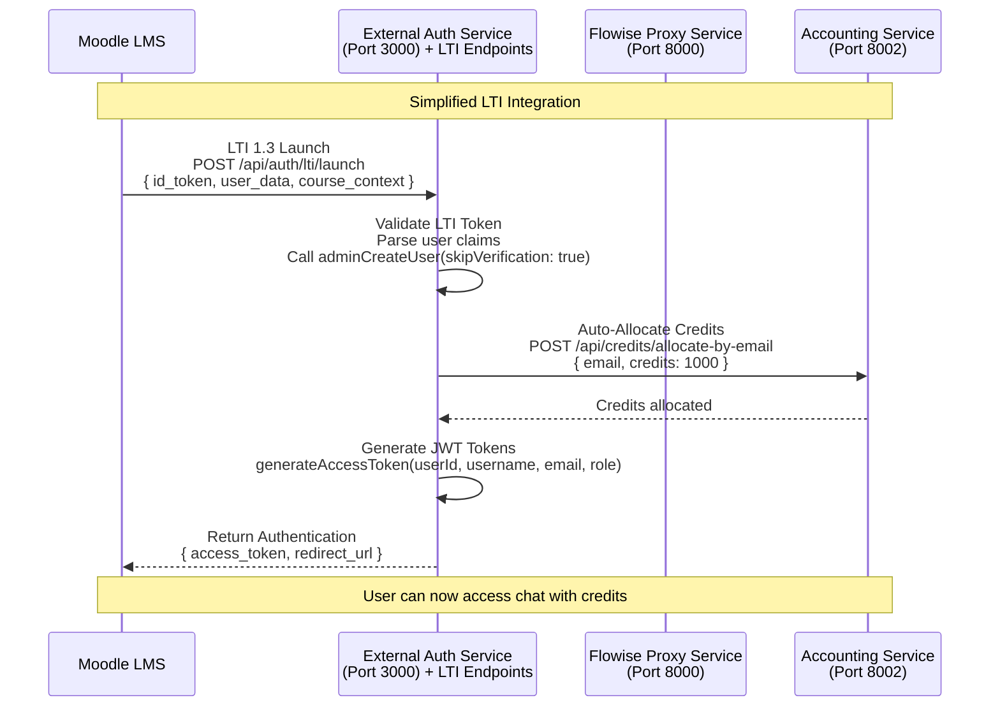

# Updated LTI Integration Recommendation

## Analysis Summary

After analyzing your comprehensive external authentication service, I **strongly recommend integrating LTI directly into your existing External Authentication Service** rather than creating a separate `moodleLTILoginService`. Here's the updated assessment:

## Why Your Existing External Auth Service is Perfect for LTI

### 1. Existing Capabilities Match LTI Needs

Your `external-authentication-service` already provides:

```typescript
// Perfect for LTI user creation
async adminCreateUser(
  username: string, 
  email: string, 
  password: string, 
  role: UserRole = UserRole.USER,
  skipVerification: boolean = false
): Promise<SignupResult>

// Perfect for batch LTI user imports
async adminCreateBatchUsers(
  users: Array<{username: string, email: string, role?: UserRole}>,
  skipVerification: boolean = true
)

// JWT tokens with all needed fields
interface TokenPayload {
  sub: string;          // User ID
  username: string;     // Username  
  email: string;        // Email (for identification across services)
  type: 'access' | 'refresh';
  role: UserRole;       // User role (ADMIN, SUPERVISOR, USER)
}
```

### 2. LTI Integration Points

Simply add these endpoints to your External Auth Service:

```typescript
// Add to existing auth routes
POST /api/auth/lti/launch        // Handle LTI 1.3 launch
POST /api/auth/lti/user-sync     // Sync LTI user and allocate credits
GET  /api/auth/lti/course/:id    // Get course-specific settings
```

### 3. Updated Architecture



## Implementation Steps

### Step 1: Add LTI Routes to External Auth Service

```typescript
// src/routes/lti.routes.ts
import { Router } from 'express';
import { authService } from '../auth/auth.service';
import { requireAuth, requireRole } from '../auth/auth.middleware';

const router = Router();

// LTI 1.3 Launch endpoint
router.post('/launch', async (req, res) => {
  try {
    const { id_token, user_data, course_context } = req.body;
    
    // 1. Validate LTI 1.3 token
    const ltiClaims = validateLTIToken(id_token);
    
    // 2. Create/sync user using existing adminCreateUser
    const userResult = await authService.adminCreateUser(
      ltiClaims.username,
      ltiClaims.email,
      generateSecurePassword(), // Random password
      UserRole.ENDUSER,
      true // skipVerification for LTI users
    );
    
    // 3. Allocate credits via HTTP call to accounting service
    await allocateLTICredits(ltiClaims.email, course_context.course_id);
    
    // 4. Generate JWT tokens
    const loginResult = await authService.login(ltiClaims.email, password);
    
    res.json({
      success: true,
      access_token: loginResult.accessToken,
      redirect_url: `/chat?course=${course_context.course_id}`
    });
  } catch (error) {
    res.status(400).json({ success: false, error: error.message });
  }
});

export default router;
```

### Step 2: Credit Allocation Helper

```typescript
// src/services/lti-credit.service.ts
import axios from 'axios';

async function allocateLTICredits(email: string, courseId: string): Promise<void> {
  // Get admin JWT token for accounting service calls
  const adminToken = generateAdminToken();
  
  // Determine credit amount based on course policy
  const creditAmount = getCreditPolicyForCourse(courseId); // Default: 1000
  
  // Call existing credit allocation endpoint
  await axios.post(`${process.env.ACCOUNTING_SERVICE_URL}/api/credits/allocate-by-email`, {
    email,
    credits: creditAmount,
    expiryDays: 365,
    notes: `LTI auto-allocation for course ${courseId}`
  }, {
    headers: { Authorization: `Bearer ${adminToken}` }
  });
}
```

## Benefits of This Approach

1. **Reuse Existing Infrastructure**: Your JWT system, user models, and token service work perfectly
2. **Minimal Code Addition**: Just add LTI validation and credit allocation logic
3. **Consistent Authentication**: Same JWT tokens across all services
4. **Single Service to Maintain**: No additional deployment complexity
5. **Proven Security**: Your existing auth patterns are already battle-tested

## File Changes Needed

1. `external-authentication-service/src/routes/lti.routes.ts` - New LTI endpoints
2. `external-authentication-service/src/services/lti.service.ts` - LTI token validation
3. `external-authentication-service/src/services/lti-credit.service.ts` - Credit allocation helper
4. `external-authentication-service/src/routes/index.ts` - Add LTI routes
5. Update `package.json` - Add LTI validation libraries

## Conclusion

Your existing External Authentication Service is **architecturally perfect** for LTI integration. The `adminCreateUser` method, JWT token structure, and role system align perfectly with LTI requirements. Adding LTI as additional endpoints to this service is the most efficient and maintainable approach.

**Recommendation: Extend External Auth Service with LTI endpoints instead of creating a new service.**
